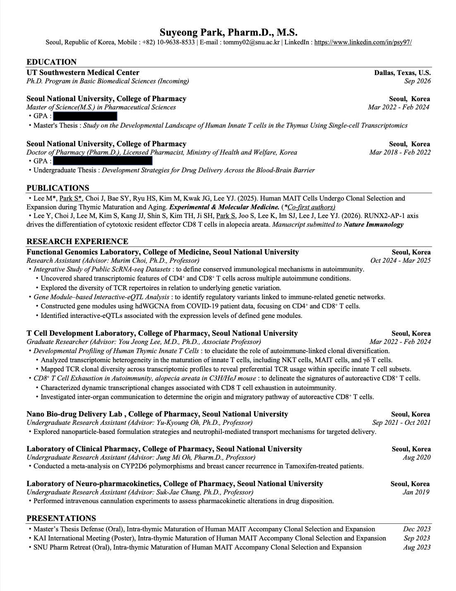
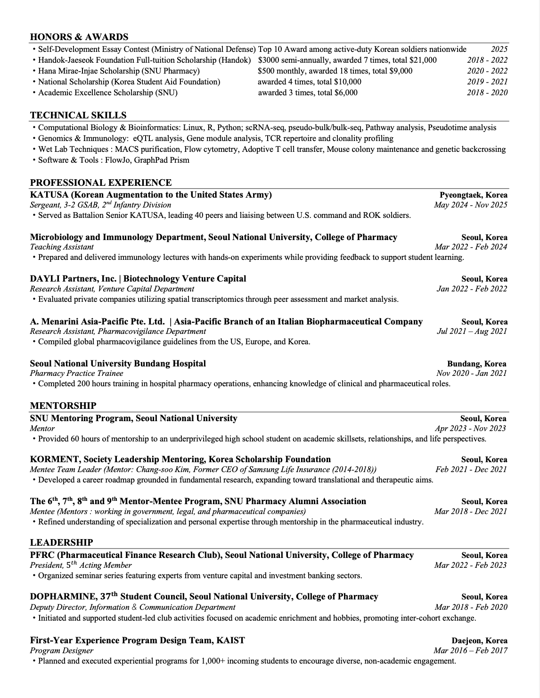

  <button onclick="closeModal()" style="position:fixed; top:1.2rem; right:1.2rem; background:white; border:none; border-radius:50%; width:2.2rem; height:2.2rem; font-size:1.2rem; cursor:pointer; z-index:10000; display:flex; align-items:center; justify-content:center; box-shadow:0 2px 8px rgba(0,0,0,0.3);">✕</button>
  

