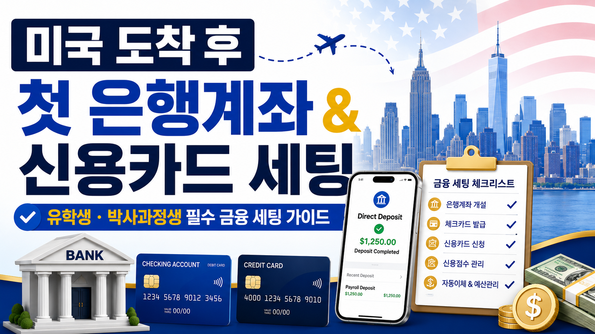

# 미국 도착 후 첫 은행계좌와 신용카드 세팅하기

미국에 도착하면 생각보다 빨리 돈과 관련된 일들을 처리해야 합니다.  
월세를 내야 하고, 휴대폰을 개통해야 하고, 장을 봐야 하고, 학교에서 받는 stipend도 미국 계좌로 받아야 합니다.

처음에는 “어떤 카드가 포인트를 많이 주는지”보다 **어떻게 안정적으로 돈을 받고, 쓰고, 신용기록을 시작할지**가 더 중요합니다.

특히 UTSW 박사과정생이라면 stipend를 받는 경우가 많기 때문에, 미국 은행계좌와 direct deposit 세팅이 거의 필수입니다.

---

## 결론부터 말하면

미국 도착 직후에는 이렇게 세팅하는 것이 가장 무난합니다.

1. **Chase나 Bank of America 같은 큰 은행에서 checking account 만들기**
2. **UTSW stipend가 들어오도록 direct deposit 설정하기**
3. **연회비 없는 첫 신용카드 한 장 만들기**
4. **6개월 정도 신용기록을 쌓은 뒤 두 번째 카드 고민하기**
5. **여행카드, 마일게임, 고연회비 카드는 나중에 시작하기**

처음부터 Chase Sapphire Preferred, Amex Gold, 항공사 카드, 호텔 카드 같은 것을 노리기보다는, 먼저 미국 금융 시스템에 안전하게 적응하는 것이 좋습니다.

---

## 1. 첫 은행계좌는 checking account부터

미국에서 가장 먼저 필요한 계좌는 **checking account**입니다.  
Checking account는 월급 입금, 카드값 결제, 월세, 공과금, 휴대폰 요금, 송금 등에 쓰는 기본 계좌입니다.

처음에는 복잡하게 여러 은행을 비교하기보다, 지점이 있고 유학생 응대 경험이 있는 큰 은행을 선택하는 것이 편합니다.

### 무난한 선택지

- Chase
- Bank of America

둘 중 하나를 고르면 됩니다.  
처음에는 혜택보다 **지점 접근성, 앱 사용 편의성, 계좌 개설 가능성, 수수료 면제 조건**이 더 중요합니다.

### 은행 방문 시 가져가면 좋은 것

- 여권
- I-20
- UTSW admission letter 또는 offer letter
- 미국 주소
- 한국 주소
- 미국 전화번호
- 학생증이 있다면 UTSW student ID
- SSN이 있다면 SSN
- 초기 입금할 돈

SSN이 아직 없어도 계좌 개설이 가능한 경우가 있습니다.  
은행마다 기준이 다르기 때문에, 방문 전에 가까운 지점에 전화해서 이렇게 물어보면 좋습니다.

> I am an international Ph.D. student at UT Southwestern.  
> I do not have an SSN yet.  
> What documents should I bring to open a checking account?

---

## 2. 계좌를 만들면 direct deposit부터 설정하기

은행계좌를 만든 뒤 가장 먼저 해야 할 일은 **UTSW stipend가 들어오도록 direct deposit을 설정하는 것**입니다.

Direct deposit은 학교에서 주는 월급이나 stipend가 종이 수표가 아니라 내 은행계좌로 바로 들어오게 하는 방식입니다.

은행계좌를 만들면 아래 정보를 확인해 둡니다.

- Routing number
- Account number
- Bank name
- Account type  
  예: checking account

그다음 UTSW의 payroll 또는 PeopleSoft 시스템에서 direct deposit을 설정하면 됩니다.

### 계좌 개설 후 바로 할 일

- 은행 앱 설치하기
- debit card 활성화하기
- routing number 확인하기
- account number 확인하기
- direct deposit 설정하기
- 첫 stipend 입금일 확인하기
- 계좌 유지 수수료 면제 조건 확인하기
- 카드 사용 알림 켜기

첫 월급이 예상보다 늦게 들어올 수도 있으므로, 도착 전에는 최소 한 달 정도 버틸 수 있는 초기 정착비를 준비해 두는 것이 좋습니다.

---

## 3. 첫 신용카드는 “좋은 카드”보다 “오래 들고 갈 카드”

미국에서 신용카드는 단순한 결제수단이 아니라 **credit history를 만드는 도구**입니다.

처음부터 포인트가 좋은 카드를 만들려고 하기보다, 연체 없이 오래 유지할 수 있는 카드를 만드는 것이 중요합니다.

첫 신용카드의 목적은 세 가지입니다.

- 미국 신용기록 시작하기
- 매달 제때 갚는 기록 만들기
- 오래 유지할 첫 카드 만들기

그래서 첫 카드는 가능하면 이런 조건이 좋습니다.

- 연회비 없음
- 승인 가능성이 높음
- 혜택 구조가 단순함
- 오래 닫지 않고 유지 가능함
- 사용 내역이 credit bureau에 보고됨

---

## 4. 첫 카드 후보

### 1) Chase Freedom Rise

Chase에서 checking account를 만들었다면 Chase Freedom Rise 같은 starter card를 고려할 수 있습니다.

장점은 Chase 계좌와 카드가 같은 앱에서 관리되고, 나중에 Chase Freedom 계열이나 Sapphire 계열로 넘어가기 좋다는 점입니다.

다만 신용기록이 거의 없거나 SSN이 아직 없다면 승인 여부가 달라질 수 있으므로, 지점에서 상담해 보는 것이 좋습니다.

---

### 2) Discover Student Card

미국 첫 카드로 자주 언급되는 카드입니다.  
학생용 카드라 초반에 접근성이 괜찮은 편이고, 신용기록을 시작하기에 무난합니다.

다만 Discover는 Visa나 Mastercard보다 가맹점 수용성이 낮을 수 있으므로, debit card나 한국 카드를 백업으로 가지고 있는 것이 좋습니다.

---

### 3) Secured Credit Card

일반 신용카드 승인이 어렵다면 secured card로 시작해도 괜찮습니다.

Secured card는 보증금을 맡기고 그만큼의 한도를 받아 쓰는 카드입니다.  
예를 들어 $200을 보증금으로 넣으면 $200 한도의 카드가 나오는 식입니다.

처음에는 조금 아쉽게 느껴질 수 있지만, 연체 없이 6개월에서 1년 정도 잘 쓰면 일반 카드로 넘어갈 수 있습니다.

---

## 5. 처음부터 CSP나 Amex 고급카드는 서두르지 않기

미국 카드 정보를 찾아보다 보면 Chase Sapphire Preferred, Amex Gold, Amex Platinum 같은 카드가 자주 보입니다.

포인트나 혜택은 좋아 보이지만, 유학생 초반에는 서두르지 않는 것이 좋습니다.

이유는 간단합니다.

- 신용기록이 짧으면 승인 가능성이 낮음
- 사인업 보너스를 받으려면 일정 금액 이상을 써야 함
- 연회비가 있음
- 혜택을 제대로 쓰지 못하면 손해일 수 있음
- 첫 카드로 오래 유지하기 애매할 수 있음

초반에는 **고급카드보다 연회비 없는 기본 카드 한 장**이 더 중요합니다.

여행카드나 마일게임은 미국 생활이 안정되고, 신용기록이 쌓인 뒤 시작해도 늦지 않습니다.

---

## 6. 첫 신용카드는 이렇게 쓰기

첫 카드는 많이 쓰는 것보다 **깔끔하게 쓰고 잘 갚는 것**이 중요합니다.

### 추천 사용처

- 휴대폰 요금
- 장보기
- Amazon
- Target
- Walmart
- 학교 근처 식비
- 소액 구독 서비스

처음부터 월세, 큰 가구, 비싼 전자기기 같은 큰 지출을 모두 신용카드에 올릴 필요는 없습니다.

특히 첫 카드 한도는 낮을 가능성이 큽니다.  
한도가 $500인데 $400씩 쓰면 카드사 입장에서는 부담스럽게 보일 수 있습니다.

가능하면 한도의 10~30% 이하로 쓰고, 매달 전액 갚는 습관을 들이는 것이 좋습니다.

### 반드시 해야 할 설정

- statement balance autopay 켜기
- due date 알림 켜기
- 카드 사용 알림 켜기
- minimum payment만 내지 않기
- cash advance 사용하지 않기
- 연체 절대 하지 않기

여기서 가장 중요한 것은 **statement balance를 매달 전액 납부하는 것**입니다.

신용카드는 포인트를 받으려고 쓰는 것이지, 이자를 내려고 쓰는 것이 아닙니다.

---

## 7. 한국 카드와 한국 번호는 당분간 유지하기

미국 계좌와 미국 카드를 만들더라도, 한국 카드와 한국 번호는 바로 없애지 않는 것이 좋습니다.

미국 도착 직후에는 은행계좌나 신용카드 개설이 바로 안 될 수도 있고, 한국 은행 앱이나 카드 앱에서 본인인증이 필요할 수도 있습니다.

### 한국에서 미리 확인할 것

- 해외 결제 가능한 카드 2장 준비
- 카드 해외 사용 설정
- 해외 원화결제 차단
- 카드 한도 확인
- 카드 분실 시 앱에서 정지 가능한지 확인
- 한국 은행 앱 로그인 가능 여부 확인
- 공동인증서, 금융인증서, OTP 확인
- 한국 번호 유지 여부 결정

한국 번호를 해지하면 한국 은행, 카드, 카카오톡, 네이버, 정부24 인증에서 문제가 생길 수 있습니다.  
가능하면 최소 몇 달은 저렴한 요금제로 유지하는 편이 안전합니다.

---

## 8. 카드 신청은 천천히 하기

미국에 도착하자마자 카드 여러 장을 동시에 신청하는 것은 추천하지 않습니다.

처음에는 카드 한 장으로 충분합니다.

### 추천 흐름

**도착 첫 주**

- 미국 번호 개통
- Chase 또는 Bank of America 방문
- checking account 개설
- debit card 수령
- direct deposit 설정

**1~3개월 차**

- SSN 신청 또는 수령
- 첫 연회비 없는 신용카드 신청
- autopay 설정
- 소액 사용 후 전액 납부

**3~6개월 차**

- 첫 카드만 꾸준히 사용
- utilization 낮게 유지
- 연체 없이 기록 쌓기

**6~12개월 차**

- 신용점수 확인
- 두 번째 연회비 없는 카드 검토
- cashback 구조 비교

**1년 이후**

- 여행카드 검토
- 사인업 보너스 검토
- 마일리지 카드 검토
- 계좌 개설 보너스 활용 검토

초반에는 카드 수가 중요한 것이 아니라, **연체 없는 깨끗한 기록**이 중요합니다.

---

## 9. 은행 보너스와 카드 프로모션은 나중에

미국에는 checking account opening bonus나 credit card sign-up bonus가 많습니다.  
잘 활용하면 꽤 도움이 됩니다.

하지만 초반에는 무리하지 않는 것이 좋습니다.

프로모션을 볼 때는 아래 조건을 확인해야 합니다.

- direct deposit 조건이 있는가?
- stipend가 qualifying direct deposit으로 인정되는가?
- minimum balance 조건이 있는가?
- 몇 개월 이상 계좌를 유지해야 하는가?
- monthly fee가 있는가?
- 조기 해지 시 보너스를 회수하는가?
- 신용조회가 발생하는가?

처음에는 보너스보다 **stipend 입금 안정성, 월세 납부, 수수료 면제, 앱 사용 편의성**이 더 중요합니다.

---

## 10. 스테이블코인, 크립토카드, 카드 돌려막기는 초반에 비추천

인터넷을 찾아보면 stablecoin, crypto card, manufactured spending, business card 같은 이야기도 나옵니다.

하지만 미국에 막 도착한 유학생에게는 추천하지 않습니다.

초반에는 은행이나 카드사에 의심스러운 거래로 보일 수 있는 행동을 피하는 것이 좋습니다.  
계좌가 제한되면 월세, stipend, 생활비 관리가 바로 꼬일 수 있습니다.

특히 F-1 학생 신분에서는 business card, side income, crypto 관련 거래가 세금이나 신분 문제와 연결될 수 있으므로 조심하는 편이 안전합니다.

미국 생활 초반에는 복잡한 방법보다 단순한 방법이 좋습니다.

**평범하게 받고, 평범하게 쓰고, 매달 제때 갚는 것.**  
이게 가장 안전한 시작입니다.

---

## 내가 추천하는 최종 세팅

UTSW 박사과정생으로 미국에 처음 도착한다면, 저는 이렇게 세팅할 것 같습니다.

### 도착 전

- 한국 신용카드 2장 준비
- 해외 결제 가능 여부 확인
- 한국 번호 유지
- 소액 달러 현금 준비
- UTSW offer letter, I-20, 여권 준비
- 미국 주소 정리

### 도착 후 첫 주

- 미국 번호 개통
- Chase 또는 Bank of America에서 checking account 개설
- debit card 활성화
- direct deposit 설정
- 월세, 휴대폰, 생활비 결제 방식 정리

### SSN 수령 후

- 연회비 없는 첫 신용카드 신청
- autopay 설정
- 소액 사용 후 매달 전액 납부
- utilization 낮게 유지

### 6개월 이후

- 신용점수 확인
- 두 번째 카드 검토
- savings account 또는 high-yield savings account 검토
- 계좌 보너스나 카드 프로모션 천천히 확인

### 1년 이후

- 여행카드 검토
- 마일리지 카드 검토
- Chase Sapphire Preferred 같은 카드 고려
- 한국 왕복 항공권을 포인트로 사는 전략 고민

---

## 핵심 요약

미국 도착 직후에는 카드 혜택을 극대화하려고 하기보다, 안정적인 금융 기반을 만드는 것이 먼저입니다.

- 첫 계좌는 Chase나 Bank of America checking account가 무난함
- 은행계좌를 만들면 UTSW stipend direct deposit부터 설정하기
- 첫 신용카드는 연회비 없는 카드로 시작하기
- Chase Sapphire Preferred나 Amex 고급카드는 나중에 고민하기
- 한국 번호와 한국 카드는 당분간 유지하기
- 첫 6개월은 카드 한 장으로 연체 없는 기록 만들기
- 계좌 보너스, 마일게임, 카드 프로모션은 생활이 안정된 뒤 시작하기

결국 초반 목표는 단순합니다.

**월급이 잘 들어오고, 생활비가 안정적으로 나가고, 첫 신용기록이 깨끗하게 쌓이게 만드는 것.**

이 세 가지만 잘 해도 미국 생활의 금융 세팅은 꽤 안정적으로 시작할 수 있습니다.