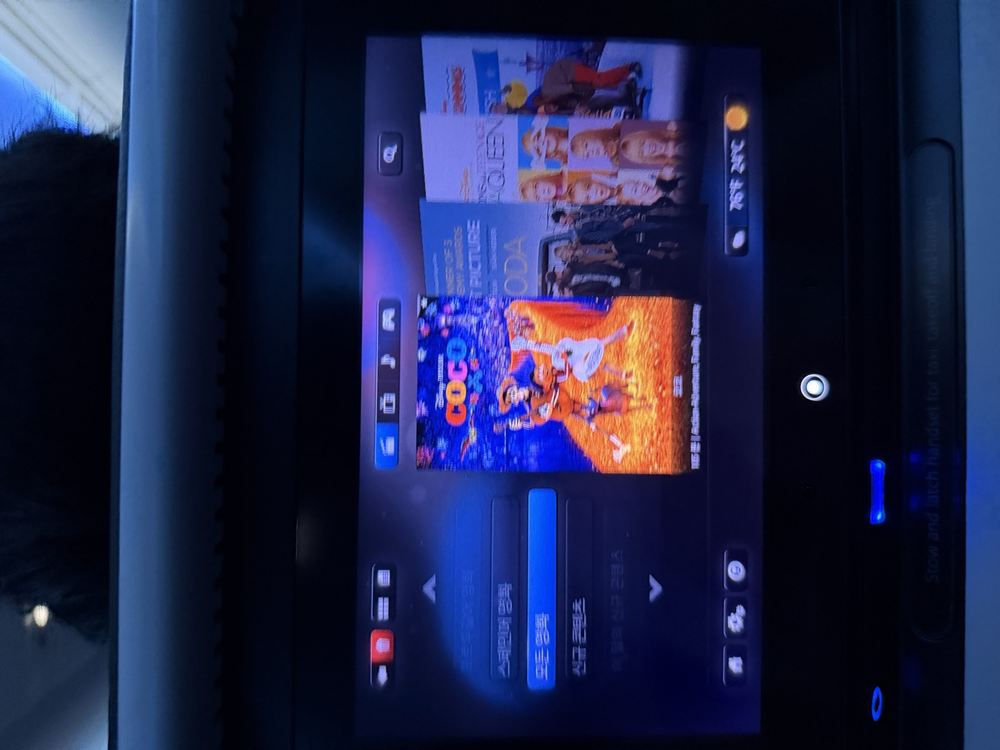
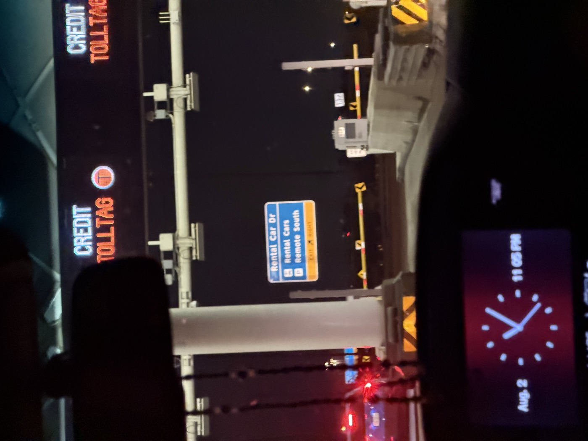
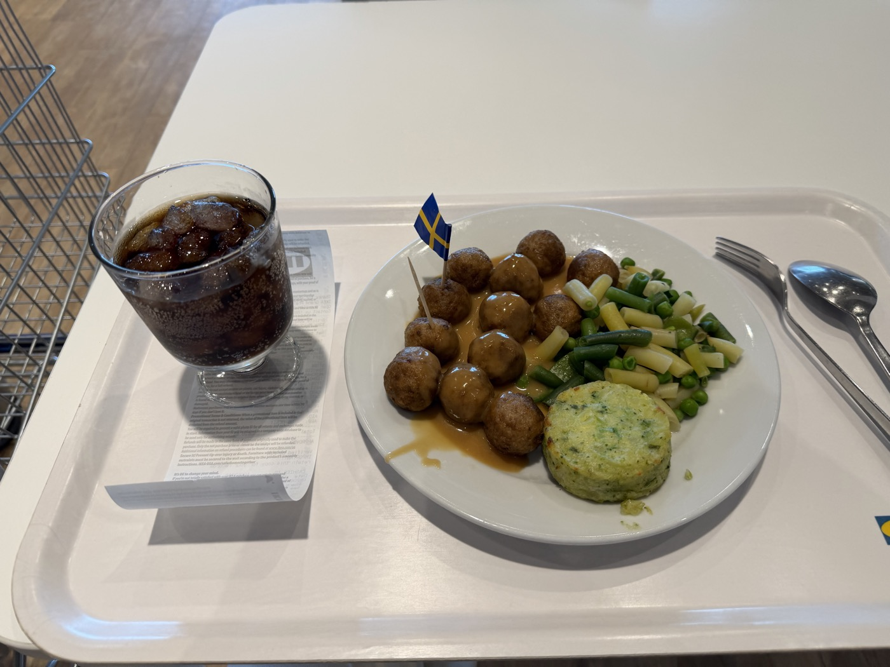
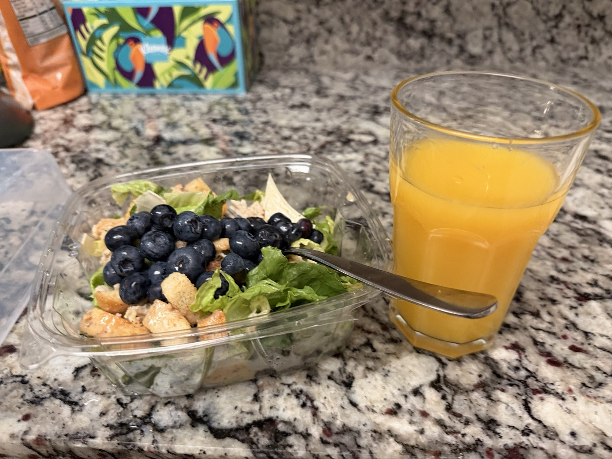
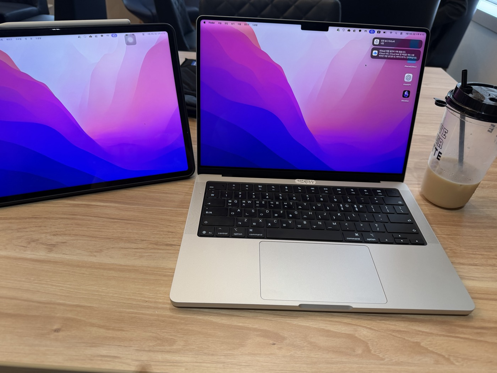

I arrived in Dallas to begin my PhD at UTSW. From the night I landed at the airport, through getting my student ID, buying a car, filling an empty apartment piece by piece, and finally trying Texas barbecue for the first time — here's a day-by-day, photo-by-photo record of my first week of settling in.

---

## Day 1 — August 2 (Sun) · Finally, Dallas

A long-haul flight out of Korea. I watched *The Godfather* on the plane and crossed the Pacific over in-flight meals.
The first time I saw *The Godfather* was back in middle school, with my father — he really wanted me to watch it.
The word "Godfather" itself says it all: a life built on earning enormous trust from people, and returning just as much generosity to them. It gave me a lot to think about.
At the same time, watching him help his own people even at the cost of hurting others made me reconsider, again, where the line for justice really is.

I landed at DFW past 11 PM.
It was supposed to be an evening flight, but the American Airlines/Korean Air codeshare got delayed about five hours out of nowhere.
So it ended up being my first time setting foot in Dallas, late at night.
Unfamiliar roads, unfamiliar signs — it finally hit me that I was really in America.

Late that night, I finally made it to the apartment I'd be living in.
Only once I'd dropped my bags did the long day actually end.
That first-ever 13-hour flight felt like a warning that the road ahead wouldn't be easy,
and the jet lag that followed was the first time in my life my body clock had ever truly broken down.

::: {.photo-row}

:::

---

## Day 2 — August 3 (Mon) · The Day I Started Filling an Empty Apartment

My first morning in America started with Chick-fil-A.
A close hyung (older friend) from my Daejeon days had insisted I try this chain.
Since it was still early, though, only the breakfast menu was available, so I couldn't get the honeycomb-shaped fries he'd so strongly recommended.

{.diary-photo}

The Zinus bed frame and mattress I'd pre-ordered were already waiting for me.
I'd gotten in so late the night before that I basically hadn't unpacked anything and just passed out.
Aching all over, I pushed through anyway,
put the frame together, and pulled the mattress out to make myself an actual place to sleep.

{.diary-photo}

Dinner was Chipotle.
I'd had In-N-Out for lunch, and honestly, I feel truly blessed.
All three of these legendary chains sit within a two-to-three-minute drive of each other — an insanely dense little "fast-food district."
Still, I'm trying to eat as "healthy" as I can manage.
And in the middle of all this, Chipotle is genuinely a solid meal.
The portions are so big, though, that I always end up splitting it into two.

{.diary-photo}

---

## Day 3 — August 4 (Tue) · First Visit to UT Southwestern

I visited the school for the first time.
My first impression: "why is this place so huge?"
They're apparently building an enormous new Children's Hospital (something like several trillion Korean won in scale),
so the whole area was a massive construction site, which didn't do much for the scenery.
I went into the Kern Wildenthal Biomedical Research Building to do my international student check-in.

{.diary-photo}

And today's highlight — **getting my student ID.**
Holding a card with my own name printed on it, it finally felt real.
Right — I decided to go back to grad school.
I felt a little nervous about what's ahead,
but also genuinely excited about how much new I'm about to learn.

{.diary-photo}

That same day, I also bought a used car.
This first week was so packed that I honestly can't write down every single thing that happened.
On day one I went and opened a bank account, on day two I saw this car, liked it, and signed the deal.
And now, on day three, I paid off the remaining balance and drove it home.
I found the listing through a Korean online community here in Texas.

Texas is so spread out that you genuinely can't go anywhere without a car.
So I moved fast to get one, and I'm glad I did, because it turned out to be spotless and in great shape.
I want to take good care of it and drive it for the next five or six years.

{.diary-photo}

From the day I landed, I was already imagining everything I'd need and going on Amazon ordering sprees.
Back in Korea, ordering through Coupang means next-day delivery, guaranteed,
but here, even with Amazon Prime, delivery sometimes slows down if something's out of stock.
It made me realize all over again just how convenient Korea really was.
Still, once I'd stocked up on a mountain of daily essentials, the apartment started to feel more and more like somewhere an actual person lives, which put me in a good mood.
{.diary-photo}

---

## Day 4 — August 5 (Wed) · Daiso, IKEA, and Decorating the Apartment

I headed to IKEA first thing this morning — there was still a mountain of things left to buy.
A desk, a chair, and a sofa were the main items on today's list.
To fuel up before all that shopping, I stopped by a chain called First Watch for breakfast.
Pancakes, bacon, eggs, and an iced latte — a proper American brunch.
The whole thing came out to somewhere around $20-30.
Paying that bill, I felt, hard, the need to learn to cook.

{.diary-photo}

At IKEA, I browsed desks and stocked up on a whole pile of kitchen stuff.
I'll be honest — I have zero skill at cooking.
Actually, "zero skill" is generous; the truth is I don't know how to cook at all.
But the second this morning's restaurant prices hit my wallet, something in me knew this had to change,
so I was glad I could quickly grab some kitchen gear while I was there.

{.diary-photo}

I was hoping to get an electric height-adjustable desk.
But since I also wanted a wide one, the price shot up fast, so I'm still on the fence.
IKEA's Trotten line is manual but reasonably priced, in the $200s,
while the 63-inch electric desk I actually want runs north of $600, so the internal debate continues.

Honestly, I think the chair matters more than the desk,
so I'd already decided I had to get either a Herman Miller or a Steelcase.
It happened that there was a used office-furniture store about a 30-minute drive away, so I stopped by,
and it was genuinely stacked wall-to-wall with Herman Miller and Steelcase chairs.

After picking through the whole lot, I grabbed the one that looked to be in the best condition.
It normally retails in the $700s, and I walked away with a well-known Steelcase Leap V2 for about 40% of that.

Just like the car, I ended up with a used chair in great condition.
I don't think it's realistic to have everything brand new here, especially as an international student.
Still, I felt genuinely lucky to be able to put together this level of setup at all.

{.diary-photo}

---

## Day 5 — August 6 (Thu) · Grocery Shopping and Yet More IKEA

Real grocery shopping today.
I asked ChatGPT what I'd need to make Greek yogurt at home — bananas, yogurt, frozen butter chicken, orange juice.
Since I'm a total beginner at cooking, I figure I'll be replacing breakfast with homemade Greek yogurt for a while.
Beyond that, my plan is mostly microwaving frozen food or buying meal-kit-style products and assembling them into something that passes for a real dish.

Maybe once I start actually craving specific things, I'll naturally start cooking for real?

{.diary-photo}

The IKEA I went to yesterday turned out to be small, without much to see,
so I headed back out to a much bigger one near home.
After browsing around for a while,
I had Swedish meatballs for lunch — the little Swedish flag stuck in the plate was pretty cute.
Being that huge, though, made it hard to track down exactly what I wanted.
Still, walking through an IKEA on a scale I'd never seen back in Korea was genuinely fun.

{.diary-photo}

---

## Day 6 — August 7 (Fri) · License Plates, the Mall, and Ramyun

After IKEA yesterday, I grabbed coffee with some Korean students who'd also come to study at the same school, just to say hi.
And now it's the day after that.
One of those Korean students showed up in a full On shoes and Alo outfit combo,
and it looked so good that I decided I had to go check the brands out myself.

I looked for somewhere I could find both brands and landed on NorthPark Mall.
It's basically the American equivalent of a Korean complex mall,
except — probably because land here is so cheap and plentiful — they don't build up, they build sprawlingly out, horizontally instead of vertically.

Spotted a Tesla Cybertruck wrapped in mint green on the highway. Very Texas.

{.diary-photo}

I wandered around NorthPark Mall, which has a fountain and an indoor garden.
The garden had a lovely little fountain with turtles wandering around in it.

Alo took forever to find; I wandered around for ages before I finally spotted it and went in.
It was packed with Americans — clearly a genuinely popular local brand.
Buying the exact same outfit my Korean friend had on felt a bit much,
so I tried to just get some running gear instead, but men's activewear options turned out to be surprisingly limited.

There was a high-neck running top I liked, but they didn't have my size, so I couldn't buy it.
I thought about ordering it online, but by the time I got around to it my interest had cooled off, so I decided to just skip it.

{.diary-photo}

After that I headed to a store that carried On shoes,
but it turned out to be more like Korea's ABC Mart — a multi-brand shoe store, not an On specialty shop — so I couldn't find the running shoe I actually wanted.
That sent me off to REI, an outdoor gear store, to hunt down On running shoes instead.

This place is basically heaven for outdoor gear nerds.
Patagonia, Arc'teryx, every recognizable outdoor brand you can name, all under one roof,
laid out in a way that felt dense and well-curated without being overwhelming. Shopping there was a genuine pleasure.

I fell for an "Outside Texas" cap right at the entrance,
and also picked up a top-and-bottom set from Vuori, the athleisure brand.

Same story with On shoes — nothing in stock —
but they did have the Cloudmonster 3 model I was after, at least as a display pair, so I could check my size.
I finished the job by ordering the color and size I wanted online.

{.diary-photo}

After about a week of eating nothing but calorie-bomb fast food, I was craving Korean food.
On a stop at Target for a few groceries, I picked up some Shin Ramyun.
Ramyun eaten in a foreign country is always, always the right call.

{.diary-photo}

---

## Day 7 — August 8 (Sat) · My First Taste of Texas Barbecue

Breakfast was a light chicken Caesar salad with blueberries on top, at home.
This morning I went straight to the tax office to register the car.
In Texas, buying a car from a private seller goes like this:
write up a Bill of Sale (proof of purchase) → take possession of the vehicle and the Title → register insurance → Title Transfer.
That fourth step, the Title Transfer, is what requires an actual visit to the tax office.
What you need to bring: ID (a passport, in my case), proof of insurance, the Title, and a way to pay Texas's vehicle registration tax (6.25% of the vehicle's value).

{.diary-photo}

Once you register the car this way, you get a license plate and an inspection sticker.
The sticker goes on the inside of the front windshield, and the plate goes on the front and back of the car.
Until the plate arrives, you can drive on a temporary transit permit,
which is valid for five days once issued.
And the whole Title Transfer process has to happen within 30 days of buying the car.

{.diary-photo}

And dinner was Texas barbecue.
If you're in Texas, you have to try — **Terry Black's Barbecue.**
I went with the same Korean friends I'd had coffee with recently, for a round of barbecue and beer.

Inside, the place was packed almost entirely with local Americans.
Clearly a real, legit local favorite.

{.diary-photo}

Brisket, sausage, ribs, mac and cheese, potato salad.
Maybe because I'd built it up so much in my head, it wasn't quite as amazing as I'd hoped.
The sides were pretty good, though, so we paired them with the meat and had a beer each.
Being able to sit around chattering away in Korean with Korean friends, this far from home, felt like a genuinely lucky connection to have.

{.diary-photo}

---

## Day 8 — August 9 (Sun) · Grand Prairie Outlets

Lunch was quick and easy at home — fried rice with an egg on top.
The fried rice was a frozen vegetable fried rice from Trader Joe's, and it was actually pretty decent — good portion size too.
It's probably going on my repeat-purchase list for next time I go grocery shopping.

In the afternoon, I headed to Grand Prairie Premium Outlets.
It was so hot and I was so sleepy that I ordered an iced latte.
It was labeled a caramel truffle latte, but there wasn't a hint of truffle flavor in it — kind of a letdown.
I settled for grabbing a running top-and-bottom set at Nike, since I hadn't managed to get one at Alo,
then picked up a pair of Crocs to wear in the lab before heading home.

{.diary-photo}

In the evening, I sat in my apartment complex's community lounge to prep for tomorrow's meeting.
The settling-in week is over — now grad school actually starts for real.

{.diary-photo}
