UTSW 박사과정을 시작하러 댈러스에 도착했다. 공항에 내린 첫날 밤부터 학생증을 받고, 차를 사고, 텅 빈 집을 하나씩 채우고, 첫 텍사스 바비큐를 맛본 정착의 첫 일주일을 사진과 함께 날짜별로 남긴다.

---

## Day 1 — 8월 2일 (토) · 드디어 댈러스 도착

한국에서 출발한 장거리 비행. 기내에서 영화 〈코코〉를 보고, 기내식을 먹으며 태평양을 건넜다.

{.diary-photo}

밤 11시가 넘어 DFW 공항에 내렸다. 렌터카 게이트를 빠져나올 때 차 시계가 8월 2일 밤 11시 5분을 가리키고 있었다. 낯선 도로, 낯선 표지판 — 진짜 미국에 왔다는 게 실감났다.

{.diary-photo}

공항을 나와 처음 마주친 건 환하게 빛나는 Raising Cane's 간판. 첫날 밤의 댈러스는 조용하고 넓었다.

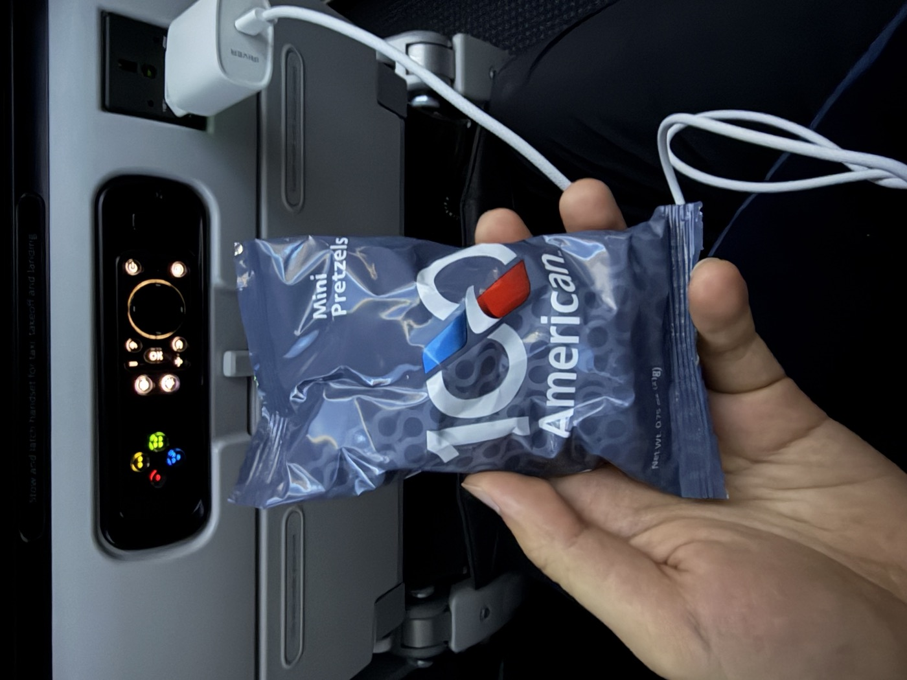{.diary-photo}

늦은 밤, 드디어 앞으로 살게 될 아파트에 도착했다. 클럽하우스, 헬스장, 자판기까지 — 짐을 내려놓고 나서야 긴 하루가 끝났다.

---

## Day 2 — 8월 3일 (일) · 텅 빈 집을 채우기 시작한 하루

첫 아침은 Chick-fil-A. 미국 아침의 상징 같은 곳에서 요거트와 브런치로 하루를 시작했다.

{.diary-photo}

점심은 그 유명한 In-N-Out. Double-Double과 감자튀김 한가득.

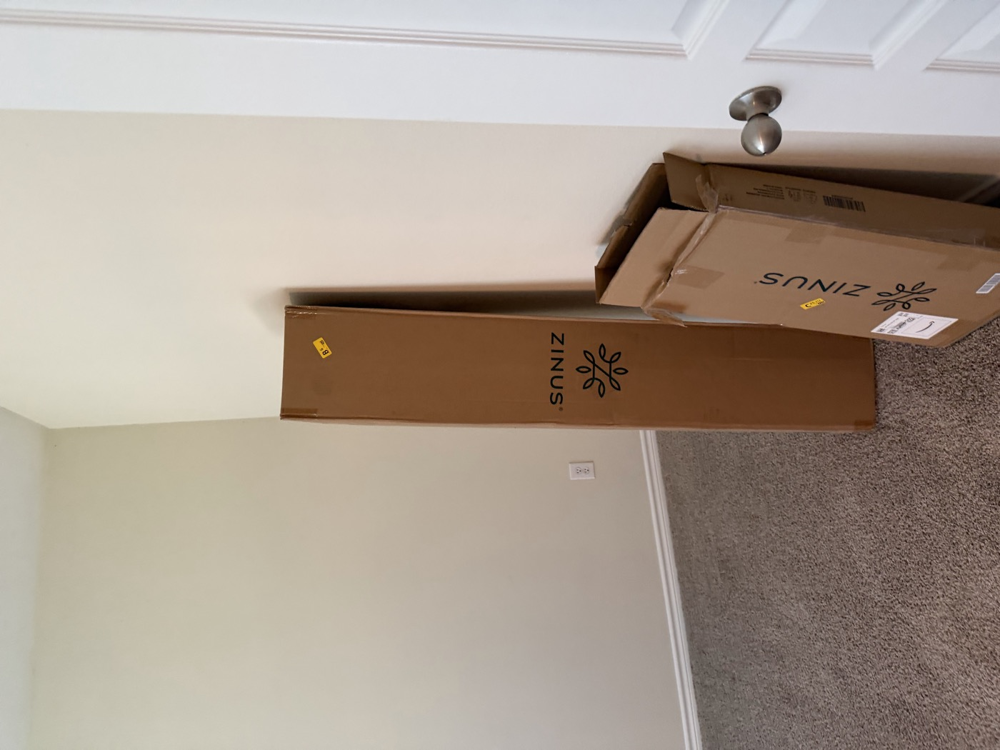{.diary-photo}

오후엔 텅 빈 방을 채우는 노동. Zinus 침대 프레임을 낑낑대며 조립하고, 매트리스까지 올리니 드디어 '잘 곳'이 생겼다.

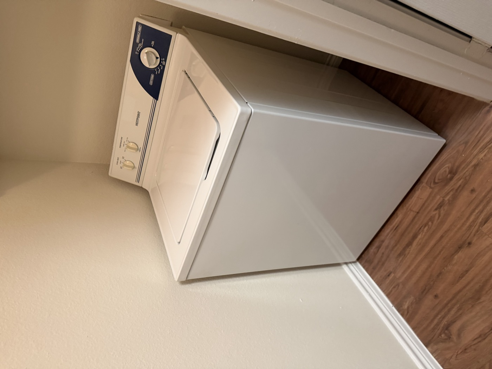{.diary-photo}

저녁은 Chipotle 볼. 정착 첫 이틀은 온통 '먹고, 사고, 조립하는' 날들이었다.

{.diary-photo}

---

## Day 3 — 8월 4일 (월) · UT Southwestern 첫 출근

드디어 학교에 갔다. Kern Wildenthal Biomedical Research Building 앞에서 인증샷.

{.diary-photo}

그리고 오늘의 하이라이트 — **학생증 발급.** "Suyeong Park, Graduate School of Biomedical Sciences." 이 카드 한 장에 지난 몇 년이 담긴 기분이었다.

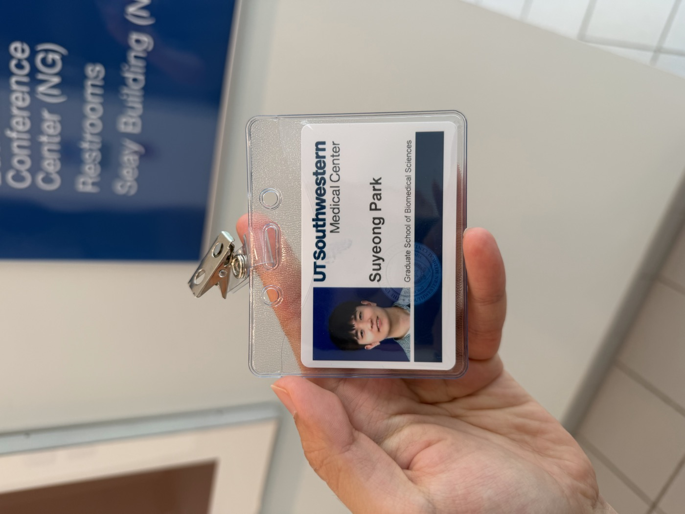{.diary-photo}

캠퍼스를 돌아다니다 만난 다람쥐 한 마리. 텍사스의 다람쥐는 사람을 별로 안 무서워한다.

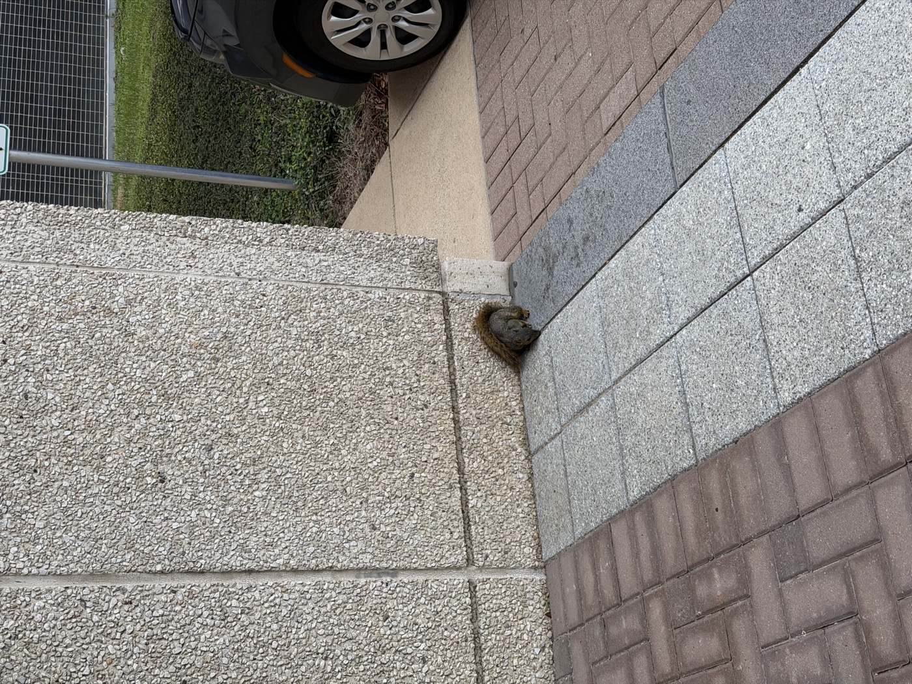{.diary-photo}

이동수단도 생겼다. 검은 현대 산타페 — 달사람닷컴에서 개인 매물로 만난 2022년식 XRT 트림, 20,200달러에 중고로 구매했다. 첫 차이자 미국 생활의 발이 되어줄 녀석.

{.diary-photo}

돌아오는 길엔 생필품 대량 구매. Charmin, Tide, Crest… 집이 조금씩 사람 사는 곳이 되어간다.

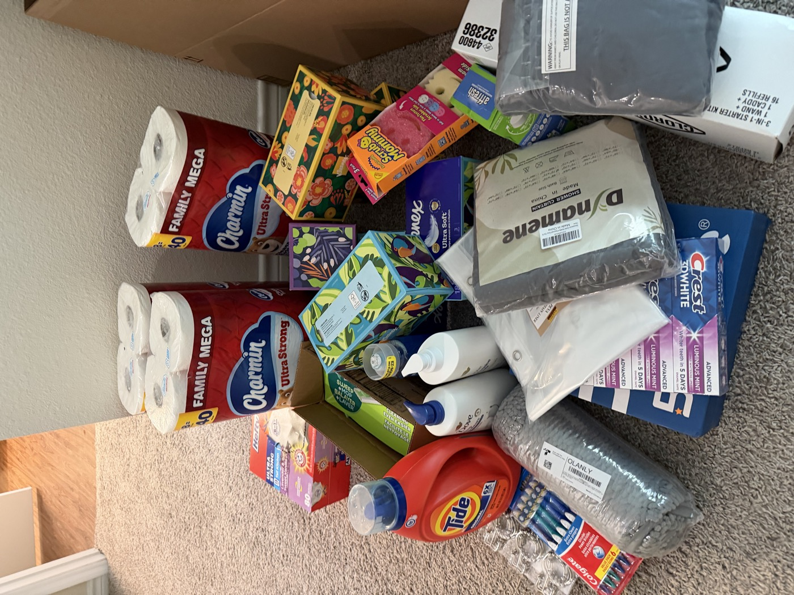{.diary-photo}

---

## Day 4 — 8월 5일 (화) · 다이소와 이케아, 집 꾸미기

아침은 First Watch에서 팬케이크·베이컨·에그와 아이스라떼. 제대로 된 미국식 브런치.

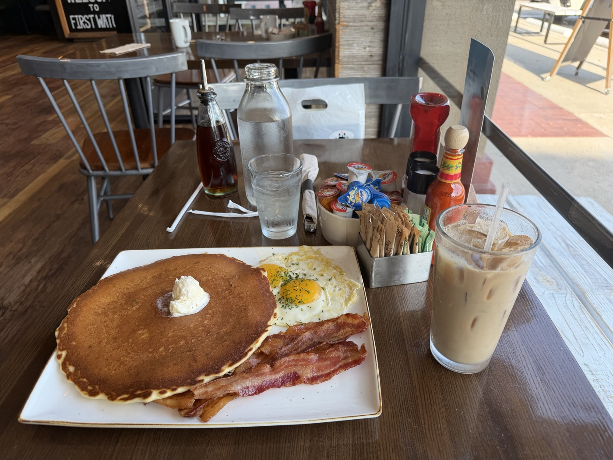{.diary-photo}

낯선 도시에서 만난 반가운 이름, DAISO. 한국 감성이 이렇게 반가울 줄이야.

{.diary-photo}

이케아에서 책상을 구경하고,

{.diary-photo}

중고 가구점에서 스틸케이스(Steelcase) 사무용 의자를 400달러에 건졌다. 집에 세팅하니 방 한 켠에 제대로 '공부할 자리'가 생겼다. 좋은 의자에 투자하는 건 앞으로의 대학원 생활을 위한 첫 투자.

{.diary-photo}

---

## Day 5 — 8월 6일 (수) · 장보기와 또 이케아

본격 장보기. 바나나, 요거트, 냉동 버터치킨, 오렌지주스 — 카트가 점점 그럴듯해진다.

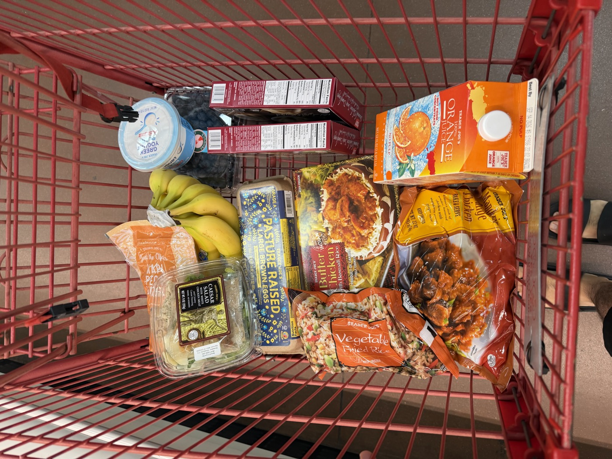{.diary-photo}

이케아에 다시 가서 스웨디시 미트볼로 점심. 접시에 꽂힌 작은 스웨덴 국기가 귀엽다.

{.diary-photo}

서랍장(STORKLINTA)을 놓고 한참 고민. 가구 하나 사는 데도 신중해진다.

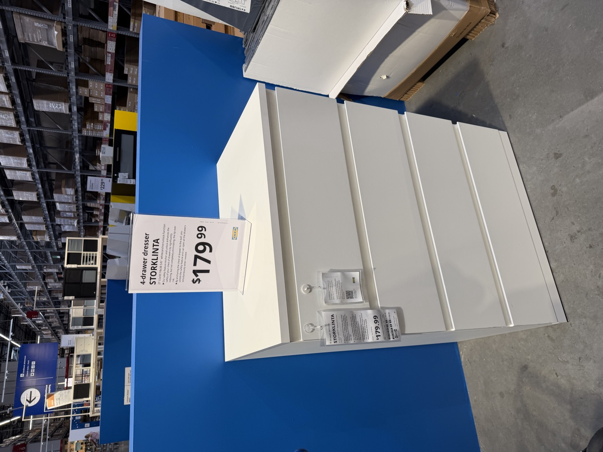{.diary-photo}

---

## Day 6 — 8월 7일 (목) · 번호판, 몰, 그리고 라면

차 번호판이 나왔다. **TEXAS · YDW-6781 · The Lone Star State.** 이제 진짜 텍사스 주민이 된 느낌.

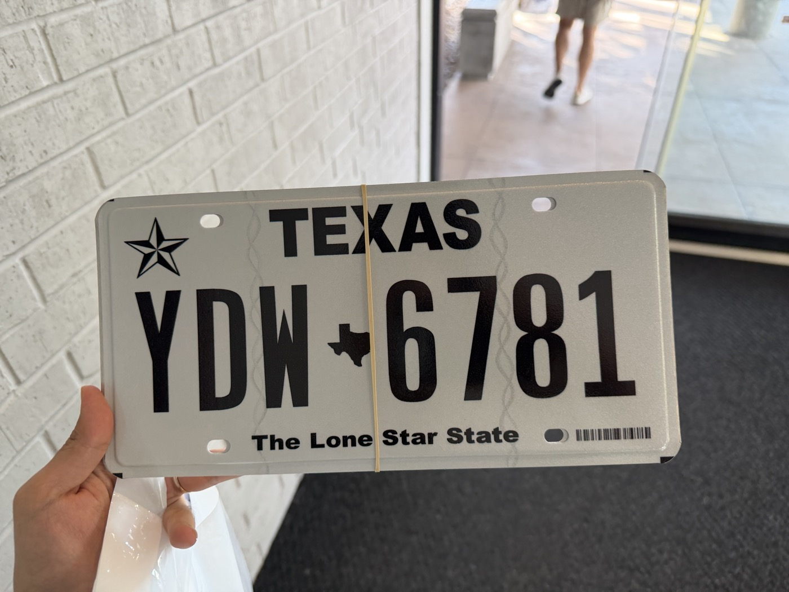{.diary-photo}

고속도로에서 민트색 랩핑을 한 테슬라 사이버트럭을 목격. 텍사스답다.

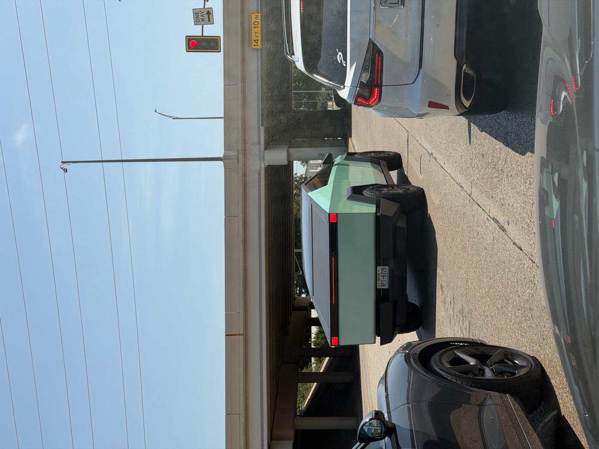{.diary-photo}

분수와 실내 정원이 있는 NorthPark Mall을 구경했다. 물 속엔 거북이도 있었다.

{.diary-photo}

아웃도어 매장 REI에서 "Outside Texas" 모자를 써보고,

{.diary-photo}

집에 돌아와선 결국 신라면. 타지에서 먹는 라면은 늘 옳다.

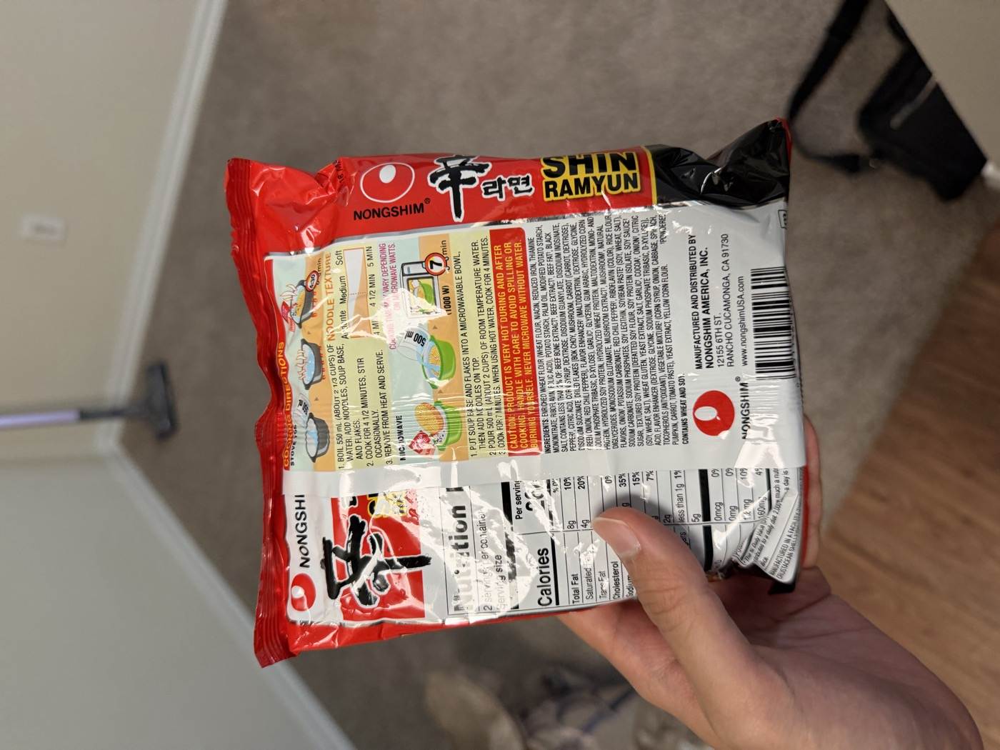{.diary-photo}

---

## Day 7 — 8월 8일 (금) · 텍사스 바비큐 입문

점심은 집에서 치킨 시저 샐러드에 블루베리를 얹어 가볍게.

{.diary-photo}

그리고 저녁 — 텍사스에 왔으면 꼭 해봐야 할 것, **Terry Black's Barbecue.**

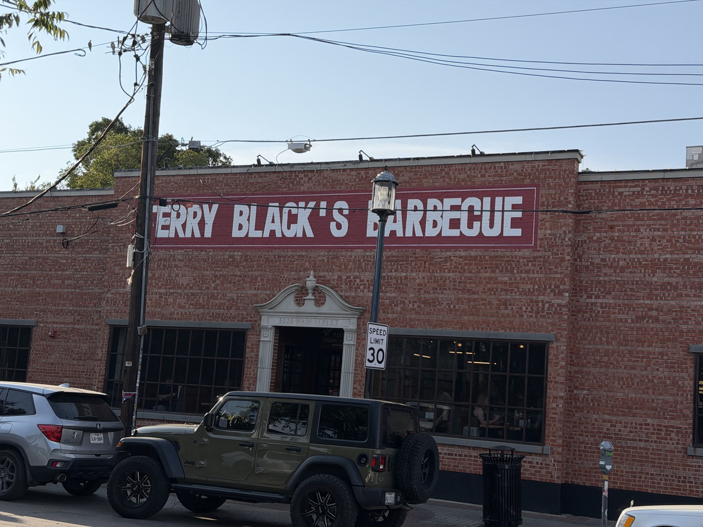{.diary-photo}

브리스킷, 소시지, 립, 맥앤치즈, 감자샐러드에 흰 식빵까지. 접시가 압도적이다.

{.diary-photo}

Modelo 한 병과 함께한 첫 정통 텍사스 BBQ. 이 맛에 텍사스 사는구나 싶었다.

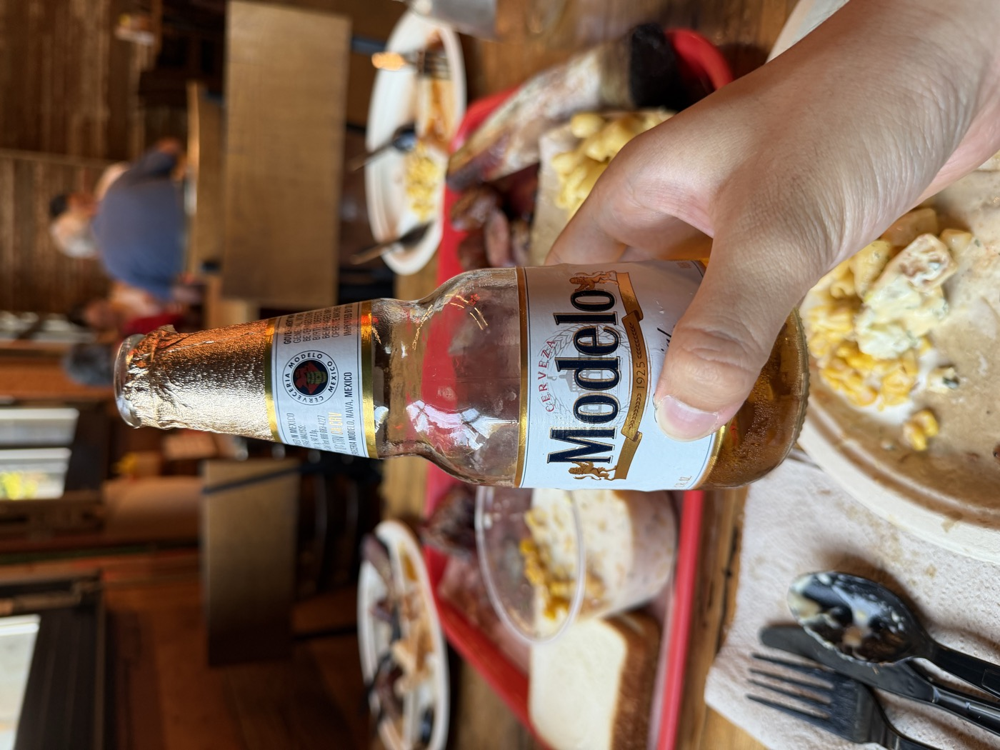{.diary-photo}

---

## Day 8 — 8월 9일 (토) · 아웃렛과 애플스토어

점심은 집에서 볶음밥에 계란을 올려 뚝딱.

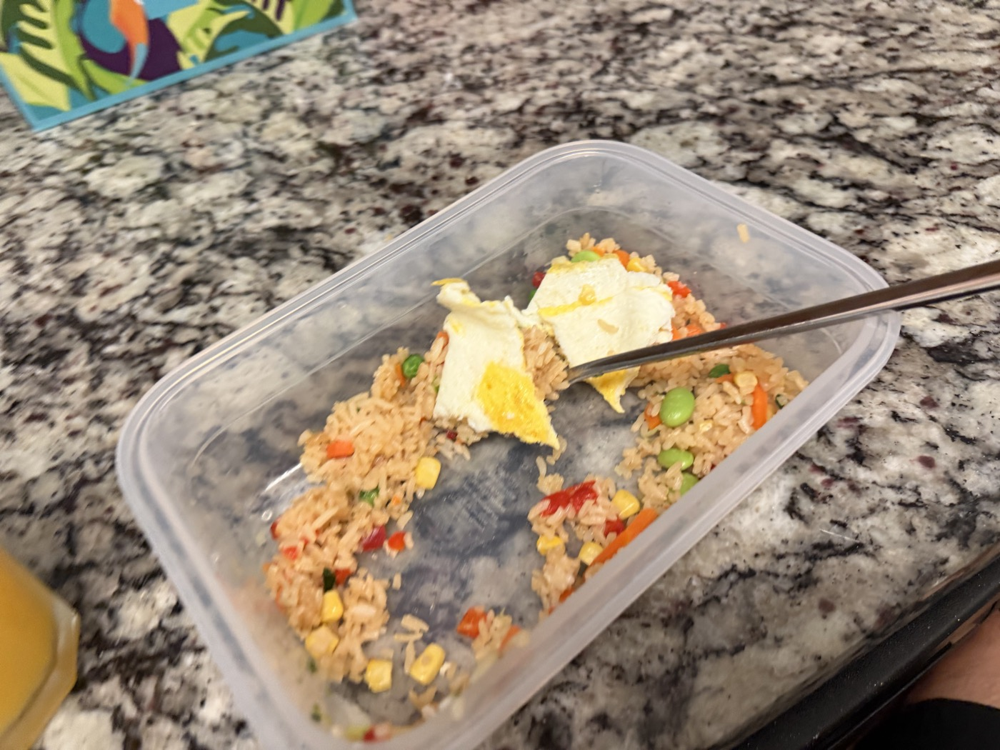{.diary-photo}

오후엔 아웃렛으로. "LOVE YOUR LATTE" 컵을 들고 Bath & Body Works를 지나 쇼핑.

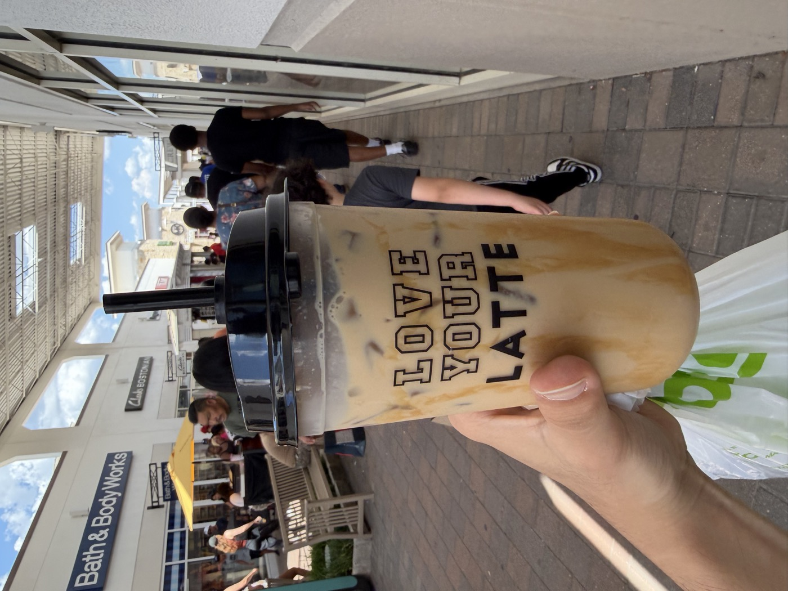{.diary-photo}

저녁엔 아파트 커뮤니티 라운지에서 내일 있을 미팅을 준비했다. 맥북과 아이패드를 나란히 펼쳐놓고 — 정착의 한 주가 끝나고, 이제 진짜 대학원 생활이 시작된다.

{.diary-photo}

