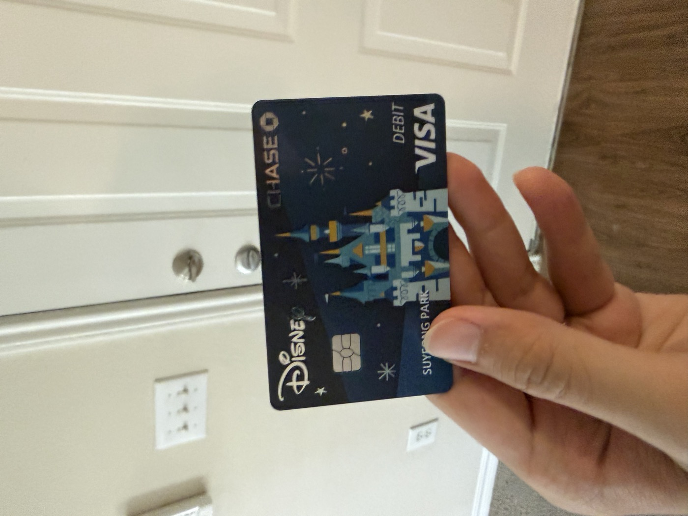
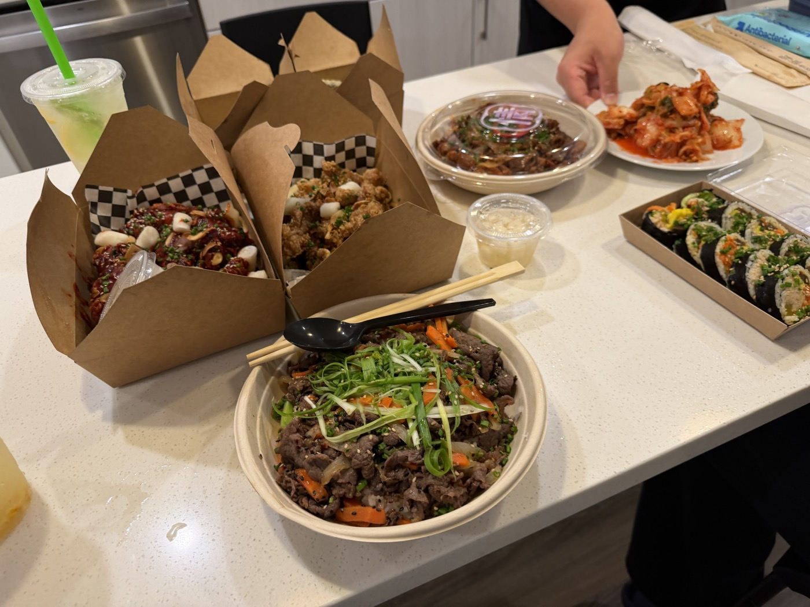
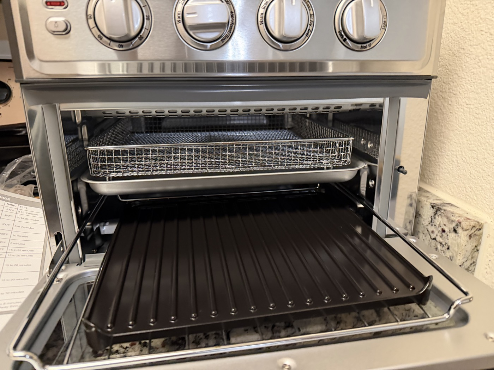
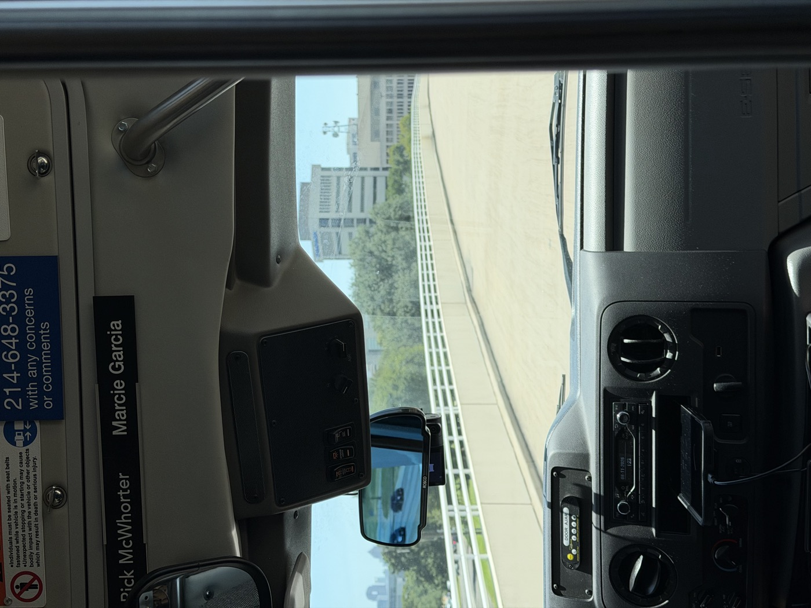
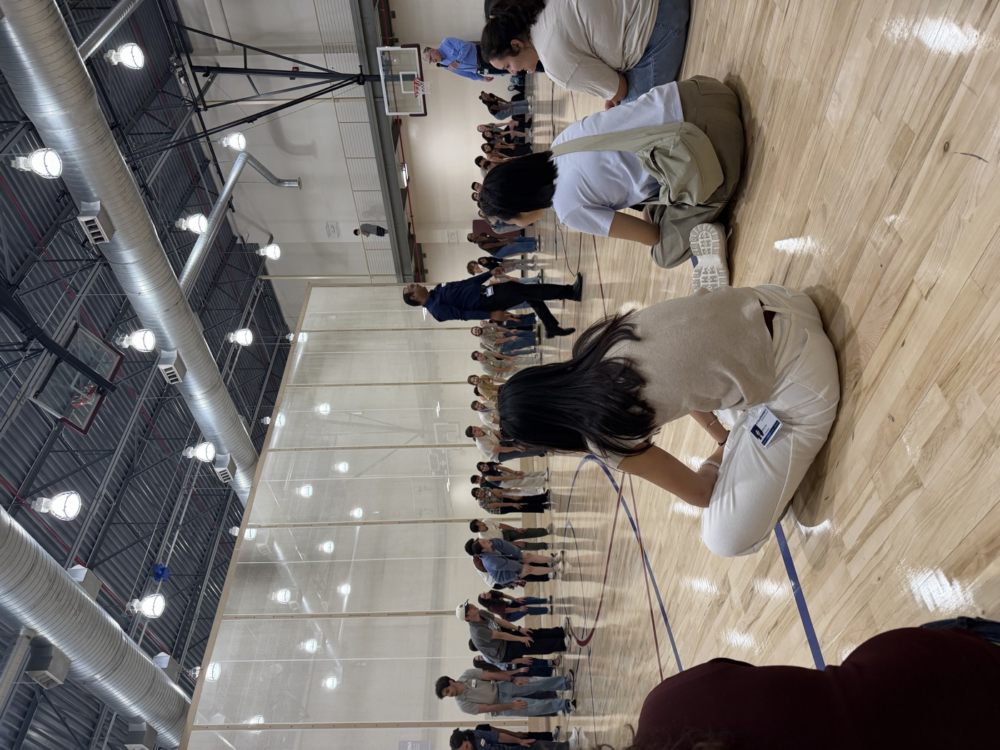
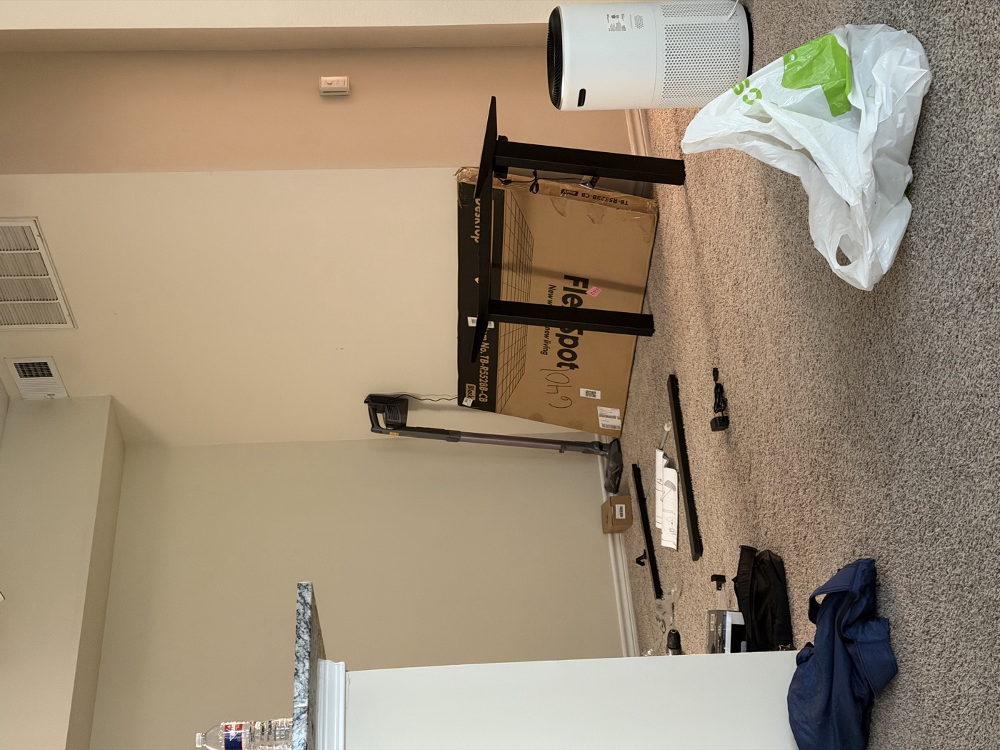
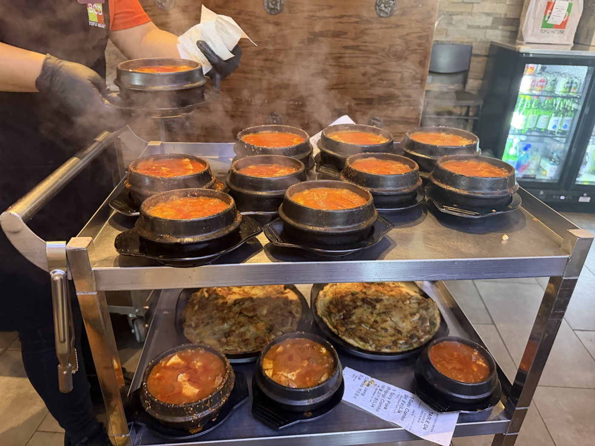
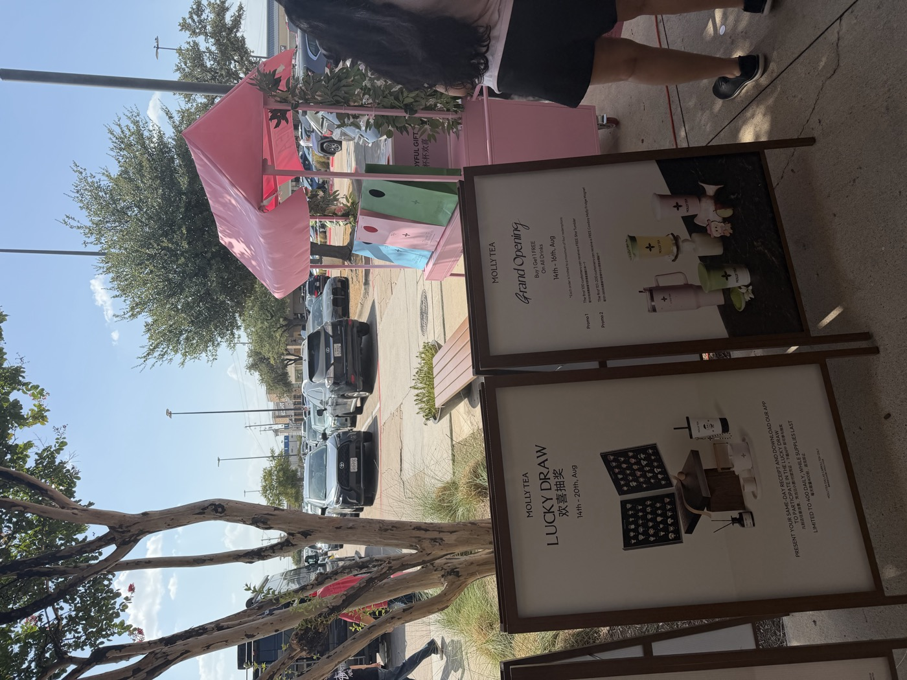
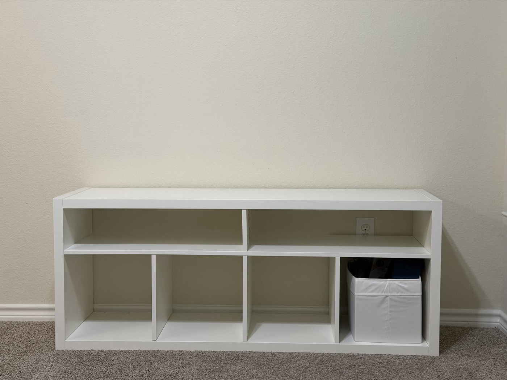
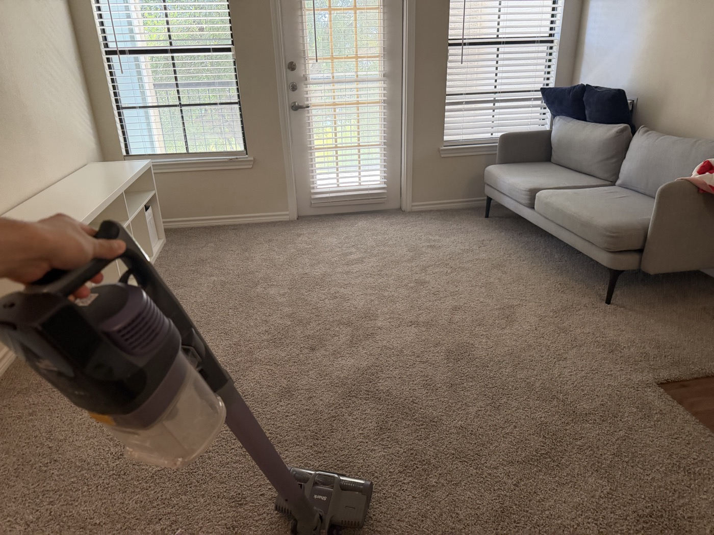

If the first week was about arriving and surviving, this week was about exploring. I got my Texas driver's license, finished furnishing the apartment with a sofa and a standing desk, and grad school orientation finally began.

## Day 1 — August 10 (Mon) · Driver's License and Decorating the Apartment

First thing in the morning, I went to the Texas DPS (Department of Public Safety) to apply for my driver's license. The weather forecast on the waiting-room screen showed 100°F (about 38°C) straight through Monday, Tuesday, and Wednesday. Texas summers are not messing around.

There was a hiccup with the license process: my name couldn't be verified in SAVE, the immigration-run system that confirms entry status. So after all the trouble of booking an appointment and showing up, I couldn't actually exchange my license at the DPS that day — I was told to wait for a physical letter from immigration in the mail and come back again later. (Oh my god.)

::: {.photo-row}

:::

Lunch was Chick-fil-A again. I'd had it last week too, and their freshly-fried waffle fries were so good I went back for more. Last time I ate comfortably indoors, but the location near the DPS only had outdoor seating, so I wolfed it down before the heat got to me. This time I got the Deluxe version instead of the plain Original — lettuce, cheese, the works — and it tasted better to me, probably because it's closer to the kind of burger Koreans are used to.

And the debit card I'd requested from Chase last week finally arrived in the mail. I'd already added it to Apple Pay and had been using it fine, but every once in a while — like at the tax office paying the 6.25% vehicle registration tax — Apple Pay just wouldn't work.
(That day I ended up going back to the bank to withdraw cash and making a second trip to the tax office just to pay it...)

So I was genuinely happy to finally get the physical card. I'd gone back and forth on whether to pick the Disney card design, worried it might look a little childish, but in person it looked much cleaner and nicer than I expected.

::: {.photo-row}

:::

Next on the agenda was buying a used sofa. I'd tried out a bunch of options at IKEA and was torn between the SÖDERHAMN and the KIVIK, but paying somewhere between $800 and $1,000 for a brand-new one made me hesitate. Then I spotted a sofa from West Elm, the New York furniture brand, going for about $150 on Facebook Marketplace, and decided to go see it in person.

It was in better shape than I expected, so I rented a 9-foot U-Haul cargo van to move it. There was no way I could manage it alone, so I asked a Korean guy — a bit younger than me — who I'd had barbecue with the week before, if he could come help. He agreed without hesitation, and we headed out together to pick up the sofa.

Sitting behind the wheel of an unfamiliar truck was a new experience in itself.

(A brief reflection) That's what America seems to be like — if you decide you're going to do something, there's always a way to make it happen. There was a lot of back-and-forth before I decided to come here, but I made up my mind and made it work. I want to keep doing that — deciding, and making it work — from here on out.

::: {.photo-row}

:::

The sofa finally made it into the living room. The space that used to feel so empty is slowly turning into a home.

::: {.photo-row}

:::

Dinner was Korean food. I wanted to treat the friend who'd helped move the sofa, and also another Korean friend who'd helped me a lot before I even arrived in the US — a small way of paying it back. I got takeout from a Korean restaurant called Jeong Kitchen: bulgogi, chicken, gimbap, and kimchi (courtesy of my friend) — a proper spread.

## Day 2 — August 11 (Tue) · Delivery Rush and Trader Joe's

Packages started piling up at the front door. My FlexiSpot standing desk and Cuisinart air fryer oven, along with everything else I'd ordered, all showed up at once. The standing desk's legs hadn't arrived yet — only the tabletop had — so I just moved the oven in for now.

I went grocery shopping at the same Trader Joe's I'd visited last week. American grocery stores are all so huge that even picking up a few things means a lot of walking. This one's the closest to my apartment (10 minutes by car), and it's stocked tightly with just the essentials, which makes it easy to grab a week's worth of food in one trip.

I wandered the aisles and threw in Greek yogurt, granola, cold brew, and a few snacks. All last week I had no way to make coffee at home, so I kept buying it out, and some days I just went without. Skip coffee for even one day and my head starts spinning. Still, I'm trying to stay healthy, so lately I've been making a point never to drink coffee on an empty stomach.

I also picked up an almond-and-chocolate snack someone had recommended.

::: {.photo-row}

:::

I unboxed the Cuisinart air fryer oven and found it a spot in the kitchen — one more reliable weapon for a cooking beginner.
Dinner was butter chicken reheated at home. I'm slowly figuring out how to survive on my own. It tasted good enough that I'll definitely buy it again.

::: {.photo-row}

:::

## Day 3 — August 12 (Wed) · Orientation Day 1

Grad school orientation finally began. I have a car, but I still hadn't gotten a parking permit, so I took the UTSW shuttle to campus. Everyone gathered at the Student Center for icebreaker activities, and I got to introduce myself to new classmates from all over the world.

::: {.photo-row}

:::

At the end, we got a bag stuffed with UT Southwestern swag and a cold ice pop. They really rolled out the welcome for us new students.

And, I also found out there was another Korean student none of us had known about, which brought the total number of Korean PhD students I've met to four. She's in a different program, and after orientation she suggested we grab a meal together, so we went out for ramen. I assumed we'd all split the bill, but she insisted on treating us — there was a whole back-and-forth over it, and in the end she won and we let her pay.

This kind of looking-out-for-each-other — jeong (정, that particularly Korean sense of warmth and attachment) among Koreans far from home — has been a huge help in adjusting to this unfamiliar country.

::: {.photo-row}

:::

## Day 4 — August 13 (Thu) · Orientation Day 2 · Standing Desk

Day two of orientation. It ran for three days total, Wednesday through Friday, and today was mostly a general walkthrough of the class schedule.

The UTSW Core Curriculum is split into three parts: Proteins, Genes, and Cells. Proteins is supposedly the hardest of the three, but since I've always liked life science, I don't think I'm too worried about it.

Classes run Monday through Thursday, 8:30 to 10:00 a.m. There's a literature-review discussion session on Tuesdays and an experimental-design discussion session on Thursdays, and Friday is presentation day for experimental design.

The exam schedule is as follows:

Proteins: Exam 1 on 8/31, Exam 2 on 9/28
Genes: Exam 1 on 10/12, Exam 2 on 11/9
Cells: Exam 1 on 11/23, Exam 2 on 12/14

On top of that, there's RCR — Responsible Conduct of Research — training, covering research ethics, with six sessions scheduled: 9/2, 9/4, 9/16, 9/23, 10/21, and 11/4. We were warned that missing an RCR session comes with a (frighteningly) heavy makeup assignment.

Finally, the office that handles international students warned us to avoid leaving the US at all during our first year if possible. Still, I'm hoping I might be able to make it back to Korea next summer.

...

After orientation I got home to find the standing desk's legs had finally arrived. Actually, they'd taken so long that I'd already requested a return — but the manufacturer offered me a 15% discount if I'd cancel the return instead, and I took the deal. America really is the land of the counteroffer. If something isn't sitting right with you, you speak up and negotiate, and because of that, how you frame things and make your case seems to really matter here.

It wasn't easy at all, but after laying out all the parts and wrestling with them for a while, my very own desk was finally done.

::: {.photo-row}

:::

## Day 5 — August 14 (Fri) · Orientation Day 3 · Safety Training

Last day of orientation. Free coffee and breakfast were provided. An iced latte from Lemmon Drop coffee shop woke me up, and then we sat through lab safety training — emergency safety equipment, emergency wash stations, and the like. It finally started to feel like I was getting ready to actually step into a lab.

Partway through the long lecture, I recharged with some Snacky Clusters from Trader Joe's. Week two of settling in, and both my apartment and school life are gradually finding their footing. My body clock is finally starting to sync up properly.

::: {.photo-row}

:::

## Day 6 — August 15 (Sat) · H Mart, BCD Sundubu, and DIY Assembly

I slept in today, then headed to H Mart. My first thought walking in was, "Wait, am I in Korea?" I grabbed a cart-load of Bibigo dumplings and Kanu coffee — things I'd never expect to find in the US — without a second thought.

There was even a Paris Baguette inside H Mart. It had only been two weeks, but seeing a Korean-style bakery again felt like I hadn't seen one in ages, and it was oddly comforting.

::: {.photo-row}

:::

For lunch we went to BCD Sundubu near H Mart. Four of us ate together — me, and a Korean friend along with her Big Sib (something like a close upperclassman/mentor in her program). That friend is still a fairly new driver, so on days when we have some free time, we go for drives together and I help coach her along a little at a time.

Eating good LA galbi, fresh geotjeori-style kimchi (lightly seasoned, not fully fermented), and sundubu, I felt a wave of happiness wash over me. The saving grace is that I've never had much of a craving for Korean food specifically, so I get by fine without it most days. Still, on days when the Korean food is this good, my appetite comes roaring back.

::: {.photo-row}

:::

After eating well, we stopped by Molly Tea for a quick drink. It was their grand opening, and people in pink cowboy hats were dancing away in the parking lot.

America really does feel full of bright energy. Seeing people smiling everywhere, cracking up over the smallest things, made me want to be more like that myself. Heaviness and lightness — I think I need to practice setting a little of the heaviness down and letting myself be lighter.

::: {.photo-row}

:::

Then I fell into assembly hell again — this time an IKEA TV shelf. I'd ordered it a while back and had honestly forgotten about it since it took so long to arrive, but it showed up blocking the entire entrance to my apartment, so I had no choice but to drag it in.

I laid out the parts and struggled through it, and before I knew it, a whole wall was filled with a finished storage unit. Maybe I'm actually getting decent at furniture assembly?

::: {.photo-row}

:::

## Day 7 — August 16 (Sun) · Tidying Up

Sunday, I started the day catching up on cleaning that had piled up. I ran a load of laundry and ran the cordless vacuum over every corner of the carpet. At first, just thinking about how much dust must be trapped in the carpet made me a little reluctant to even come home — but after vacuuming it up bit by bit and setting up furniture and tidying, I found myself growing fond of the place.

I want to fix this place up nicely and make the most of the four years I'm allowed to stay in student housing. Whatever moving plans come after that, I trust future-me to figure it out.

I also bought a textbook based on an English study method I'd read about somewhere. Being here has really driven home how important English is, and I decided I needed to set aside dedicated time to study. I figured speaking and listening would naturally improve just from keeping up with classes, and that vocabulary was my biggest weak point. So my plan is to build up my vocabulary gradually with Wordly Wise, learning about 15 words a day.

After a slow, lazy afternoon and a short workout, I'm finally on the doorstep of my very first day of classes.

