정착 3주차. 드디어 본격적인 수업이 시작되었다. 텍사스 운전면허를 따고, 소파와 스탠딩데스크로 집을 완성하고, 드디어 대학원 오리엔테이션이 시작됐다.

## Day 1 — 8월 17일 (월) · 대학원 본격 수업 시작

첫 대학원 수업이 시작되었다. Core curriculum인 Proteins부터 시작해서 각 7주간, Cells, Genes를 배우는 과정이다. 간단한 코스 소개와 함께 Proteins 수업에서는 아미노산 20가지와 각각의 성질, 그리고 기본적인 단백질 분석법 등을 수강했다.

이어지는 오후 일과에서는 mouse safety class를 수강했다. 동물 실험을 하게 될지 아닐지 아직 모르지만, 내가 지망하는 immunology 면역학 분야에서는 mouse study가 꽤나 비중을 차지하고 있어서 미리 수강해두었다.

::: {.photo-row}

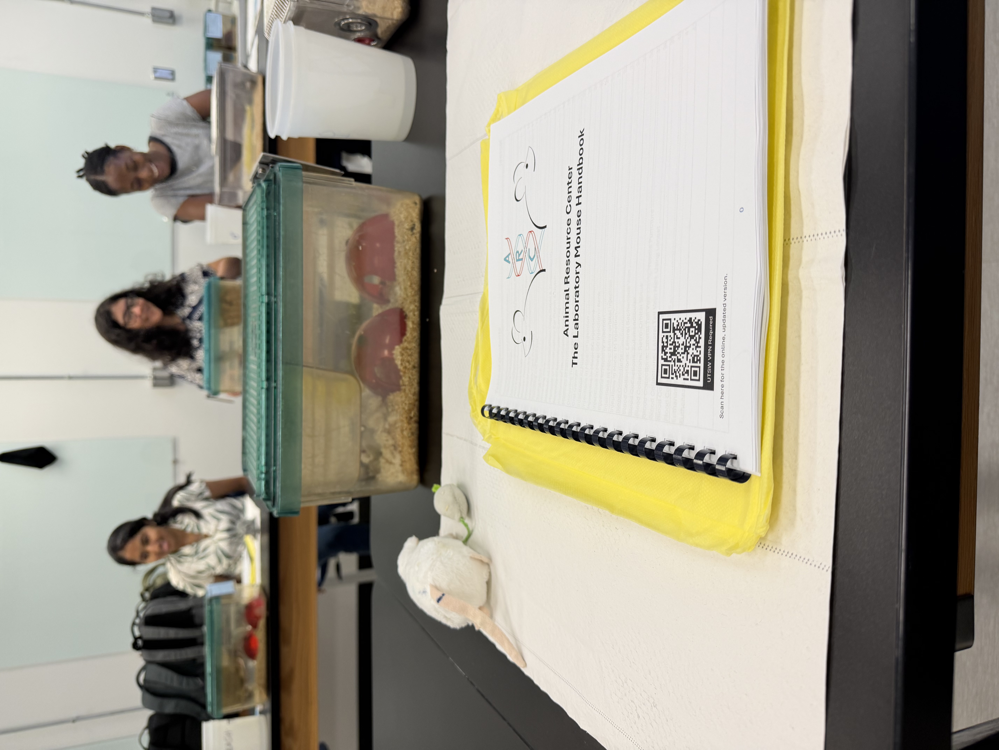
:::

그리고 한국에 있는 친구들과 이런 저런 얘기를 하다가, 영화 오디세이에 대한 이야기가 나왔다. 너무 재밌어서 두번, 세번 보러갔다는 친구의 이야기를 듣고 나도 혹해서 IMAX로 보고 싶어 찾아보았다. 그러다가, 달라스 근처에 IMAX 70mm 상영관이 있다는 것을 알게 되었고, 계속 빈자리를 새로고침해보다가 (아주 좋은 자리는 아니지만) 세번째 줄에 있는 좌석을 하나 잡게 되었다.

아직 일상 영어도 잘 들리지 않는 내가, 영화관에 가서 3시간동안 자막 없는 영화를 잘 소화할 수 있을지는 모르겠다. 그래도 밑져야 본전 아니겠는가..! IMAX 70mm를 본토에서 볼 수 있다는 것만 해도 정말 좋은 기회인 것 같다. 날짜는 9/6 일요일이니, 다다음 포스팅쯤 후기가 올라갈 수 있을지도.

그리고 달라스에 온지 2주 정도 되었던 김에, 내가 쓴 돈이 얼마나 되는지 한번 파악해보고 싶어서 가계부를 작성하였다. 주마다 친구들과 맛있는 것도 먹고, 아직 요리 세팅이 잘 되어있지는 않아 꽤나 외식 비중이 높은 상황에서 나쁘지 않은 수준의 지출을 확인하니 마음이 놓였다.

앞으로도 지출을 잘 관리해서, 박사과정을 마칠 때는 n원을 목표로 틈틈히 재테크도 공부해야겠다.

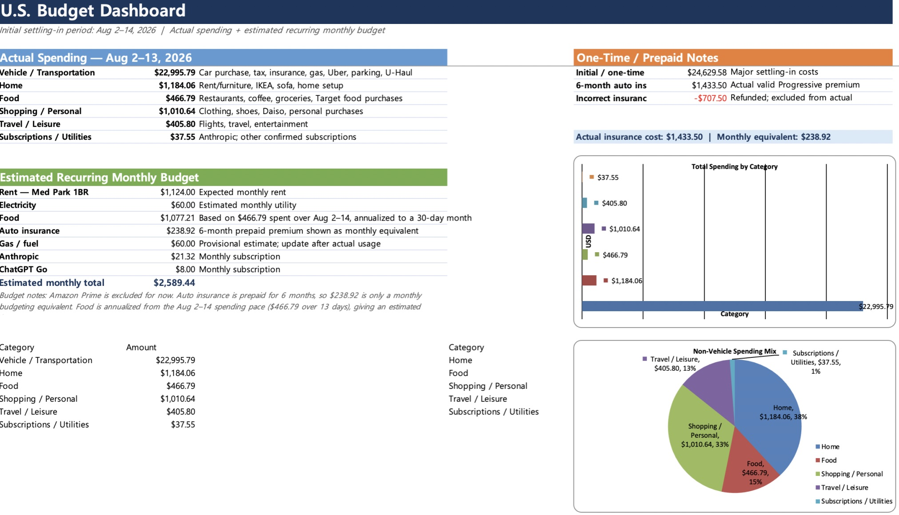

## Day 2 — 8월 18일 (화) · 미국 면허 발급 성공?!

영원히 텍사스 면허 발급 때문에 고통 받고 있었던 나는, 계속해서 나의 Case number를 조회하면서 진행이 되고 있는건지 확인해보고 있었다. 그러던 어느날, 갑자기 나의 Case status 상태가 바뀐 것이 아닌가!!
(지난 글 [미국 정착 2주차 — 오리엔테이션과 살림 채우기](2026-08-week2.html) Day 1 참고)

아묻따 이럴때는 일단 일이 발생한 장소로 달려가서 in person으로 직접 해결을 봐야한다. 그것이 내가 지난 2주간 미국 생활에서 내린 결론이었다.

::: {.photo-row}

:::

결과는 대 성공이었다.

무슨 일이 있었냐면, 미국 이민국에서 관리하는 SAVE라는 프로그램에 내가 아직 등록이 안되어서 텍사스 DPS(Department of Public Safety)에서도 신원 조회가 안되었던 것이다. 그래서 입국 후 2주가 지난 지금에서야 시스템 상 정상적인 신원 조회가 가능하여, 드디어 텍사스 면허를 발급받게 됐다.

아직 실물은 받지 못했지만, 1주일 내로 우편으로 보내줄거라고 하니 기다려봐야지.
다만 "교환"하는 것이다 보니 기존에 가지고 있던 한국 면허증은 반납해야 했다.

...

그리고 기다리고 기다렸던 ON 런닝화가 배송되었다.(?!)

::: {.photo-row}
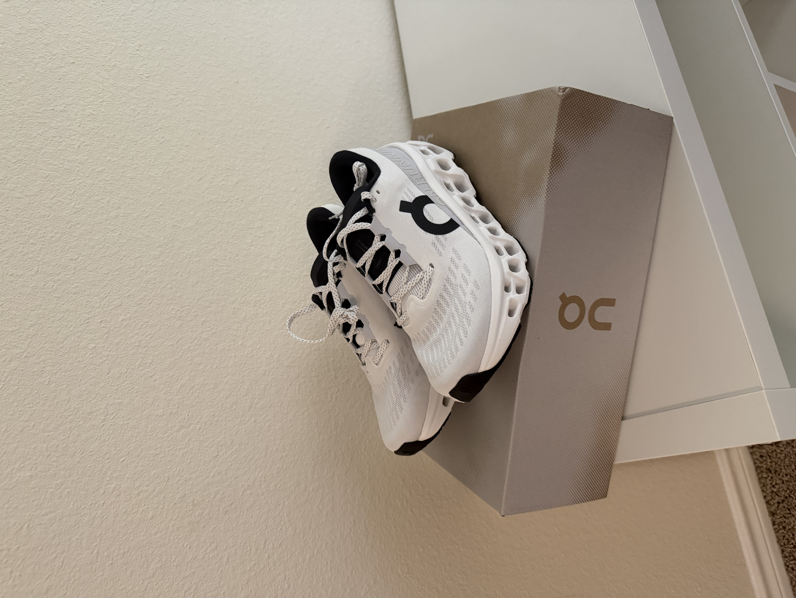

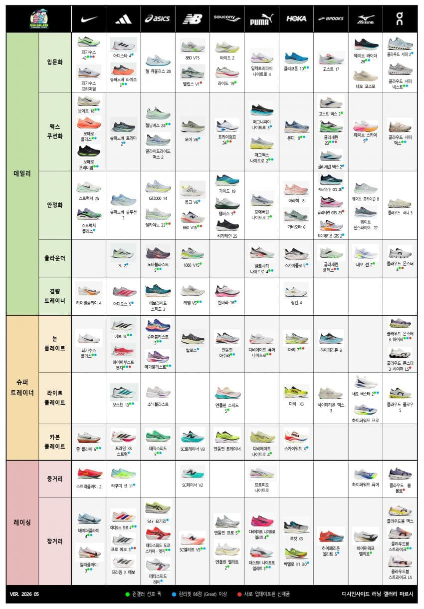
:::

내가 구매한 제품은' 클라우드 몬스터3' 라는 제품이었다. 데일리 하게 신을 수 있는 올라운더 포지션에 있는 러닝화였고, 기존에는 뉴발란스의 1080V14를 신고 있었는데 수화물 이슈(...)로 차마 미국에 데려오지 못했던 러닝화의 대체품이었다.

기다림이 길었던 탓일까.. 너무나도 기뻤다. 기쁨도 잠시.. 마감 상태를 보면서 가격에 대한 의구심이 들었다. 그 의구심은 내가 발을 넣고 몇 발자국 걷자말자 그 즉시 완전히 해소되었다. 넓은 미국 땅을 이 신발로 열심히 거닐어야지.

## Day 3 — 8월 19일 (수) · 공짜 점심 헌팅

미국 대학원에 있다보면, 가끔 점심이 애매해질 때가 있다. 집에 가기도 애매하고, 또 집에 가자니 오후에 학교에서 일정이 있어 사먹게 되는 날이다. 오늘이 그런 날이었다. 오후에 교수님 한분 포닥 한분과 각각 앞으로 있을 로테이션에 대해 심도 깊은 대화를 나누기로 한 날이었다.

항상 대학원 수업은 오전 8시반에 시작해서 10시에 끝나는 일정이다. 10시에 끝나면, 이제 다음주 부터는 로테이션이 시작되어 한 연구실의 소속된 일원으로서 지내야한다. 로테이션은 최대 5개의 연구실에서 지낼 수 있고, 최소 2개 이상 그리고 권장되는 로테이션 횟수는 3회였다.

아무튼, 이런 일정 상 이슈로 교내에서 하는 여러가지 행사에 참여하면 Free Lunch! 로 간단히 끼니를 해결할 수 있다.

::: {.photo-row}
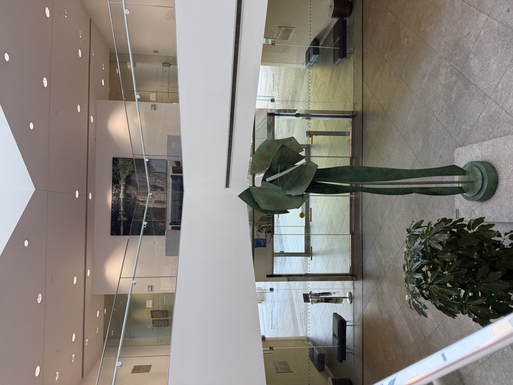

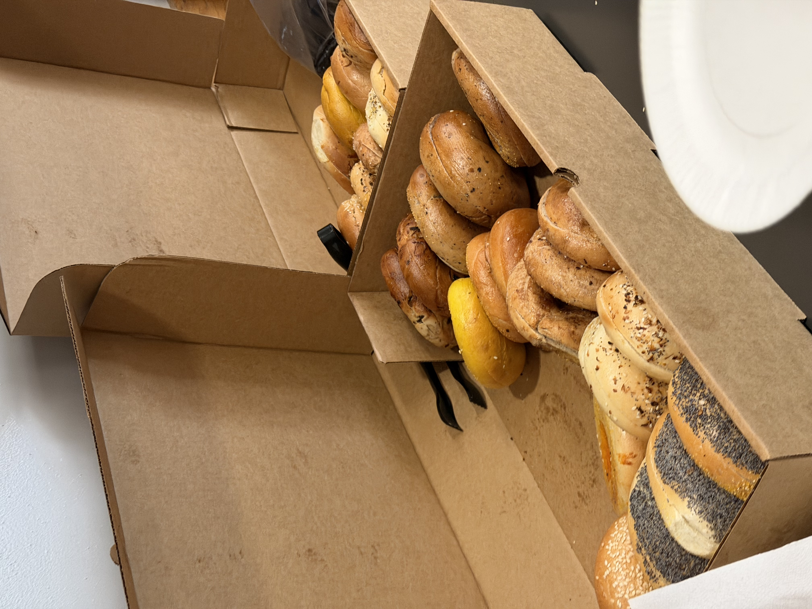
:::

삐까뻔쩍한 Biomedical Engineering(BME) 건물로 들어가 BME student를 대상으로 하는 행사에 참여했다. 해당 프로그램 소속이 아니더라도, 대학원은 굉장히 열려 있는 곳이기 때문에 다른 Program의 학생들도 마다하지 않는다. 이렇게 공짜 점심 베이글로 간단히 끼니를 때우고, 오후 로테이션 미팅까지 마무리했다.

로테이션은 Jean-Laurent Casanova(장로항.. 이라고 읽는다)라는 세계적인 infectious disease 관련 genetics study를 하는 연구실에서 하기로 결정했다. 여기까지 많은 우여곡절이 있었는데, 짧게 얘기하자면, 이 분이 원래 Rockefeller University라는 New york city에 있는 대학에서 약 20년간 계시다가 올해 7월부로(?!) UTSW에 이직해오셨다. 내가 연구하고 싶은 관심사와도 매우 일치해서, 아주 좋은 기회로 로테이션을 하게되었다.
(연구실 홈페이지 [HGID (Human Genetics of Infectious Diseases)](https://www.hgid.org/))

인생은 운칠기삼이다.

::: {.photo-row}
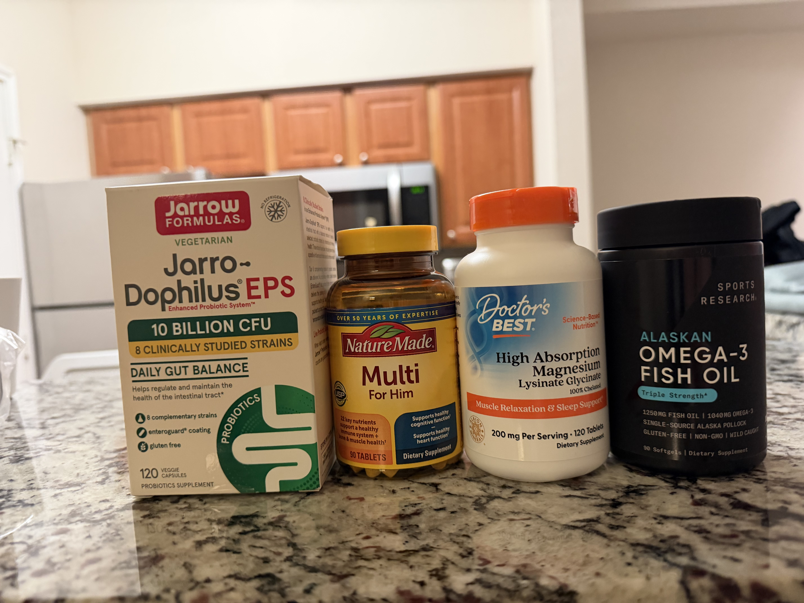

:::

그리고 몇가지 영양 보충제를 구매했다. 미국은 한국보다 훨씬 영양제 및 보충제 시장이 잘 발달되어있다. 정말 많은 가짓수와, 좋은 성분 배합을 가진 제품들이 많다보니 어떤 조합으로 구매할지 고민 끝에 다음과 같이 구매했다.

1순위는 오메가-3, 그리고 2순위 마그네슘, 3순위 유산균, 4순위는 종합 비타민(비타민 B, D 등) 이었다. 그래도 나름 스테디-셀러들이 정해져 있어서 좋은 가격에 제품들을 구매할 수 있었다. 나중에 한국으로 놀러갈 때, 영양제를 잔뜩 사가야겠다.

그 외에도 작고 소중한 근육을 지켜줄 단백질과 크레아틴을 구매했다.

## Day 4 - 8월 20일 (목) · 일본인 친구 사귀기

지난 오리엔테이션 때, 스치듯이 지나간 Ryoske라는 일본인 친구가 있었다. 그 친구는 일본에서 대학을 졸업하고 NYC에서 1년 정도 Research Assitant로 지내다가, 이번 박사과정에 합격하여 Texas로 건너온 친구였다.

아무래도 북미권에서 아시아권 문화에 있는 친구들이 더 친숙하게 다가오기 마련인 것 같다. 요코하마에서 왔다는 친구에게, 지난 도쿄 여행때 방문했던 요코하마 사진을 열심히 펼쳐 보이며 스몰톡을 이어갔다. 내가 살고 있는 Med Park로 내년에 이사오고 싶다고 해서, 다음에 기회가 되면 방을 소개시켜주겠다고 했다.

아무튼 이런 저런 얘기를 하다가 친해졌고, 같이 점심을 먹고 학생 라운지에 가서 캡슐 커피를 마시며 열심히 외국인 친구들과 짧은 영어 실력을 늘려나갔다.

::: {.photo-row}
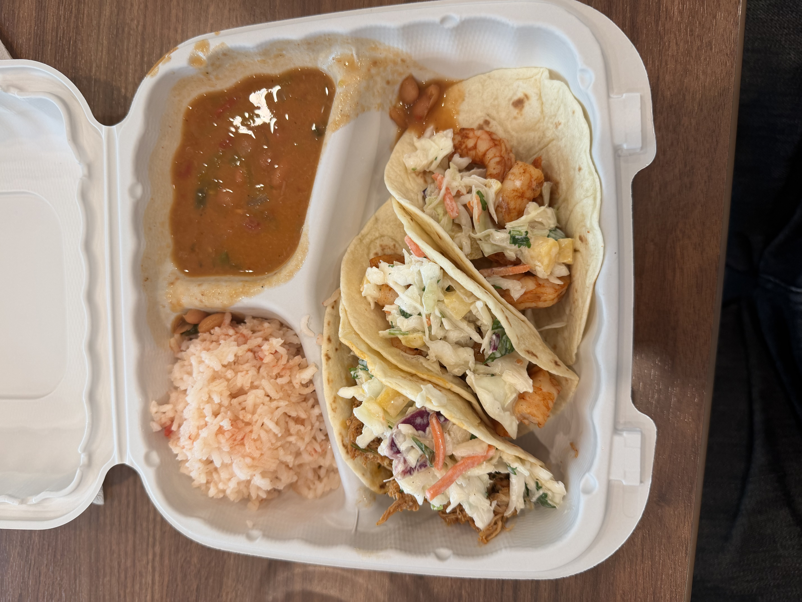

:::
## Day 5 - 8월 21 (금) · Meet the GDD

오늘도 어김없이 수업을 마치고, 학교에서 일정이 있는 날이었다. 10시 15분에는 Student Advisory Committee(SAC) meeting이라고 해서, Rotation 랩 선정 및 앞으로의 박사과정 생활 전반에 대해 학생들에게 조언해주는 교수님들과 함께 1시간 가량 유익한 세션을 들었다.

그 이후에는 12시에 Meet the GDD Program이라는 세션이 있었다. 내가 속한 대학원은 Basic Biomedical Sciences Program으로 입학하여 2년차 때 어떤 Program에 진학할 지 결정하게 되는 시스템이었고, GDD는 Genetics, Development and Disease라는 프로그램의 Abbreviation 이었다.

마음속으로는 Immunology Program으로 이미 어느정도 결정을 해뒀지만, 그래도 다른 프로그램은 어떤 차이가 있는지 궁금한 마음으로 향했다. 피자와 음료가 세팅되어 있었고, 끼니를 해결하며 프로그램에 관한 유익한 정보들을 얻을 수 있었다. 그 중 가장 기억에 남았던 조언은, 프로그램 선택 기준에 관한 것이었다. 프로그램 선택 이후 WIPS 라는 세션에 매주 참석해야 하는데, 이 저널 클럽 형태의 세션에서 내가 어떤 topic에 더 친숙해지고 싶은지를 생각해보라는 조언이었다.

GDD가 매력적인 프로그램인 건 사실이었지만, 아무래도 다루고 있는 범위가 너무 넓다보니 박사과정동안 나의 뾰족한 무언가를 다듬기에는 immunology가 더 적절하지 않을까 라는 마음 속 답을 조용히 내릴 수 있었다.

::: {.photo-row}
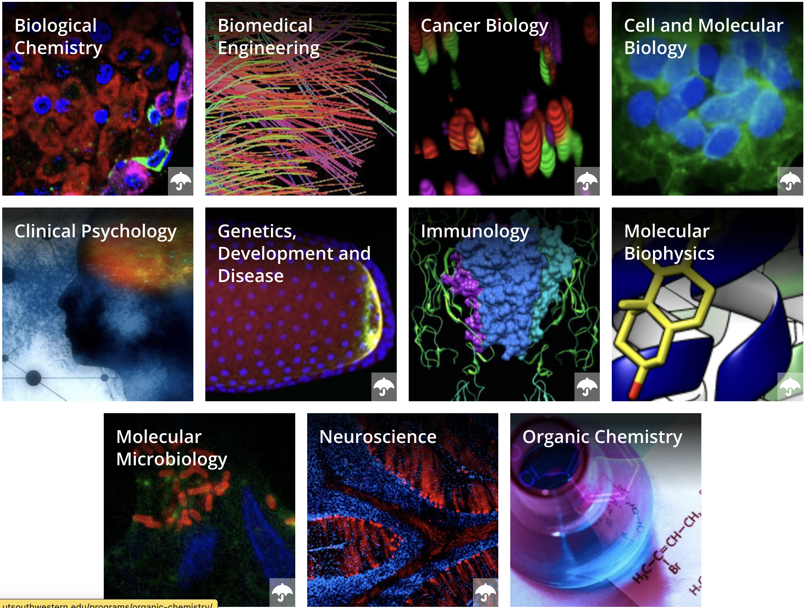

:::

## Day 6 - 8월 22 (토) · Goldee's BBQ · Stockyard 나들이

오늘은 정말 역사적인 날이다. 무려 [Goldee's BBQ](https://share.google/h7o4fN8TVbvXW7c6t)를 가는 날! 텍사스 먼슬리라는 4년마다 업데이트 되는 텍사스 내의 유명 잡지에 2022년도 1위, 2026년도 3위를 달성한 미친 식당이었고, 더욱 말도 안되는 점은 오직 금토일 오전 11시부터 오후 3시까지만 영업한다는 것이었다. 그 마저도 오전부터 길게 늘어지는 웨이팅 덕분에 오후 1,2시면 이미 재료 소진일 가능성도 있었다!

이 식당을 공략하기 위해 한국인 친구들과 또 머리를 한참 싸맨 결과, 무려 오전 8시에 출발하자는 극단적인 일정을 세우게 되었다. 그리고 식사 이후에는 stockyard에서 펼쳐지는 롱혼 쇼를 보겠다는 야심찬 계획까지 세우게 된다.

::: {.photo-row}
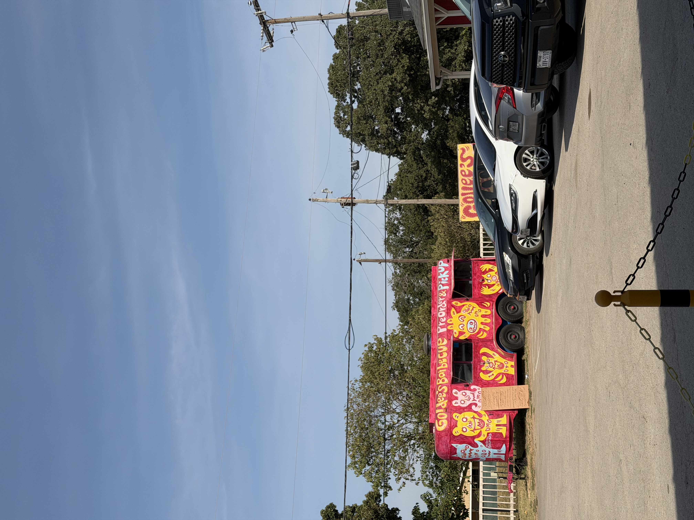

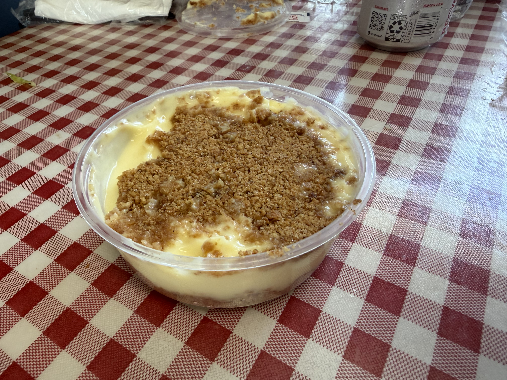
:::

와.. 내가 갔던 Terry's black은 가짜 BBQ였다.(미안) 포크로 건들자마자 바스러지는 극한의 부드럼과 함께, 육향이 짙게 베어있었다. 이건 글로 형용하는 것이 모욕적일 만큼 직접 가서 맛봐야 하는 곳이다. 모든 텍사스 바베큐를 맛본 것은 아니지만, 만약 타지에서 가족이나 친구들이 놀러오면 아마 1순위로 생각이 날 식당인 것 같다. 극단적 육식 식이요법 카니보어의 정점을 맛본 뒤, 미친 단짠의 바나나 푸딩을 디저트로 먹어주면서 정말 만족스러운 텍사스 BBQ 경험을 마무리했다.

...

다음으로는 롱혼쇼를 보기 위해 스톡야드로 향했다. 그러나 청천벽력과 같은 소식이 들려왔다. 롱혼쇼가 하필이면 이번주 폭염으로 인해 오후 일정이 취소되었다는 것이다..! 아쉬운 마음을 뒤로 한채 쉬고 있는 롱혼들을 먼발치에서 구경하고, 멋진 카우보이 햇을 잔뜩 구경한 뒤에 집으로 향했다.

::: {.photo-row}

:::

## Day 7 - 8월 23 (토) · 끝 없는 가구 조립

오늘은 최종 진짜 마지막 파이널 가구인 신발장이 배송되었다. 한동안 가구 조립에 지쳐 필요한 가구들을 생각만 하다가, 더 이상 미룰수가 없어 시켰던 마지막(제발..) 가구였다. 맨 위 상판이 앉을 수 있게 되어 있어서 신발 벗고 신기 편할 것 같다는 생각으로 구매했다.

이젠 이 정도 사이즈의 가구는 순식간이다.

::: {.photo-row}

:::

그리고 나서는, 학교 헬스장으로 향했다. 항상 아파트 헬스장 내에서 운동을 했는데, 요즘들어 그 좁은 공간에 3-4명씩 억지로 운동을 하다보니까 별로 환경이 좋지 못하다는 생각이 들었다. 그래서 무료로 이용할 수 있는 학교 헬스장을 한번 가볼까했다.

지난 오티 때 잠깐 구경할 기회가 있어서 아주 멀리서 봤었는데, 그냥 그저 그런 헬스장인 줄 알았다. 그러나 직접 가까이 가서 경험한 헬스장은 내 생각과는 아예 달랐다. 모든게 Hammer Strength였고, 기구도 거의 20가지 정도 아주 essential한 기구들 위주로 세팅되어 있었다. 랙이 세 개나 있었고, 러닝머신 앞에는 대형 스크린이 세팅되어 있어서 유산소하기에도 아주 좋아보였다. 이 정도 시설이면 박사과정 5-6년 동안 아주 만족하면서, 그것도 무료로 헬스를 즐길 수 있을 것 같다!

::: {.photo-row}

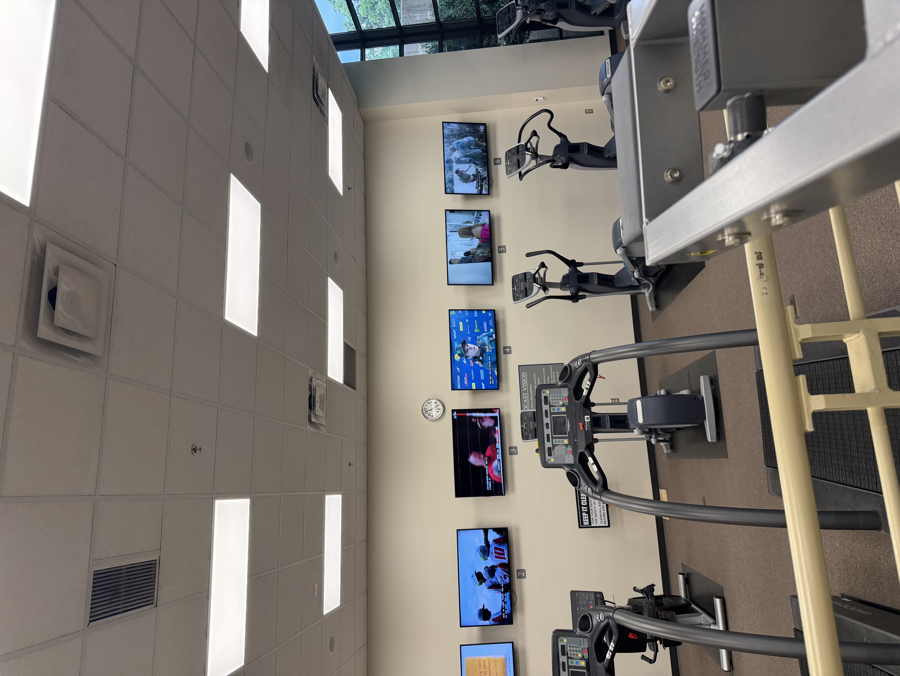
:::

이제 벌써 미국에 온지 3주가 흘렀다. 다음 포스팅의 마지막에는 미국에서의 한달 살이 최종 후기를 짧게 남겨볼 예정이다. 로테이션도 열심히 임해서 꼭 연구실에 들어갈 수 있으면 좋겠다.
