🇰🇷 [한국어로 보기](2026-08-week4.html)

Lab life kicked off and it was an incredibly busy week. I had my first exam looming the following week, and on top of that, I somehow squeezed in a trip to see the Lee Sang-joon comedy show — a genuinely insane schedule.

## Day 1 — August 24 (Mon) · Grad School Rotation Begins

My first grad school rotation began. Here's roughly what the schedule looks like.

From 8:30–10:00 AM I have Core Curriculum class, and once it's over I head to the lab for the rest of the day.

On top of that, I had my first exam coming up the following Monday, 8/31.

Anyway, once class ended, it was my first day showing up to the lab. I'd decided to do both of my rotations within the JL Casanova group, and Shen-Ying Zhang — the PI for my second rotation — offered to walk me over personally, so we went together.

For my first rotation, running 8/24–10/12, I'll be working with Ahmad Yatim on an anti-integrin project. It plays an important role in tissue homing in T cell biology, and since the analysis relies on immunology techniques I'm already familiar with — flow cytometry, MACS, that kind of thing — it felt a bit more approachable.

The one thing I didn't expect was running flow cytometry on my very first day. A lot happened, but in the end, using frozen human samples, we worked through everything from antibody staining to the gating strategy and managed to optimize the conditions for tomorrow's experiment.

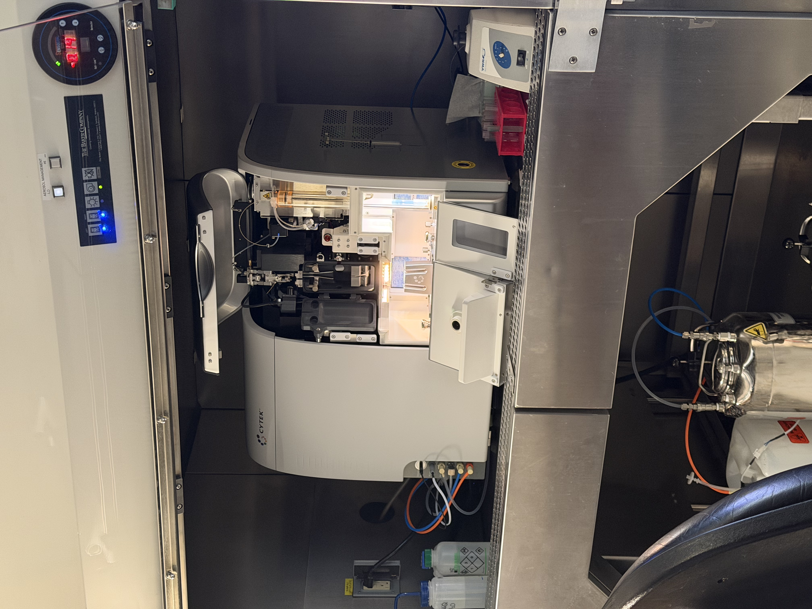

## Day 2 — August 25 (Tue) · A Hectic Rotation

Leave the apartment, go to class, then head over to the lab in the same building — my daily routine has gotten almost absurdly simple. On the way out this morning, though, I spotted a creature wandering around the apartment complex, so here's a record of that.

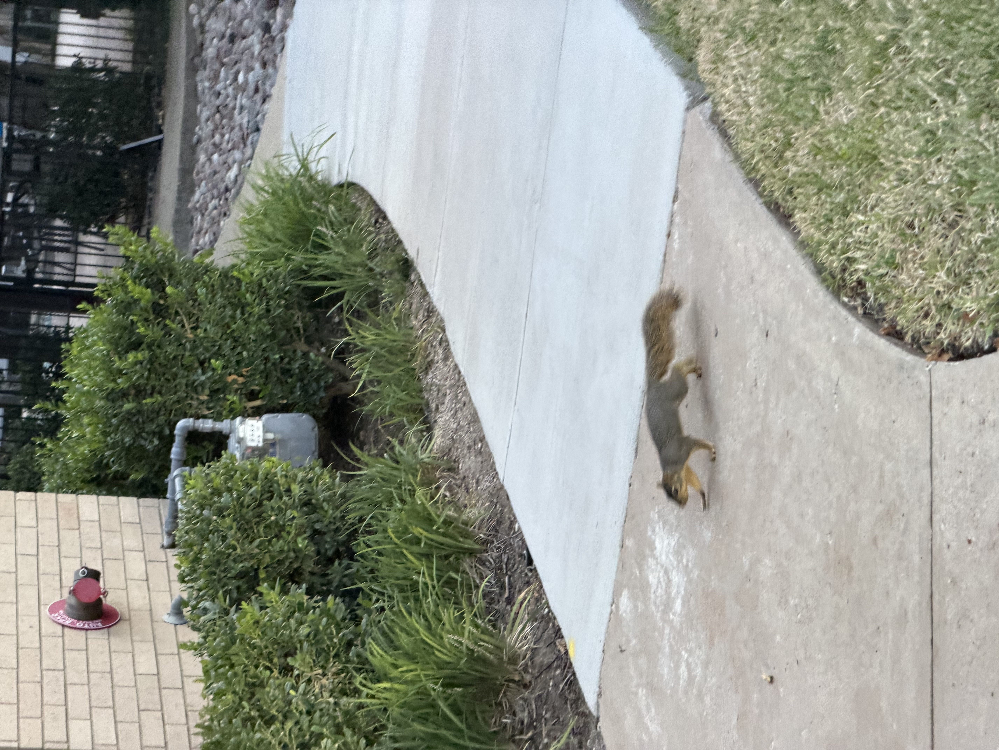

Another frantic day of experiments. (Honestly, "watching" is probably the more accurate word.) We get healthy donor blood from UTSW and isolate PBMCs from it via density-gradient centrifugation using Ficoll. What we'll actually be doing is staining these PBMCs with the right antibodies to pull out the cell phenotypes we want, then analyzing the genome and proteome of each population.

Since the project just started, I can't go into detail, but here's an analogy: if a whole pizza represents all of human blood, our strategy is to pick out just the pepperoni, the peppers, and the onions from the pizza and dig deeper into the individual characteristics of each.

Anyway, after finishing up and getting home, I was lying around and thought of my nephew. He has no idea I'm out here struggling with English. He's been really into Pokémon lately, always looking things up — I think I'll get him this thick English-language Pokémon book as a gift.

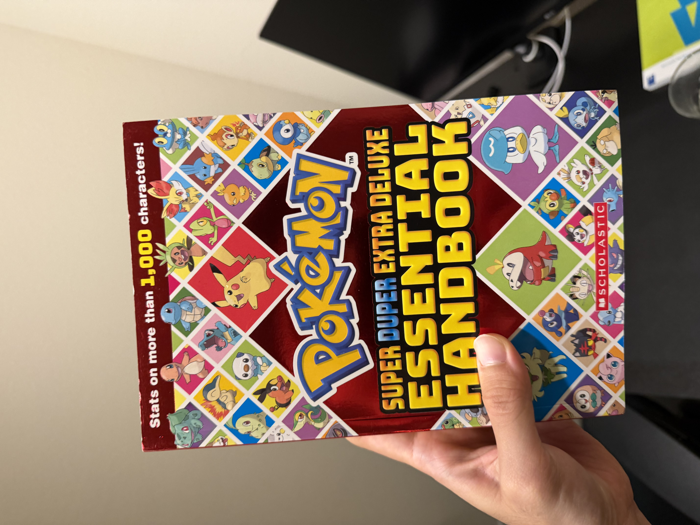

## Day 3 — August 26 (Wed) · A Successful Sorting Run

Thanks to the gating strategy we'd set up on Monday — basically, the plan for how to pick the pepperoni, onions, and peppers off the pizza — we were able to sort them out cleanly.

We used a sorter called the Aurora, which can detect over 40 multi-channels — meaning it can separate out 40 different pizza toppings based on each one's individual characteristics. It's basically a pizza expert. To sort out the cells we actually wanted, we stained them with a 17-color panel (meaning we threw together a rough pizza using just 17 toppings).

The results were a real success. Usually, the more complex a gating strategy is, the lower the yield tends to be, but this time the sorting efficiency came in at close to 80–90%, giving us a large number of cells.

::: {.photo-row}
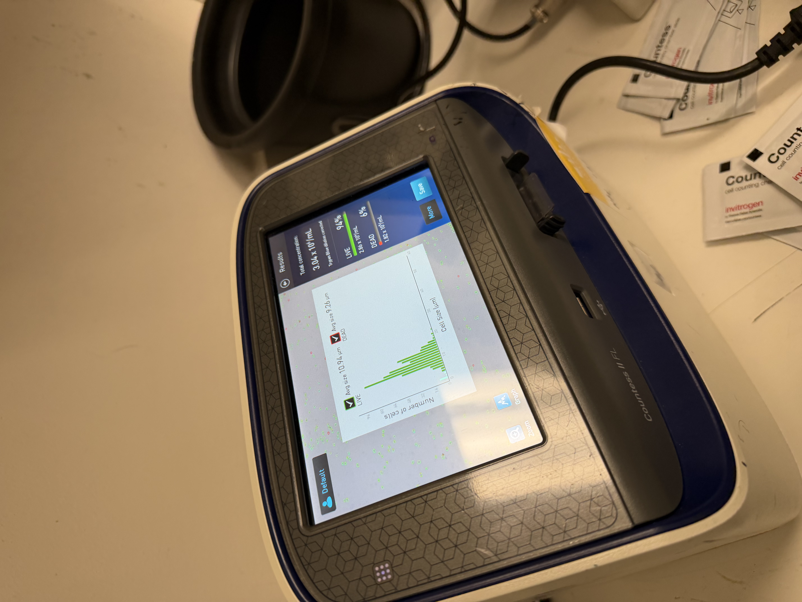

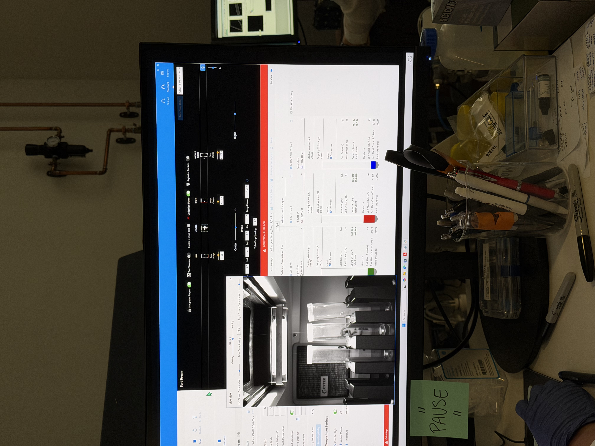

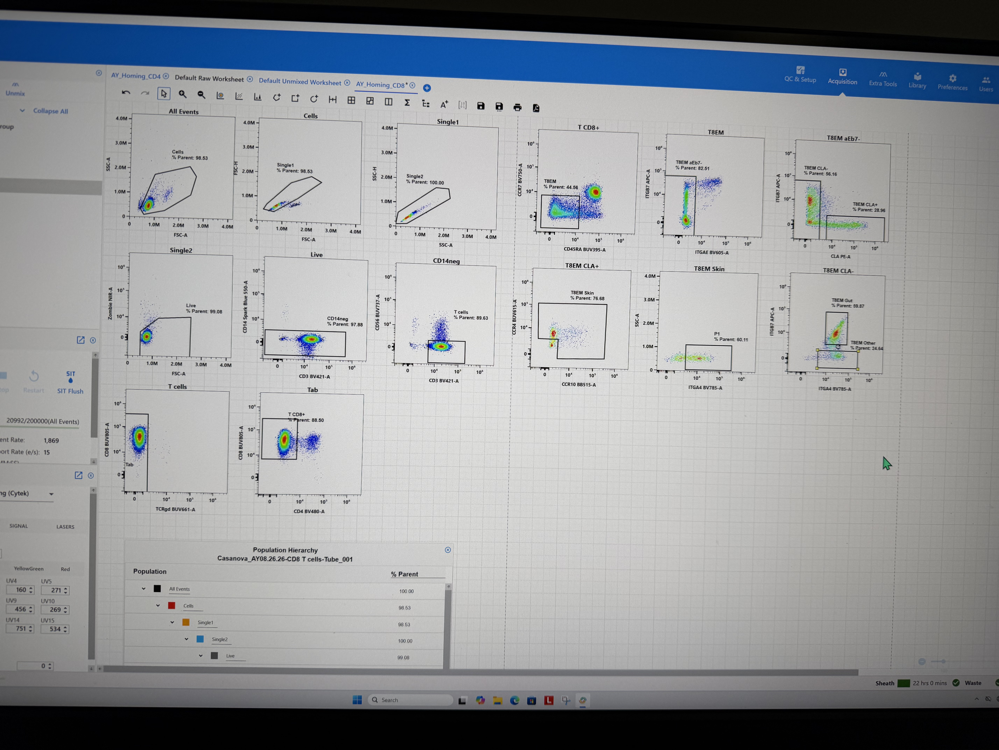
:::

## Day 4 - August 27 (Thu) · The Lee Sang-joon Show!

One of my close Korean friends mentioned that his uncle, who lives out west, runs a coffee business. He told me to let him know anytime I needed coffee — and of course, I said I definitely needed coffee!

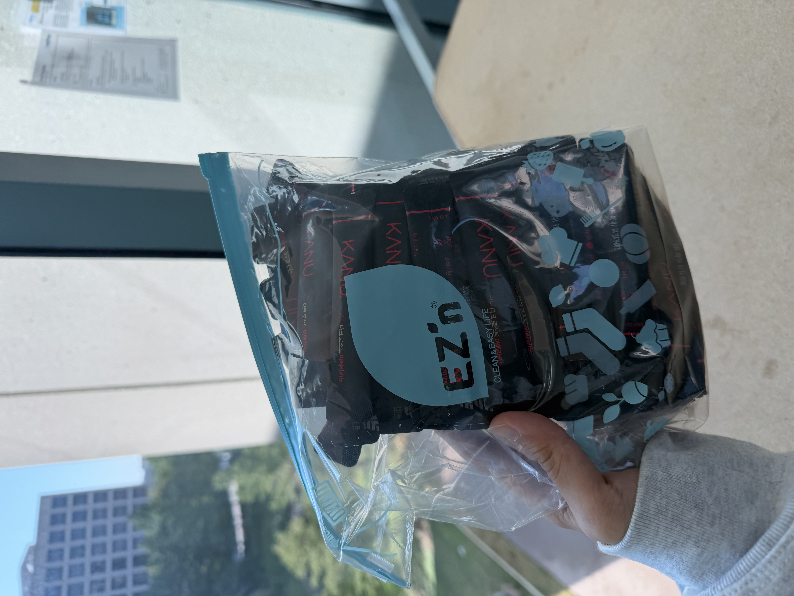

As a result, I received an absolutely ridiculous amount of Kanu (a Korean instant coffee mix). I'd been rationing a 30-pack I bought at H-Mart for $20, so this friend is a genuine lifesaver. Looks like I won't have to worry about coffee for a while.

Anyway, today was finally the day of the Lee Sang-joon show. It was held at the Charles W. Eisemann Center, a genuinely upscale venue, and our seats were closer than I expected, so I enjoyed it a lot. When Lee Sang-joon first came out, he was wearing a Texas cowboy hat someone had given him, and he joked that nobody in the audience was wearing one — which cracked me up. I'll skip the rest of the details.

But at one point, in a similar vein, he brought up Trader Joe's bags — half-joking, half-annoyed that nobody in the audience had brought one — and right then, the person sitting immediately to our left suddenly held up her own Trader Joe's bag and shouted, "Right here!" A cameraman caught the seat right next to us in an instant, so for a brief moment, we were on the broadcast.

::: {.photo-row}
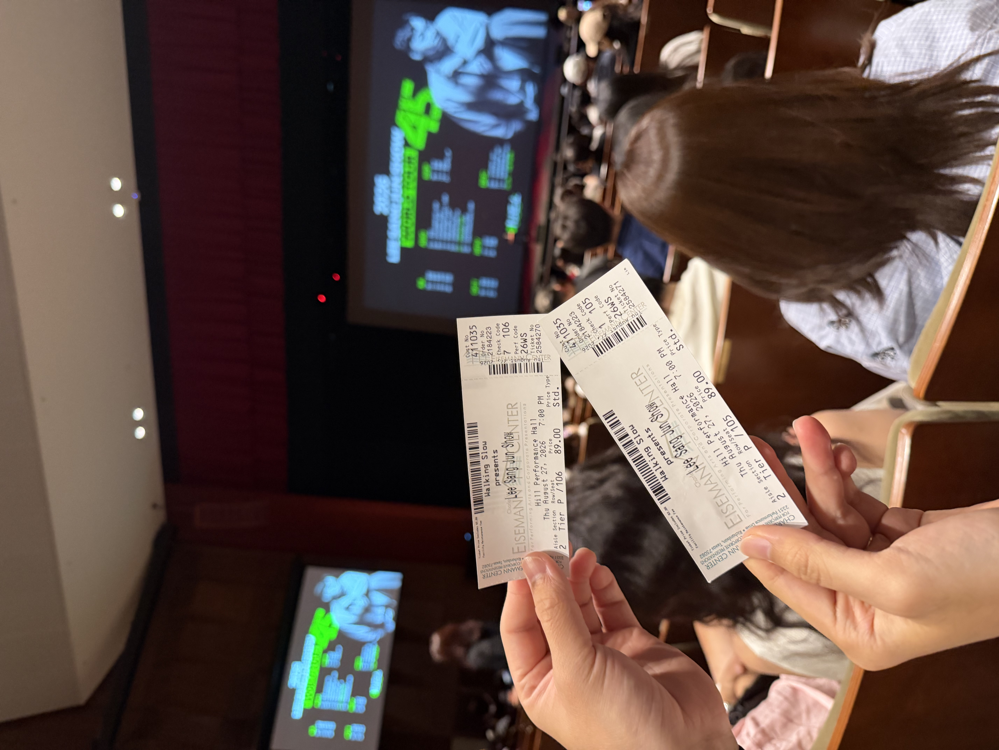

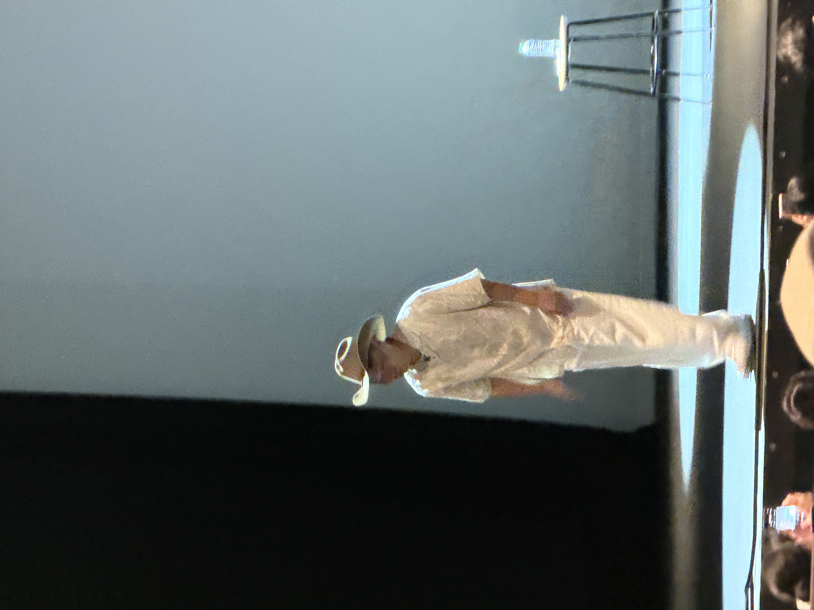

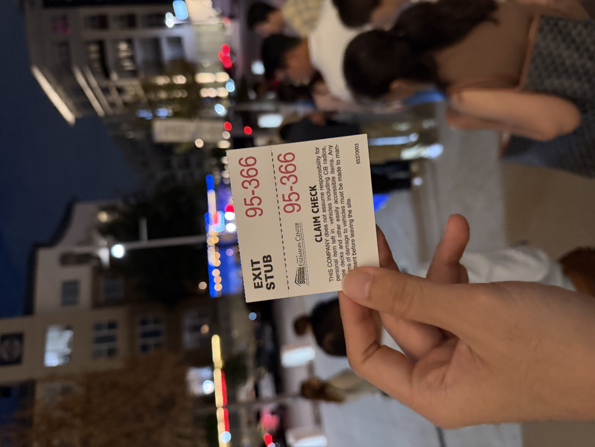
:::

At one point, he calmly shared that he'd grown up raised by a single mother, and it made me imagine what kind of hardship might have been behind the scenes of his life. (Of course, he may well have had a perfectly fine time with none of that.) Still, thinking about everything he must have had to overcome — both the social stigma and the practical difficulties — to end up here, confidently running a nationwide tour at 45, I quietly applauded him in my head.

Since I hadn't eaten a proper dinner, before heading home I stopped for a bowl of pho — and polished it off, kimchi and all.

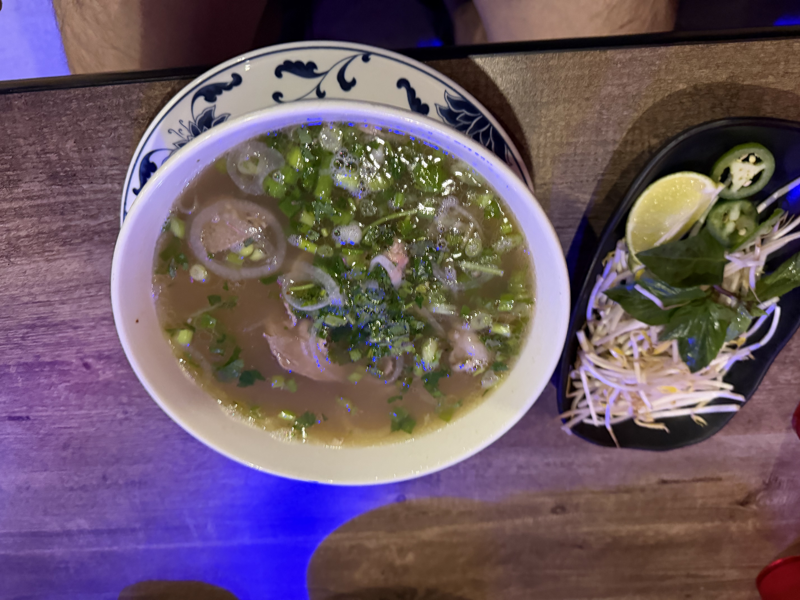

## Day 5 - August 28 (Fri) · Juggling Exam Prep and Lab Life

Today a new postdoc candidate visited the lab, and we sat in on their talk and had a meal together. They gave a roughly 45-minute lecture on their research at 10:30, followed by lunch together. After that, they spent 30 minutes to an hour with small groups, chatting briefly with every member of the lab, and the day wrapped up with dinner alongside the lab head and a few postdocs.

Afterward, an email went out to everyone in the lab — a survey asking for our honest assessment of whether we thought this candidate would be a good fit, and whether we thought they should join the lab.

That email gave me a lot to think about. I hadn't really talked with the candidate directly, so I just answered the survey with something reasonably positive and moved on — but it hit me that the moment my own rotation ends, the exact same kind of survey is going to go out about me. My head got a little tangled up over that. Still, I need to sit with that anxiety and just make sure I show my best self.

I'll just do my best not to leave any regrets in my choices, and accept whatever comes of it.

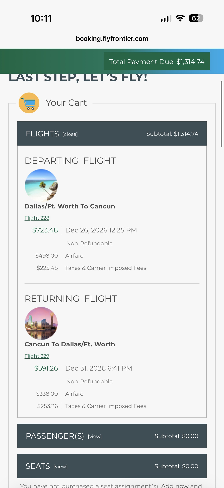

To put this anxiety to rest, I booked myself a flight to Cancún and went to sleep.

## Day 6 - August 29 (Sat) · New Hobby: Car Washing?!

Today is two days before the exam. Even the most boring daily routine somehow turns fun right before an exam.

Car washing was no exception.

The first time I washed my car, I remember being irritated, wondering why on earth I had to be out there scrubbing a car in this heat.
Today was the second time — ($9.99 gets you unlimited washes for a month!) — and for some reason, I actually enjoyed every minute of it.

Watching the ugly grime and stains rinse cleanly away gave me a weirdly satisfying thrill. My apartment only has an outdoor parking lot, so the car gets covered in dust almost immediately — but thinking of this as keeping it properly maintained made the whole thing feel worthwhile.

I guess it really is all about mindset.

::: {.photo-row}
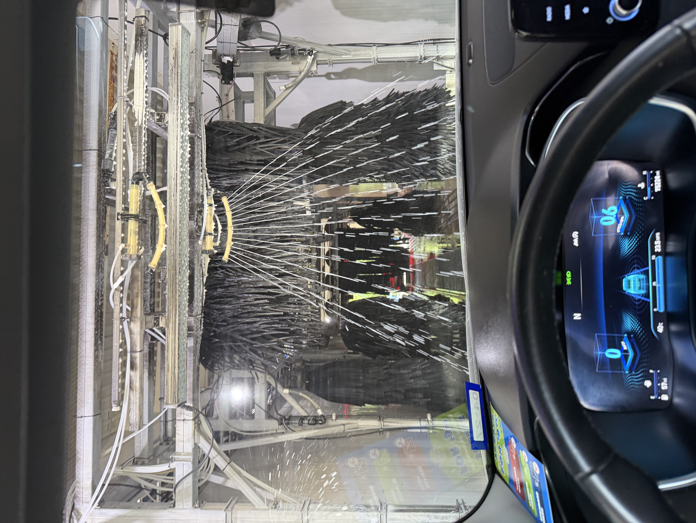

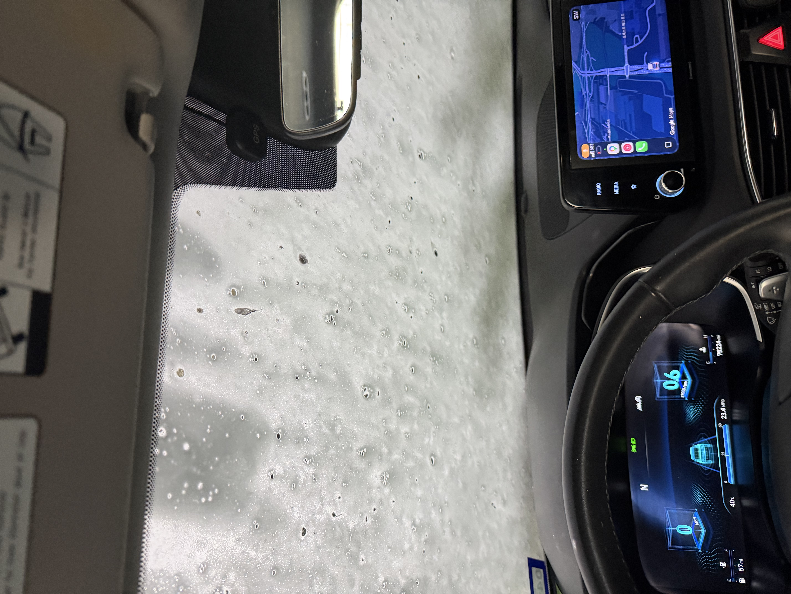

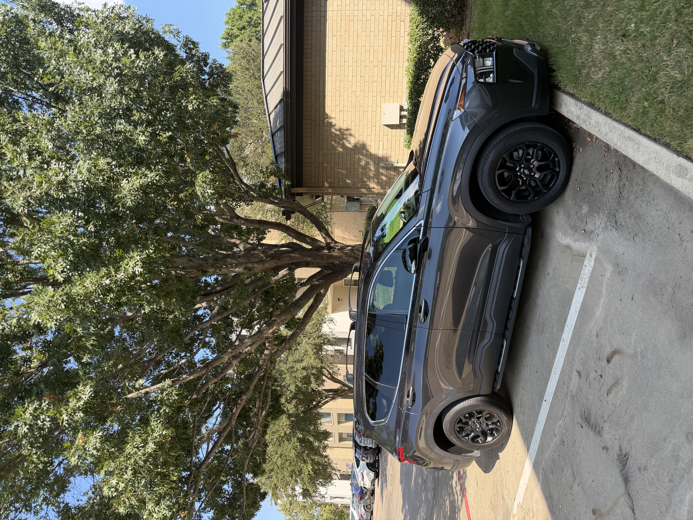
:::
## Day 7 - August 30 (Sun) · Studying at an American Starbucks

Today is the day before the exam. Back in Korea, I always used to study at cafés whenever I had a test coming up, but apparently studying at cafés isn't really a thing here in the US. Still, I'd noticed people at the Starbucks near my place always had their laptops open working, so I decided to give café-studying a shot.

I can whip up an iced Americano for myself at home without any trouble these days, so I decided to try something I could only get at Starbucks. I ordered a pumpkin matcha latte — knew nothing about it going in, just picked it because it was new — and it turned out to be pretty good.

::: {.photo-row}
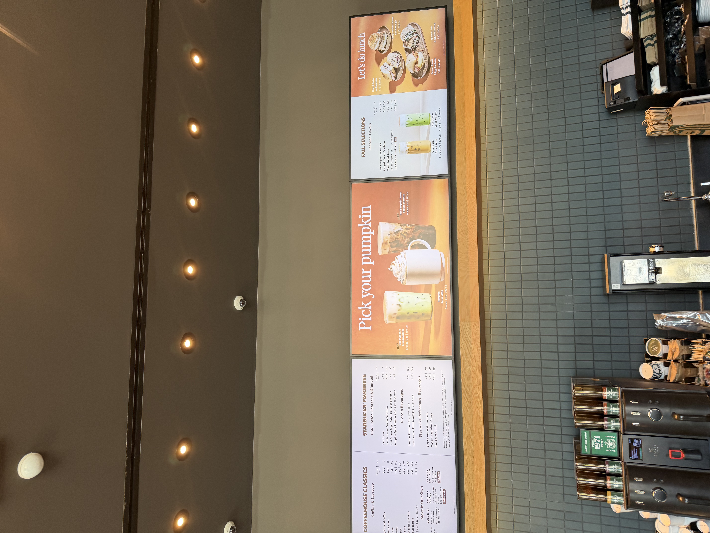

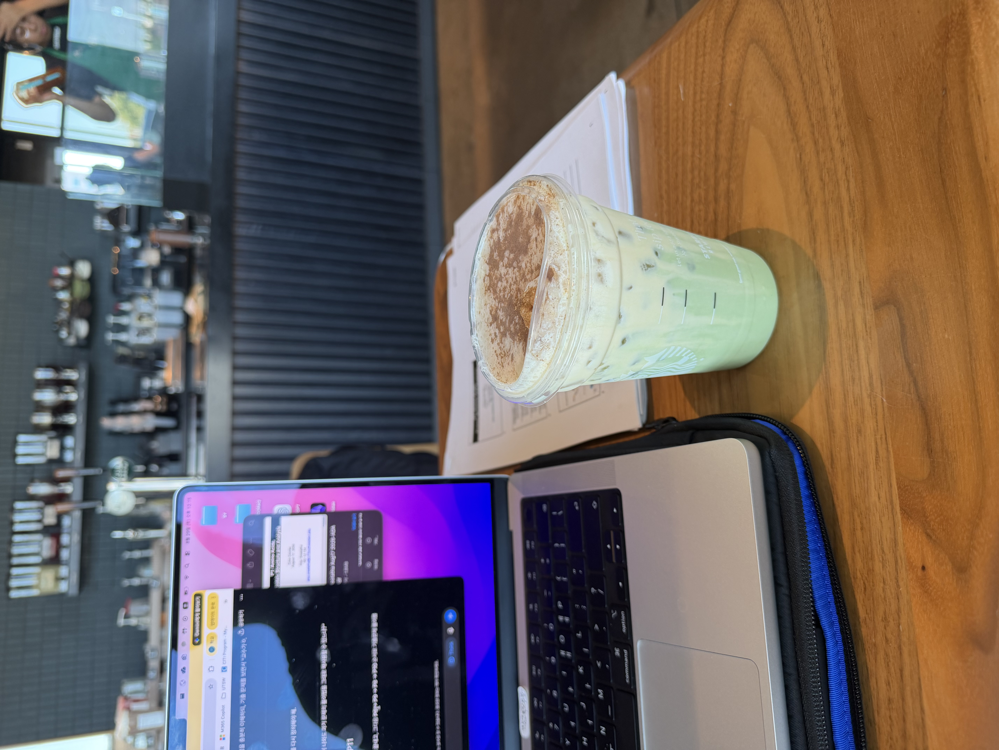
:::

After that, since it was an open-book exam, I put real effort into making a summary sheet. I cracked the whip on ChatGPT — my friends and I call this "채찍피티," a pun on 채찍 (whip) and GPT — and ended up with a genuinely solid set of notes. It used to take a long, painful process: typing everything out by hand, organizing it, revising draft after draft. Now I just upload the lecture slides, say "do it for me," and it's all organized in seconds.

I'm honestly curious what the future of humanity is going to look like.

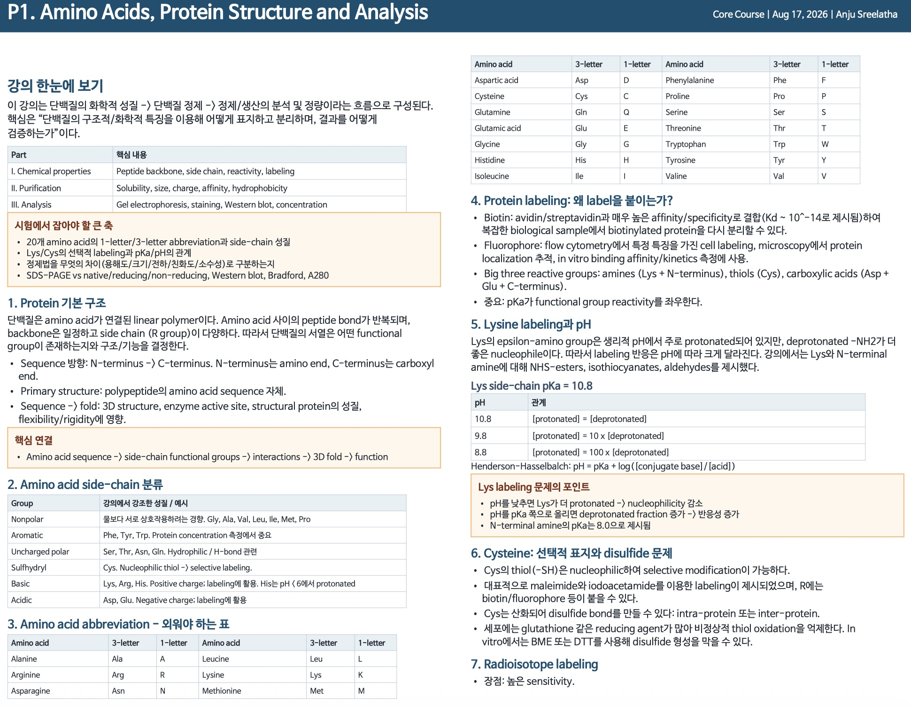

It's week four in the US — somehow it's already been a month. It's only now starting to really sink in that I'm actually living here. Up until last week, it was more like a taste of classes; this week, with lab life added on top, it was genuinely, literally an insanely busy week. But I think having this kind of gradual "damper" period to adjust bit by bit is what's letting me keep up at all.

Going forward, I want to hold onto this rhythm so I can keep adjusting well. Oh, and there's one important change: I used to get hit with brutal, overwhelming drowsiness every day around 1–2 PM, from my brain overloading on all the English input — and that doesn't happen anymore! I guess humans really are creatures of adaptation.

And last week, I couldn't follow a conversation at all unless it was strictly one-on-one, but after spending time with people in the lab, I can now more or less keep up when it's a group of three, including me. Granted, that mostly means reacting and tossing in the occasional short phrase, but it's still a huge step forward.

If nothing else, to survive in the lab, I need to get comfortable with English faster and adjust to this environment. That wraps up my one-month check-in. Next week's goal is to consistently add exercise to my routine. I'll try to record in more detail next week exactly how much and how I actually worked out.
