대학원 첫 시험을 치루고, 정신 없이 실험을 시작했다. 그 와중에 시험이 끝난 기념으로, 맛있는 저녁식사와 음주는 빼놓을 수 없지.

## Day 1 — 8월 31일 (월) · 대학원 첫 시험

대학원 첫 시험을 치뤘다.

사실 그게 이번주 월요일이었다는 사실을 이번주 일정을 정리하며 깨달았다. 정말 시간은 기다려주지 않는구나.. 그만큼 한 주 한 주가 알차게 지나가고 있다는 뜻이겠지.

지금 로테이션 중인 연구실의 졸업생이 랩에 놀러왔다. 하버드 어린이병원에서 포닥중이신데, 'Mis-C'라는 희귀유전감염질환에 대해 연구를 하시는 분이셨다. 내가 진지하게 고려중인 PI 밑에서 박사학위를 받으셨다고 해서, 꼭 얘기를 나눠보고 싶었다.

그 분은 한국계 프랑스인이었고, 한국어를 꽤나 유창하게 잘 하셨다. 그래서 한창 연구에 대한 설명을 한국어로 들을 수 있게되어 신났으나, 한국어로 설명하시는게 오히려 불편하시다며 영어로 설명하기 시작하셨다.. 로마에 왔으니 로마법을 따라야지.

그리고 드디어 랩 자리가 조금 더 괜찮은 곳으로 옮겨졌다! 원래는 문 바로 앞자리라 끼익거리는 소리때문에 집중이 자주 깨지곤 했는데, 아주 구석 창가자리에 21년도 iMAC!을 함께 받을 수 있어 업무 효율이 두배, 아니 그 이상 올라갔다. 그리고 Big sib이 첫 시험이 끝난 기념으로 깜짝 선물을 해줬다.. You make my day!

::: {.photo-row}

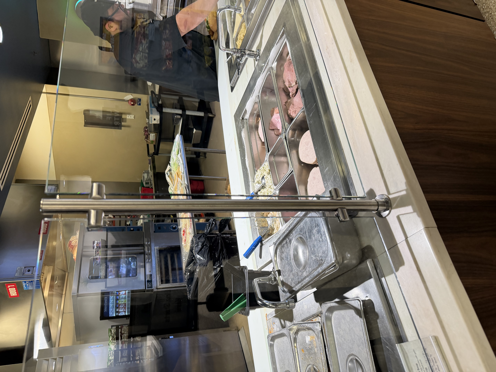

:::

## Day 2 — 9월 1일 (화) · 롤드컵?

이제 점점 학교에서 인사하는 외국인 친구들이 생겨나고 있다. 그 중에 Rex와 Ryoske에 대해 이야기하려고 한다. Rex는 아직 얘기를 많이 해보진 못했지만, 굉장히 chill하고 항상 뭔가 생각하는 듯한 느낌이다. 그리고 이 친구도 나와 '리그오브레전드'라는 아주 큰 관심사를 공유하는데, 그 친구 덕분에 올해 롤드컵이 달라스에서 열린다는 걸 알게되었다! (같이 가자고 제안해주었다!)

하지만 역시 자본주의의 나라, 이미 판매된 100불 가량의 티켓은 아주 좋은 좌석 기준으로 4-500불에 거래되고 있었다. 조금 측면으로 가면 250-300불 정도의 좌석이 있긴한데.. 한번 고민해봐야겠다. 한국에서도 단 한번도 가볼 생각을 안했는데, 왠지 달라스에서 열린다고 하니까 가보고 싶은 그 마음 뭔지 알겠는가?

그리고 Ryoske는 일본인 친구이다. 조금 독특한게 Computer Science 배경을 가지고 있으면서 직접 wet 실험을 하고싶어서 대학원에 왔다고 했다. 하고자 하는 연구 방향이 일론 머스크의 'Neural Link'를 연상케해서 정말 멋있다고 생각했다. 이 친구와는 꽤 많이 친해져서 이제 수업때 항상 옆자리에 앉는다. 그리고 목요일에 다른 한국인 친구들과 함께 Hang out 하기로 했다!

::: {.photo-row}

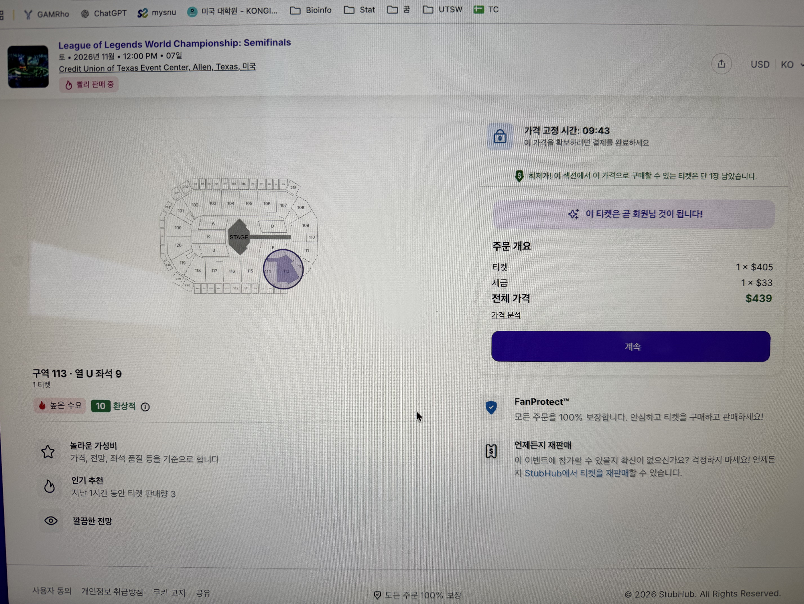
:::

그리고, 며칠동안 윗집 발소리때문에 너무 시달려서 결국 쪽지를 쓰고말았다. 정말 그 친구에게 미안하지만, 나의 소중한 수면이 계속해서 방해받다보니 랩에 적응하랴 영어쓰랴 일상에서 그 피로함이 가시질 않았다.. 룸 슬리퍼를 사주겠다고 제안했는데 연락이 와서 흔쾌히 신발을 주문했다.

그리고.. 룸 슬리퍼가 완벽히 작동하고 있는 요즘이다:)

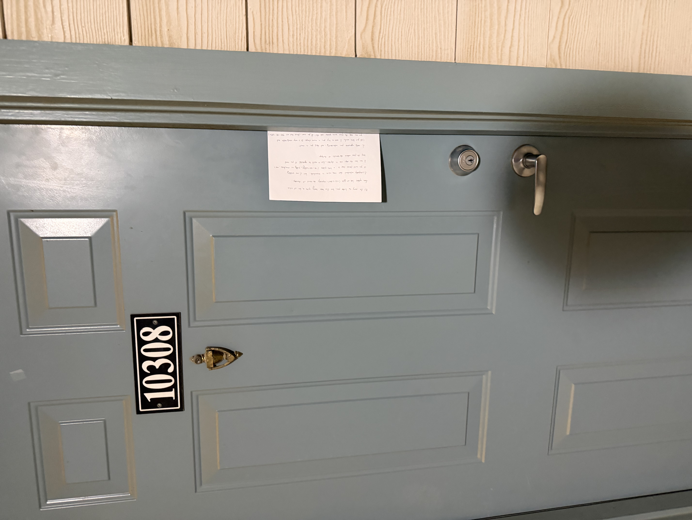

## Day 3 — 9월 2일 (수) · SSN 발급

마지막 서류 지옥의 퍼즐이 완성되는 날이다. 드디어 Social Security Number(SSN)을 받기 위한 모든 재료가 한 곳에 모였고, 그리고 이 SSN 발급을 위해 2주전부터 예약해 이 날만을 손꼽아 기다렸다.

미국의 행정.. 겪어본 사람만 안다. 더군다나 속도의 나라 대한민국에서 온 터라 더더욱 그 답답한 행정이 견디기 힘들었다. 그래도 운전 면허를 발급 받으며 어느 정도 면역이 생겼고, 이제 SSN만 발급 받으면 한동안 행정에서 해방이다.

그러나 일은 역시 순탄하게 흘러가지 않았다. 공식적으로 준비해야 하는 서류 외에, 우리 학교로 부터 받은 Offer letter를 함께 요구한 것이었다. 나는 다행히 모든 서류를 가지고 있어서 발급 받을 수 있었는데, 오피스에 함께 방문한 친구들은 해당 서류가 없었다. 그래서 친구들은 근처에 출력할 수 있는 곳을 찾아내어 해당 서류를 출력한 뒤에 겨우 발급 받을 수 있었고, 나는 랩미팅이 있어 친구들을 뒤로한채 먼저 출발했다.(미안) 마지막까지 순탄치 않게 흘러갔지만, 결국 우리 모두 SSN을 무사히 발급받을 수 있었다.

::: {.photo-row}

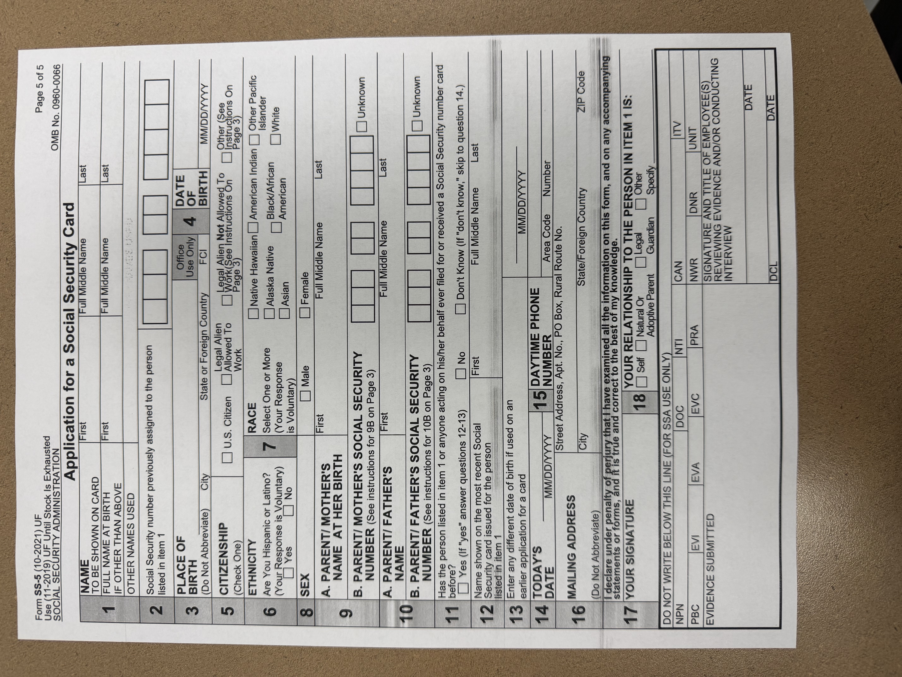
:::

그리고 그 날 저녁, 아파트 내 헬스장에 가서 짧은 근력 운동 시간을 가졌다. 그런데 오랜만에 밤공기가 선선하니 너무 좋았다. 그래서 20분만 근력 운동을 하고, 나머지 20분 정도 실외에서 갑자기 런닝을 시작했다. 같은 코스를 계속 뺑뺑 도는거기도 하고, 차들이 다니는 주차장이어서 환경이 썩 좋지는 않았지만, 처음 겪는 선선한 달라스 날씨에 기분 좋게 런닝을 했다.

앞으로 날씨가 더 풀리면, 주기적으로 야외 런닝을 나가보려고 노력해야겠다.

::: {.photo-row}

:::

## Day 4 - 9월 4일 (목) · Hang Out!

Ryoske와 한국인 친구 셋이서 같이 집 바로 앞에 있는 Pub에 놀러갔다. 실내는 다소 어두웠는데, 이어진 곳에 야장이 있어 선선한 날씨에 바깥 공기를 즐길 수 있었다. 메뉴가 다양하지는 않았지만 저렴한 가격에 비해 굉장히 퀄리티가 좋았고, 특히 맥주가 정말 맛있었다!

첫 잔은 Modelo로 시작해서 라임을 한가득 짜넣고, 두번째 잔은 페일 에일로 시켜 먹었는데 시트러스함이 가득한 미국 맥주였다. 

::: {.photo-row}
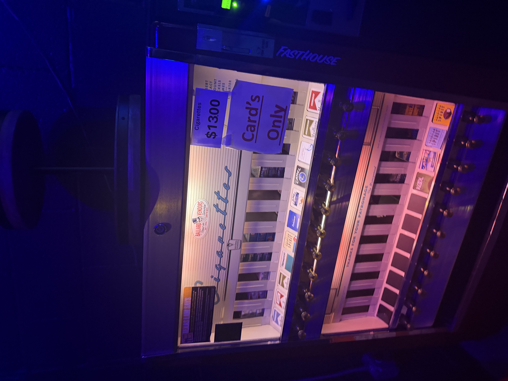

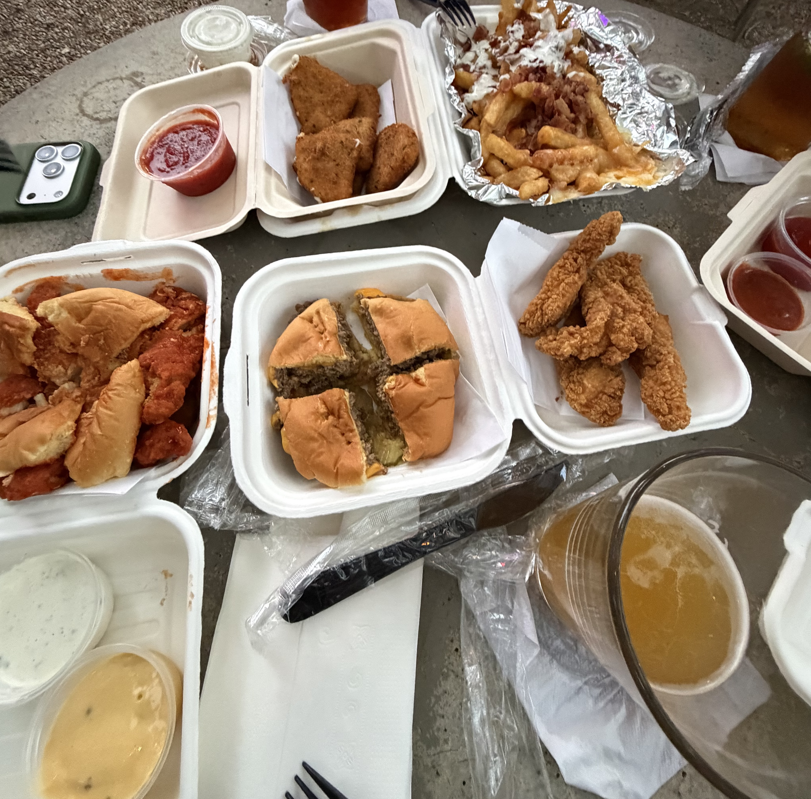
:::

## Day 5 - 9월 5(금) · 실험에 미친 날

석사 때 있었던 연구실은 거의 항상 마우스를 이용한 연구를 수행했었는데, 여기서 로테이션 중인 연구실은 주로 사람을 대상으로 연구를 수행하다보니 마우스 대신 실제 환자의 Sample부터 시작해서 다양한 Human Cell-line, 혹은 다른 연구실과 협업하여 organoid를 이용해 실험을 한다.

지금 키우기 시작한 세포는 T blast와 Jurkat인데, 둘 다 사람 T 림프구의 특성 연구에 쓰이는 세포들이다. 이 세포들을 이용하여 Cell adhesion Assay를 셋업중이었고, 마침 오늘 NovoCyte라고 하는 약 $10k, 한국돈으로 1400만원 정도의 기기를 사용할 기회가 있었다. 이 기기는 24 well-plate부터 96 well-plate까지 한번에 flow cytometry를 수행할 수 있는 아주 좋은 기기였고, 우리 실험의 목적 중 하나인 Cell count에 최적화된 기기였다.

그래서 이 기기를 오늘 정확한 시간에 맞춰 사용하기 위해 아침부터 굉장히 분주했고, 우리가 예상한 것과 거의 비슷한 실험 결과를 얻을 수 있었다! 그 와중에 너무 정신없어 랩에서 신는 크록스를 신고 퇴근해버렸다.

::: {.photo-row}
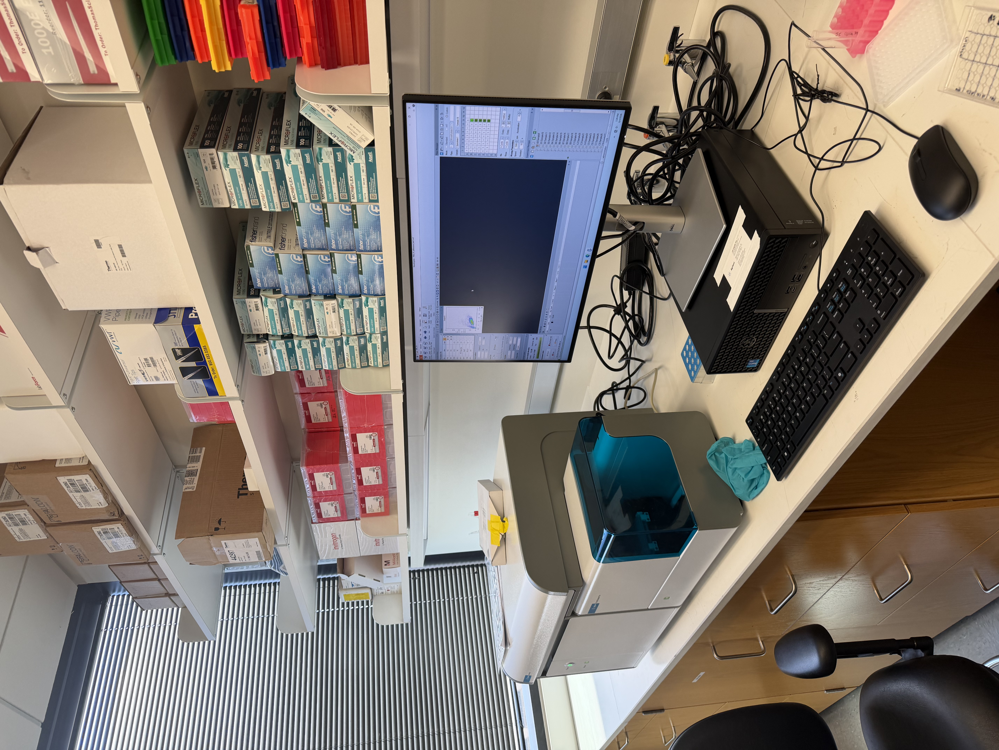

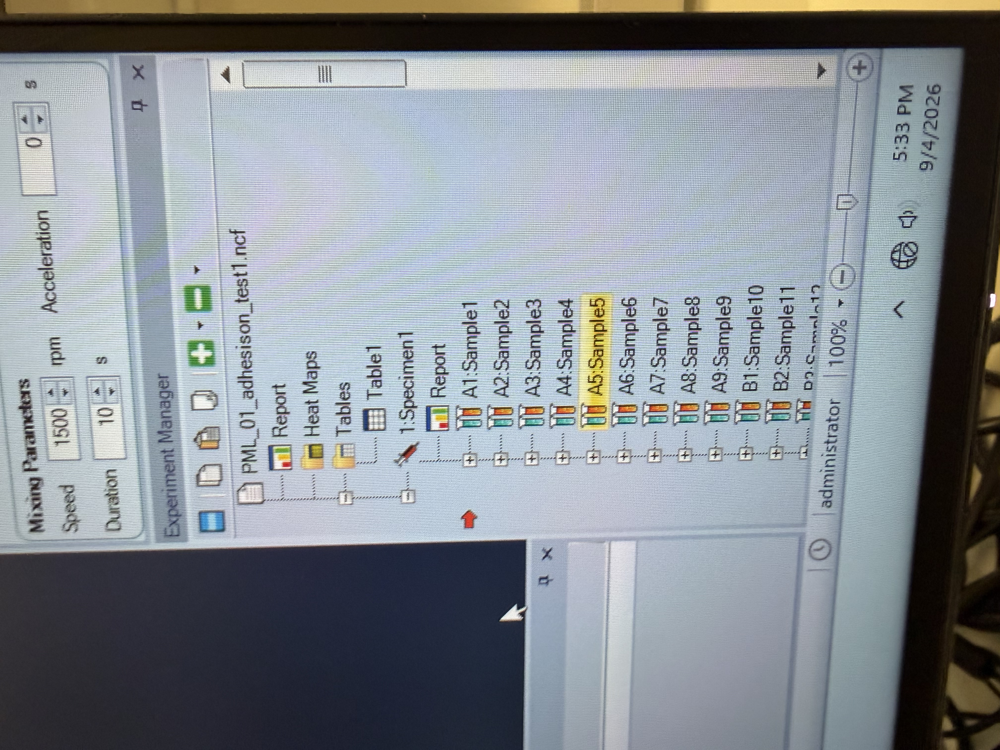

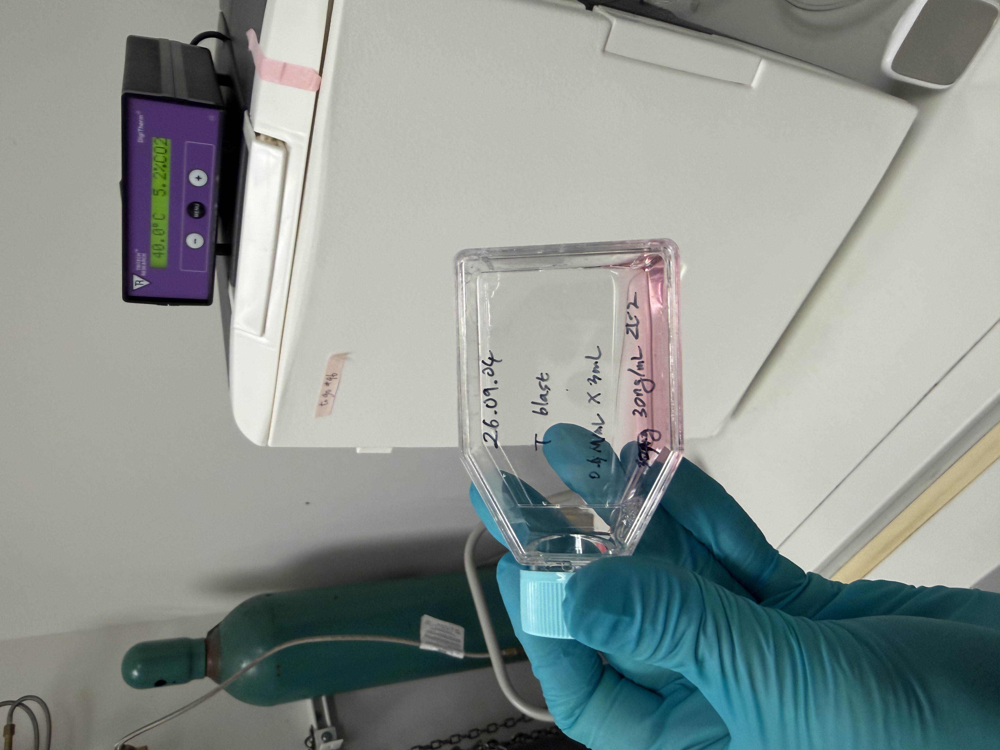

:::

## Day 6 - 9월 5(토) · Hang Out!!

오늘 저녁에 새로운 한국인 친구와 Hang out이 예정되어 있었다. 그 전에 밀린 운동도 좀 하고, 세차도 하고, 장도 볼겸 짧은 외출을 감행했다. Student Center에 학생들이 무료로 이용할 수 있는 헬스장이 있는데, 집에서 차로 5분 정도 거리에 있어 가려면 아주 큰 마음을 먹어야 한다.(너무 게으른가..) 지난주 평일 저녁시간에 갔을 때는 거의 꽉차있어서 운동할 맛이 안났는데, 오늘은 주말이라 그런지 거의 나 혼자서 계속 사용했다. 주말에 자주 와야겠다.

차를 간단히 세차해주고(이제 실외세차는 껌이다), 스테이크를 한번 도전해보기 위해 립아이를 한번 사봤다. 한국에서 정말 요리를 안했어서, 간단한 스테이크조차 나한테 큰 도전이다. 그래도 장기적으로 봤을 때, 할 줄 아는 요리를 점차 늘려나갈 필요가 있을 것 같아 하나 둘씩 도전해보려고 한다.

:::{.photo-row}
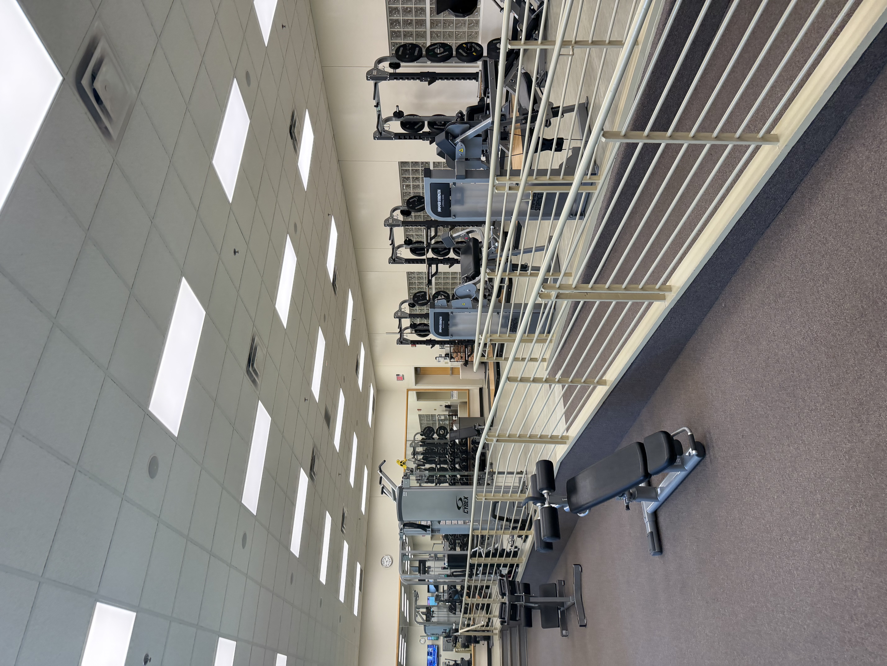

:::

그리고 메인 이벤트. 이번주 두번째 행아웃이다. 오늘은 기존에 함께 놀던 한국인 친구 두명에 더해 새로운 한국인 친구 한명과 총 네명이서 맛있는 레스토랑에서 함께 저녁식사를 했다. 음식은 정말 퍼펙트하고 좋았지만, 내부가 거의 만석일 정도로 인기여서 그런지 가게가 꽤 시끄러워 대화에 집중하기는 어려웠다.

맛있는 피자와 파스타, 그리고 여러 가지 사이드 음식들을 함께 먹고, 후식으로 엄청난 아이스크림 맛집에 갔다. 내가 고른 맛은 Peanut Butter 어쩌구와 Mango Sticky Rice였는데, 둘 다 처음먹어보는 맛이라 정말 맛있었다.

::: {.photo-row}

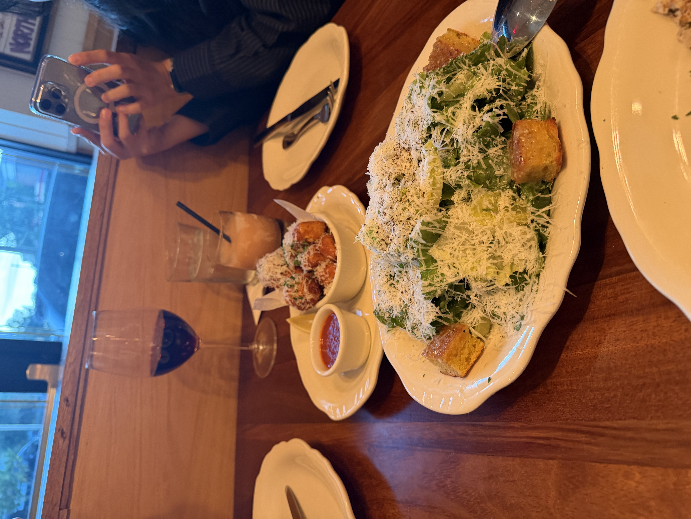

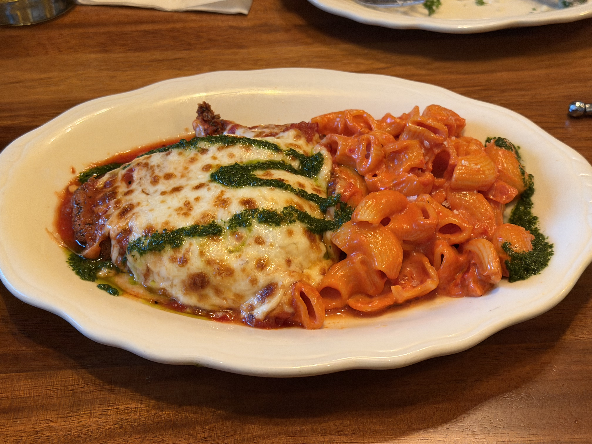

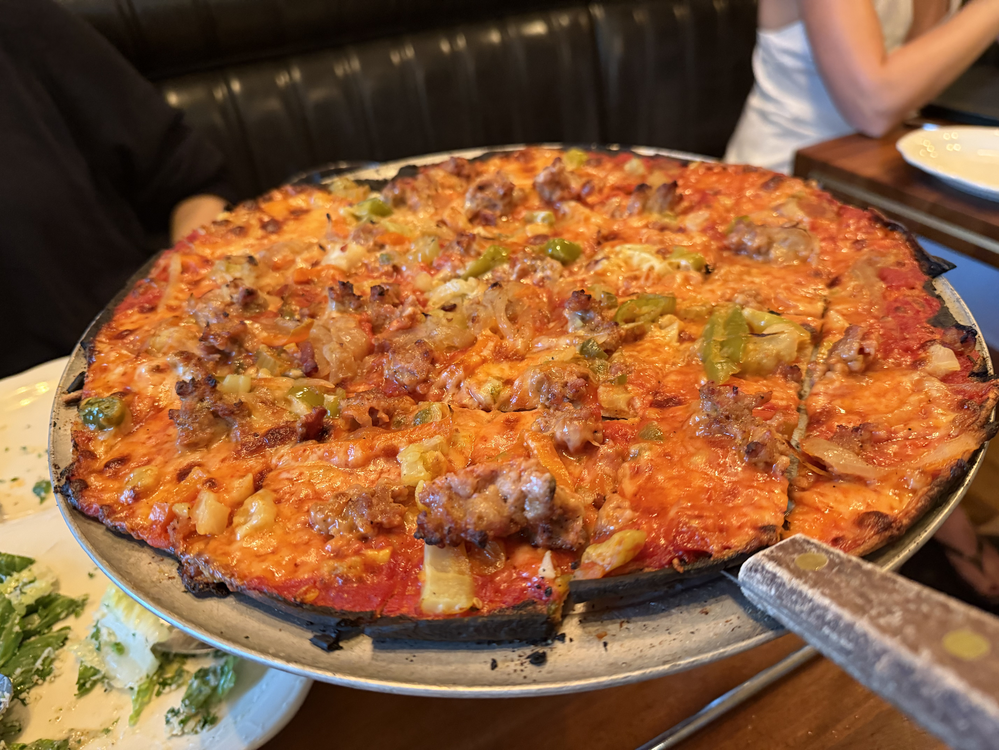

:::

## Day 7 - 9월 6일(일) · 오디세이 IMAX 70mm

오늘은 혼자 영화를 보러가는 날이다. 한국에서는 영화관 분위기를 너무 좋아해서 주기적으로 찾곤 했는데, 너무너무 보고 싶은 영화가 있어 볼 방법을 찾다가 덜컥 IMAX를 예매해버렸다. 그것도 한국에서는 상영하지 않는 70mm 버전으로! 그 영화는 바로 오디세이었다.

영화관 분위기를 낭낭하게 즐기기 위해 미리 팝콘과 음료를 구매해서 출발했다. 그런데 왠걸, 그 곳은 외부 식음료 반입이 불가한 곳이었다.. 어쩔 수 없이 차에 넣어두고, 새로 팝콘과 음료를 구매해서 영화관에 착석했다.

자막없는 3시간짜리 영화는 다소(많이) 힘들었다. 그렇지만 영상미가 너무 좋아서 정말 재미있게 봤다. 아마 실제로 이해한 내용은 전체 내용 중에 1/3 정도인 것 같다.. 내 listening 실력을 너무 지나치게 과신했다. 그 와중에 IMAX 70mm 인기도 많고 극장이 다소 규모가 작아 어쩔 수 없이 앞에서 세번째 줄에서 봤는데, 목이 아직도 뻐근하다. 그렇지만 오랜만의 극장이라 너무너무 즐거운 시간을 보냈다.

::: {.photo-row}

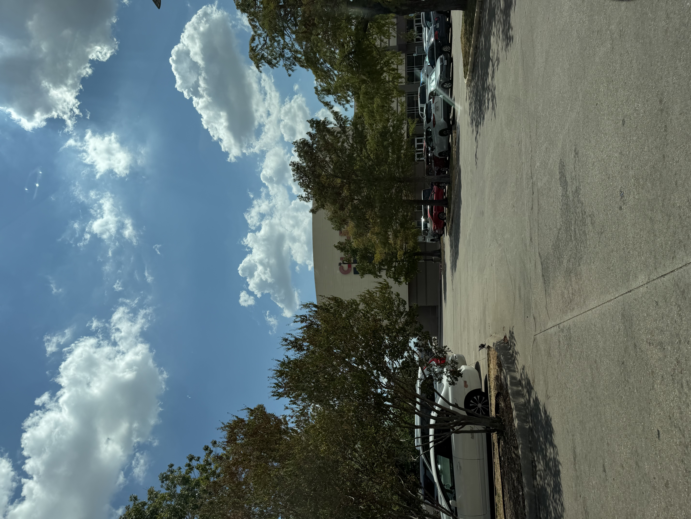

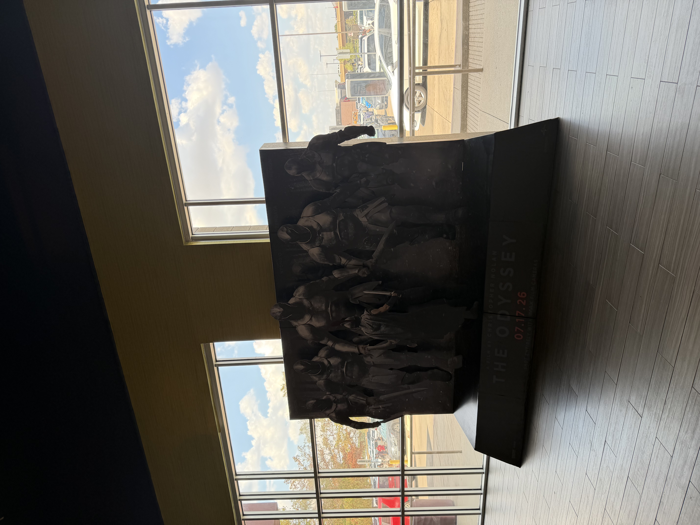

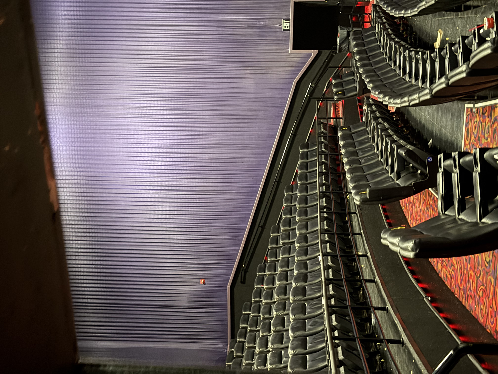

:::

그리고 나서는, 한인마트 H-mart에 방문해서 장을 더 봤다. 요즘 거의 트레이더조스에 냉동으로 파는 제품들을 전자레인지 or 에어프라이기로 조리해서 먹고 있는데, 점점 물리기도 하고 또 약간 건강하지 못하다는 생각이 들어 주식을 한식으로 한번 바꿔보려고 한다.

일단 처음은 간장계란밥과 김치부터 시작해서 불고기와 대패삼겹살까지 구워볼 생각이다. 평소에는 요리에 시간을 쓰는 것 자체가 조금 부담스럽기도 하고 그 후의 뒷정리가 번거롭다고 생각했는데, 뭔가 영양학적으로 건강하지 못한 식습관인 것 같아서 고쳐보려고 한다.

이렇게 하나 둘 맛들리다 보면 나중에 건강한 한식 한상을 뚝딱 지어낼 수 있지 않을까?

:::{.photo-row}
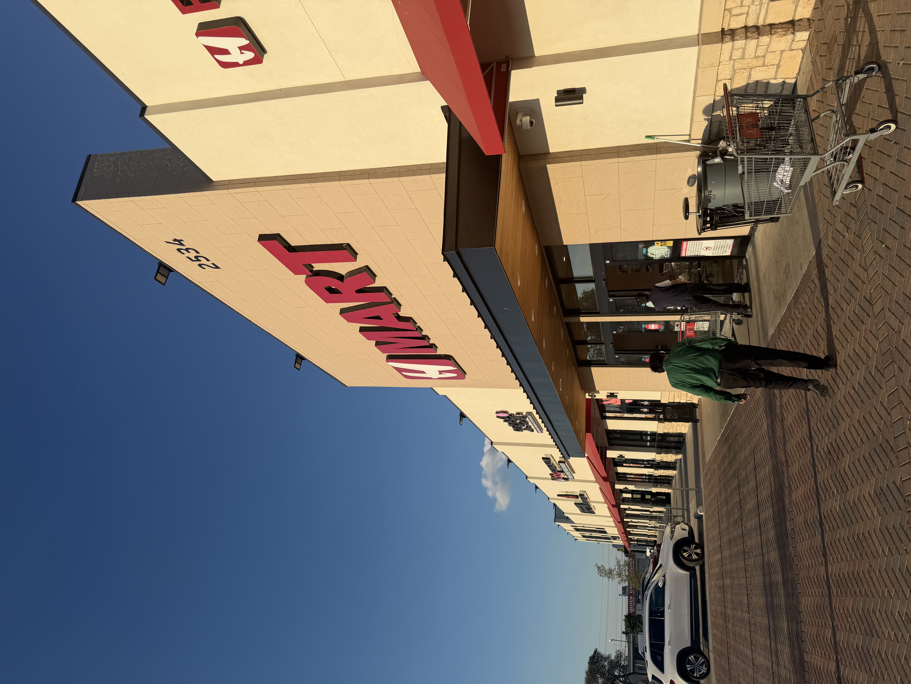

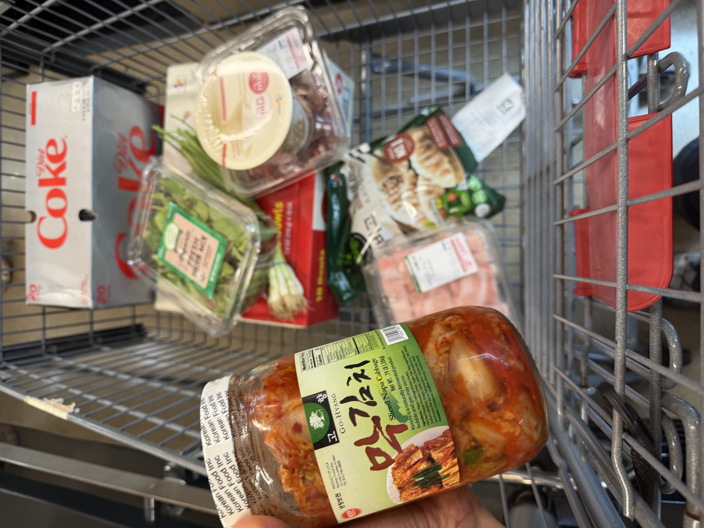

:::

미국에 온지 5주차, 첫 시험까지 치뤘다. 실험실 사람들과 나누는 인사도 제법 익숙해졌고, 또 첫 입국 이후로 필요한 서류들 세팅까지 정리되어 마음이 한결 가볍다. 

뭐든 처음이 어려운 법이다. 이제 어느정도 어려운 일들은 정리됐고, 조금 더 본질적인 공부와 연구에 집중할 수 있는 환경이 마련되어가고 있다. 

그 와중에 나를 좀 더 잘 돌보기 위해 지난주에는 운동을 하겠다고 선언했는데, 사실 잘 지키지 못했다. 주 3회를 목표로 했으나 수요일과 토요일 2회밖에 하지 못했고, 시험도 끝난 마당에 바쁘다는 건 역시 핑계다. 다음주에는 꼭 주 3회 운동을 지켜보려고 노력해야겠다.

그리고 다음주에는 스테이크와 불고기, 대패 삼겹살까지 한번씩 저녁에 시도해볼 생각이다. 실험실에서 퇴근하고 저녁을 신경써서 먹기가 조금 어렵긴 하지만, 그래도 '나'를 위해서 하나 둘씩 시도해봐야지 어쩌겠는가. 더 건강하게, 더 장기적으로 접근해서 생활 습관을 잘 만들어봐야겠다.

그런 의미에서 다음주에는 운동 리뷰와 함께 식습관 점검을 진행해 볼 예정이다.