Challenge, failure, and rest. Rest is the fertilizer for the next challenge.

## Day 1 — Sep 7 (Mon) · Everyone's first try is a mess

Every time I glance at the calendar I'm startled. I'm really already here?

Here's what I tried cooking this week with ingredients I picked up at H Mart last week.
1. Rice, kimchi, and bulgogi.
2. Ribeye steak

One was a success, the other a failure.
Warm rice, bulgogi, and kimchi is a combination that's basically impossible to mess up,

but the steak turned out pretty badly — maybe I picked the wrong cut, or maybe it was just my own inexperience. I guess this is how you learn, one dish at a time.

I also soaked, in the bathtub, a pair of reproduction denim jeans I'd bought in Osaka, Japan.

Raw denim shrinks a lot the first time it's washed, so to keep the fit from getting distorted, you soak it in the tub in its worn shape for about 30 minutes first — that process is called "soaking."

And a simple workout to round out the day.

::: {.photo-row}

:::

## Day 2 — Sep 8 (Tue) · Challenge and failure

Yesterday's new challenges were cooking and soaking denim.
Today's were the lab and English.

My supervisor, who has been training me, gave me a mission: reproduce the experiment I'd learned entirely on my own.
I had the protocol, I had the materials — what could possibly go wrong?
So I dove in. The result was brutal.

I'll get to it later, but I tried the same experiment again on Thursday and Friday and got something close to a success.
Does that change the fact that my first attempt ended in failure, though?

...

I'm slowly realizing just how important English is.
In one of Tyler's YouTube videos, he laid out three elements needed to acquire a language: exposure, necessity, and motivation.

Necessity and motivation can be easy to mix up. Say I'm watching something on Netflix in English with English subtitles. I chose to put it on, so my motivation to understand it is plenty high. But whenever a scene is hard to follow, I can just glance at the subtitles — so the necessity is low. (Translation: turn the subtitles off.)

I think I get enough exposure already.
So I decided to study harder, treating necessity as "surviving inside an English-speaking culture"
and motivation as being able to freely discuss research as a researcher.

To that end, I signed up for English conversation tutoring twice a week — I need to be more proactive about this.
I also don't seem to have enough motivation to study Wordly Wise on my own, so I'm going to have my tutor help me with that too. Each session, we'll go through whichever words from that week's list I'm not already comfortable with.

::: {.photo-row}
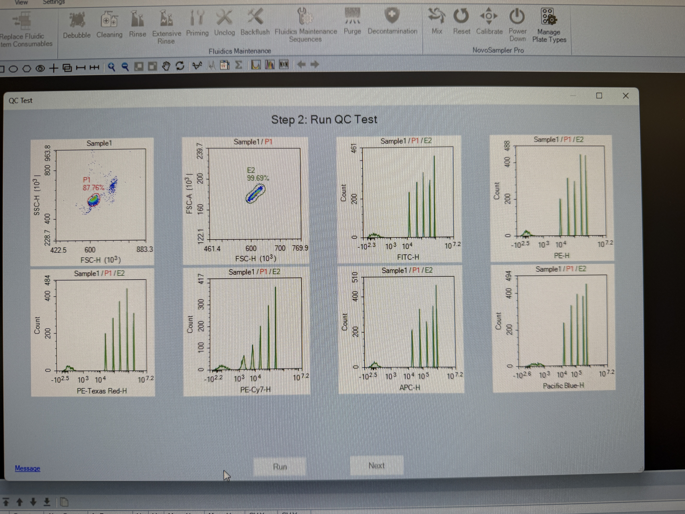

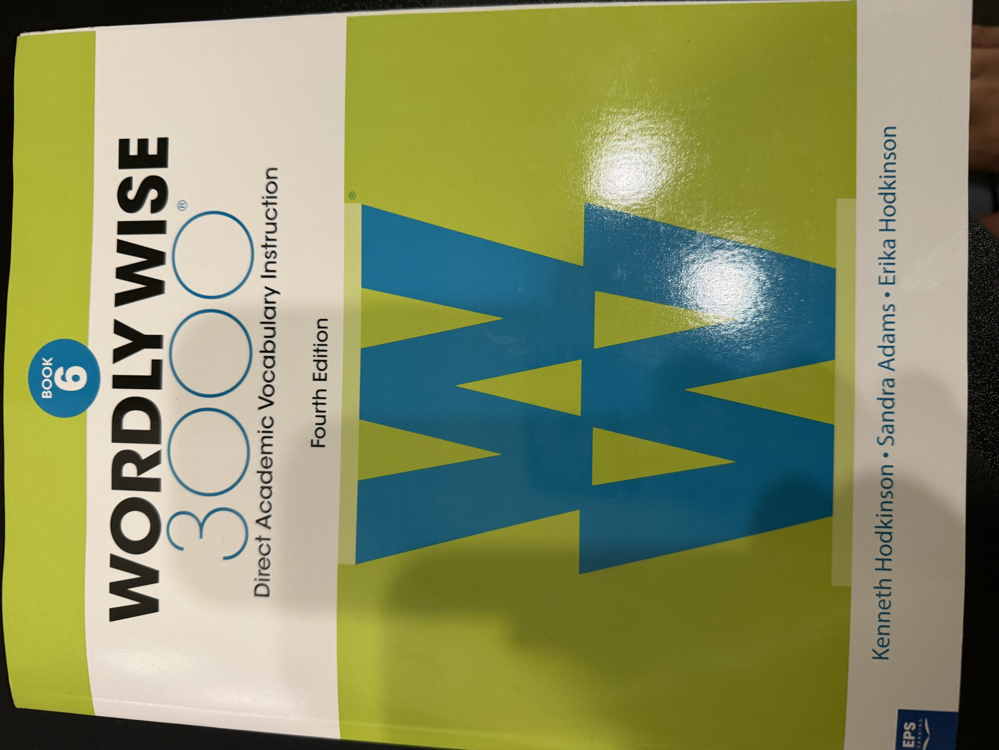
:::

## Day 3 — Sep 9 (Wed) · Learning is always new

Discouraged by yesterday's experiment, I had a hard time focusing on anything today.
I never expected to get it right on the first try, but actually facing that result and accepting it turned out to be a different matter entirely.

I noticed this back in my previous lab too — I tend to get distracted pretty easily.
So I've concluded that when I'm running an experiment, I need to give it my full, undivided attention,
and I'm going to try reproducing it again with that in mind.
I pulled myself together, went back through the protocol, and vividly simulated in my head exactly how Thursday and Friday would go.

Besides that, today I learned how to use a kit called LegendPlex
to detect and quantify several of the cytokines that are the Casanova lab's main targets.
It felt unfamiliar at first, but if I keep chewing on it, before I know it, it'll feel like it was always mine.

::: {.photo-row}

:::

## Day 4 - Sep 10 (Thu) · My first exam result

The results came back for the exam I took last week.
I scored a little above average — better than I'd worried, honestly.
But of course, people never seem to be satisfied that easily. (Or is that just me?)

With a slightly better score I might just barely clear the cutoff for an A,
so I'm going to buckle down and prepare for the next exam too.

My supervisor also gave an oral presentation today.

It was a seminar on topographic memory T cells —
the idea that the cells making up our body's immune system are each programmed differently
and dispatched to specific organs, where they form a kind of memory immunity for that particular organ.
(Seminars come with food more often than not, and this time it was pizza!)

I'm currently testing a hypothesis specifically about the T cells that go to the brain,
and if it turns out to be true, I think there could be a real clinical connection — it's a project I'm genuinely excited about.

And on the way to the gym, it started pouring like crazy out of nowhere.
I turned the car around and rushed home, and — of course — the rain stopped the instant I did.
Undeterred, I headed back out to the apartment gym and managed to get my workout in after all.

::: {.photo-row}
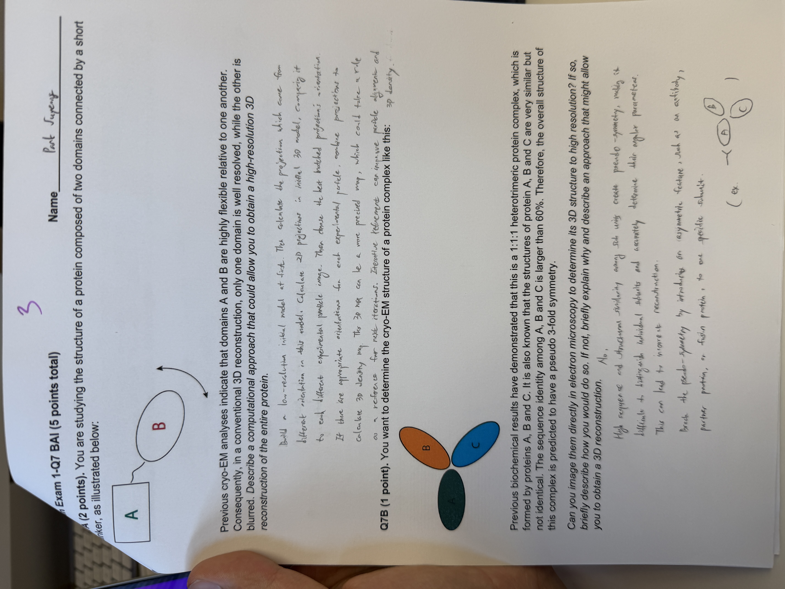

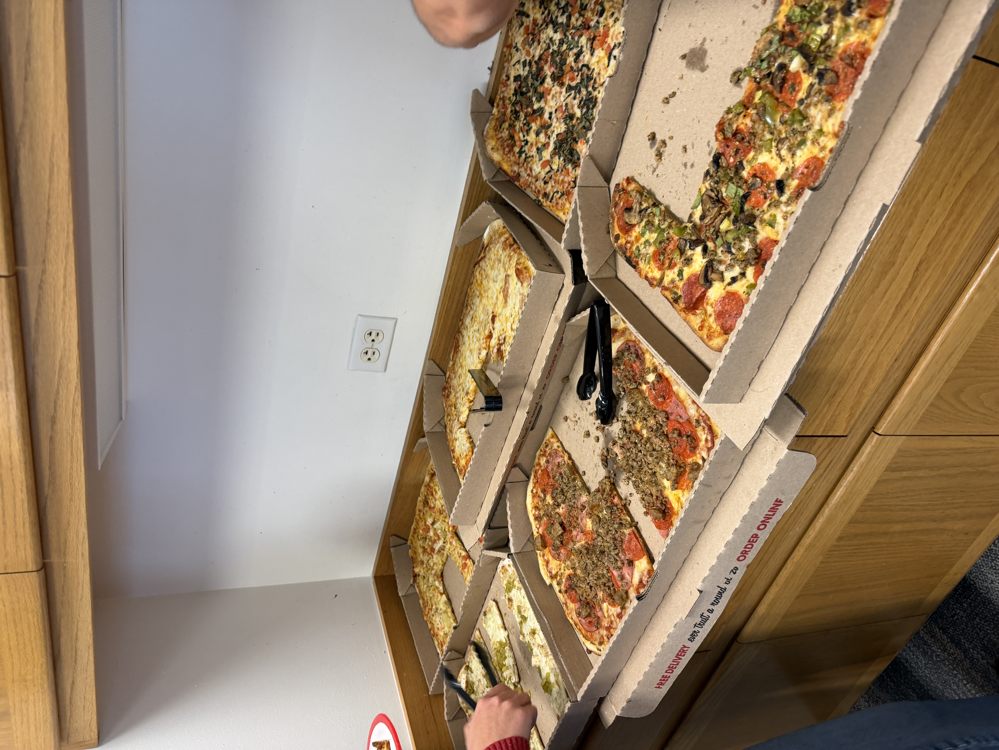

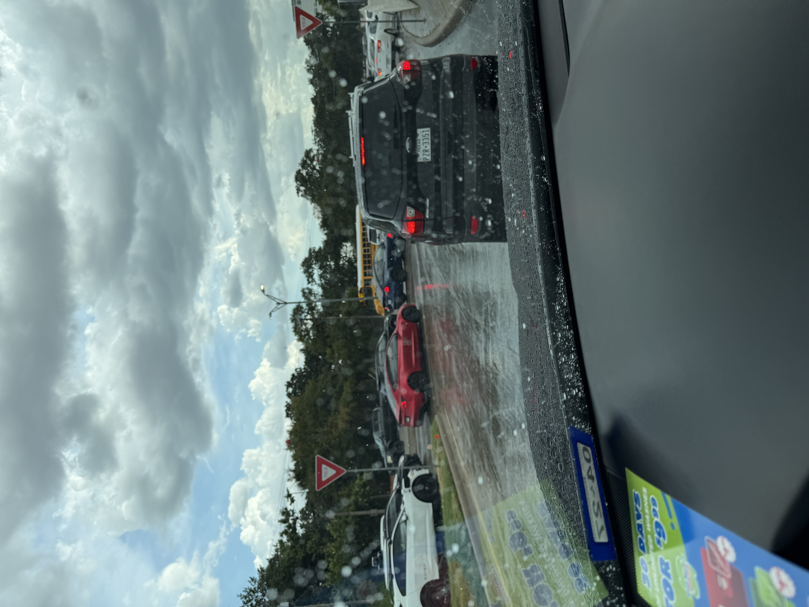
:::

## Day 5 - Sep 11 (Fri) · Reproducing the experiment — success?!

Determined to bounce back from Tuesday's failure,
I stayed completely locked into the experiment all day — and as a result, I managed to reproduce it, more or less.

There was some pre-treatment I had to do on Thursday to get ready for today's run,
and the main experiment itself started right after class and didn't wrap up until just before I left for the day.

It was a genuinely simple experiment,
the kind that might be second nature to someone else —
but for me, that small success meant more than I can really put into words.

There's a phrase I've been holding onto lately: "To build confidence, build evidence."
My hope is that the evidence of each day I live through — piling up here on this blog and in my lab notebook —
will, by the end of my PhD, add up to something enormous, and give me a confidence just as solid.

I closed out the day with a simple walk outside.

There's a YouTuber named Souljung whose words stuck with me:
separate your time into "variable" time and "constant" time.

The world changes so fast, and relationships and communication with other people are caught up in that same whirlwind of "variables."
To build a core of steadiness inside all of that, I've decided to carve out "constant" time — time I spend focused only on myself.

::: {.photo-row}

:::

## Day 6 - Sep 12 (Sat) · Time for the "constant," clearing my head

The "constant" time from that video was really about building a routine, some part of the day set aside purely for yourself,
and I decided to focus specifically on "tidying up."

That sounds grand when I say it out loud, but really
I just let my exhausted body rest and filled the weekend with things I like.
After a string of new challenges, I let myself fully enjoy the kind of rest that's familiar and comfortable to me.

It started with a haircut.

I like haircut time.
By the time I need one, my thick hair is practically screaming that there's no more room left to grow,
and some mornings, standing there with the blow dryer forever trying to dry hair that just won't dry, a wave of exhaustion hits me.

So I like getting a haircut — it lightens up a head that's gotten heavy.
Afterward, I treated myself to a sweet boba, a cup of bubble tea.

:::{.photo-row}
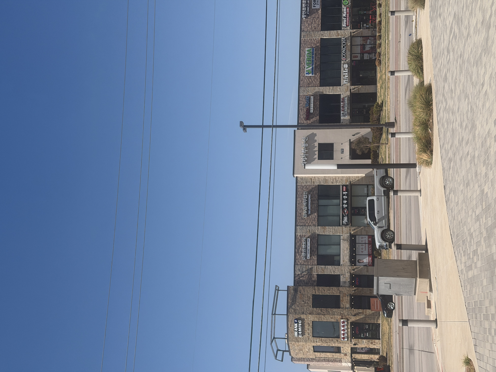

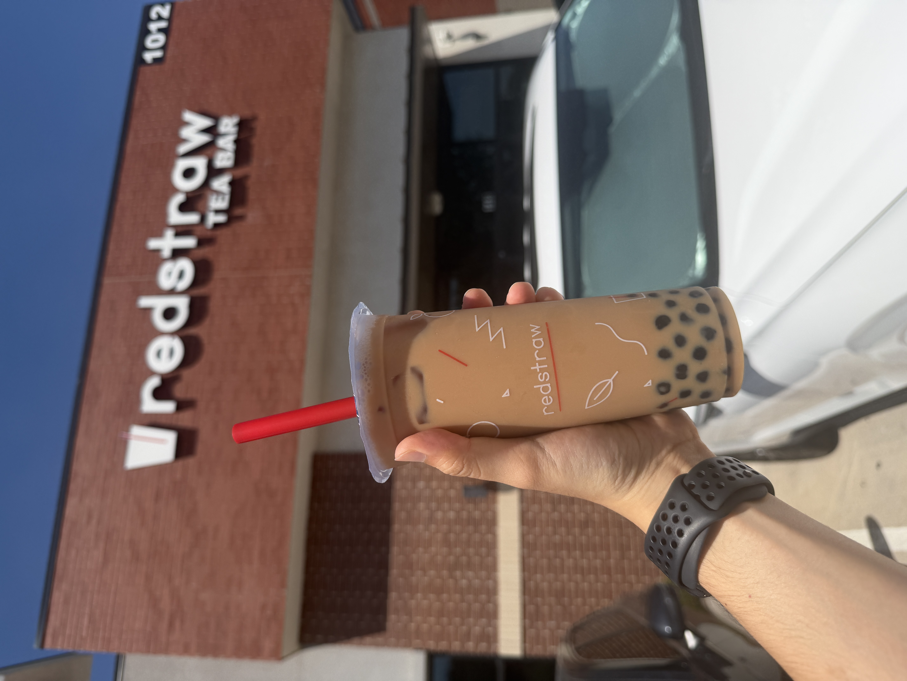
:::

And then, shopping!

My plan had two main targets.
1. RRL black-on-black vintage five-pocket jeans
2. Hamilton Khaki Field Mechanical, 36mm

Here's the longer version of why I wanted these.

Soaking my jeans for the first time this past Monday and watching them change was genuinely fun,
and it made me want to try a different pair of jeans.

I've also been a little skeptical lately, looking back at how I spend on clothes —
I make purchase decisions too lightly, and there have been more than a few moments of regretting them afterward.

So I wanted to pay a bit more for a pair of jeans I could actually enjoy watching fade and change over the years,
and buying RRL — Ralph Lauren's own denim line — from the home turf of Polo felt like it would mean something.

And then the watch.
The Hamilton Khaki Field Mechanical is famous enough that most watch enthusiasts would recognize it.
The only watch I'd ever worn was an Apple Watch,
so I started poking around out of a desire to widen my world a little.

That's when I learned the 36mm version had actually been discontinued,
and Hamilton was only bringing it back for 2026 — the 250th anniversary of the Declaration of Independence in 1776 — for this year alone,

and that made me want to grab the chance while it lasted.

And then the shocking discovery:

RRL had so many beautiful pieces that I wanted to take a proper, closer look before committing,
and the Khaki Field, meanwhile, is set to arrive next week!

:::{.photo-row}

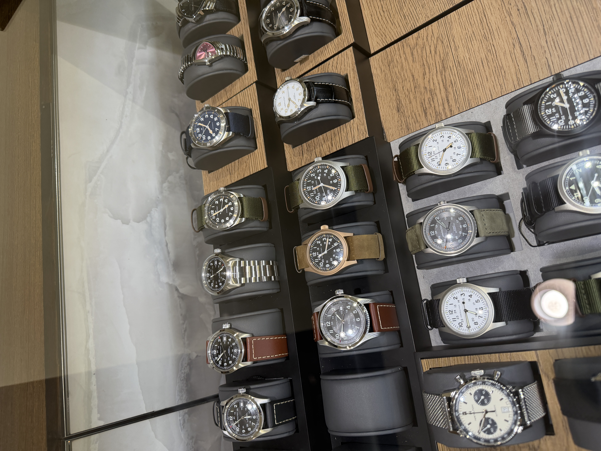

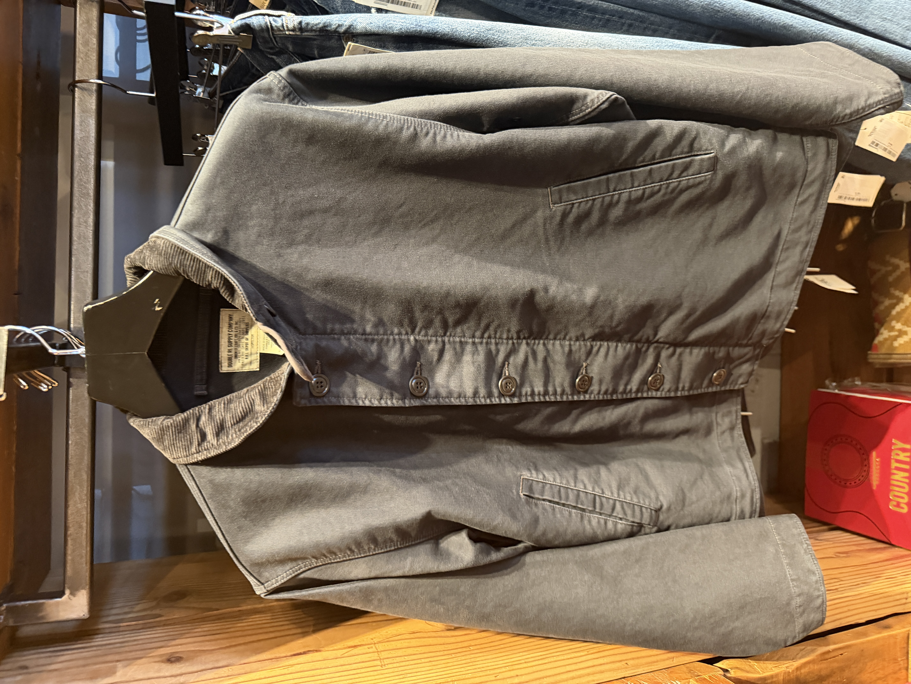

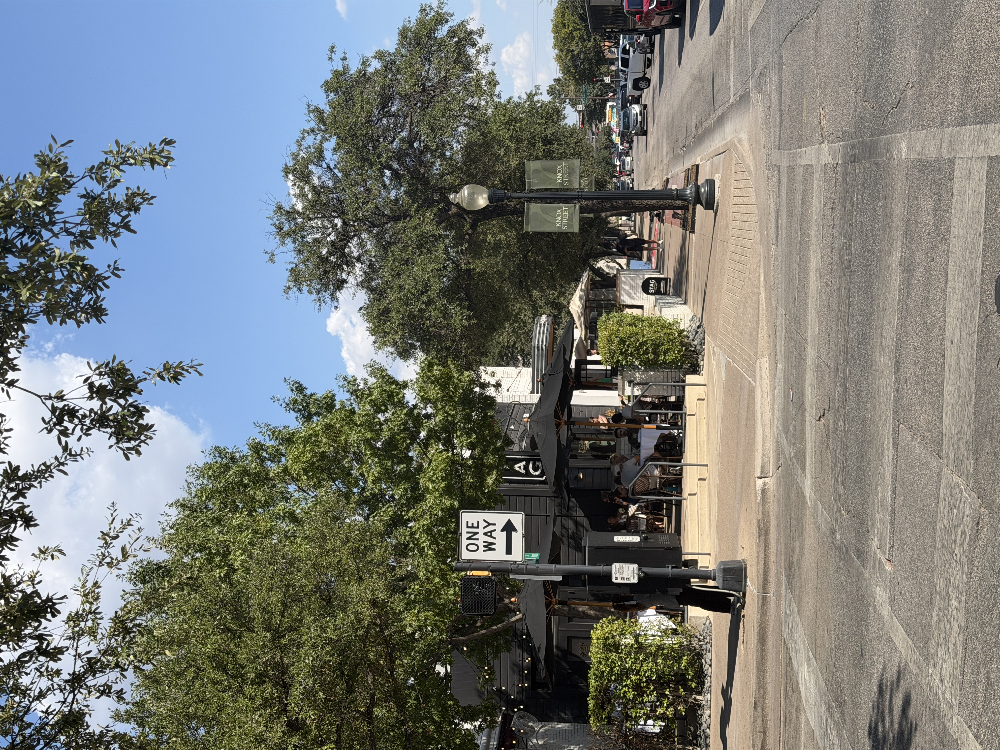

:::

A quick thought on neighborhoods, too.
In the US especially, the vibe shifts wildly from one neighborhood to the next.

The place I went shopping was Knox Street,
a neighborhood where everyone strolled around peacefully under a warm, pleasant sun.

It was a moment that made me think harder about what kind of environment I want to put myself in.

## Day 7 - Sep 13 (Sun) · Netflix House

Today the four of us — a Japanese friend, two Korean friends, and me — spent a fun day together.
It started at a Mexican taco place.

Not the kind of taco we usually get back in Korea,
stuffed to bursting with a dozen ingredients that spill out the moment you take a bite,

this was the real, authentic Mexican taco,
genuinely simple and focused on the essentials — bread on the outside, meat on the inside.

Sometimes simple instinct beats complicated technique.

:::{.photo-row}

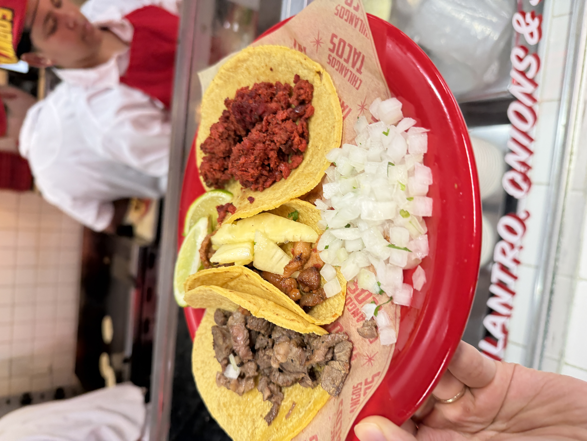
:::

After that, we debated what to do next and decided to check out Netflix House.

It's a themed attraction built around various Netflix series,
and the one you could actually get in and play was Squid Game. About $50.

It put us right in as actual Squid Game contestants,
playing and competing through several of the games ourselves.

Contrary to what I expected,
it was staged so realistically that I got completely immersed.
Worth experiencing at least once!

The gift shop was selling a huge variety of merchandise, and since I'd really enjoyed watching Stranger Things,
a lot of the related merch caught my eye — but I never actually opened my wallet!

:::{.photo-row}

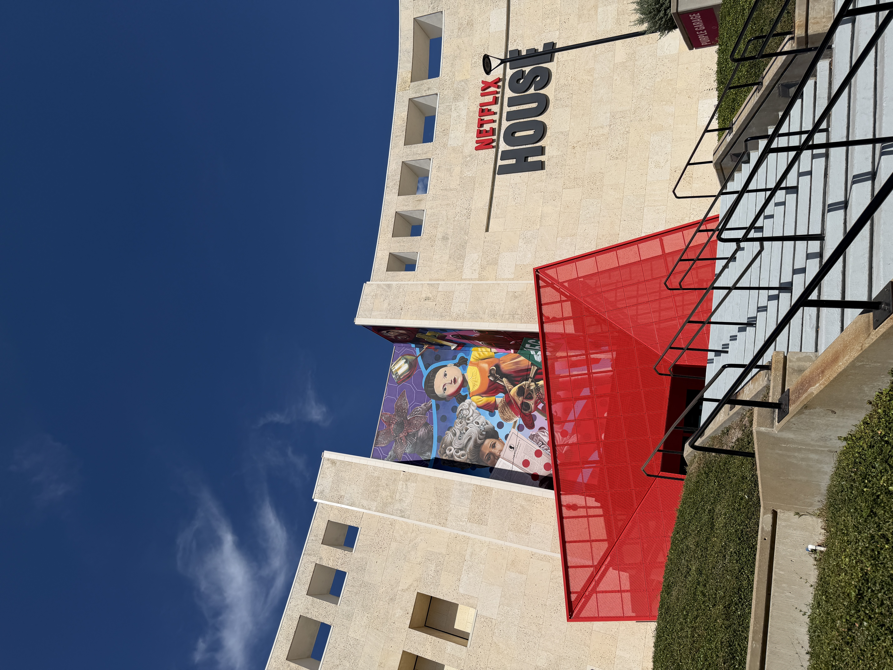

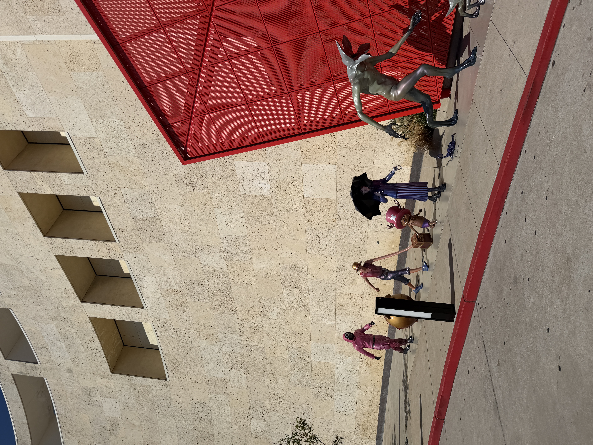

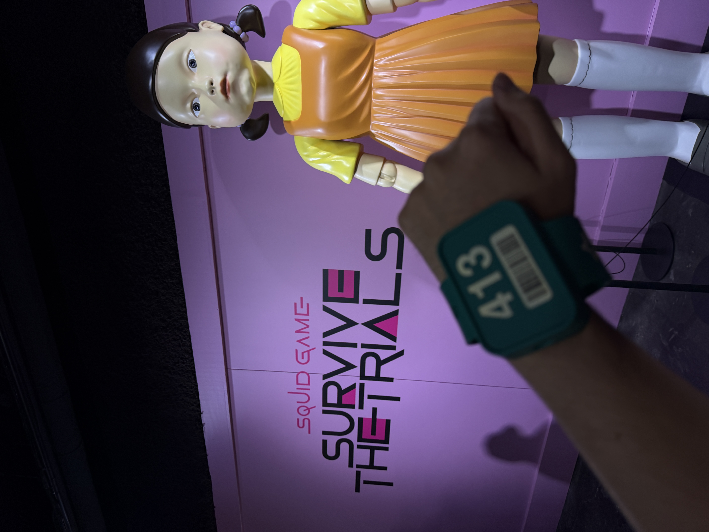
:::

Six weeks into the US now, and this is a golden stretch of time for getting a full taste of challenge and failure. I'm sure a day will come when I look back and miss even this. I go into every challenge braced for failure, but actually accepting it when it happens is a whole separate assignment.

This week I made it to the gym three times — Tuesday, Thursday, Friday. And the promise I made to myself about paying more attention to food, I managed to hold up reasonably well too, thanks to some solid Korean food combos. Same with the workouts and the food: neither is a complete success yet, but I believe that if I keep stacking up experience like this, week after week, at some point it will quietly settle into my "constant" territory.

With that in mind, next week I want to talk about my "constants" — the things I want to hold onto, unchanging, because they matter to me.

This week's entry turned out fairly abstract and personal, but just the act of sitting down and calmly writing out what I've been thinking and feeling seems to sort out a lot on its own. And I believe it'll become a valuable asset someday — something I can pull back out and revisit through these words.
