Grad school orientation is officially over — classes have started for real. I finally got my Texas driver's license, and the apartment keeps slowly filling up with a sofa, a standing desk, and whatever else I decide I can't live without.

## Day 1 — August 17 (Mon) · Grad School Classes Officially Begin

My first real grad school class started today. The core curriculum kicks off with Proteins, followed by seven weeks each of Cells and Genes. After a short course overview, the Proteins class dove straight into the 20 amino acids, their individual properties, and some basic protein analysis methods.

In the afternoon I took a mouse safety class. I still don't know whether I'll end up doing animal work, but mouse studies make up a pretty big chunk of immunology — the field I'm hoping to go into — so I figured I'd get it out of the way early.

::: {.photo-row}
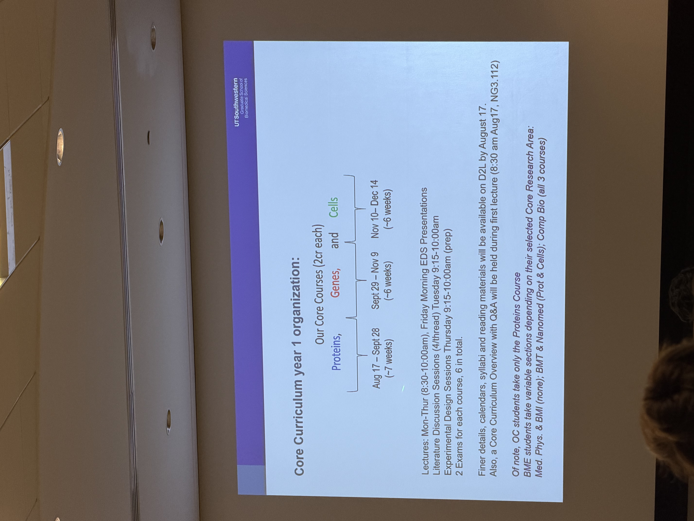

:::

Later, catching up with friends back in Korea, the movie *Odyssey* came up. One friend said it was so good she went back to see it two or three times, and that was enough to make me want to catch it in IMAX. Digging around, I found out there's an actual IMAX 70mm theater near Dallas. After refreshing the seat map more times than I'd like to admit, I managed to snag a seat in the third row — not the best spot, but a seat all the same.

I'm honestly not sure I can follow three hours of unsubtitled English when everyday conversation still trips me up. But nothing to lose by trying, right? Just getting to watch true IMAX 70mm here in the US feels like a rare opportunity on its own. It's scheduled for Sunday, September 6th, so a review might show up around two posts from now.

It's also been about two weeks since I landed in Dallas, so I sat down and tallied up exactly how much I've spent so far. Between eating out with friends every week and not having my kitchen fully set up yet — which pushes the dining-out ratio way up — I was relieved to see the number wasn't as bad as I'd feared.

Going forward I want to keep a closer eye on spending, and maybe start studying up on personal finance here and there, with some vague target dollar amount in mind for when I finish the PhD.

## Day 2 — August 18 (Tue) · Did My US License Actually Come Through?!

I've been suffering through the Texas license process for what feels like forever, endlessly refreshing my case number to see if anything was moving. And then, out of nowhere, my case status actually changed!
(See Day 1 of my last post, [Week 2 in the US — Orientation and Furnishing an Apartment](2026-08-week2.html))

Whenever something like this happens, my rule after two weeks here has become: drop everything and go handle it in person, on-site.

::: {.photo-row}
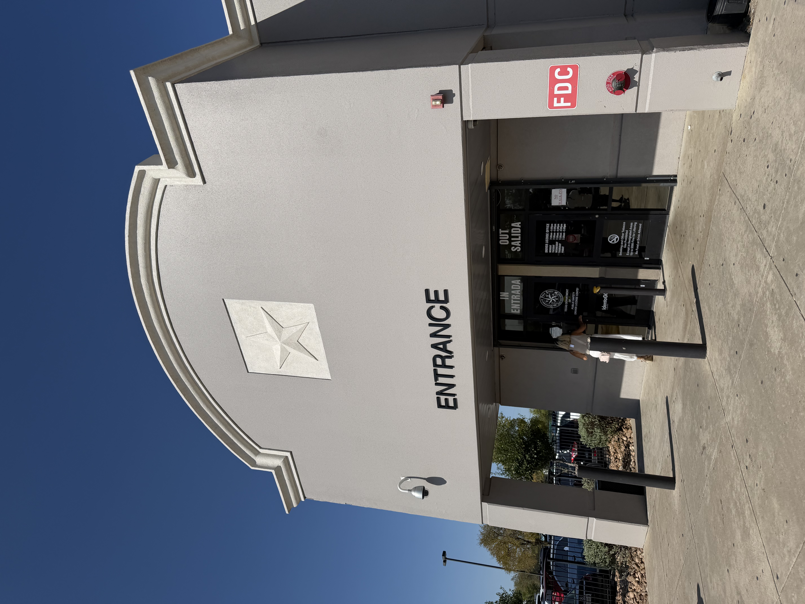

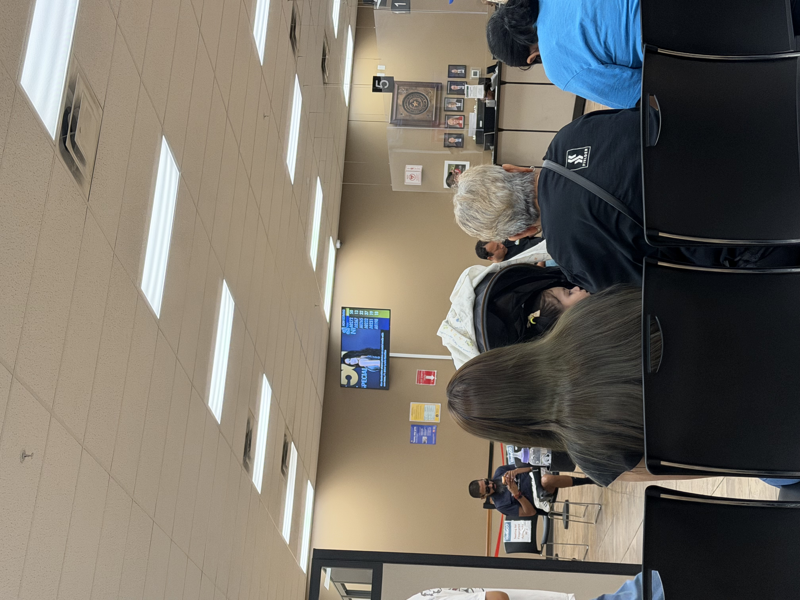
:::

And it worked out perfectly.

Turns out the holdup was that I hadn't yet been registered in SAVE, a verification program run by US immigration, so the Texas DPS (Department of Public Safety) couldn't confirm my identity either. Now that two weeks have passed since I entered the country, the system was finally able to verify me properly, and I got my Texas license approved at last.

I don't have the physical card yet, but they said it'll arrive by mail within a week, so I'll just wait it out.
One catch — since this counted as an "exchange," I had to surrender my Korean license.

...

And on top of that, my long-awaited ON running shoes finally arrived. (?!)

::: {.photo-row}

:::

The pair I got was the Cloudmonster 3 — a solid daily all-rounder. I used to run in New Balance 1080v14s, but a baggage-space issue (...) meant I couldn't bring them with me to the US, so these are the replacement.

Maybe it was the long wait, but I was genuinely thrilled. That excitement lasted about five seconds before I started second-guessing the price when I looked closely at the finish. That doubt disappeared completely the moment I put them on and took a few steps. I'm going to put a lot of miles on these across this big country.

## Day 3 — August 19 (Wed) · Hunting for Free Lunch

Grad school life sometimes lands you in that awkward lunch spot — not really worth going home, but also not free enough to just relax, since there's something on campus in the afternoon. Today was one of those days. I had two deep conversations lined up in the afternoon, one with a professor and one with a postdoc, both about upcoming rotations.

Classes always run from 8:30 to 10 in the morning. Once they wrap at 10, starting next week I'll officially belong to a lab for my first rotation. Students can do up to five rotations, with a minimum of two required and three recommended.

Anyway, thanks to this scheduling gap, campus events are a great way to grab a Free Lunch! and solve the meal problem cheaply.

::: {.photo-row}

:::

I wandered into the shiny Biomedical Engineering (BME) building for an event aimed at BME students. Even though I'm not in that program, grad school here is pretty open about this kind of thing, and students from other programs are welcome too. I filled up on free lunch bagels and then headed off to my afternoon rotation meeting.

I've decided to do my rotation with Jean-Laurent Casanova — a name I definitely mangled before I could say it smoothly — in a lab doing world-class infectious disease genetics research. There's a longer story behind how I landed here, but the short version is that he spent about 20 years at Rockefeller University in New York City before moving to UTSW this past July(?!). His research lines up closely with what I want to study, so this rotation felt like a genuinely great opportunity.
(Lab website: [HGID (Human Genetics of Infectious Diseases)](https://www.hgid.org/))

As they say, life is seventy percent luck and thirty percent effort.

::: {.photo-row}

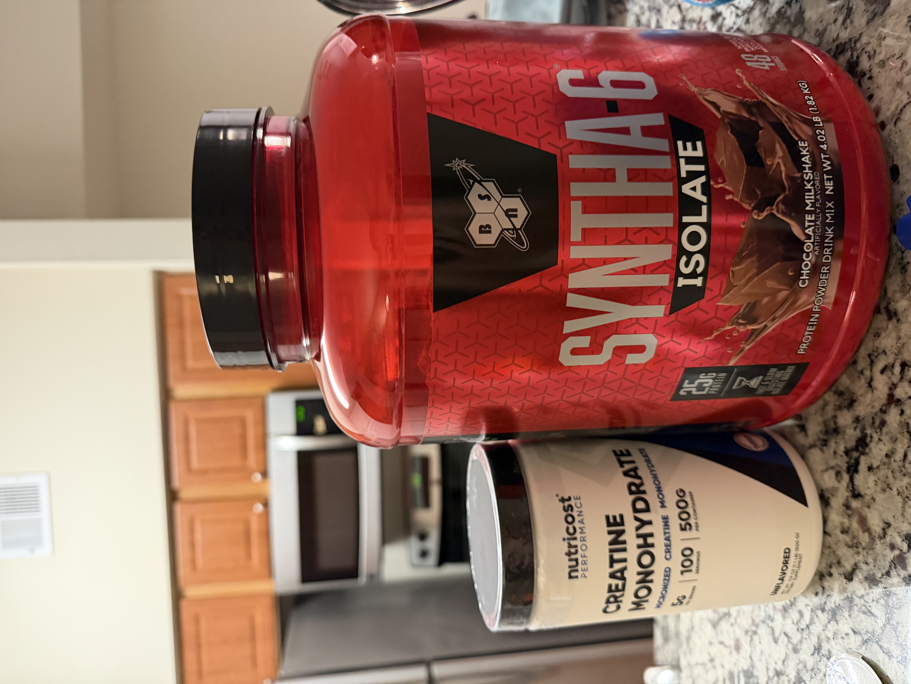
:::

I also picked up a few supplements. The supplement and vitamin market here is way more developed than in Korea — there's an overwhelming number of products with genuinely good formulations, so after a lot of deliberating over what combination to get, here's where I landed.

Top priority was omega-3, then magnesium, then probiotics, then a multivitamin (B, D, and so on). There are enough well-established go-to brands that I could get good prices on all of them. Next time I visit Korea, I should stock up on a huge haul of supplements to bring back.

On top of that, I grabbed some protein powder and creatine to look after my small but precious muscles.

## Day 4 - August 20 (Thu) · Making a Japanese Friend

Back at orientation, I'd briefly crossed paths with a Japanese classmate named Ryosuke. He finished undergrad in Japan, spent about a year in NYC as a research assistant, and then got into the same PhD program here in Texas.

I think, in North America especially, friends from other parts of Asia end up feeling more familiar somehow. He's from Yokohama, so I pulled out photos from my last trip to Tokyo — including Yokohama — and we ended up chatting for a while over them. He mentioned wanting to move to Med Park, where I live, next year, so I told him I'd help him find a place when the time comes.

Anyway, we hit it off talking about this and that, grabbed lunch together, and then headed to the student lounge for capsule coffee, where a bunch of us international students kept practicing our not-quite-there English.

::: {.photo-row}

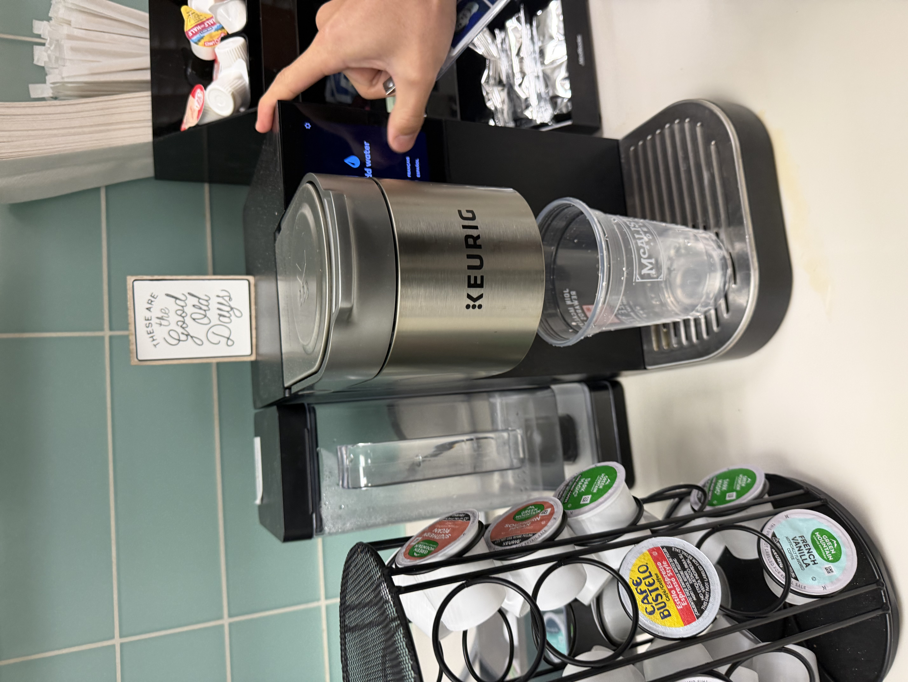
:::
## Day 5 - August 21 (Fri) · Meet the GDD

Another day of finishing class and then having somewhere to be on campus. At 10:15 there was a Student Advisory Committee (SAC) meeting — an hour-long, genuinely useful session with faculty who advise students on picking rotation labs and navigating the PhD in general.

After that, at noon, there was a session called Meet the GDD Program. My program admits students into the Basic Biomedical Sciences umbrella, and you choose a specific track in your second year — GDD stands for Genetics, Development and Disease.

I'd already more or less made up my mind on Immunology, but I went anyway, curious how the other programs differed. There was pizza and drinks, so I got to eat while picking up useful info about the program. The advice that stuck with me most was about how to actually choose: after picking a program, you attend a weekly journal-club-style session called WIPS, so the real question is which topics you want to become more fluent in through that kind of recurring exposure.

GDD is genuinely appealing, but it also covers a lot of ground — probably too much for me to carve out something sharp and specific during my PhD. I quietly settled on the answer that Immunology was still the better fit for me.

::: {.photo-row}

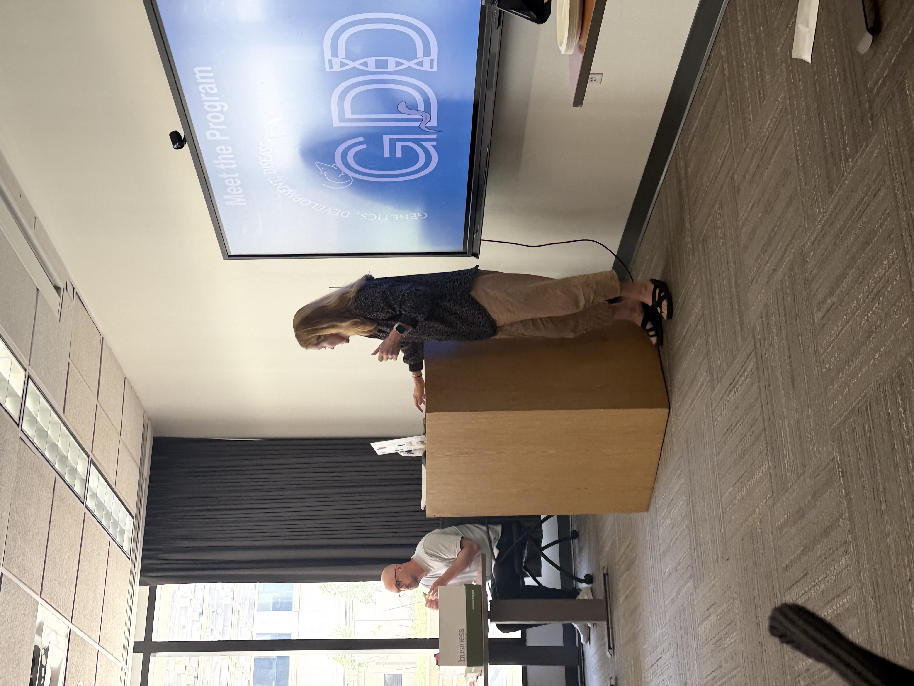
:::

## Day 6 - August 22 (Sat) · Goldee's BBQ and a Stockyards Outing

Today was a genuinely historic day — we finally went to [Goldee's BBQ](https://share.google/h7o4fN8TVbvXW7c6t)! It's ranked #1 (2022) and #3 (2026) in Texas Monthly's famous statewide list, which only updates every four years, and the even crazier part is that it's only open Friday through Sunday, 11am to 3pm. Given the line that builds up starting in the morning, there's a real chance they sell out of food by 1 or 2pm.

To have any shot at this place, my Korean friends and I put our heads together and settled on the extreme plan of leaving at 8am. And after eating, we had the ambitious follow-up plan of catching the longhorn show at the Stockyards.

::: {.photo-row}

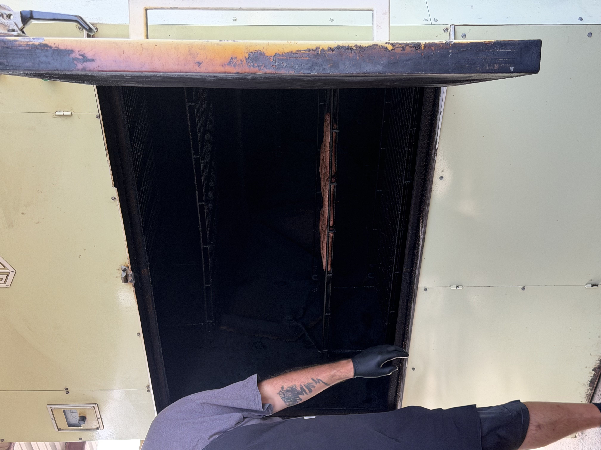

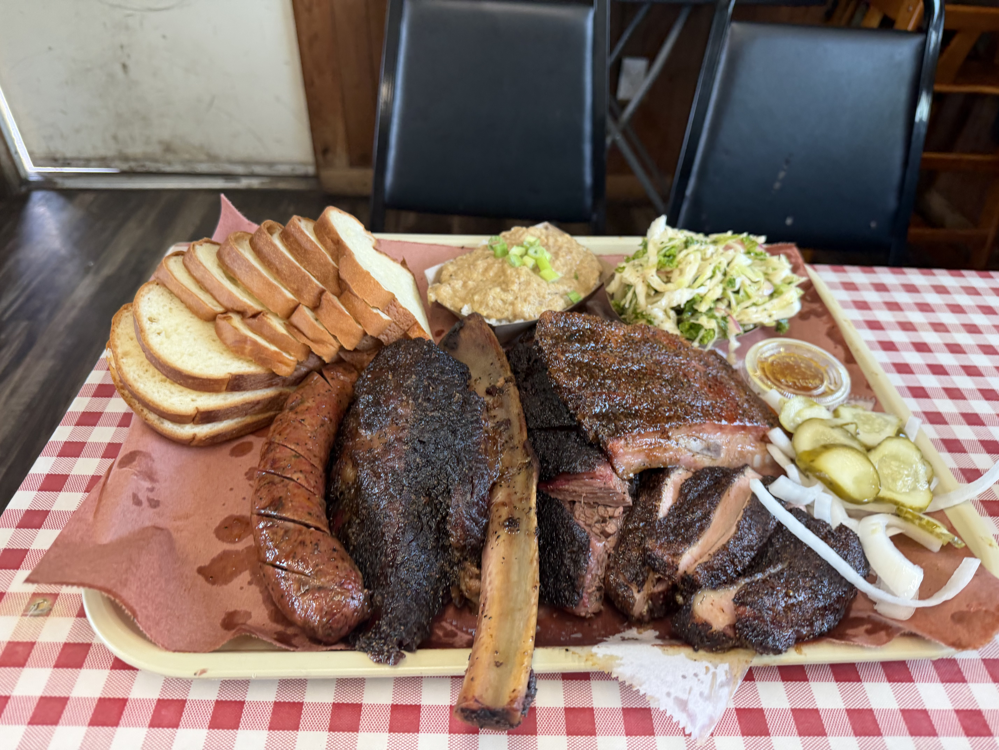

:::

Wow. Terry Black's, the BBQ place I'd been to before, turns out to have been fake BBQ this whole time (sorry, Terry's). The brisket fell apart the second a fork touched it, impossibly tender, with deep smoky flavor running all the way through. This is a place where describing it in words feels almost insulting — you just have to go taste it yourself. I haven't tried every BBQ joint in Texas, but if family or friends ever visit from out of town, this is almost certainly the first place I'd take them. After hitting peak carnivore at the height of extreme meat-eating, we capped it off with an absurdly sweet-and-salty banana pudding for dessert — a genuinely satisfying Texas BBQ experience from start to finish.

...

Next we headed to the Stockyards for the longhorn show. But then came a bolt out of the blue — the afternoon longhorn show had been canceled because of this week's heat wave..! A little disappointed, we settled for watching the resting longhorns from a distance, admired a whole lot of impressive cowboy hats, and headed home.

::: {.photo-row}
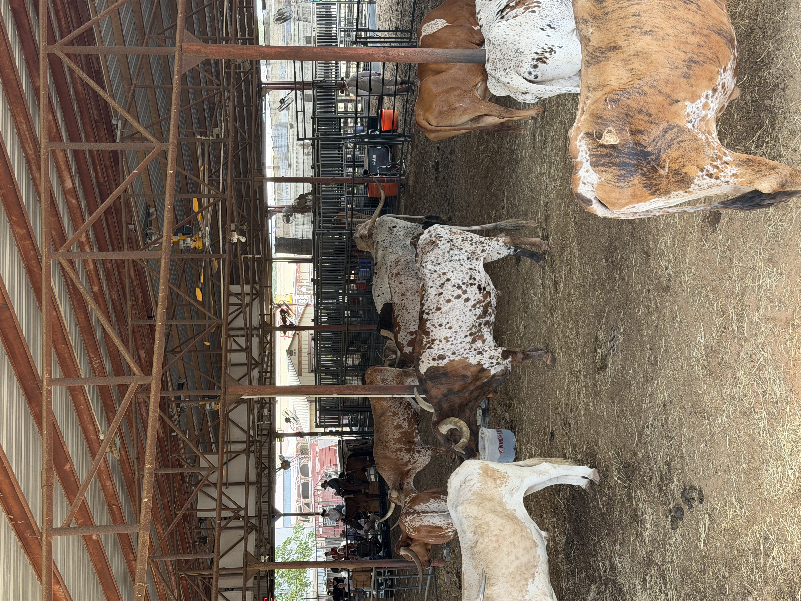

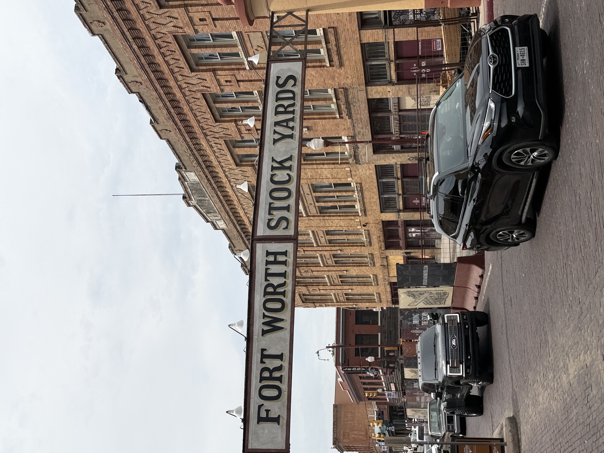
:::

## Day 7 - August 23 (Sun) · The Furniture Assembly That Never Ends

Today the truly, actually, finally last piece of furniture arrived — a shoe rack. I'd been putting off ordering it for a while, worn down from all the furniture assembly, but I finally couldn't delay any longer and ordered this last (please, let it be last) piece. The top surface doubles as a seat, which sold me on it — should make it much easier to sit down and put shoes on and off.

At this point, assembling furniture this size takes me almost no time at all.

::: {.photo-row}

:::

After that, I headed over to the campus gym. I'd always worked out at my apartment's gym, but lately it's been cramped with three or four people crammed into that small space, and the environment just wasn't great anymore. So I figured I'd finally check out the campus gym, which is free to use.

I'd caught a glimpse of it from a distance during orientation and assumed it was just an ordinary gym. Actually going and experiencing it up close was a completely different story. Everything was Hammer Strength, with around 20 machines covering pretty much all the essentials. There were three full racks, and big screens set up in front of the treadmills, which made it look great for cardio too. With facilities like this, I think I could happily spend the next 5-6 years of my PhD working out here — and all for free!

::: {.photo-row}
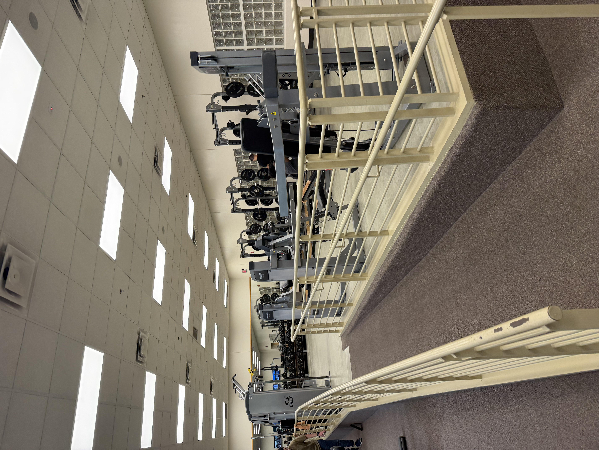

:::

It's already been three weeks since I landed in the US. At the end of my next post, I'm planning to write a short final wrap-up on my first month living here. And I really hope I can throw myself into rotations and land in a lab I'm excited about.
