I took my first graduate school exam, and dove straight into starting experiments without a moment to catch my breath. And of course, to celebrate the exam being over, a good dinner and some drinks were non-negotiable.

## Day 1 — August 31 (Mon) · My First Graduate School Exam

I took my first graduate school exam.

I only realized it had actually happened this past Monday while putting together this week's schedule. Time really doesn't wait for anyone... I suppose that just means each week has been full enough to blur together.

An alum from the lab I'm currently rotating in stopped by to visit. She's doing her postdoc at Harvard's children's hospital, researching a rare genetic infectious disease called 'MIS-C.' She got her PhD under a PI I'm seriously considering joining, so I really wanted the chance to talk with her.

She turned out to be Korean-French, and spoke Korean quite fluently. I got excited that I'd finally get to hear about research explained in Korean for once — but she said explaining things in Korean actually felt more awkward to her, and switched over to English instead... when in Rome, I suppose.

And my lab seat finally got moved somewhere better! I used to sit right by the door, where a constant creaking sound kept breaking my focus, but now I'm tucked into a corner by the window with a 2021 iMac to go with it — my productivity has doubled, maybe more. And my Big Sib gave me a surprise gift to celebrate my first exam being over... you make my day!

::: {.photo-row}
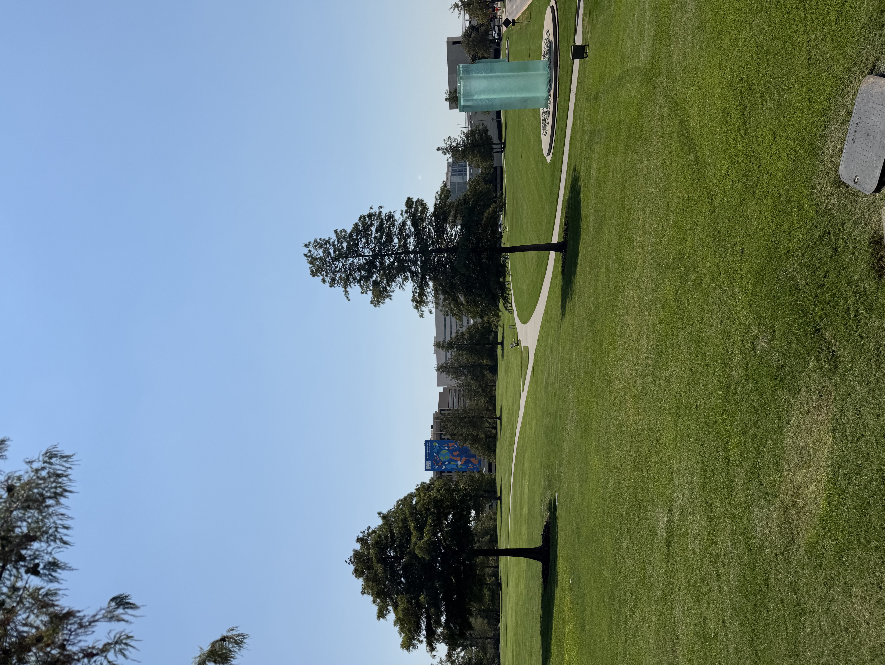

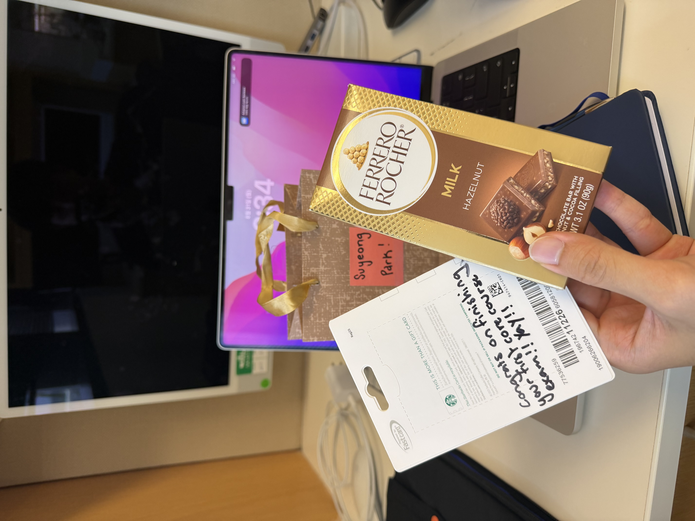

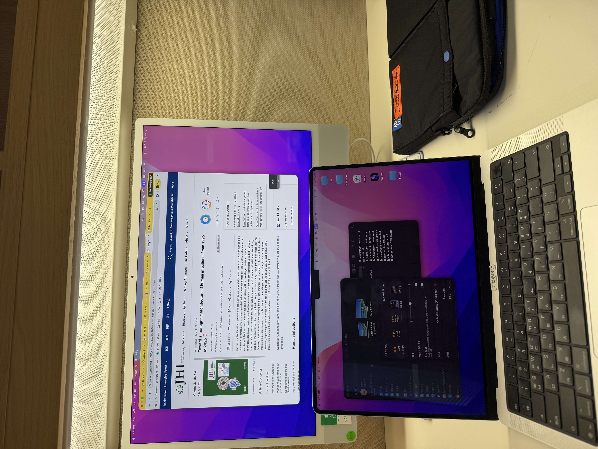
:::

## Day 2 — September 1 (Tue) · Worlds?

I'm slowly starting to make international friends I say hi to around campus. Let me tell you about two of them — Rex and Ryoske. I haven't talked to Rex all that much yet, but he's super chill and always seems to be deep in thought about something. He also happens to share a huge interest of mine — League of Legends — and thanks to him I found out this year's Worlds (the League of Legends World Championship) is being held right here in Dallas! (He already invited me to go with him.)

But of course, this is the land of capitalism — tickets that originally sold for around $100 are now going for $400–500 for the good seats. There are some side seats around $250–300... I might have to think it over. I never once considered going even back in Korea, but somehow the fact that it's happening right here in Dallas makes me want to go. Anyone else know that feeling?

Ryoske is a Japanese friend of mine. He's a bit unusual — he came from a Computer Science background but wanted to get hands-on with real wet-lab experiments, so he ended up in grad school. The research direction he wants to pursue reminded me of Elon Musk's 'Neuralink,' which I thought was really cool. We've gotten pretty close, and now we always sit next to each other in class. We're also planning to hang out with some other Korean friends on Thursday!

::: {.photo-row}

:::

Also, after days of being worn down by footsteps from the upstairs neighbor, I finally ended up writing a note. I feel bad about it, but my precious sleep kept getting interrupted, and on top of adjusting to the lab and speaking English all day, the exhaustion just wasn't going away... I offered to buy them slippers, and they actually got back to me, so I happily ordered a pair.

And... the slippers have been working perfectly ever since :)

## Day 3 — September 2 (Wed) · Getting My SSN

Today the last piece of the paperwork-hell puzzle finally fell into place. Everything I needed to get my Social Security Number (SSN) had finally come together, and after booking this appointment two weeks in advance, I'd been counting down the days to it.

American bureaucracy... you only really understand it once you've lived through it. Coming from Korea, the land of speed, made the frustratingly slow process even harder to stomach. Still, getting my driver's license had built up some tolerance, and once I had my SSN in hand, I'd finally be free from paperwork for a while.

But of course, things didn't go smoothly. On top of the officially required documents, they also asked for the offer letter from our school. Luckily I had brought every document, so I got mine issued without a hitch — but the friends who came with me to the office didn't have that letter on hand. They had to track down a nearby place to print it out before they could finally get theirs issued, and since I had a lab meeting, I had to leave them behind and head out first (sorry, guys). It was a bumpy ride right to the end, but in the end, all of us walked away with our SSNs safely in hand.

::: {.photo-row}

:::

That evening, I went to the apartment gym for a short strength workout. The night air was cool for the first time in a while, and it felt amazing. So after just 20 minutes of lifting, I spontaneously headed outside and started running for another 20 minutes or so. It wasn't exactly the best setup — just looping the same route through a parking lot with cars driving through — but running in genuinely cool Dallas weather for the first time put me in a great mood.

Once the weather cools down more, I want to try to make outdoor running a regular thing.

::: {.photo-row}
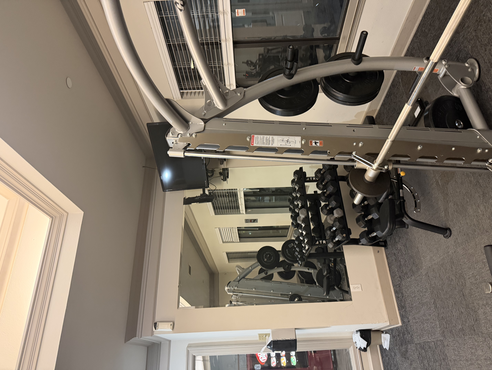

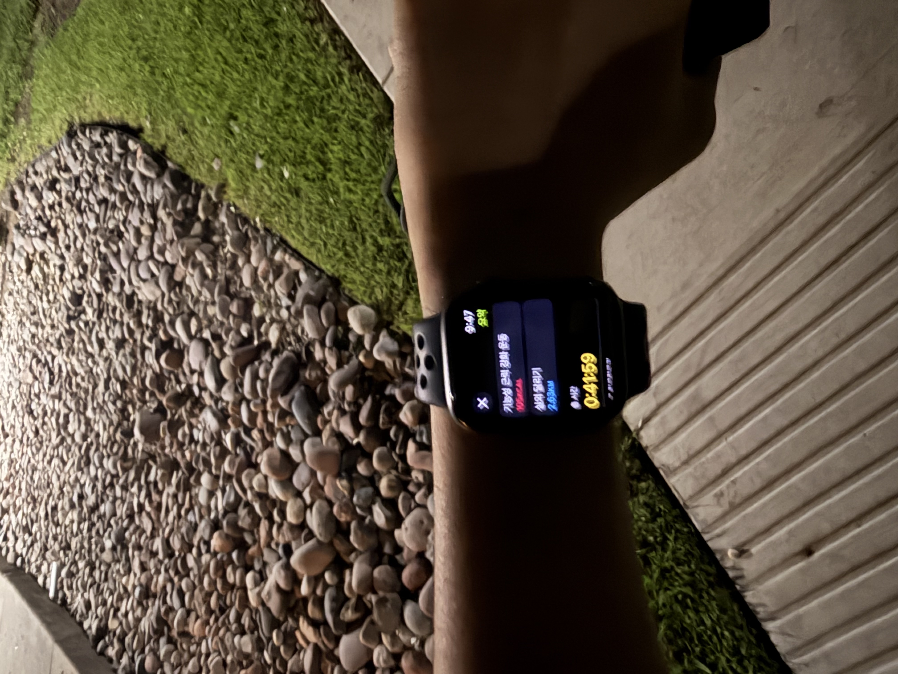
:::

## Day 4 - September 4 (Thu) · Hang Out!

Ryoske, three Korean friends, and I went to a pub right in front of our place. The inside was a bit dark, but there was an outdoor patio attached, so we got to enjoy the cool evening air. The menu wasn't huge, but the quality was great for the price — the beer especially was really good!

I started with a Modelo loaded up with lime, then switched to a pale ale for my second round — a very citrusy American beer.

::: {.photo-row}

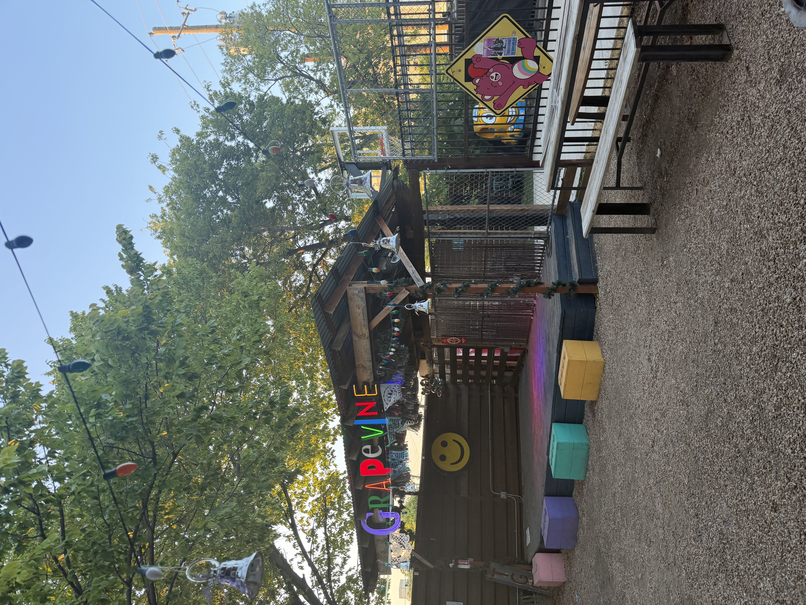

:::

## Day 5 - September 5 (Fri) · A Day Obsessed with Experiments

The lab I was in during my master's almost always worked with mice, but the lab I'm rotating through here mainly studies humans — so instead of mice, we work with everything from actual patient samples to various human cell lines, and sometimes organoids through collaborations with other labs.

Right now I've started culturing T-blast and Jurkat cells, both used to study the characteristics of human T lymphocytes. I've been setting up a cell adhesion assay with them, and today I got the chance to use the NovoCyte — a roughly $10k instrument, about 14 million won. It's a great machine that can run flow cytometry on anything from a 24-well plate up to a 96-well plate in a single run, and it's especially well suited for cell counting, which is one of the goals of our experiment.

So I was running around all morning to make sure we could use the machine at exactly the right time, and in the end, we got results pretty close to what we expected! In the middle of all the chaos, I was so scattered that I ended up leaving the lab still wearing my lab Crocs.

::: {.photo-row}

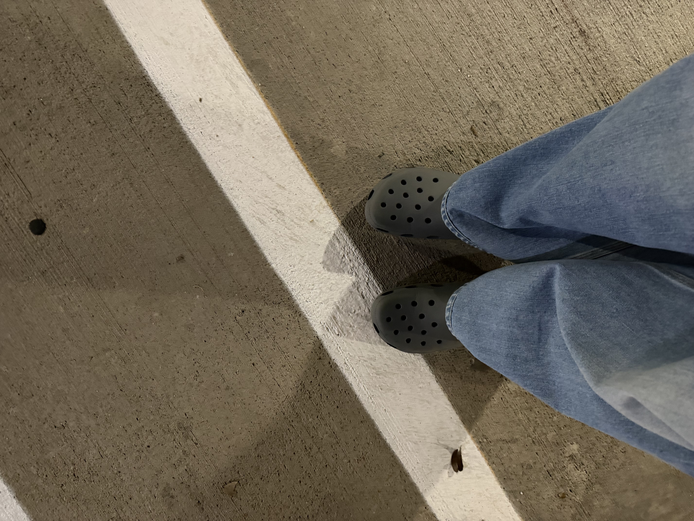
:::

## Day 6 - September 5 (Sat) · Hang Out!!

I had plans to hang out with a new Korean friend that evening. Before that, I made a short run out to catch up on exercise, wash the car, and grab some groceries. The Student Center has a free gym for students, and it's only about a 5-minute drive from home — but somehow it still takes real willpower to actually go. (Maybe I'm just lazy.) Last week when I went on a weekday evening it was almost completely packed and I didn't feel like working out at all, but today, being the weekend, I pretty much had the whole place to myself the entire time. I should start coming on weekends more often.

I gave the car a quick wash (outdoor car washes are second nature to me now), and picked up a ribeye to give steak a try. I barely cooked at all back in Korea, so even a simple steak feels like a big challenge to me. Still, thinking long-term, I figure I should gradually build up my cooking repertoire, so I'm going to keep trying things one at a time.

:::{.photo-row}

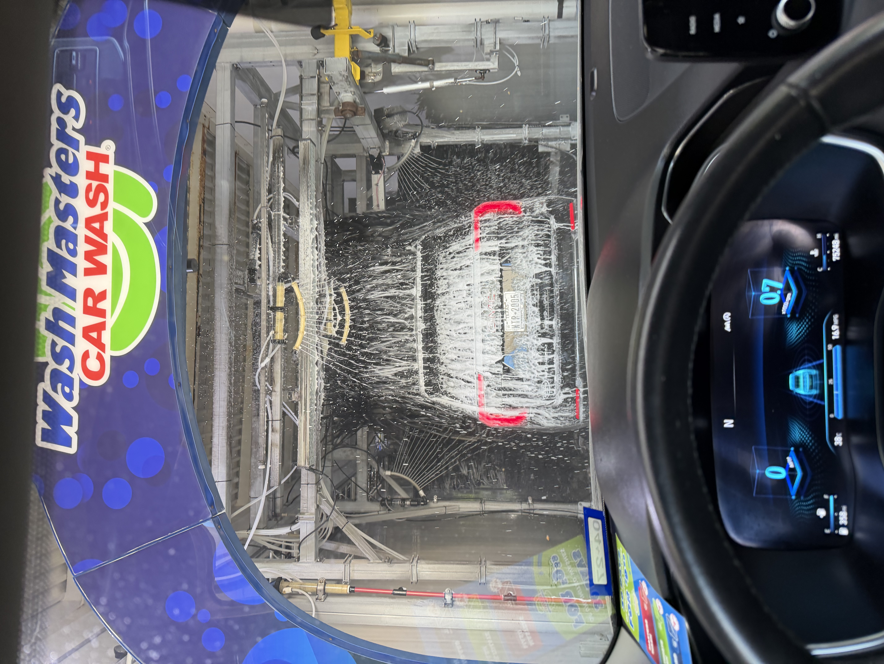

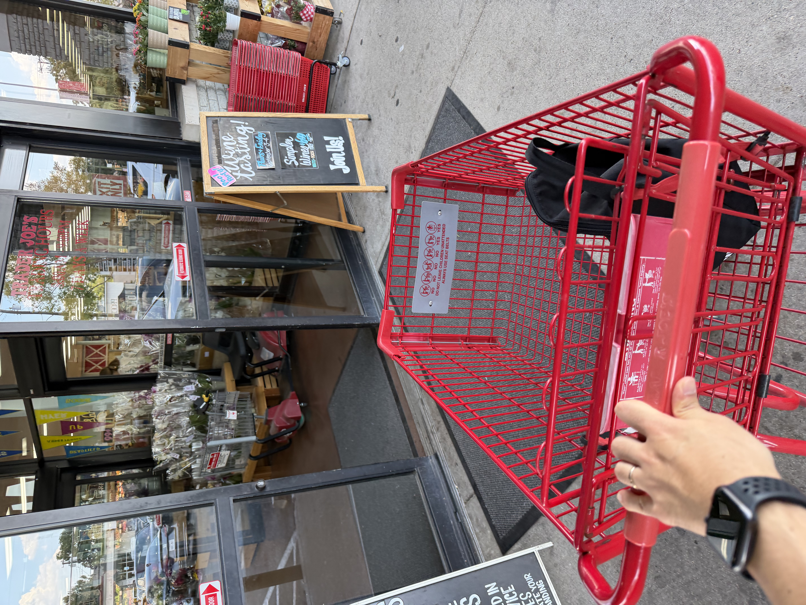

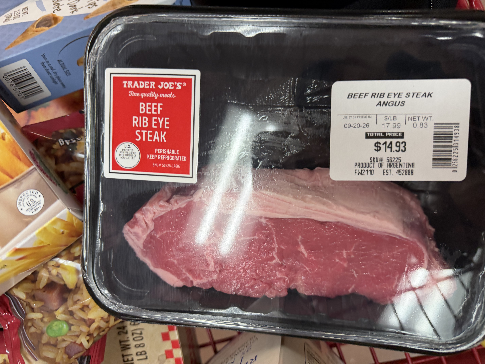
:::

And now, the main event — my second hangout of the week. Today, joined by the two Korean friends I usually hang out with plus one new Korean friend, the four of us had dinner together at a great restaurant. The food was absolutely perfect, but the place was so popular it was nearly full, which made it pretty loud and hard to focus on conversation.

We shared delicious pizza and pasta along with a bunch of sides, and for dessert went to an amazing ice cream place. I picked something like a Peanut Butter flavor and Mango Sticky Rice — both flavors I'd never tried before, and they were genuinely delicious.

::: {.photo-row}
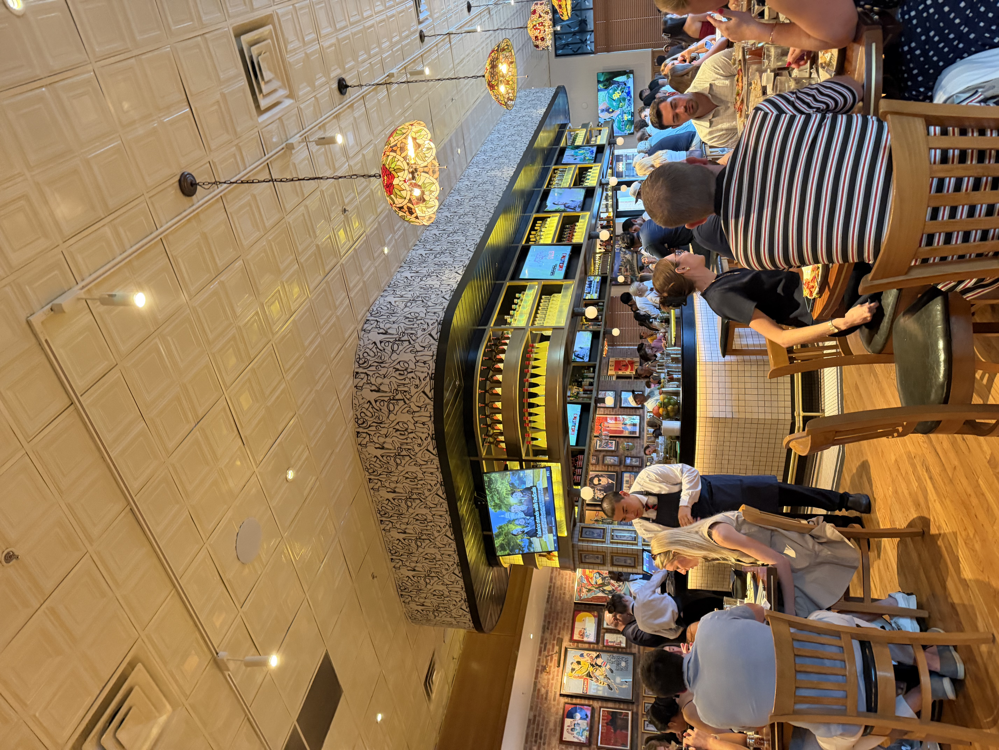

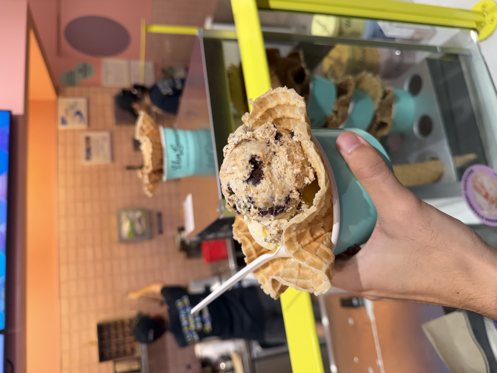
:::

## Day 7 - September 6 (Sun) · The Odyssey, IMAX 70mm

Today I went to the movies by myself. Back in Korea I loved the whole movie-theater atmosphere and used to go pretty regularly, and there was a movie I desperately wanted to see, so while looking into how to watch it, I impulsively booked an IMAX ticket. And not just any IMAX — the 70mm version, which doesn't even screen in Korea! The movie was The Odyssey.

To really soak in the theater atmosphere, I bought popcorn and a drink beforehand and headed out. Except, as it turned out, the theater didn't allow outside food or drinks... So I had no choice but to leave them in the car and buy a fresh popcorn and drink once I got there.

A three-hour movie with no subtitles was rough — okay, really rough. But the cinematography was so beautiful that I genuinely enjoyed it. I'd guess I actually understood maybe a third of what was going on... I clearly overestimated my listening skills. On top of that, IMAX 70mm was popular and the theater was fairly small, so I ended up stuck in the third row from the front — my neck is still stiff. Still, it had been a while since I'd been to a theater, and I had a genuinely great time.

::: {.photo-row}
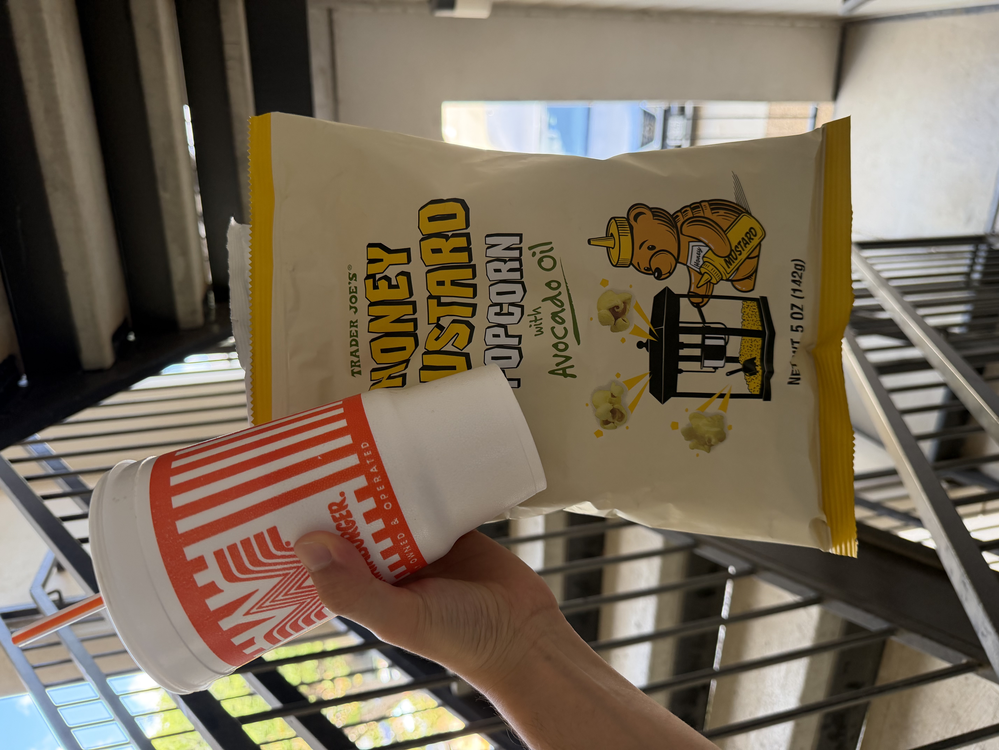

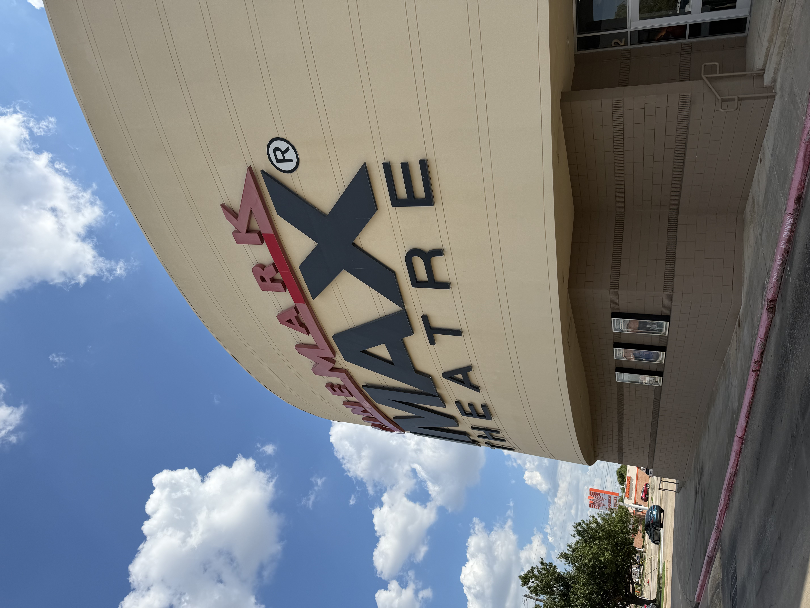

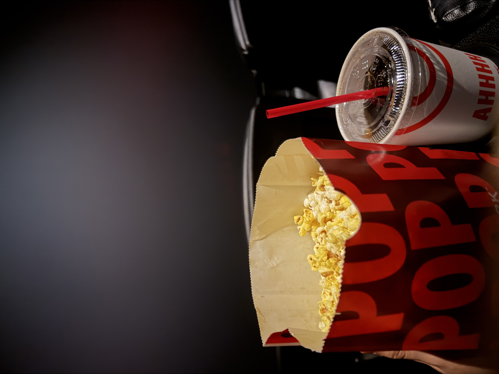
:::

After that, I stopped by H Mart, the Korean grocery store, to pick up more groceries. Lately I've mostly been eating frozen stuff from Trader Joe's, microwaved or air-fried, and I'm starting to get tired of it — plus it doesn't feel especially healthy — so I'm going to try switching my staples over to Korean food.

For starters, I'm planning to begin with ganjang gyeran-bap (rice topped with a soy-sauce fried egg) and kimchi, then work my way up to bulgogi and daepae samgyeopsal (thinly sliced pork belly). I used to think spending time cooking was a bit of a hassle, and cleaning up afterward even more so, but it seems like an unhealthy eating habit nutritionally, so I want to fix it.

If I keep picking up a taste for this one dish at a time, maybe eventually I'll be able to throw together a full, healthy Korean spread without even thinking about it.

:::{.photo-row}

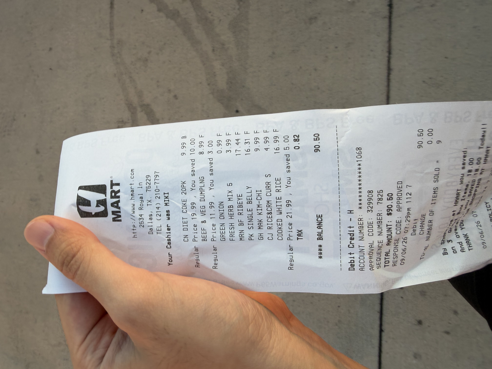
:::

Five weeks into life in the US, and I've even made it through my first exam. Greeting people in the lab has started to feel natural, and with all the paperwork from those first weeks finally settled, I feel a lot lighter.

Everything is hardest the first time you do it. The hard logistical stuff is mostly sorted out now, and I'm slowly building an environment where I can focus more on the actual studying and research.

In the middle of all this, I'd declared last week that I'd start exercising to take better care of myself — but honestly, I didn't really follow through. I aimed for three times a week but only managed two, on Wednesday and Saturday, and now that the exam's over, "I was too busy" is really just an excuse. Next week I need to actually stick to working out three times a week.

And next week I'm planning to try cooking steak, bulgogi, and daepae samgyeopsal for dinner, one at a time. It's a little hard to put real effort into dinner after coming home from the lab, but I figure I just have to keep trying things, one by one, for my own sake. I want to build healthier habits by thinking longer-term about all this.

With that in mind, next week I'm planning to do both an exercise check-in and a review of my eating habits.
