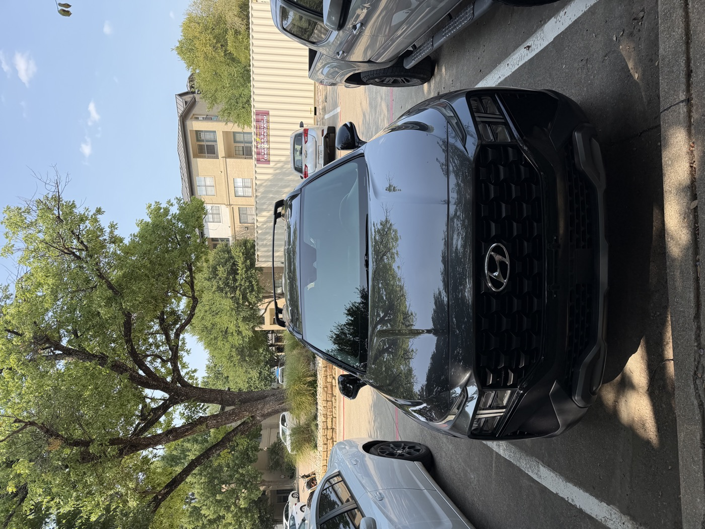
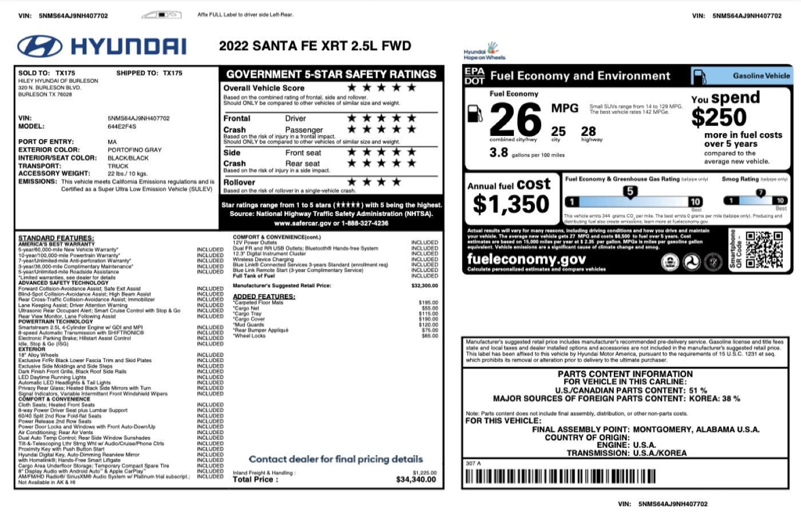
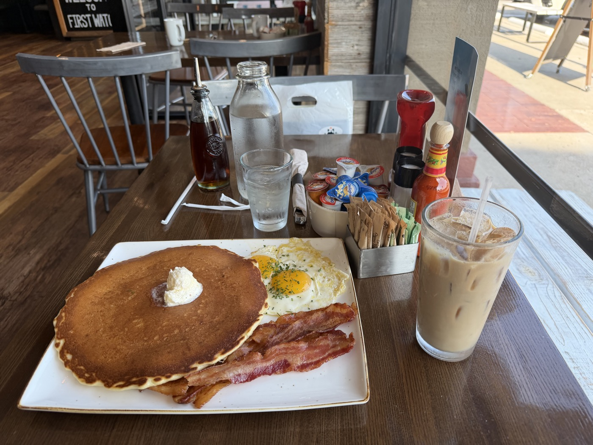
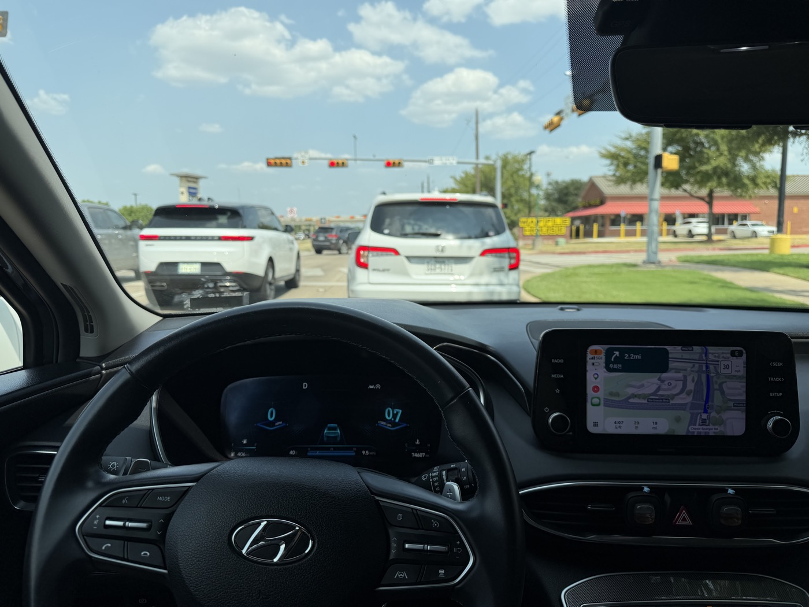

In my last post ([Getting Ready to Buy My First Car in the US](us-car.html)), I wrote up how I prepared before arriving, assuming I'd be buying from a dealer. What actually happened was different — I ended up buying a 2022 Hyundai Santa Fe XRT through a **private-party** sale instead. I saw the listing in a Korean community group, the car looked like it was in good shape, and I decided to handle the whole thing myself. This post walks through what that process actually looked like, step by step.

---

## How I judged the price

The most confusing part of a private-party deal was figuring out "what's a fair price here." I learned pretty quickly that you can't judge it off a single number.

| Source | For this car | What it means |
| ------------------- | --------- | --------------------------------------- |
| CARFAX Retail Value | ~$19,000 | Reference price for the retail market — not the same as a private-party price |
| CarMax buy offer | ~$15,000 | What a dealer would actually pay to buy it — normally lower than retail |
| What I actually paid | $20,200 | A private-party price shaped by the car's condition, service history, and the seller's own situation |

These three numbers represent different things, so you can't just compare them directly. Paying more than the Carfax value doesn't automatically mean I got ripped off — so instead I weighed these five things together:

1. Actual asking prices for similar year/trim/mileage listings
2. Value guides like CARFAX/KBB
3. Dealer buy offers (CarMax offer)
4. Accident, ownership, and title history
5. Recent maintenance and the condition of wear items

In the end, it wasn't so much "I got a deal" as "I paid a bit more, but for a car with solid condition and a documented service history."

For reference, I checked the original window sticker (Monroney Label) from when the car was new — MSRP was $32,300, and with dealer-installed options (floor mats, cargo net, cargo tray, cargo cover, mud guards, bumper appliqué, wheel locks) the total came to $34,340. After a little over three years and 74k miles, it had depreciated by almost half.

---

## The overall process

| Step | What happened | Cost |
|------|------|------|
| 1 | Pulled a Carfax report | $40 |
| 2 | PPI (pre-purchase inspection) | $150 |
| 3 | Test drive | - |
| 4 | Payment and Bill of Sale | $20,200 |
| 5 | Received the signed title transfer | - |
| 6 | Got insurance (Progressive) | - |
| 7 | Applied for a Transit Permit | - |
| 8 | Visited the Tax Office to register | 6.25% of the vehicle's value |

The total vehicle price was $20,200 ($500 deposit + $19,700 balance).

---

## Step 1. Pulling the Carfax report

I bought a Carfax report for **$40** to check the accident history and ownership history. Here's what I looked for:

- **Accident/damage** — accident or damage records, structural damage, whether the airbags had deployed
- **Title** — any salvage, rebuilt, flood, or other title issues
- **Odometer** — rollback or inconsistencies in mileage
- **Ownership** — number of owners and how long each held it
- **Service history** — actual maintenance records for oil, tires, brakes, filters, etc.
- **Open recall** — any unresolved recalls
- **Location** — possible exposure to flooding, road salt, or other environmental factors

This car came back clean: no accidents, no structural damage, airbags never deployed, no mileage discrepancies, clean title, two private owners, and several real service records on file — all of which I took as a good sign.

Before heading out for the PPI, I grabbed a quick breakfast, and when I looked at the receipt while paying, I had to pause for a second. I'd ordered just a coffee and a couple of items, and it came to almost **$30**. It was one of those moments where the cost of eating out really hit me.

::: {.photo-row}

:::

## Step 2. PPI (Pre-Purchase Inspection)

A seller saying "it's in great shape" and a mechanic actually confirming that are two different things. The standard practice is to have an independent shop with no ties to the seller do the inspection, at the buyer's expense. It cost **$150**, and at 74,532 miles, they checked the following:

| Item | What was checked |
| ------ | ----------------------------------- |
| OBD/scan | Current and past fault codes, warning lights |
| Engine | Fluid leaks, coolant leaks, unusual noises, oil condition |
| Transmission | Fluid leaks, shift shock/unusual noises, road test |
| Brakes | Pad and rotor condition |
| Tires | Tread depth, uneven wear, DOT date code |
| Suspension | Shocks/struts, bushings, ball joints |
| Undercarriage | Leaks, corrosion, signs of accident damage |
| Body | Signs of panel replacement/repaint, frame damage |
| Basic electrical | AC, lights, windows, locks, battery |

The lift inspection, leak check, suspension, tires, brakes, and system scan all came back GOOD.

::: {.callout-tip}
Even if the PPI report just says "GOOD," it's worth asking for the actual **measured numbers** where possible — tire tread depth, brake pad thickness, and so on — and cross-checking recent maintenance against receipts. "GOOD" is a snapshot of the car's current condition, not a guarantee for the next however-many thousand miles.
:::

## Step 3. Test drive

Separately from the PPI, I drove it myself and checked the following:

| Situation | What to check |
| ----- | ------------------------- |
| Cold start | Unusual vibration, noise, or warning lights right after starting |
| Low speed | Brake feel, steering pull, shift shock at low speed |
| Acceleration | Engine power, shift quality, unusual noises |
| High speed | Vibration, steering wheel shake, wheel bearing noise |
| Hard braking | Brake shudder, metallic noise, pulling to one side |
| Parking | Shock when shifting between forward/reverse, signs of fluid leaks |

## Step 4. Payment and the Bill of Sale

I put down a **$500** deposit first to hold the car. After that, I paid the remaining **$19,700** of the $20,200 total as a cashier's check — in private-party deals, sellers are often uncomfortable accepting a stack of cash, so a cashier's check is the standard way to pay. After payment, the seller and I met at a nearby coffee shop and filled out a **Bill of Sale** together. It's a simple document with the transaction amount, vehicle information, and both signatures — it's easiest to just print a standard template from the internet ahead of time instead of drafting something formal from scratch.

## Step 5. Receiving the signed title transfer

After the Bill of Sale was done, I received the **Title**. The seller had already filled in and signed the seller section on the back of the title.

::: {.callout-warning}
If the seller section on the back of the title isn't filled out properly, the Tax Office can refuse to register the car later. It's worth checking on the spot that everything is filled in completely.
:::

## Step 6. Getting insurance

Before applying for a Transit Permit, you need insurance in your own name to legally drive the car. I got quotes from three insurers and went with **Progressive**, which came out cheapest.

## Step 7. Applying for a Transit Permit

Since I still needed to drive the car around without plates, I applied for a **Transit Permit**. It lets you legally drive without plates for **5 days**.

Around this time, the seller took back the existing plates (front and rear), which belong to them, along with the inspection sticker on the windshield. That was the first time I learned that license plates in Texas belong to the owner, not the car.

## Step 8. Visiting the Tax Office — registration and paying the tax

After that, I went to the Tax Office by myself to finish registration. I brought three things:

- A way to pay **6.25%** of the vehicle's value in tax
- The **Title** from the seller
- My **Passport**, for ID

::: {.callout-note}
I paid the tax in all cash. **Apple Pay didn't work** — it's safer to bring cash or a card.
:::

Once the process was done, I got a Texas license plate and inspection sticker on the spot, and finally a **registration receipt**, and with that, registration was complete.

The odometer read 74,607 miles — not far off from the 74,532 miles at the PPI — by the time the car officially became mine.

::: {.photo-row}

:::

---

## Post-purchase checklist

Once registration was done, I put together this checklist:

- [ ] Confirm insurance is active and I have the documents needed to drive
- [ ] Keep the Title / registration / Form 130-U and other transaction documents
- [ ] Keep the maintenance receipts, CARFAX, and PPI report I got from the seller
- [ ] Record the current mileage and the mileage at the last oil change
- [ ] Record tire DOT codes and tread depth
- [ ] Record brake pad/rotor condition
- [ ] Put upcoming maintenance on a calendar by mileage

---

## Timeline, summarized

| Order | What happened |
|------|------|
| 1 | Carfax ($40) → PPI ($150) |
| 2 | Test drive |
| 3 | Paid $500 deposit + $19,700 balance (cashier's check), wrote up the Bill of Sale at a coffee shop |
| 4 | Received the signed title transfer |
| 5 | Compared quotes from 3 insurers, went with Progressive |
| 6 | Applied for a Transit Permit (5 days without plates), seller took back the old plates and inspection sticker |
| 7 | Visited the Tax Office — paid the 6.25% tax, submitted Title and Passport |
| 8 | Received the Texas plates, inspection sticker, and registration receipt |

---

## Wrapping up

The process felt simpler than going through a dealer, but there was a lot more I had to verify myself. Validating the car's condition through the PPI and Carfax, and checking the title's transfer section on the spot, mattered especially. From payment to registration, the whole thing wrapped up within a day or two, and overall it came out cheaper than going through a dealer would have.

*Tax and paperwork requirements can vary a bit by county, so it's worth double-checking what your local Tax Office requires before you go.*

---

## My maintenance and ownership plan going forward

As of purchase (roughly 75,000 miles, 2.5L GDI, FWD), I put together the following maintenance plan. All four tires and the brake pads were replaced at 53,146 miles, and the service records show an oil change around 69k miles (around March 2026), so there's no need to change the oil right away.

| Mileage | Maintenance |
|------|------|
| 75–76k | Oil + filter |
| 82–91k | Oil + filter every oil-change interval (5,000–6,000 mi), tire rotation, brake/tire check |
| **96k** | ★ Spark plug replacement + oil/filter |
| **100k** | ★ Full inspection — this mileage alone isn't a reason to sell |
| 104–140k | Rotation every oil-change interval, repeated brake/suspension/undercarriage checks |
| **120k** | ★ Coolant flush + full inspection |
| **144–150k** | ★ Oil + full check of engine/transmission/cooling system/undercarriage/brakes/tires/battery/AC |

From 75k to 150k, I'm budgeting roughly **$3,000–5,250** for normal maintenance, and conservatively **$4,500–7,500** once I add a buffer for unexpected repairs.

Separately from the maintenance plan, I also decided ahead of time roughly "how long I plan to keep this car." I compared three points: 2 years (2028, ~95k), 6 years (2032, ~150k), and 10 years (2036, ~200k).

| Ownership length | Sell around | Mileage | Key idea |
|------|------|------|------|
| 2 years | 2028 | 95k | Sell early to minimize depreciation |
| 6 years | 2032 | 150k | Balance between economics and repair risk |
| 10 years | 2036 | 200k | Get as much use out of the car as possible |

I decided the criteria not by mileage, but by **type of cost**. I'm excluding **routine maintenance** — oil, filters, tire rotations, spark plugs, coolant, normal tire/brake replacement — from the sell/keep decision entirely. Instead, I'm only weighing **unexpected repairs** — engine, transmission, AC compressor, major electrical problems, wheel bearings, CV axles, or big suspension/cooling-system repairs.

- Under $3,000 in cumulative unexpected repairs → just keep driving it
- $3,000–5,000 → generally keep driving it
- $5,000–7,000 → weigh the car's condition against future costs
- $7,000+, or a major repair at the engine/transmission level → seriously consider selling

I concluded that hitting 100,000 miles isn't, by itself, a reason to sell a car still worth over $15,000. So I've set **6 years/150k as my first checkpoint**, and at that point I'll look at how much I've spent on unexpected repairs and decide whether to push on to 200k or sell. I'm keeping 2 years/95k as a safe exit if I ever want to trade up sooner, and 10 years/200k as the plan if the car keeps holding up well and I decide to run it all the way out.
