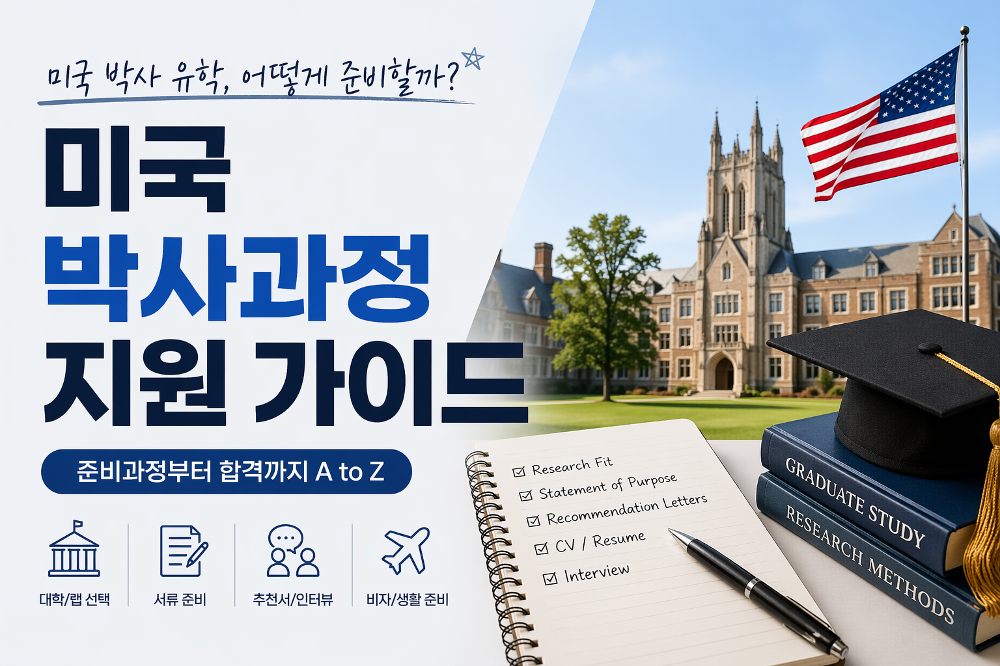

Applying to a US PhD program isn't just about assembling a stack of documents. It's a process of convincing an admissions committee why you want to do research, why this particular school, and what kind of researcher you'll become. I applied in immunology and genetics, and I was ultimately admitted to the PhD program at UTSW (UT Southwestern Medical Center). Here's everything I learned along the way, as concretely as I can put it.

---

## Application Document Requirements by School

Requirements vary somewhat from school to school.

| Document    | A School | B School | C School            | D School       | E School |
| ----------- | -------- | -------- | -------------------- | -------------- | -------- |
| SOP         | ✅        | ✅        | ✅                     | ✅              | ✅        |
| PS          | ⚪        | ✅        | ⚪                     | ✅              | ⚪        |
| LOR (3)     | ✅        | ✅ (4–5)  | ✅                     | ✅              | ✅        |
| Transcript  | ✅        | ✅        | ✅ (sent directly via WES) | ✅          | ✅        |
| TOEFL/IELTS | ✅        | ✅        | ✅                     | ✅              | ✅        |
| CV          | ✅        | ✅        | ✅                     | ✅ (GPA removed) | ✅        |
| GRE         | ❌        | ❌        | ❌                     | ❌              | ❌        |

Most of this follows general guidelines; the special cases I ran into for each item across the 22 schools I applied to will be covered in their own sections below.

Briefly, here's what stood out:

1. Some schools allowed up to 4–5 letters of recommendation.
2. Some schools required an official transcript sent through a credential evaluation agency.
3. Some schools asked me to remove the GPA listed on my CV.

> The GRE has been dropped by most STEM PhD programs since 2023. Always check the latest program guidelines before applying.

---

## Overall Timeline

The application season starts earlier than you'd think. Most program deadlines cluster around **mid-November** at the earliest and **early December** for the typical case, so you need to be seriously underway by **March at the latest**.

| Timing        | What to do                                                    |
| ------------- | -------------------------------------------------------------- |
| March–June    | Take the TOEFL/IELTS                                            |
| June–July     | Finalize the list of schools/programs; identify PIs of interest |
| July–August   | Start drafting the SOP; reach out to recommenders                |
| September–October | Revise the SOP/PS repeatedly                                 |
| October–November | Customize essays per school; final submission                 |
| December–January | Wait for interview invitations                                |
| January–February | Interviews (usually over Zoom for international applicants)   |
| March–April   | Admission decisions arrive; decide by the April 15 deadline      |

---

## Statement of Purpose (SOP)

The SOP is the single most important document in the application. It's usually 1–2 pages (roughly 600–1,000 words), and it boils down to one core message: **"This is who I am as a researcher, and this is the research I want to do at this school."**

### Structure

I wrote mine with the following structure.

1. **Hook** — What got you interested in research. Avoid vague openers like "I've loved science since I was a kid." Start with a concrete experiment, paper, or pivotal moment instead.

2. **Summary of research experience** — Describe the research you did during undergrad and your master's. Don't just list it out — focus on *what you learned and what questions it left you with*. Your thought process matters far more than a list of technical skills.

3. **Research interests** — State specifically what you want to explore during your PhD. Too narrow and you look inflexible; too broad and you look like you haven't thought it through. Something like "I want to understand [mechanism] within [field]" is about the right level.

4. **Why this program** — Name 2–3 PIs you're specifically interested in. Don't just drop their names — explain which of their papers caught your attention and how that work connects to your own interests.

5. **Closing** — End with your long-term goals (academia, industry, etc.) and how this program contributes to them.

### Customizing per School

It's fine for 70–80% of your SOP to be shared across schools, but the parts mentioning specific PIs and the program's distinctive features (rotation system, particular core facilities, etc.) need to be customized for every single school.

::: {.callout-warning}
Submitting an SOP with another school's name still in it happens more often than you'd think. Always cross-check before you submit.
:::

---

## Personal Statement (PS)

Not every school requires a PS. When they do, it's sometimes submitted separately from the SOP and sometimes folded into it. The PS exists to cover the **personal background and context** that the SOP doesn't get into.

| | SOP | PS |
|--|-----|-----|
| Focus | Research experience and goals | Personal background and diversity |
| Tone | Academic, analytical | Personal, narrative |
| Required? | Required by almost every school | Varies by school |

Things you can write about here:

- Personal motivations for pursuing research (family history, personal experience, etc.)
- Hardships or adversity that affected your studies
- What perspective your education in Korea gives you
- Experiences contributing to community or diversity

::: {.callout-tip}
The PS shouldn't turn into a sentimental personal essay. Everything in it should still tie back to **why you'll be a good researcher**.
:::

---

## Letters of Recommendation (LOR)

Most programs require **three** letters. Since you can't write your own recommendation, who you ask is everything.

### Choosing Recommenders

A good letter is **specific**. "This student worked hard" means nothing. Your recommender needs to be someone who personally witnessed your research ability, how you think, and how you solve problems.

- A **PI or advisor you actually did research with** is best.
- Someone you worked with in the lab beats a professor whose class you merely took.
- A specific, detailed letter from a professor who knows you well is far more powerful than a generic, formal letter from a famous name.

### The Request Process

| Timing                    | What to do                                                      |
| -------------------------- | ----------------------------------------------------------------- |
| 2 months before deadline   | Send a formal request email to recommenders                        |
| At the time of request     | Include your CV, SOP draft, list of schools, and deadlines           |
| 2 weeks before deadline    | Send a reminder email                                              |
| After the deadline         | Send a thank-you email                                             |

::: {.callout-note}
If you let your recommender know what you'd like them to emphasize (a specific project, your problem-solving ability, etc.), you'll get a more specific letter back.
:::

::: {.callout-tip}
Some schools allow up to 4–5 letters of recommendation. When that's an option, though, think carefully about whether the extra letter is actually strong enough to move the needle on your admission.
:::

---

## Transcripts

- **Unofficial transcript**: uploaded at the time of application (scan or PDF)
- **Official transcript**: sent directly to the school after admission (sealed envelope with the school's official stamp)
- If you don't have an English transcript, you'll need a certified translation

At the application stage, an unofficial transcript usually suffices. For schools whose grading scale doesn't convert cleanly to a 4.0 scale, though, you may need a credential evaluation agency like WES to do the conversion.

::: {.callout-tip}
Some schools require a certified credential evaluation service like WES (World Education Services). I used the [WES iCAP](https://www.wes.org/resource-library/blog/credential-advice/wes-international-credential-advantage-package/) service around September for this, and the physical documents arrived by mail in late October. Once issued, the unofficial PDF is available to access freely.
:::


---

## TOEFL / English Proficiency

Most programs require an iBT score of **80–100 or above**. With a TOEFL score above 100, I was eligible to apply to nearly every program I considered.
As of January 2026, TOEFL has been revised and is now scored in a band format similar to IELTS —
a 100 on the old scale converts to roughly a 5.0–5.5 on the new one.

| | TOEFL iBT | IELTS Academic |
|--|-----------|----------------|
| Format | Computer-based | Paper or computer |
| Scoring | 0–120 points | 0–9.0 bands |
| Typical minimum | 80–100 | 6.5–7.0 |
| Preferred by US STEM programs | ✅ more common | ⚪ |


TOEFL runs a **MyBest Scores** program that lets you submit your highest section scores across all attempts from the past two years. That said, in my experience, no school besides Stanford actually accepted it.

```{=html}
<a href="/posts/en/toefl-prep.html" class="post-link-card">
  
  <div class="post-link-card-body">
    <div class="post-link-card-category">PhD in US</div>
    <div class="post-link-card-title">TOEFL Prep Strategy — Self-Study for Reading/Listening, a Class for Speaking/Writing</div>
  </div>
</a>
```

---

## CV (Curriculum Vitae)

A US academic CV is different from a Korean résumé — no photo, age, or gender.
It's usually about 2 pages.

### Essential Sections

- **Education** — school, major, GPA, graduation year
- **Research Experience** — lab name, advisor, research description (2–3 bullet points)
- **Publications / Presentations** — papers, conference posters, oral talks
- **Awards & Fellowships**
- **Skills** — lab techniques, programming languages, etc.
- **Teaching / Mentoring** (if applicable)

### How to Describe Research Experience

Don't just list what you did — use bullet points to describe your specific contributions.

❌ **Bad example**: Worked in immunology lab

✅ **Good example**: Performed scRNA-seq analysis on 12 human thymic samples using Seurat, identifying 8 distinct T cell developmental trajectories

```{=html}
<a href="/posts/en/cv-preparation.html" class="post-link-card">
  
  <div class="post-link-card-body">
    <div class="post-link-card-category">PhD in US</div>
    <div class="post-link-card-title">How to Write a CV for US PhD Applications — Bottom-Up vs. Top-Down</div>
  </div>
</a>
```


---

## Contacting PIs — Should You?

It depends on the program.

- **Rotation systems** (UTSW, Harvard BBS, etc.): You choose your advisor after rotating through several labs post-admission. Contacting a PI before applying isn't required, but it helps to confirm in advance whether a PI you're interested in is even planning to take students.
- **Direct PI-assignment systems**: If you're applying to work under a specific PI, contacting them beforehand is effectively mandatory. The typical flow is to email first, have a video call, secure an "informal acceptance," and then submit the formal application.

A contact email should be short and specific. Read the PI's recent papers and include a concrete question or point of interest. An email that opens with "I am very interested in your lab" won't get read.

---

## Final Checklist Before Submitting

- [ ] Does the SOP still mention another school's name anywhere?
- [ ] Have all recommenders submitted their letters? (check the portal)
- [ ] Is the English transcript accurate?
- [ ] Have TOEFL/IELTS scores been reported? (double-check the school code)
- [ ] Is the CV up to date in both dates and content?
- [ ] Does every item show "Submitted" status in the application portal?

---

## Closing Thoughts

The single most important thing in preparing a PhD application is **starting early**. An SOP gets better through writing it, and rewriting it, and rewriting it again. Don't try to finish it in one pass — it's far more efficient to get a draft out quickly and cycle through feedback.

Letters of recommendation especially are out of your control, which is exactly why it matters to ask early and leave plenty of buffer. In a future post, I'll go into more detail on interview prep and my Visit Weekend experience.
