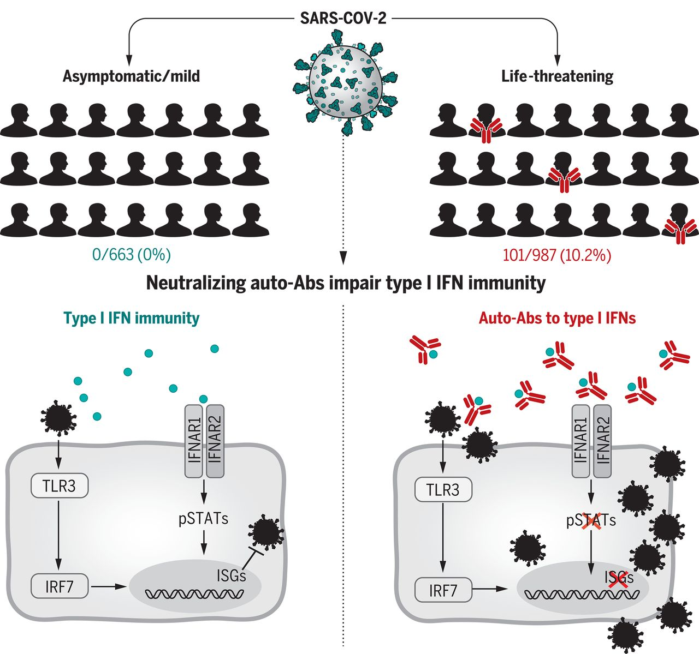

In early 2020, the world was stuck on one unsolved puzzle about COVID-19.

People exposed to the exact same virus, SARS-CoV-2, were ending up with wildly different outcomes. Why?

Some never even realized they'd been infected. Some had something like a mild cold and recovered. And some fought for their lives on a ventilator in the ICU. Age and preexisting conditions explained part of it, but not nearly all of it.

In September 2020, a paper published in *Science* handed us an important piece of that puzzle.

---

## Interferon: the body's first weapon against an invading virus

When a virus breaks into a cell, the cell immediately sounds an alarm. The most important of those alarm signals is **interferon**.

Interferon is a protein that tells neighboring cells, "the virus is here, get into defense mode." Cells that receive this signal switch on a whole battery of genes that suppress viral replication, buying time for immune cells to arrive at the scene.

There are several types of interferon, but the one that matters most in the early stages of a viral infection is **type I interferon (type I IFN)** — IFN-α and IFN-ω belong to this family.

Multiple research teams studying severe COVID-19 patients independently noticed the same thing: type I interferon levels in these patients' blood were extremely low, or undetectable altogether. The virus was replicating explosively, and the body simply wasn't mounting a proper early defense.

So why wasn't interferon working?

---

## Autoantibodies: destroying your own weapons

An international research team that included Paul Bastard formed a striking hypothesis.

*What if these patients' bodies were attacking their own interferon?*

Antibodies are normally weapons aimed at outside invaders — viruses, bacteria. But occasionally, an antibody mistakes a protein that belongs to the body itself for an enemy and attacks it. This is called an **autoantibody**, and autoantibodies are the core mechanism behind autoimmune diseases like rheumatoid arthritis and lupus.

The team analyzed blood from 987 patients hospitalized with severe COVID-19, 663 people with mild or asymptomatic infections, and 1,227 healthy controls. What they found was striking.

**In 10.2% of the severe patients — 101 people — they found neutralizing autoantibodies against IFN-α and/or IFN-ω.**

Not a single person in the mild-infection group had them. Among healthy controls, only 0.33% (4 people) tested positive.

And these autoantibodies didn't just bind to interferon and sit there. When tested in the lab, they neutralized **all 13** subtypes of IFN-α. They blocked interferon's ability to signal to cells at all, completely wiping out interferon's capacity to hold off SARS-CoV-2 infection.

---

## The most surprising finding: they were there before infection

This raises an obvious question: did these autoantibodies appear because of COVID-19, or were they already there beforehand?

The team was able to check blood samples drawn from some patients before their infection. The autoantibodies were already present in that pre-infection blood.

In other words, **these autoantibodies existed in the body independent of SARS-CoV-2 infection.** They weren't produced in response to the coronavirus — they had been lying dormant for a long time, and when the coronavirus arrived, that preexisting defect turned lethal.

These people had probably lived their whole lives without any obvious problem. Even with interferon neutralized, that defect doesn't show itself under ordinary circumstances. But when a virus like SARS-CoV-2 — one where the early interferon response is absolutely critical — got in, that defect became the vulnerability that decided who lived and who died.

---

## Why did this show up so much more in men?

Of the 101 people carrying these autoantibodies, **95 — 94% — were men**.

This sex bias is unlikely to be a coincidence. The research team proposed an X-chromosome-linked genetic predisposition as a plausible explanation. Women carry two X chromosomes, so a defect on one can often be compensated for by the other. Men have only one X chromosome, so a mutation in a gene that regulates immune tolerance may leave them more exposed.

Sure enough, follow-up studies have reported evidence linking mutations in X-linked immune genes such as *FOXP3* and *IKBKG* to the formation of these autoantibodies.

---

## What this finding means

What makes this study significant is that it traced one cause of severe COVID-19 not to the virus's own virulence, but to **a defect in the immune system that predated infection entirely**.

There are a few important implications.

First, **the possibility of screening**. If people carrying these autoantibodies could be identified ahead of time, we could design strategies around prophylactic treatment or priority vaccination for them.

Second, **directions for treatment**. Options worth considering include plasma exchange to reduce autoantibody levels, therapies that eliminate the plasma cells producing the autoantibodies, or administering IFN-β instead of IFN-α, since IFN-β isn't affected by these particular autoantibodies.

Third, **a bigger question**. This isn't just a COVID story. Similar autoantibodies have turned up in a subset of patients with other viral infections too, including influenza and West Nile virus. Autoantibodies targeting interferon may be far more common than we'd assumed.

---

## The question immunogenetics keeps asking

What captivates me about this study isn't just that it's interesting.

It approached the question "why does one person die from the same virus that another survives" through the lens of genetic background interacting with the immune system. And it showed that the answer can lie in a specific vulnerability created by a person's genes and immune system — one that existed long before infection ever began.

This is exactly why I study immunogenetics.

Before symptoms ever appear, an individual's genetic differences have already, to some degree, determined the immune system's fate. Understanding that map, and finding the vulnerable points on it — I think that's the direction precision medicine needs to go.

---

*Bastard P, et al. Autoantibodies against type I IFNs in patients with life-threatening COVID-19. Science. 2020;370(6515):eabd4585.*
