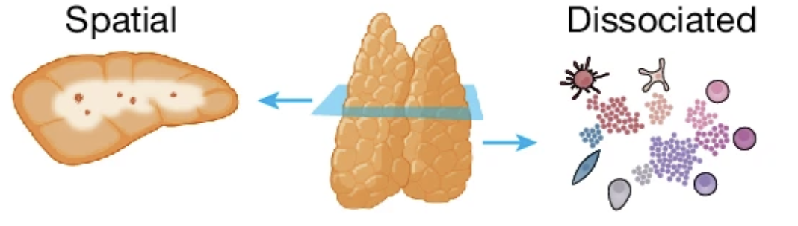

If there's one organ in the immune system that qualifies as truly strange, it's the thymus.

Tucked just above the heart, behind the sternum, this small organ is at its busiest right at birth, then gradually gets replaced by fatty tissue as we move through puberty. By adulthood, barely a trace of it remains. And yet, without it, the immune system simply doesn't work properly.

The thymus is where T cells go to school.

---

## Where T cells learn what "self" means

T cells are born in the bone marrow, but they mature in the thymus. And while they're there, they have to pass two make-or-break exams.

The first is **positive selection**. Only T cells that can recognize the body's own MHC molecules survive. If a T cell can't recognize them, it dies.

The second is **negative selection**. T cells that react too strongly to the body's own proteins get eliminated. Leave them alive, and you've planted the seeds of autoimmune disease.

Only the T cells that survive both gauntlets get released into the bloodstream to fight off outside invaders. The thymus is a precision filter, letting through only the T cells that react "just enough" — no more, no less.

But exactly where inside the thymus this process happens, and in what order, has been unclear for a long time.

---

## The geography of the thymus

The thymus has two regions: an outer **cortex** and an inner **medulla**.

The textbook story is that positive selection happens in the cortex and negative selection happens in the medulla. But where, exactly, each individual cell sits, what signals it's exchanging, and in what sequence it moves — that's been hard to pin down at the cellular level, mostly because of technical limitations.

In November 2024, a study published in *Nature* took this problem head-on.

An international team including Nadav Yayon, Veronika Kedlian, and Chenqu Suo completed the **Spatial Human Thymus Cell Atlas**. Working with thymus tissue spanning from the fetal period through childhood, they combined single-cell RNA sequencing, spatial transcriptomics, and high-resolution multiplexed imaging to capture both each cell's gene expression profile and exactly where that cell sits within the tissue — at the same time.

---

## A continuous space between cortex and medulla

One of this study's central contributions is a concept called the **Cortico-Medullary Axis (CMA)**.

The conventional view treated the thymus as two separate compartments: cortex and medulla. This study showed instead that the thymus functions not as two compartments but as **one continuous space** running from cortex to medulla. T cells mature as they travel along this continuous axis.

To quantify this continuous spatial axis, the team built a new analysis tool called TissueTag. Each cell was assigned coordinates capturing "how close is this cell to the cortex, and how close is it to the medulla," and the researchers tracked how each cell's gene expression pattern shifted along those spatial coordinates.

---

## A finding: when CD4 and CD8 cells part ways

One of the more striking findings in this study is that CD4 T cells and CD8 T cells enter the medulla at different times.

CD4 and CD8 mark the two major T cell lineages. CD4 T cells act as helpers that coordinate the immune response, while CD8 T cells directly kill infected or cancerous cells. Exactly when and where these two lineages diverge inside the thymus has long been an open question.

This study showed, spatially, that the two lineages enter the medulla at different positions along the cortico-medullary axis and at different times. In other words, a T cell's fate isn't determined solely by signals inside the cell — it's also tied to **where** that cell happens to be within the thymus.

---

## Thymic epithelial cells: the map of the teachers

T cells aren't the only characters in this story. Thymic epithelial cells (TECs) act as the teachers, setting the standards T cells are selected against. Medullary thymic epithelial cells (mTECs) in particular express a striking range of tissue-specific proteins from all over the body — proteins that normally belong to the heart, the pancreas, the skin, and so on — right there inside the thymus, so that T cells reacting to those self-proteins can be identified and eliminated.

This study newly identified distinct populations of thymic epithelial progenitor cells spanning the fetal and childhood periods, and traced how these populations contribute to shaping the thymus's spatial architecture.

Another key finding: the thymus's structural framework is already established by the second trimester of fetal development. In other words, the immune system's basic blueprint is laid down long before birth.

---

## Why this matters

A cell atlas of the thymus isn't just a basic-science achievement for its own sake.

When negative selection fails, self-reactive T cells survive and can drive autoimmune disease. When positive selection is insufficient, immunodeficiency results. In conditions like DiGeorge syndrome, where the thymus itself fails to form properly, patients face severe immunodeficiency from the absence of T cells.

This atlas provides a foundation for understanding exactly where in the thymus, and through which failed cell-cell interaction, these immune disorders originate. It could also serve as a practical reference for building thymic organoids that recapitulate T cell development in vitro, or for improving the outcomes of thymus transplantation.

---

## From where I sit as a researcher

Two things stood out to me the first time I read this paper.

One is **the power of spatial information**. Single-cell sequencing gives you the gene expression profile of each individual cell, but it tells you nothing about where that cell actually sits within the tissue. Spatial transcriptomics fills that gap. Knowing a cell's identity and its location at the same time gives you a fundamentally different kind of insight into developmental processes.

The other is **the link between thymic development and autoimmunity**. One question I keep coming back to is: why do autoantibodies form in certain individuals and not others? This paper suggests that part of the answer may lie in the process of T cell education inside the thymus — and in the genetic and spatial factors that shape that process.

Finishing a map of the thymus doesn't mean the immune system's secrets are all solved. If anything, this atlas is less an ending than a starting point — one that makes it possible to ask much sharper questions.

---

*Yayon N, Kedlian VR, Boehme L, Suo C, et al. A spatial human thymus cell atlas mapped to a continuous tissue axis. Nature. 2024;635(8039):7944.*
