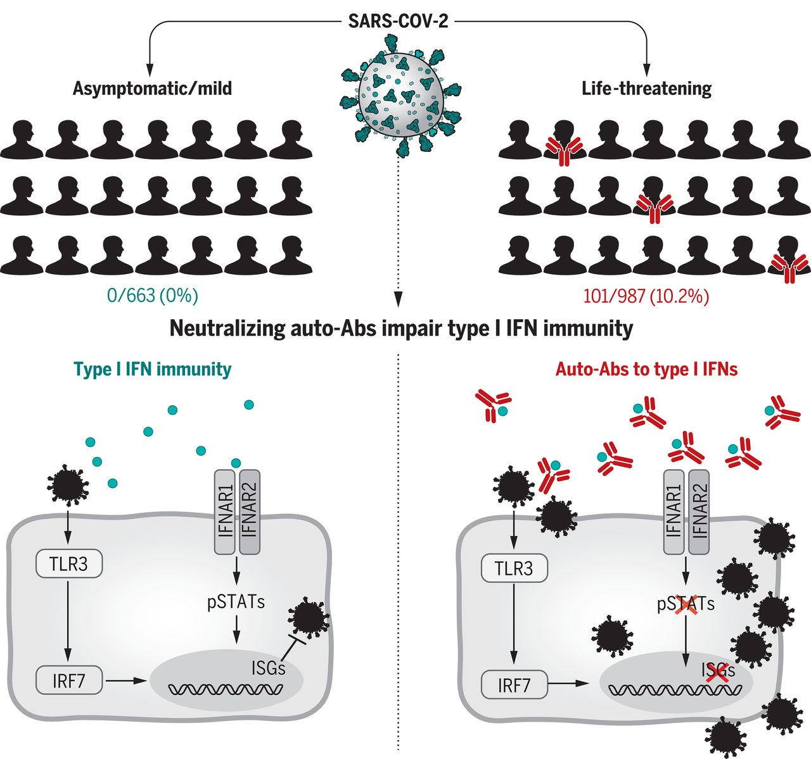

2020년 초, 전 세계가 COVID-19 앞에서 한 가지 수수께끼를 풀지 못하고 있었다.

똑같이 SARS-CoV-2에 노출된 사람들이, 왜 이렇게 다른 결과를 맞이하는가.

누군가는 감염 사실조차 모른 채 지나갔다. 누군가는 가벼운 감기처럼 앓고 나았다. 그리고 누군가는 중환자실에서 인공호흡기를 달고 사투를 벌였다. 나이, 기저질환으로 일부는 설명할 수 있었지만, 그것만으로는 부족했다.

2020년 9월, *Science*에 발표된 한 논문이 그 퍼즐의 중요한 조각 하나를 내놓았다.

---

## 인터페론: 바이러스가 들어왔을 때 몸이 가장 먼저 꺼내드는 무기

바이러스가 세포 안으로 침입하면, 세포는 즉각 경보를 울린다. 그 경보 신호 중 가장 중요한 것이 **인터페론(interferon)**이다.

인터페론은 주변 세포들에게 "바이러스가 왔다, 방어 태세를 갖춰라"라는 메시지를 전달하는 단백질이다. 이 신호를 받은 세포들은 바이러스 복제를 억제하는 유전자들을 일제히 켜고, 면역세포들이 달려올 시간을 번다.

인터페론에는 여러 종류가 있는데, 바이러스 감염 초기에 특히 중요한 것이 **1형 인터페론(type I IFN)**이다. IFN-α와 IFN-ω가 여기에 속한다.

중증 COVID-19 환자들을 연구한 여러 팀이 공통적으로 발견한 것이 있었다. 이 환자들의 혈액에서 1형 인터페론 수치가 극히 낮거나 아예 검출되지 않는다는 것이었다. 바이러스가 폭발적으로 증식하고 있는데, 몸이 제대로 된 초기 방어를 못 하고 있다는 뜻이었다.

그렇다면 왜 인터페론이 작동하지 않은 걸까?

---

## 자가항체: 자신의 무기를 스스로 파괴하다

Paul Bastard를 포함한 국제 공동연구팀은 여기서 놀라운 가설을 세웠다.

*혹시 이 환자들의 몸이 스스로 인터페론을 공격하고 있는 건 아닐까?*

항체는 원래 외부에서 들어온 바이러스나 세균을 표적으로 삼는 무기다. 그런데 드물게, 항체가 자신의 몸에 있는 단백질을 적으로 오인해 공격하는 경우가 있다. 이를 **자가항체(autoantibody)**라고 한다. 자가항체는 류마티스 관절염, 루푸스 같은 자가면역 질환의 핵심 기전이다.

연구팀은 중증 COVID-19로 입원한 환자 987명, 경증·무증상 감염자 663명, 건강한 대조군 1,227명의 혈액을 분석했다. 그리고 충격적인 결과를 얻었다.

**중증 환자의 10.2%, 101명에서 IFN-α 및/또는 IFN-ω를 무력화하는 중화 자가항체가 발견됐다.**

경증 감염자에서는 단 한 명도 검출되지 않았다. 건강한 대조군에서는 0.33%(4명)에서만 발견됐다.

이 자가항체들은 단순히 인터페론에 붙는 것에 그치지 않았다. 실험실에서 검증했을 때, IFN-α의 13개 아형 **전부**를 중화했다. 인터페론이 세포에 신호를 보내는 것 자체를 차단했고, SARS-CoV-2 감염을 막는 인터페론의 능력을 완전히 무력화했다.

---

## 가장 놀라운 발견: 감염 전부터 있었다

여기서 한 가지 중요한 질문이 생긴다. 이 자가항체는 COVID-19 때문에 생긴 건가, 아니면 원래 있었던 건가?

연구팀은 감염 전에 채혈된 일부 환자의 샘플을 확인할 수 있었다. 그 혈액에서도 자가항체가 검출됐다.

즉, **이 자가항체는 SARS-CoV-2 감염과 무관하게 이미 몸에 존재하고 있었다.** 코로나 바이러스가 와서 생겨난 것이 아니라, 오래전부터 잠복해 있다가 코로나가 왔을 때 치명적인 결과로 이어진 것이다.

이 사람들은 평소에는 별다른 문제 없이 살았을 것이다. 인터페론이 중화되어도, 일상적인 환경에서는 그 결함이 드러나지 않는다. 하지만 SARS-CoV-2처럼 초기 인터페론 반응이 결정적으로 중요한 바이러스가 침투했을 때, 그 결함이 생사를 가르는 취약점이 됐다.

---

## 왜 남성에게 더 많이 나타났을까

자가항체 보유자 101명 중 **95명, 즉 94%가 남성**이었다.

이 성별 편향은 단순한 우연이 아닐 가능성이 높다. 연구팀은 X 염색체 연관 유전적 소인을 가능성 있는 설명으로 제시했다. 여성은 X 염색체가 2개이기 때문에 한쪽에 결함이 있어도 다른 쪽이 보완할 수 있다. 남성은 X 염색체가 하나뿐이어서, 면역 관용을 조절하는 유전자에 변이가 있을 경우 더 취약할 수 있다는 것이다.

실제로 후속 연구에서 *FOXP3*, *IKBKG* 같은 X 염색체 상의 면역 관련 유전자 변이가 이 자가항체 형성과 연관된다는 증거들이 보고됐다.

---

## 이 발견이 의미하는 것

이 연구는 중증 COVID-19의 한 원인을 바이러스 자체의 독성이 아니라, **감염 이전부터 존재하던 면역계의 결함**에서 찾았다는 점에서 의미가 크다.

몇 가지 중요한 시사점이 있다.

첫째, **스크리닝의 가능성**이다. 자가항체 보유자를 사전에 파악할 수 있다면, 이들에게 예방적 치료나 우선 접종을 제공하는 전략을 세울 수 있다.

둘째, **치료 방향**이다. 자가항체를 줄이는 혈장교환술, 자가항체를 생산하는 형질세포를 제거하는 치료, 또는 IFN-α 대신 자가항체의 영향을 받지 않는 IFN-β를 투여하는 방법 등을 고려할 수 있다.

셋째, **더 넓은 질문**이다. 코로나만의 이야기가 아니다. 인플루엔자, 웨스트나일바이러스 등 다른 바이러스 감염에서도 유사한 자가항체가 일부 환자에서 발견됐다. 인터페론을 겨냥한 자가항체는 생각보다 흔하게 존재하고 있을지도 모른다.

---

## 면역유전학이 묻는 질문

이 연구가 나를 사로잡는 이유는 단순히 흥미롭기 때문만이 아니다.

이 연구는 "왜 어떤 사람은 같은 바이러스에 죽고 어떤 사람은 살아남는가"라는 질문에, 유전적 배경과 면역계의 상호작용이라는 렌즈로 접근했다. 그리고 그 답이 감염이 시작되기 훨씬 이전, 개인의 유전자와 면역계가 만들어낸 특정 취약성에 있을 수 있다는 것을 보여줬다.

이것이 내가 면역유전학을 공부하는 이유다.

증상이 나타나기 전에, 개인의 유전적 차이가 이미 면역계의 운명을 어느 정도 결정해놓고 있다. 그 지도를 이해하고, 그 지도 위의 취약한 지점들을 찾아내는 것. 그게 정밀 의학이 가야 할 방향이라고 생각한다.

---

*Bastard P, et al. Autoantibodies against type I IFNs in patients with life-threatening COVID-19. Science. 2020;370(6515):eabd4585.*
