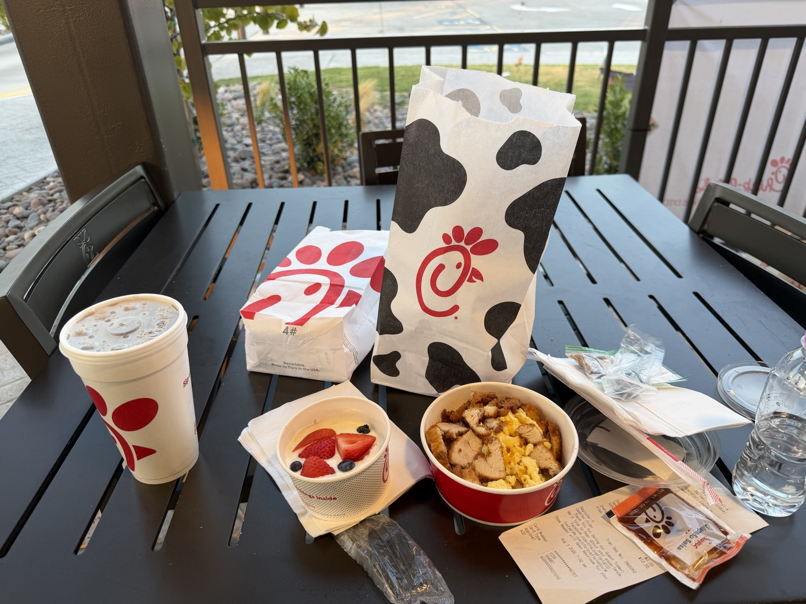
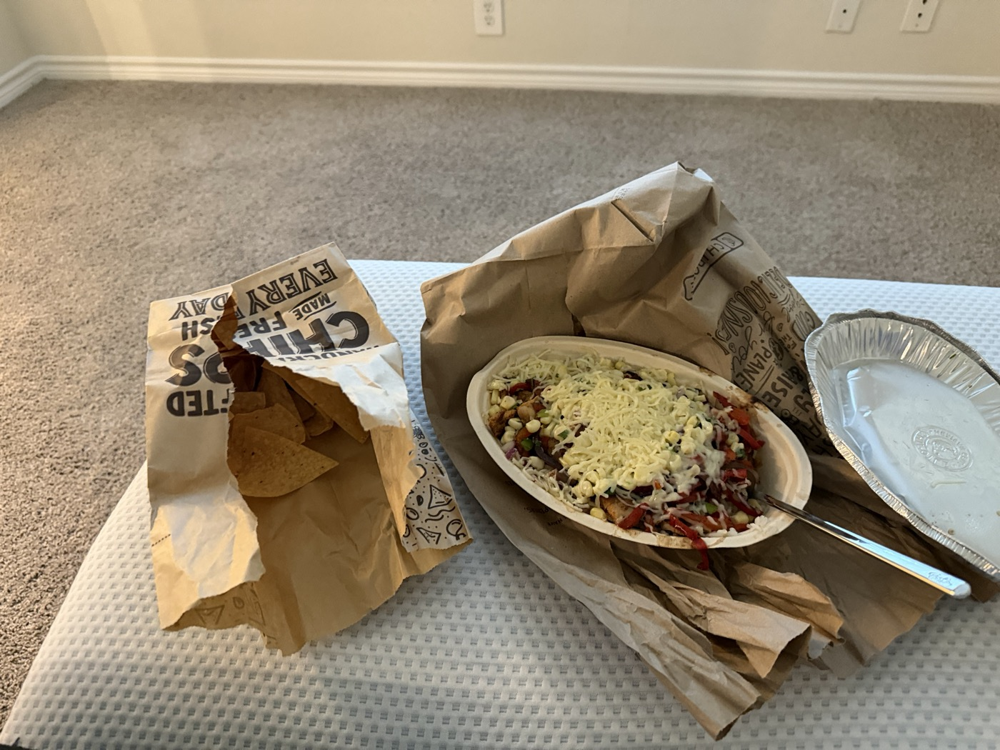
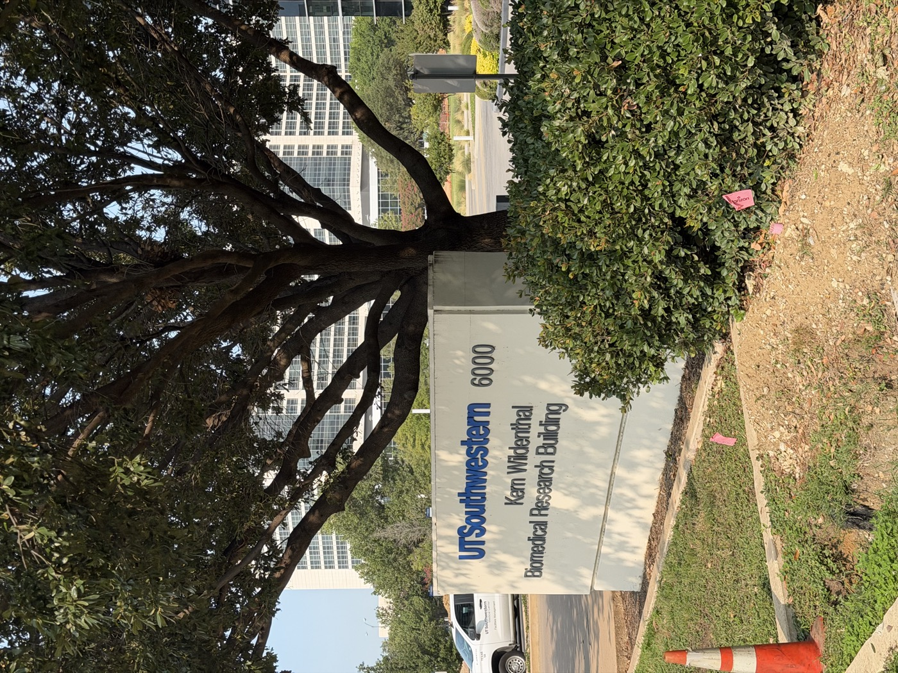
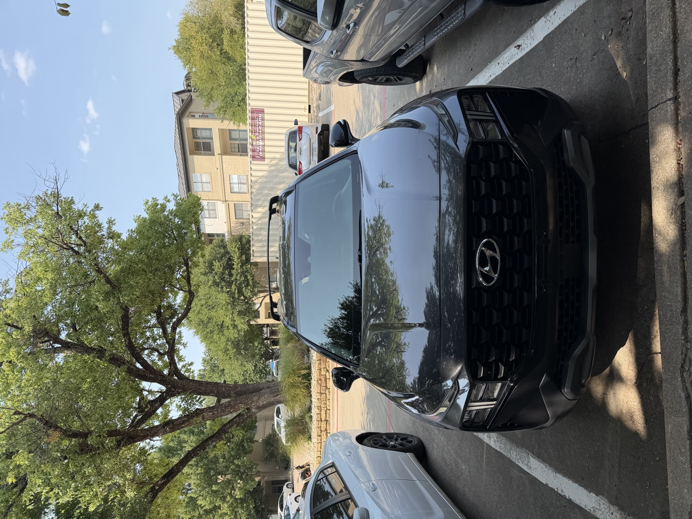
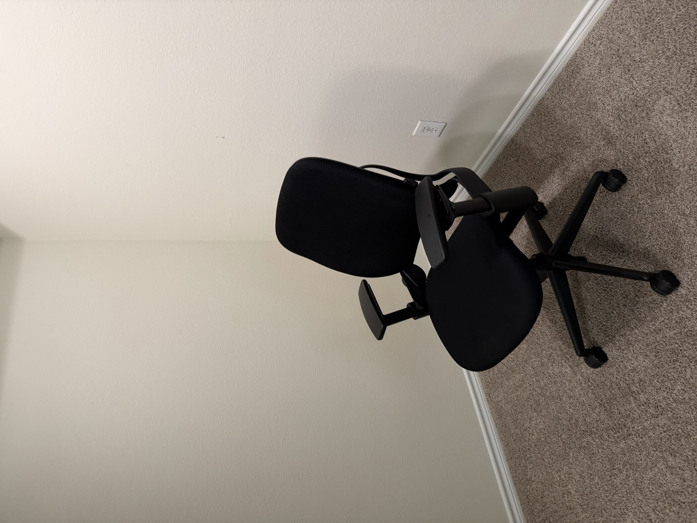
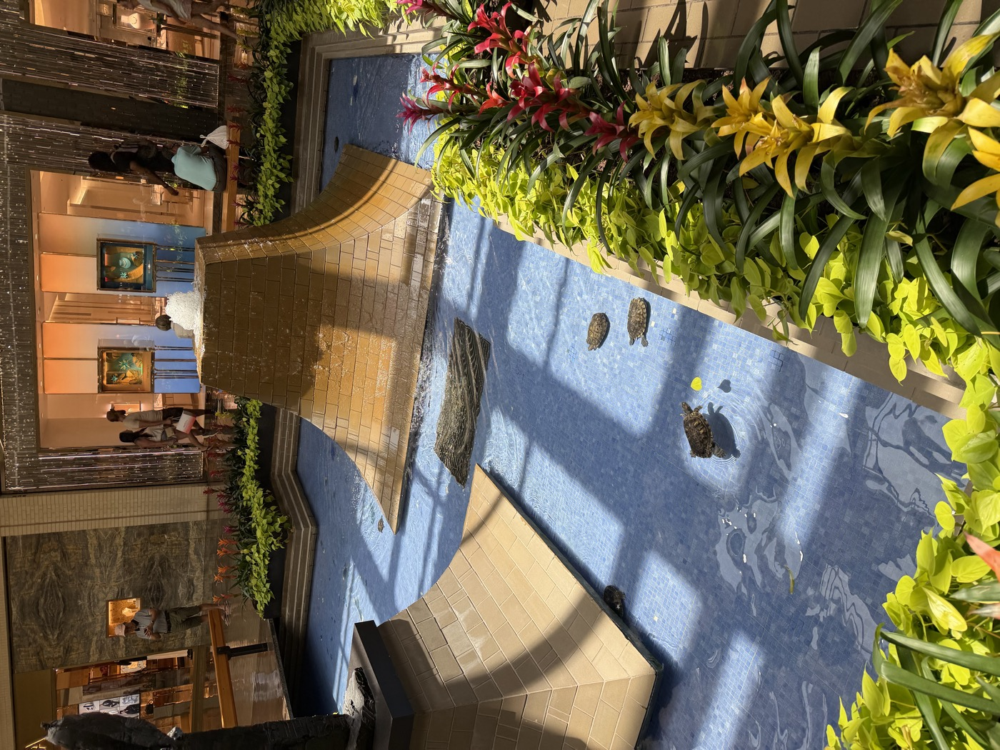
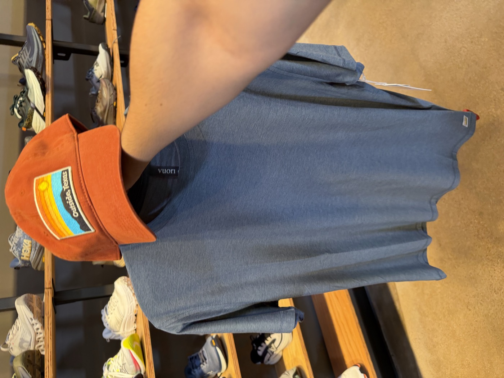
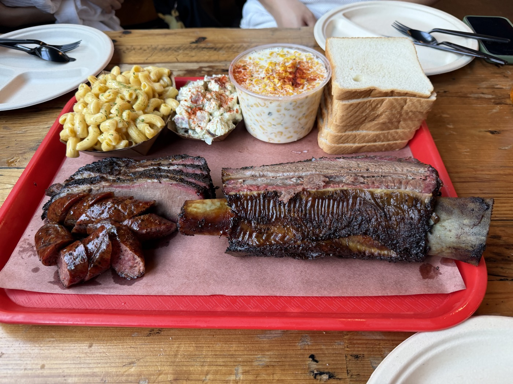

UTSW 박사과정을 시작하러 댈러스에 도착했다. 공항에 내린 첫날 밤부터 학생증을 받고, 차를 사고, 텅 빈 집을 하나씩 채우고, 첫 텍사스 바비큐를 맛본 정착의 첫 일주일을 사진과 함께 날짜별로 남긴다.

---

## Day 1 — 8월 2일 (일) · 드디어 댈러스 도착

한국에서 출발한 장거리 비행. 기내에서 영화 〈대부>를 보고, 기내식을 먹으며 태평양을 건넜다.
대부를 처음 봤던 건 중학교 때 아버지와 함께였는데, 내게 꼭 그 영화를 보여주고 싶어하셨다.
Godfather라는 단어에서 알 수 있을만큼 많은 사람들에게 신의를 얻고, 또 그만큼 많은 호의를 베풀며 살아가는 삶에 대해 생각해볼 수 있었다.
한편으로, 그 업이 다른 누군가에게 피해를 끼치면서까지 본인의 친구들을 돕는 모습을 보며, 어디까지가 정의인지 다시금 생각해보게 되는 영화였다.

밤 11시가 넘어 DFW 공항에 내렸다. 
원래는 저녁 비행기였지만, 갑작스러운 연착으로 아메리칸 항공-대한항공 공동 운항 노선이었던 비행기가 5시간 가량 연착된 것이었다. 
처음으로 늦은 밤 댈라스에 발을 내딛은 날이었다.
낯선 도로, 낯선 표지판 — 진짜 미국에 왔다는 게 실감났다.

늦은 밤, 드디어 앞으로 살게 될 아파트에 도착했다.
겨우 짐을 내려놓고 나서야 긴 하루가 끝났다.
처음으로 겪어본 13시간의 비행은 앞으로의 시간들이 만만치 않을 것임을 암시하는 것 같았고,
그 뒤로 찾아온 시차 문제는 난생 처음으로 느껴보는 생체시계의 고장이었다.

::: {.photo-row}

:::

---

## Day 2 — 8월 3일 (월) · 텅 빈 집을 채우기 시작한 하루

미국에서의 첫 아침은 Chick-fil-A. 
대전에서 지낼 때 친하게 지냈던 형이 꼭 먹어보라고 추천해준 프렌차이즈다.
다만 이른 아침시간이라 아침 메뉴만 제공되어, 그 형이 강력하게 추천해준 벌집 모양 감자튀김은 먹지 못했다.

{.diary-photo}

미리 주문해둔 지누스의 침대 프레임과 매트리스가 미리 도착해있었다.
전날 밤 너무 늦게 도착하는 바람에, 거의 아무것도 정리하지 못한채로 그대로 잠들었다.
뻐근한 몸상태를 뒤로하고,
열심히 프레임을 조립하고 매트리스를 꺼내 잠을 잘 수 있는 공간을 만들었다.

{.diary-photo}

저녁은 Chipotle.
점심에는 In-N-Out을 먹었는데, 난 정말 복받았다.
이 삼대 프렌차이즈가 모두 차로 2-3분 거리내에 위치하는 미친 프-세권이었다.
그래도 건강을 생각해서 최대한 건강?한 식사를 하려고 노력중이다.
그 와중에 Chipotle는 정말 괜찮은 한끼이다.
사실 양이 많아 항상 두끼에 나눠먹는다.

{.diary-photo}

---

## Day 3 — 8월 4일 (화) · UT Southwestern 첫 방문

처음으로 학교에 방문했다.
첫 인상은 '뭐가 이렇게 크지?' 였다.
사실 Children's hospital을 아주 크게 짓고 있어서(한화 약 몇조원 규모..)
아주아주 공사판이라 조경이 썩 마음에 들진 않았다.
Kern Wildenthal Biomedical Research Building으로 들어가 국제 학생 Check-in을 진행했다.

{.diary-photo}

그리고 오늘의 하이라이트 — **학생증 발급.** 
내 이름이 적힌 카드를 발급 받으니 이제야 실감이 났다.
나, 다시 대학원으로 돌아오기로 했었지.
앞으로의 날들이 살짝 걱정되기도 하면서,
또 얼마나 새로운 것들을 많이 배울 수 있을까 기대도 되었던 것 같다.

{.diary-photo}

그리고 같은 날, 중고차를 구매했다.
사실 이 첫주는 무지하게 바빠서, 모든 일정을 다 쓸 수가 없다.
첫째날에는 은행을 가서 계좌를 만들었고, 둘째날에는 이 차를 보고는 마음에 들어 계약을 했더랬다.
그러고는 오늘이 셋째날이 되어 남은 잔금을 치루고, 차를 가져온 것이었다.
텍사스 내에 한인 온라인 커뮤니티가 있어 그 곳에서 구했던 매물이었다.

아무래도 땅이 워낙 넓다보니 차가 없으면 아무곳도 가지 못한다.
그래서 서둘러 구했는데, 차가 너무 깨끗하고 상태가 좋아 만족스러웠다.
앞으로 5-6년동안 소중히 잘 관리해서 오래오래 타고싶다.

{.diary-photo}

첫째날 도착과 함께 어떤 물건이 필요할지 상상하며 아마존에서 폭풍 주문했다.
한국은 쿠팡으로 시키면 다음날에는 무조건 받을 수 있는데,
미국은 아마존 프라임이라도 가끔 재고가 없는 경우에 배송이 늦어지기도 한다.
새삼 한국이 참 모든게 편리했더랬다라는 생각이 들었다.
그래도 생필품을 한가득 구매하고 나니 점점 사람 사는 곳처럼 꾸며져간다는 생각에 기분이 좋아졌다.
{.diary-photo}

---

## Day 4 — 8월 5일 (수) · 다이소와 이케아, 집 꾸미기

이 날은 아침부터 이케아로 향했다.
아직도 살 것들이 산더미처럼 남아서였다.
책상, 의자, 소파가 주 쇼핑리스트인 날이었다.
아침부터 든든히 먹기 위해 First Watch라는 미국 프랜차이즈 식당에 들러 아침을 먹었다.
팬케이크·베이컨·에그와 아이스라떼. 제대로 된 미국식 브런치.
이 정도 구성에 거의 2-30불 정도 나왔던 것 같다.
결제하며 요리의 필요성을 절감했다.

{.diary-photo}

이케아에서 책상을 구경하고,
이것저것 요리에 필요한 주방용품들을 잔뜩 구매했다.
사실 난 요리에 전혀 일가견이 없다.
일가견이 없다는 표현보다는, 솔직히 말하자면 전혀 할 줄 모른다.
그래도 아침에 외식 물가를 체험하자 말자 뭔가 잘못 되었음을 느꼈고,
재빠르게 주방도구를 쇼핑할 수 있어서 다행이었다.

{.diary-photo}

책상은 높이 조절이 되는 전동 책상을 구매하려고 했었다.
그런데 또 너비가 넓은 책상을 원하다 보니 금액이 너무 비싸져서, 아직 고민중이다.
이케아의 Trotten이라는 가구 라인업은 수동 조절이지만 비교적 가격이 200불대로 저렴한 편이고
내가 가장 갖고 싶은 63인치의 전동 책상은 600불이 넘어가 고민이 깊어진다.

사실 책상보다도 의자가 중요하다고 생각해서,
꼭 허먼밀러나 스틸케이스 의자 중에 하나를 사야겠다고 생각중이었다.
마침 차로 30분 정도 거리에 중고 사무용 가구점이 있어서 들렀는데
허먼밀러와 스틸케이스 의자가 정말로 한가득 쌓여있었다.

그 중에서 고르고 골라 가장 상태가 좋아보이는 의자를 집어왔다.
실제 판매가격은 700불대이고, 40% 정도의 가격으로 스틸케이스 Leap V2라는 유명한 의자를 갖게되었다.

중고차와 마찬가지로 중고 의자를 좋은 컨디션에 갖게 되었다.
아무래도 미국에서, 특히나 유학생의 지위로 모든 것을 누리긴 쉽지 않은 것 같다.
그래도 이 정도 옵션을 갖출 수 있다는게 참 다행이라고 생각했다.

{.diary-photo}

---

## Day 5 — 8월 6일 (목) · 장보기와 또 이케아

본격 장보기. 
그릭 요거트를 해먹기 위한 준비물을 chatGPT에게 물어보았다.
바나나, 요거트, 냉동 버터치킨, 오렌지주스.
요리가 처음이라 아침은 그릭요거트를 만들어 먹는 것으로 한동안 대체해야 할 듯하다.
그리고는 냉동 음식들을 전자레인지에 돌려먹거나,
밀키트 형태의 제품들을 사서 그럴듯하게 조립하는 쪽으로 생각중이다.

그러다가 점점 먹고 싶은게 생기면 요리를 하게 되지 않을까?

{.diary-photo}

어제 갔던 이케아는 너무 작아서 크게 볼 것이 없었다.
집 주변에 엄청 큰 이케아로 다시 향했다.
한바탕 구경하고,
스웨디시 미트볼로 점심. 접시에 꽂힌 작은 스웨덴 국기가 귀엽다.
막상 또 너무 넓으니 내가 원하는 것을 정확하게 찾아내기 어려웠다.
그래도 한국에서 본 적 없는 규모의 이케아를 돌아보니 나름 즐거웠다.

{.diary-photo}

---

## Day 6 — 8월 7일 (금) · 번호판, 몰, 그리고 라면

어제 이케아를 다녀오고,
같은 학교로 유학온 한국인 친구들이 있어 함께 간단히 커피를 마시며 인사를 나눴다.
그리고 그 다음날이다.
그 한국인 유학생 중 친구 한명이 ON 신발과 Alo 옷을 셋업으로 입고 나왔는데,
그게 너무 예뻐보여서 한번 직접 가보기로 했다.

두 브랜드를 동시에 볼 수 있는 곳이 어딜까해서 찾은 곳이 Northpark mall.
우리나라로 치면 복합쇼핑몰같은 느낌인데,
미국은 땅이 넓어서 그런지 위아래로 건물을 짓지 않고 가로세로로 아주 넓게 지어버린다.

고속도로에서 민트색 랩핑을 한 테슬라 사이버트럭을 목격. 텍사스답다.

{.diary-photo}

분수와 실내 정원이 있는 NorthPark Mall을 구경했다. 
정원에는 거북이가 다니는 분수가 예쁘게 꾸며져 있었다.

Alo를 찾지 못해서 한참 헤메이다가, 겨우 발견하고 들어갔다.
미국인들이 엄청 많았고, 현지에서 정말 인기가 많다는 것을 실감했다.
그 한국인 친구가 입었던 셋업을 똑같이 따라사는 것은 좀 그렇기에,
러닝복을 구매하려고 했으나 생각보다 남자 운동복은 옵션이 별로 없었다.

목 끝까지 올려서 입는 런닝복은 괜찮았는데, 사이즈가 없어서 구매할 수는 없었다.
인터넷으로 주문할까 고민하다가 관심이 식어 구매하지 않기로 결정했다.

{.diary-photo}

그러고 ON 신발을 파는 곳으로 향했는데,
ON만 취급하는 곳이 아닌 한국의 ABC 마트 같은 곳이어서 내가 관심있었던 런닝화를 찾을 수 없었다.
그래서 ON 러닝화를 찾기 위해 아웃도어 매장 REI로 향했다.

이 곳은 아웃도어 매니아들에게 정말 천국과 같은 곳이다.
파타고니아, 아크테릭스 등 이름만 들어도 알법한 아웃도어 브랜드들이 전부 다 모여있고,
매대 구성이 굉장히 알차고 컴팩트해서 쇼핑하기 너무 좋았다.

입구에서 마주쳐 꽂혀버린 "Outside Texas" 모자와,
애슬레저 브랜드인 Vuori에서 상하의 셋업을 구매했다.

마찬가지로 ON 운동화는 매물이 없었지만,
내가 구매하려고 했던 클라우드 몬스터3 모델이 있긴 있어서 사이즈만 확인할 수 있었다.
원하는 색상과 사이즈 조합으로 온라인 구매 완료.

{.diary-photo}

일주일 정도 고열량 패스트푸드를 잔뜩 먹으니 한식이 당겼다.
지나가다 타겟에 들려 간단한 식료품을 사면서 구매했던 신라면.
타지에서 먹는 라면은 늘 옳다.

{.diary-photo}

---

## Day 7 — 8월 8일 (토) · 텍사스 바비큐 입문

아침은 집에서 치킨 시저 샐러드에 블루베리를 얹어 가볍게 먹었다.
오늘은 아침부터 Tax office에 가서 차량 등록을 진행했다.
텍사스에서 개인 간 차량 구매 순서는 다음과 같다.
Bill of Sale 작성(구매 증빙) - 차량 및 Title 인수 - 보험 등록 - Title Transfer
네번째 단계인 Title transfer를 위해서는 Tax office에 방문해야 한다.
준비물은 ID(나의 경우 여권), 보험 카드, Title, 그리고 텍사스 차량등록세(차량 가액의 6.25%)를 지불할 수단이다.

{.diary-photo}

이렇게 차량을 등록하고 나면 차 번호판과 inspection 스티커를 받게 된다.
스티커는 차량 앞쪽 안쪽유리에 부착하면 되고, 번호판은 차량 앞 뒤에 부착하게 된다.
번호판이 없는 동안은 임시로 transit permit을 받아 차량을 운행할 수 있고,
한 번 허가를 받으면 5일동안 유효하다.
그리고 Title transfer는 차량 구매 후 30일 이내에 진행되어야 한다.

{.diary-photo}

그리고 저녁은 텍사스 바베큐를 먹었다.
텍사스에 왔으면 꼭 먹어야 할 것, **Terry Black's Barbecue.**
얼마 전 커피를 마셨던 한인 친구들과 함께 바-맥을 즐기기로 한 것이었다.

실내는 거의 미국인 현지인들로 가득차있었다.
제대로 된 현지 맛집이었다.

{.diary-photo}

브리스킷, 소시지, 립, 맥앤치즈, 감자샐러드. 
너무 큰 기대를 하고 가서 그런지, 그렇게까지 맛있지는 않았다.
다만 사이드들이 꽤 맛있어서 고기와 함께 곁들여, 맥주를 한잔씩 마셨다.
한국인 친구들과 이렇게 타지에서 한국말로 떠들 수 있어서 참 다행인 인연이라는 생각이 들었다.

{.diary-photo}

---

## Day 8 — 8월 9일 (일) · 그랜드 프레리 아울렛

점심은 집에서 볶음밥에 계란을 올려 뚝딱.
볶음밥은 트레이더 조에서 파는 냉동 야채와 볶음밥인데, 나름 양도 많고 괜찮았다.
아마 다음에 장보러가면 재구매할 아이템 중 하나인 것 같다.

오후엔 그랜드 프레리 프리미엄 아웃렛으로.
너무 덥고 졸려 시원하게 라떼를 한잔 시켰다.
분명 카라멜 트러플 라떼였는데, 트러플 향은 전혀 나지 않아서 실망했다.
Alo에서 사지 못했던 러닝복 상하의 세트를 나이키에서 대충 구매하고,
연구실에서 신을 크록스까지 구매하여 집으로 향했다.

{.diary-photo}

저녁엔 아파트 커뮤니티 라운지에서 내일 있을 미팅을 준비했다. 
정착의 한 주가 끝나고, 이제 진짜 대학원 생활이 시작된다.

{.diary-photo}

