정착 2주차. 첫 주가 '도착과 생존'이었다면, 이번 주는 '살림을 채우고 학교로 들어가는' 한 주였다. 텍사스 운전면허를 따고, 소파와 스탠딩데스크로 집을 완성하고, 드디어 대학원 오리엔테이션이 시작됐다.

---

## Day 1 — 8월 10일 (월) · 운전면허와 집 꾸미기

아침부터 Texas DPS(Department of Public Safety)에 가서 운전면허 신청을 했다. 대기 화면에 뜬 이번 주 날씨 — 월·화·수 내내 100°F(약 38°C). 텍사스의 여름은 진심이다.

면허 발급 과정에서 문제가 있었는데, SAVE라고 하는 미국 이민국에서 관리하는 입국 확인용 프로그램에서 내 이름이 확인되지 않았다는 것이다. 결국 어렵게 예약하고 방문했던 DPS에서 텍사스 면허로 교환하지는 못했고, 이후 이민국에서 발송하는 실물 우편을 수령하고 다시 재방문하라는 얘기를 전해들었다. (오마이갓)

::: {.photo-row}

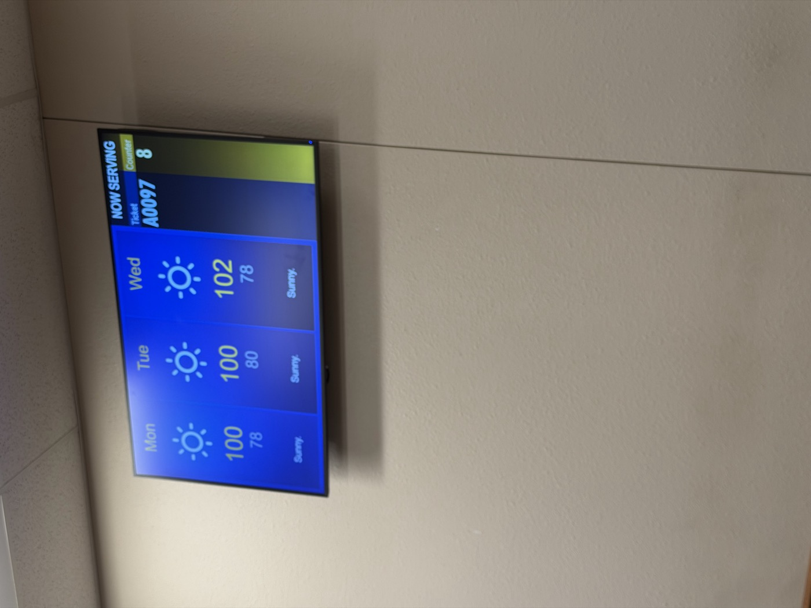
:::

점심은 또 Chick-fil-A. 
사실 지난 주에 칙필레를 먹었는데, 갓튀겨져 나온 벌집 감튀가 진짜 너무 맛있어서 재방문했다.
그 때는 실내에서 쾌적하게 먹었는데, DPS 근처 지점으로 방문했더니 야외 객석만 마련되어 있어서 더위에 쫓겨 빨리 먹었다. 이번에는 기본 오리지널 말고 양상추와 치즈 등을 추가하는 Deluxe? 버전으로 먹었는데, 한국인들에게 훨씬 익숙한 버전의 햄버거라 더 맛있게 느껴졌다.

그리고 지난주에 Chase에서 바로 발급 신청했던 Debit Card가 드디어 우편으로 배송되었다. 애플페이에 이미 카드를 등록해서 잘 쓰고 있었지만, 아주 가끔(예를 들어 Tax office에서 차량 등록세 6.25%..) 애플 페이가 안되는 경우들이 있었다. 
(결국 그 날은 세금을 내기 위해 다시 은행에 가서 돈을 인출하고, tax office를 재방문했다..)

그래서 매우 기쁜 마음으로 실물 카드를 수령했다. 디즈니 카드 디자인을 고를지 말지 고민했는데, 보기에 꽤나 유치하지 않나 생각했지만 실물은 훨씬 깔끔하고 괜찮았다.

::: {.photo-row}
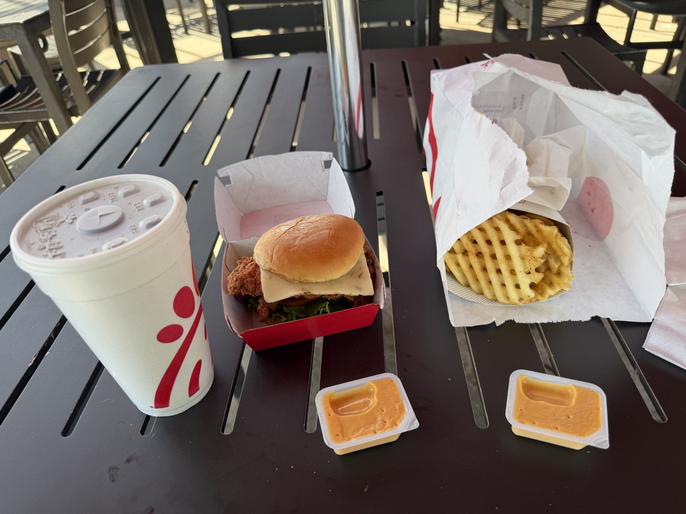

:::

다음 일정은 중고로 소파를 구매하는 것이었다. 이케아에서 여러가지 소파를 경험해봤고, 그 중에서 SODERHAMN과 KIVIK 이라는 모델 중에 고민중이었다. 그러나 새 소파를 거의 800불에서 1000불 정도 내고 구매를 하자니 망설여졌다. 그러던 도중 Facebook Marketplace에서 West Elm이라는 뉴욕의 가구 브랜드에서 만든 소파를 150불 정도에 판매하는 것을 보고, 직접 가서 상태를 확인하기로 했다.

생각보다 컨디션이 나쁘지 않아서, 이 소파를 옮기기 위해 U-Haul 9인치 카고 밴을 빌렸다. 혼자서는 도저히 옮길 각이 나오지 않아 지난주 같이 바베큐를 먹었던 한국인 남자 동생에게 같이 가줄 수 있냐고 부탁했다. 흔쾌히 합석해서 같이 소파를 옮기러 향했다.

낯선 트럭 운전석에 앉아보는 것도 새로운 경험.

(잠깐 감상) 미국이라는 곳이 그런 것 같다. 뭐든지 하겠다고 마음 먹으면 할 수 있는 방법들이 있다. 미국에 오기까지 많은 고민들이 있었지만, 결국 마음 먹었고, 해냈던 것처럼 앞으로도 잘 해내고 싶다.

::: {.photo-row}

:::

드디어 거실에 소파가 들어왔다. 텅 비었던 공간이 사람 사는 집이 되어간다.

::: {.photo-row}
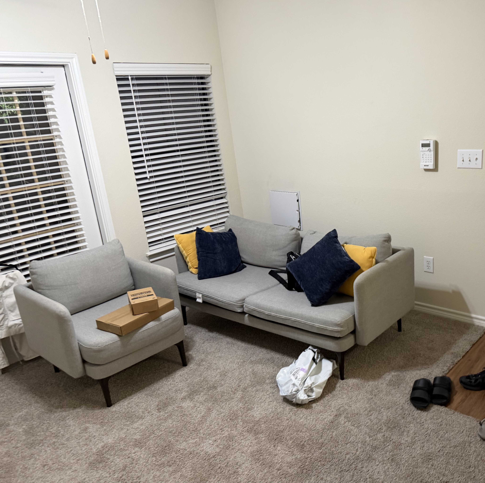

:::

저녁은 한식. 같이 소파를 옮겨준 친구에게 감사의 의미로, 그리고 또 다른 한국인 친구에게도 미국 도착 전에 많은 도움을 받았기 때문에 이를 조금이나마 되돌려 주고 싶다는 마음으로 식사를 대접했다. Jeong Kitchen이라는 한식당에서 포장하여 불고기, 치킨, 김밥, (친구가 내어준) 김치까지 한 상 제대로 차렸다.

---

## Day 2 — 8월 11일 (화) · 택배 러시와 트레이더조

현관 앞에 택배가 쌓이기 시작했다. FlexiSpot 스탠딩 데스크와 Cuisinart 에어프라이어 오븐 등, 주문했던 것들이 한꺼번에 도착했다. 스탠딩 데스크는 상판 외에 아직 하판 부품들이 도착하지 않아, 오븐만 먼저 옮겨주었다.

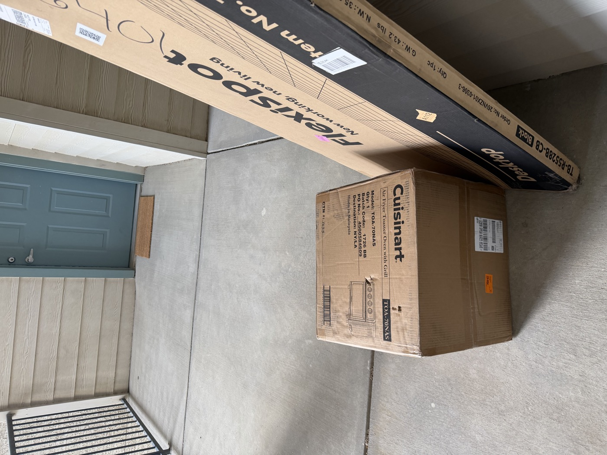

지난 주에 갔던 Trader Joe's로 장을 보러 갔다. 미국 마트들은 다 너무 대형이라, 필요한 몇 가지를 사기 위해서는 정말 동선이 길어진다. 이 곳은 집에서 가장 가까운 마트(차로 10분)이면서도, 아주 필요한 것들로만 알차게 구성되어 있어서 일주일 치 식량을 간단히 구매하기에 좋다.

매장을 돌며 그릭요거트, 그래놀라, 콜드브루, 간식까지 이것저것 담았다. 지난 한 주간 집에 커피를 마실 방법이 없어서 계속 사먹었는데, 그러다보니 커피를 못마시는 날도 생겼다. 하루라도 커피를 마시지 않으면 머리가 핑돈다. 그래도 건강하게 지내고 싶어서 요즘 빈속에는 절대 커피를 마시지 않으려고 노력중이다. 

그리고 추천받은 아몬드+초코 조합의 간식도 같이 구매했다.

::: {.photo-row}

:::

Cuisinart 에어프라이어 오븐도 개봉해서 자리를 잡았다. 요리 초보에게 든든한 무기 하나 추가.
집에서 데워 먹은 버터치킨 한 끼. 조금씩 살아남는 법을 터득해나가고 있다. 맛은 나쁘지 않아서 재구매 예정이다.

::: {.photo-row}

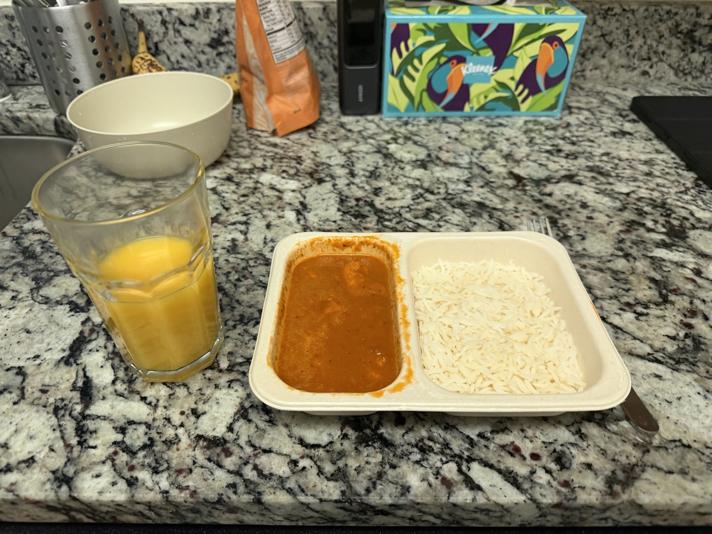
:::

---

## Day 3 — 8월 12일 (수) · 오리엔테이션 Day 1

드디어 대학원 오리엔테이션이 시작됐다. 차는 있지만 아직까지 주차장 Permit을 신청하지 못해서, UTSW 셔틀을 타고 캠퍼스로 향했다. Student Center라는 곳에서 모여 아이스브레이킹 활동. 전 세계에서 온 새 동기들과 처음 인사를 나눴다.

::: {.photo-row}

:::

마지막으로는 UT Southwestern 굿즈들이 가득 담긴 가방과 시원한 아이스바까지. 신입생 대접을 톡톡히 받았다.

그리고, 우리가 몰랐던 한국인 학생분이 한 분 더 계셔서 지금까지 총 4명의 박사과정생을 만날 수 있게 되었다. 이 분은 다른 전공과셨는데, 오티가 끝나고 같이 식사 자리를 제안해주셔서 맛있는 라멘을 먹었다. 당연히 각자 낼 거라고 생각했는데 새로 만난 한국인 분께서 본인이 내겠다고 말씀하셔서, 한바탕 야단이 났다가 결국 얻어먹게 되었다.

이렇게 타지에서 서로를 돌보는(?) 한국의 정이, 낯선 미국땅에 적응하는 데 큰 도움이 되고 있다.

::: {.photo-row}

:::

---

## Day 4 — 8월 13일 (목) · 오리엔테이션 Day 2 · 스탠딩데스크

오리엔테이션 두번째 날이었다. 수요일부터 금요일까지 총 3일에 걸쳐 진행되었고, 오늘은 수업에 관한 전반적인 일정 안내가 주된 내용이었다.

UTSW Core Curriculum은 총 세 가지 파트로 나뉜다 : Proteins, Genes, Cells 이다. Proteins가 가장 어려운 파트라고 하는데, 나는 원래 생명과학을 좋아하다보니 크게 걱정되는 부분은 없었던 것 같다.

수업은 월화수목 오전 8시반부터 10시까지 진행되었고, 문헌 리뷰 후 논의하는 세션과 직접 실험 설계를 논의하는 세션이 각각 화요일과 목요일에 있었다. 그리고 금요일에는 실험 설계에 대해 발표하는 날이 있었다.

각 시험 일정은 다음과 같다.

Proteins Exam 1은 8/31, Exam 2는 9/28
Genes Exam 1은 10/12, Exam 2는 11/9
Cells Exam 1은 11/23, Exam 2는 12/14

그 외에 RCR 수업은 연구 윤리 및 책임 교육을 다루는데, 9/2, 4, 16, 23 그리고 10/21, 11/4 총 6번의 수업이 예정되어 있었다. 이 때 RCR 수업을 빠지게 되면 굉장히 무거운(?) 추가 과제가 주어질 것이라는 경고가 있었다.

마지막으로 국제 학생을 관리하는 부서에서, 왠만하면 첫 1년동안은 미국 밖으로 나가지 말라는 경고를 듣게 되었다. 그래도 내년 여름에는 한국을 갈 수 있지 않을까?

...

오티가 끝나고 집을 가니 드디어 책상의 하체 부품이 도착했다. 사실 중간에 너무 오래 걸리길래 반품을 신청했는데, 해당 제조사에서 15% Discount 해줄테니 반품 철회하면 어떻겠냐는 제안이 와서 수락했다. 미국은 정말 오퍼의 나라이다. 각자 마음에 들지 않는 부분이 있으면 적극적으로 협상에 나서고, 또 그렇기에 뉘앙스와 이를 어떻게 납득시킬것인지에 대한 접근 방식이 중요한 부분인 것 같다.

정말 쉽지 않았지만 부품을 늘어놓고 낑낑댄 끝에, 드디어 나만의 책상이 완성됐다.

::: {.photo-row}

:::

---

## Day 5 — 8월 14일 (금) · 오리엔테이션 Day 3 · 안전교육

오리엔테이션 마지막 날. 공짜 커피와 아침이 제공되었다. Lemmon Drop 커피숍의 아이스 라떼로 정신을 깨우고, 실험실 안전교육(Emergency Safety Equipment, 응급 세척 시설 등)을 들었다. 이제 진짜 연구실에 들어갈 준비를 하는 느낌.

긴 강의 도중 트레이더조에서 산 Snacky Clusters로 당 충전. 정착 2주차, 집도 학교도 조금씩 자리를 잡아간다. 이제야 생체 시계가 제대로 돌아가는 중이다.

::: {.photo-row}

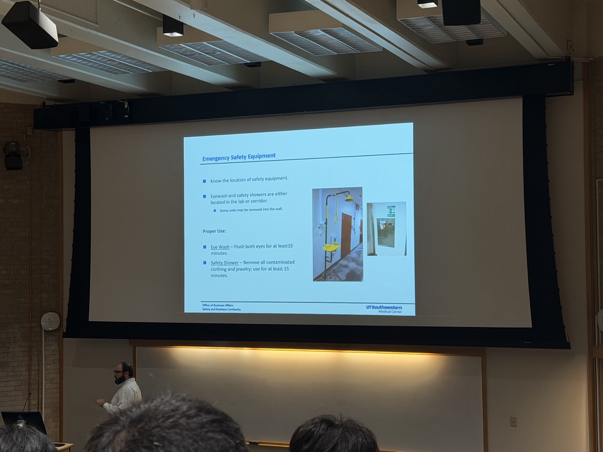

:::

---

## Day 6 — 8월 15일 (토) · H마트, BCD 순두부, 그리고 셀프 조립

오늘은 늦잠을 자고, H마트로 향했다. 첫 인상은, '나 한국에 있나?'였다. 미국에서 전혀 볼 수 없는 비비고 만두와 카누 커피를 한가득 집어 장바구니에 얼른 담았다.

H 마트 내부엔 파리바게트도 입점해 있었다. 2주만이지만 정말 오랜만에 본 것 같은 한국식 베이커리를 보고 있자니 왠지 모를 위안이 되었다.

::: {.photo-row}
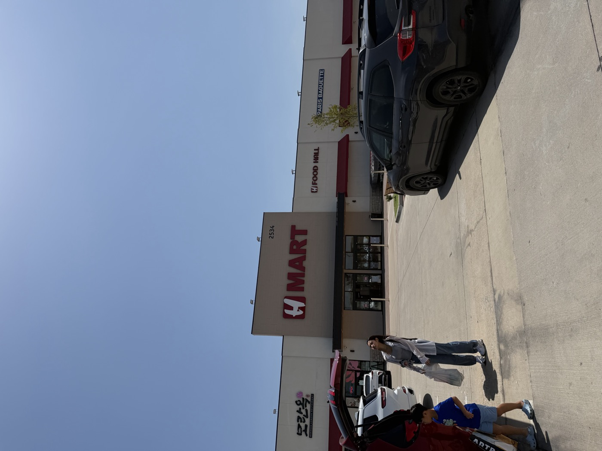

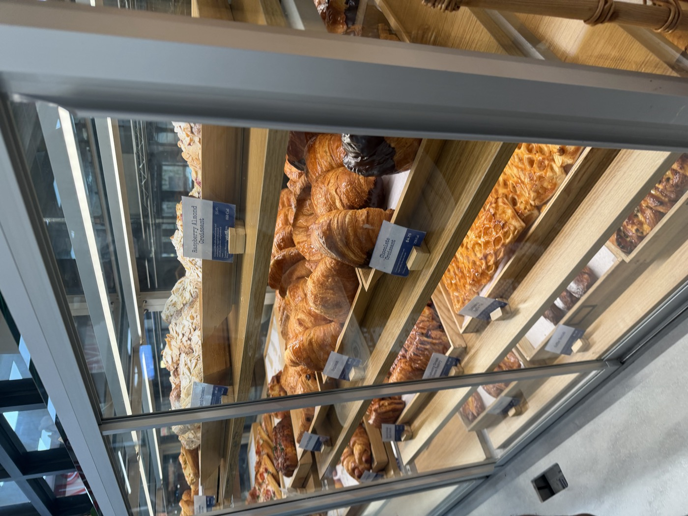

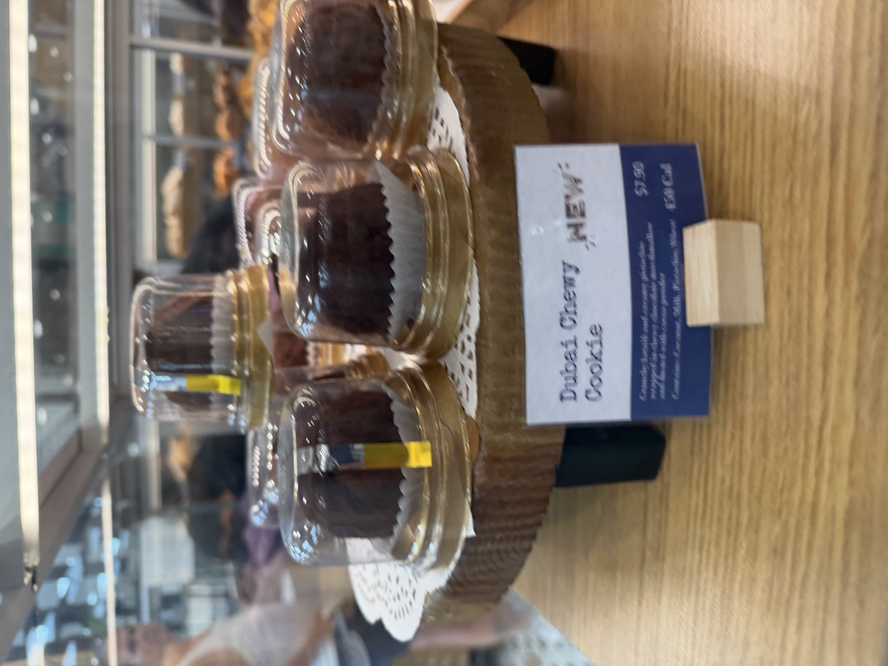
:::

점심은 H마트 근처에 있는 BCD 순두부로 향했다. 한국인 친구 한명의 Big Sib(가까운 과 선배? 개념이다.)과 함께 네명이서 같이 맛있는 한식을 먹었다. Big Sib을 데려온 한국인 친구가 아직 운전에 미숙한데, 이렇게 시간이 많을 때 한번씩 같이 드라이브를 가서 옆에서 조금씩 알려주고 있다.

맛있는 LA 갈비와 겉절이 느낌의 김치, 그리고 순두부를 먹고 있자니 행복감이 몰려왔다. 그나마 다행인 것은 내가 그렇게 식탐이 많지 않아 한식이 없어도 그럭저럭 지낼 만 하다는 것이었다. 그래도 이렇게 맛있는 한식을 먹는 날엔 식욕이 확 돌기는 했다.

::: {.photo-row}
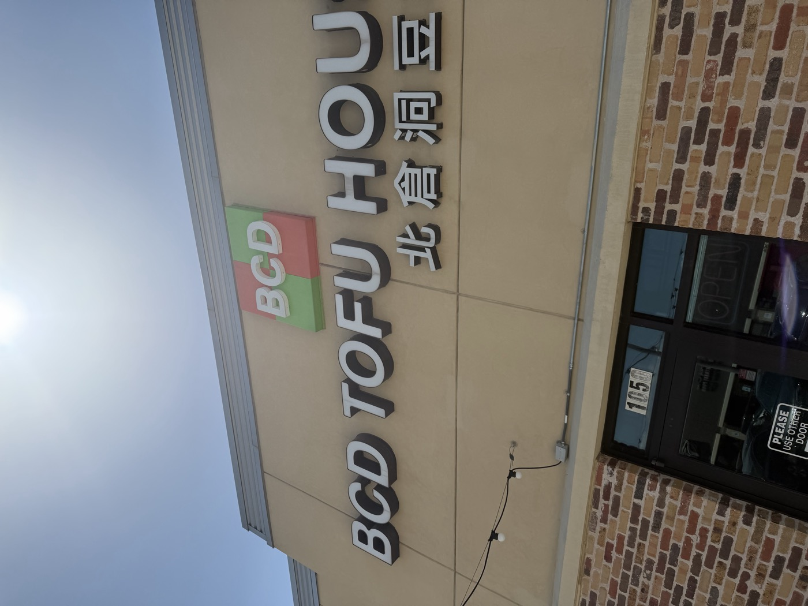

:::

잘먹고 나와서 간단히 음료를 마시기 위해 Molly Tea를 방문했다. Grand Opening 이벤트로, 핑크 카우보이 모자를 쓴 사람들이 주차장에서 신나게 춤을 추고 있었다. 

정말 미국은 밝은 에너지로 가득찬 나라인 것 같다. 어딜 가나 스마일 페이스로 웃고 있는 친구들과, 별거 아닌 이야기에도 큰 웃음을 터트리는 모습들을 보고있자니 나도 그렇게 되고싶다는 생각이 들었다. 무거움과 가벼움, 무거움을 조금 내려놓고 가벼워지는 연습을 해야겠다.

::: {.photo-row}
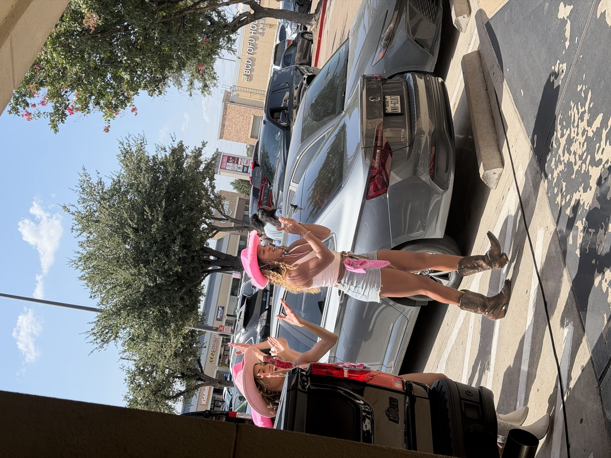

:::

조립 지옥에 빠졌다. 이번에는 이케아 TV 선반이었다. 배송을 시켜놓고 한참을 안오길래 까먹고 있었는데, 집 입구를 거대하게 가로막고 있는 바람에 어쩔 수 없이 들여왔다.

부품을 늘어놓고 낑낑대다, 어느새 벽 한쪽을 채우는 수납장으로 완성됐다. 이제는 나, 가구 조립을 조금 잘할지도?

::: {.photo-row}
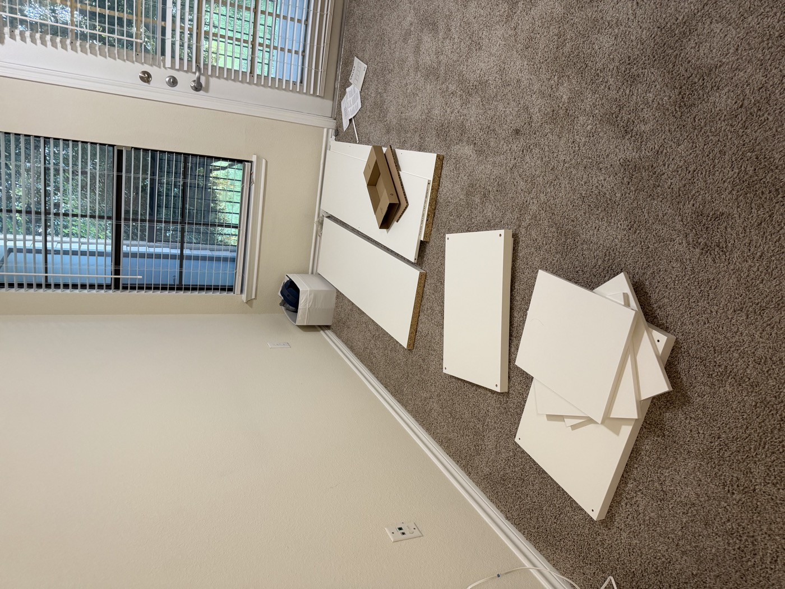

:::

---

## Day 7 — 8월 16일 (일) · 집 정리

일요일, 밀린 청소로 하루를 시작했다. 빨래를 돌리고, 무선 청소기로 카펫 구석구석을 밀었다. 처음에는 카펫에 먼지가 많을거라고 생각하니 집에 오는 것 자체가 조금 싫게 느껴지는 순간들도 있었는데, 계속해서 먼지를 빨아들이고 가구를 놓고 정리하다보니 어느새 정들었다. 

이 공간을 잘 단장해서, Student Housing 최대 거주 기간인 4년을 잘 채워봐야겠다. 그 이후의 이사 계획은 그 때의 내가 알아서 잘 할 수 있을거라 믿는다.

그리고, 어느 글에서 봤던 영어 공부법을 참고하여 교재를 하나 구매했다. 이 곳에 오니 특히나 영어의 중요성을 많이 느꼈고, 따로 시간을 내어 공부 해야겠다는 생각이 들었다. 스피킹과 리스닝은 수업을 따라가면서 많이 공부가 되리라 생각했고, 나에게 가장 부족한 건 어휘라고 생각했다. Wordly Wise를 통해 매일 15개 정도의 단어를 조금씩 쌓아나가볼 계획이다.

조금 늘어지는 오후 시간을 보낸 후, 짧은 운동을 마치고 드디어 첫 개강일을 앞두고 있다.

