미국에 온 지도 벌써 7주가 되었다.

돌이켜보면 지난 6주 동안 정말 많은 일들이 있었다.  
비행기를 타고 댈러스에 도착한 첫날부터 차를 사고, 운전면허와 SSN을 발급받고, 텅 빈 집에 가구를 하나씩 채워 넣었다. 오리엔테이션을 거쳐 첫 수업을 듣고, 처음으로 미국 연구실에 출근하고, 첫 시험을 치르고, 처음으로 실험을 혼자 해보기도 했다.

그래서 지난 6주 동안은 **가능한 한 많은 것을 기록하려고 했다.**

처음 미국에 도착한 나에게 하루하루가 새로운 사건이었기 때문이다.

하지만 이제는 조금 달라졌다.

차도 생겼고, 집도 어느 정도 자리를 잡았다.
학교에서 마주치는 사람들과 인사를 나누는 것도 익숙해졌고, 연구실에서 어떤 하루를 보내는지도 조금씩 알 것 같다.

무엇보다 이제는 매주 새로운 사건이 일어나기를 기다리기보다는, **이미 시작된 박사과정 속에서 내가 무엇을 배우고 있는지를 기록해야 할 시점**이라는 생각이 들었다.

그래서 앞으로는 지금까지처럼 매주 있었던 일을 하나하나 기록하는 것에서 조금씩 벗어나려고 한다.

물론 **Weekly Diary는 계속 쓸 예정이다.**
다만 이전보다 조금 가볍게, 그 주에 있었던 일과 생각을 남기는 정도로 기록하려 한다.

대신 한 달에 한 번 정도는, 그동안의 경험을 조금 더 길게 돌아보며 '미국 박사과정생으로 살아가면서 배운 것'을 정리해보려고 한다.

새로운 연구실에 빠르게 적응하는 방법, 논문을 읽는 방법, 사람들과 소통하는 방법, 로테이션을 선택하는 방법처럼 그동안 직접 부딪히면서 배웠던 것들을 하나의 주제로 묶어보려고 한다.

아마 앞으로의 글은 이전보다  '미국에서 무엇을 했는가'보다는 '미국에서 무엇을 배웠는가'에 조금 더 초점을 두려한다.

그 첫 번째 이야기는,  
**[새로운 연구실에 빠르게 적응하는 방법](../../phd-in-us/journey/month1.html)**에 대한 이야기다.

...

그래도 여전히 주간 기록은 계속된다.

## Day 1 — 9월 7일 (월) · 처음은 누구나 엉망이다.

달력을 보면 깜짝깜짝 놀란다. 내가 벌써 여기있다고?

지난주에 H mart에서 산 재료들로 새롭게 시도해본 메뉴들이다.
1. 밥, 김치, 그리고 불고기. 
2. 립아이 스테이크

하나는 성공, 다른 하나는 실패였다.
따뜻한 밥과 불고기, 그리고 김치는 실패할래야 실패할수가 없는 조합이었고,

스테이크는 고기 선정이 조금 잘못되었는지 아니면 나의 미숙함이 문제였는지
썩 좋지못한 결과가 완성되었다. 이렇게 하나씩 둘씩 배워나가는거겠지?

그리고 일본 오사카에서 구매했던 복각 데님 청바지를 욕조에 담궈 소킹했다.

청바지는 세탁과 함께 급격히 줄어드는데, 그 과정에서 전체적인 바지의 핏이 망가지지 않도록 욕조에서 형태를 유지한 채 30분 가량 물에 담궈두는 과정을 '소킹'이라고 한다.

그리고 간단한 work-out.

::: {.photo-row}
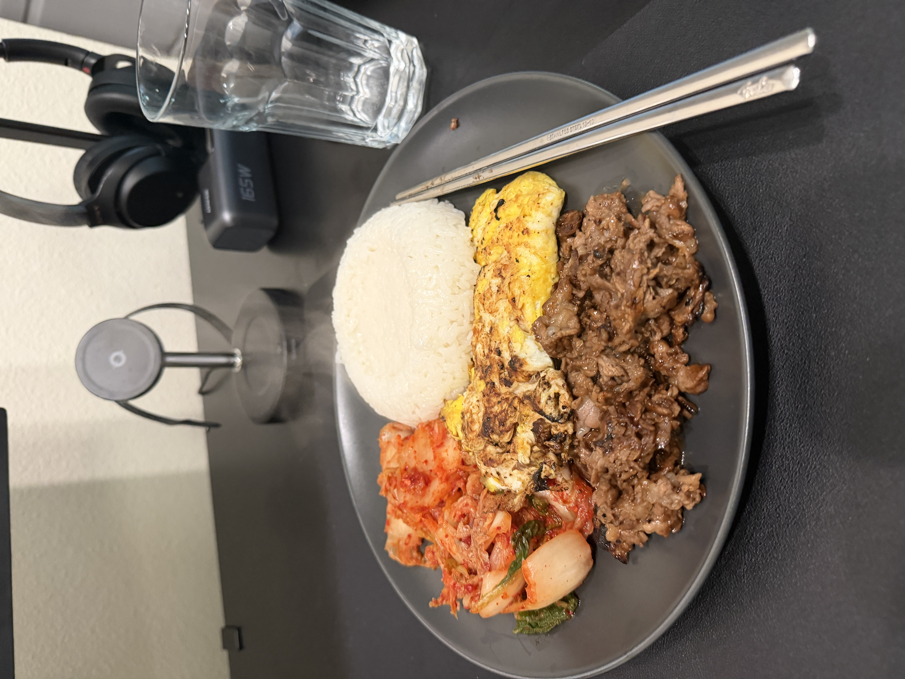

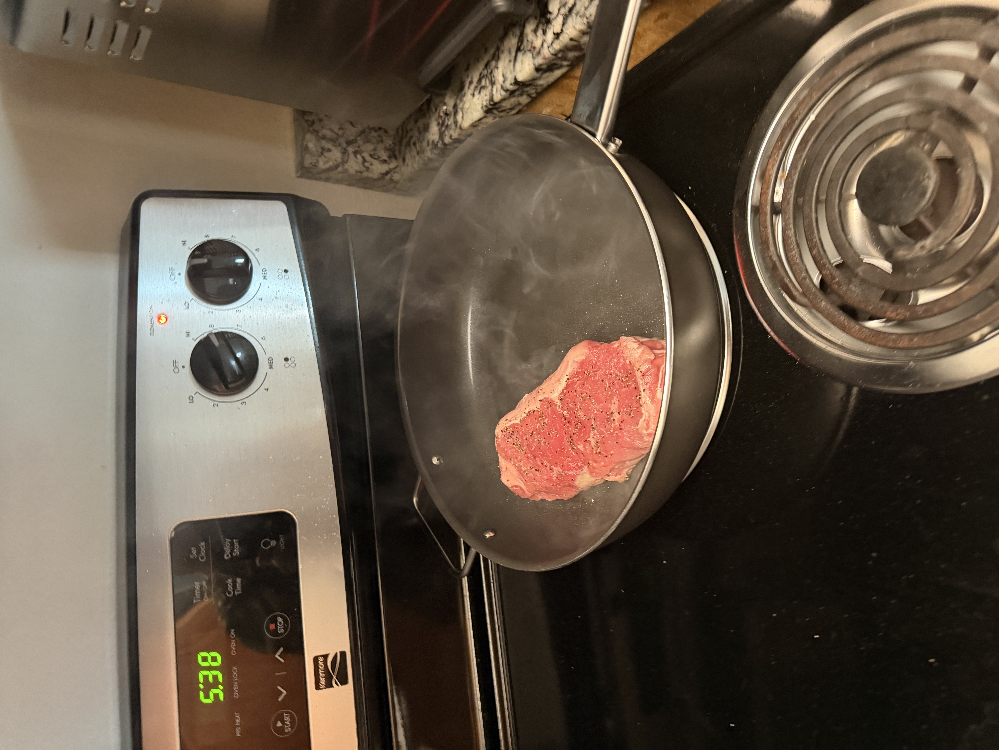

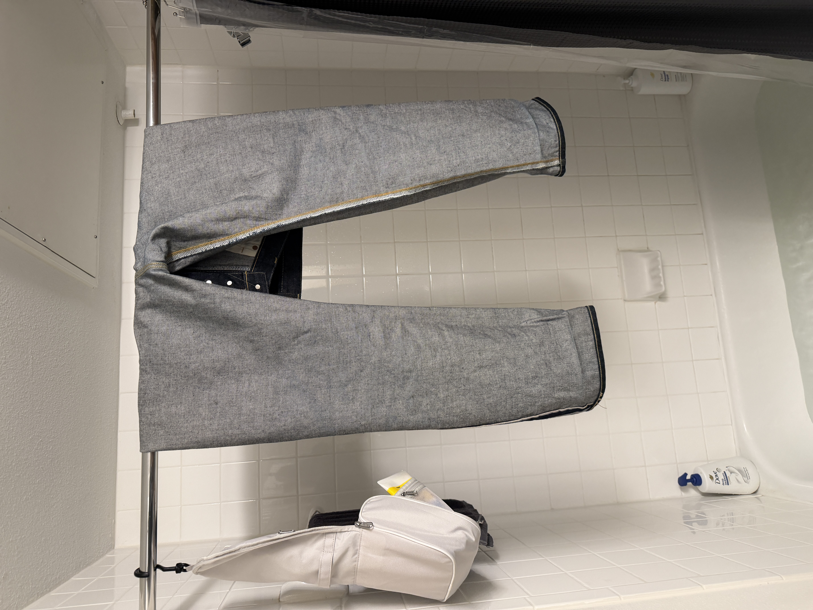

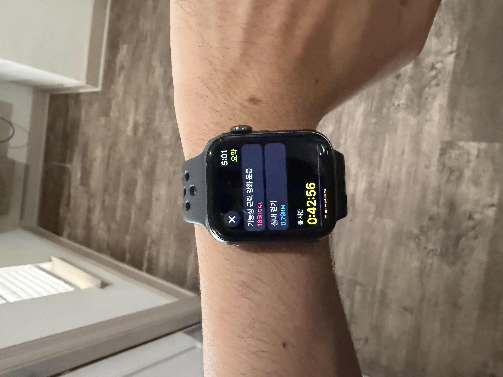
:::

## Day 2 — 9월 8일 (화) · 도전과 실패

어제 새롭게 도전 했던 요리와 소킹,
그리고 오늘의 새로운 도전은 실험과 영어이다.

여태 함께했던 슈퍼바이저가 나더러 배운 실험 내용을 스스로 재현해보라는 미션을 줬다.
프로토콜, 실험재료도 다 있겠다 혼자서 못할게 무엇인가?
하고 냅다 도전해본 실험은 잔혹한 결과로 다가왔다.

후술하겠지만, 똑같은 실험을 목-금에 걸쳐 다시 한번 시도하여 성공에 가까운 결과를 만들었다.
그렇다고 해서 첫 도전이 실패로 끝났다는 사실이 변하는가?

...

영어의 중요성을 점차 깨닫고 있다.
타일러의 유튜브 내용 중, 언어의 습득을 위한 세 가지 요소는 다음과 같다.
노출, 필요성, 동기.

필요성과 동기는 조금 헷갈릴 수 있는데, 예를 들어 내가 넷플릭스 영어 영상을 영어 자막과 함께 본다고 가정해보자. 내가 그 영상을 틀었으니 영상에 대한 이해에 대한 동기는 충분하다. 그렇지만 만약 내가 적절히 해석하지 못하는 장면에 대해서는 간편하게 자막을 보게 되는것이니 필요성이 낮은 것이다. (즉, 영어자막 끄고 영상 보세요)

노출은 충분한 것 같고,
필요성은 "영어 기반 문화 속에서 살아남기" 위해,
동기는 "연구에 관한 논의"를 연구자로서 자유자재로 하기 위해, 영어 공부를 더 열심히 하기로 했다.

이를 위해 주 2회 영어 회화 튜터링을 받기로 했고, 더 적극적으로 영어 공부에 임해야겠다.
그리고 혼자서 wordly wise를 공부할 동기가 부족한 것 같아, 이 지점도 튜터에게 도움을 받기로 했다. 매 세션마다 1주치 단어 중 익숙치 않은 것들만 추려서 커버할 예정이다.

::: {.photo-row}

:::

## Day 3 — 9월 9일 (수) · 배움은 늘 새로워

어제의 실험 결과에 낙심해, 오늘은 다소 일이 손에 잡히지 않았다.
처음부터 잘 할거라는 기대는 전혀 없었지만, 그것을 실제 결과로 마주하고 받아들이는 건 또 다른 문제다.

이전 실험실에서도 느꼈던 건데, 나는 다소 주의력이 산만한 편인 것 같다.
그래서 실험을 할 때는 온전히 그 실험에 모든 집중을 쏟아야한다는 결론을 냈고,
그 방법을 통해 다시 한번 실험 재현에 도전해볼 생각이다.
심기일전하여 프로토콜을 다시 점검하고, 목-금에 걸쳐 어떻게 할 것인지를 생생하게 시뮬레이션했다.

그 외에, 오늘은 LegendPlex라는 키트를 이용하여,
Casanova lab의 메인 타깃이 되는 여러 cytokine을 검출, 정량하는 방법을 배웠다.
처음에는 익숙치 않지만, 계속해서 곱씹다보면 어느샌가 원래 내것인양 정리된다.

::: {.photo-row}
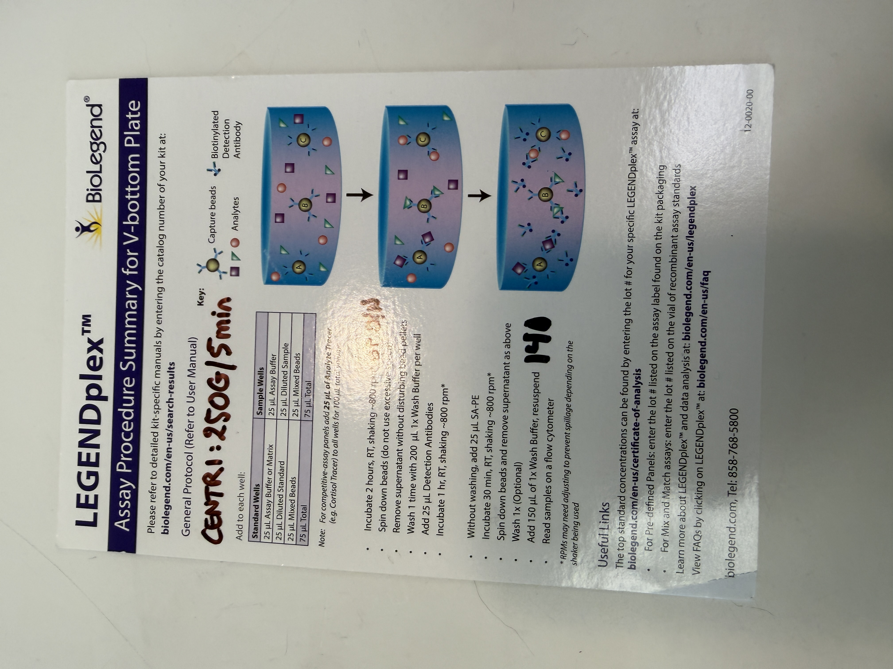

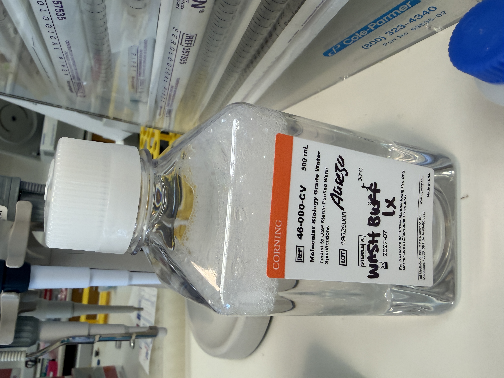
:::

## Day 4 - 9월 10일 (목) · 첫 시험 결과

지난주에 봤던 시험 결과가 나왔다.
결과는 평균보다 근소 우위. 걱정에 비해 나쁘진 않은 결과였다.
하지만 역시 사람은 쉽게 만족하지 못하는 법이다. (나만 그런가?)

조금만 더 좋은 점수를 받으면, A의 커트라인을 간신히 넘길 것 같다는 기대에
다음 시험도 심기일전해서 준비해봐야지.

그리고 내 슈퍼바이저의 Oral Presentation이 있었다.

Topographic memory T cell에 관한 세미나인데,
우리 몸의 면역을 구성하는 세포마다, 각기 달리 프로그래밍되어
특정 장기로 보내져 그 장기에 대한 기억 면역을 형성한다는 개념이다.
(세미나에는 높은 확률로 음식이 있고, 이번에는 피자였다!)

나는 그 중에서도 뇌로 가는 T cell에 대해 가설을 시험중인데,
만약 이게 진짜로 밝혀진다면 실제 임상으로도 연결점이 있을 것 같아 기대중인 프로젝트이다.

그리고 헬스장에 가는 길에, 미친듯이 폭우가 왔고,
서둘러 차를 돌려 집으로 돌아가는 길에 귀신같이 그쳤다.
그래도 포기하지 않고 아파트 헬스장으로 향해 무사히 운동을 완수할 수 있었다.

::: {.photo-row}

:::

## Day 5 - 9월 11(금) · 실험 재현 성공?!

이 날은 화요일의 실패에 심기일전하여,
하루종일 정말 실험에 몰입했고, 그 결과 어느 정도 재현에 성공했다.

목요일은 오늘의 실험을 위해 전처리를 해둬야 하는 부분이 있었고,
본 실험을 수업 끝난 직후부터 시작해서 퇴근 직전이 되어서야 마무리할 수 있었다.

정말 간단한 실험이었고,
누군가에게는 밥먹듯이 하는 일일 수 있지만
나에게는 그 조그마한 성공이 얼마나 큰 힘이 되는지 모른다.

내가 최근에 강력하게 믿고 있는 말이 있다. "To build confidence, build evidence"
이렇게 하루 하루 살아낸 증거가 내 블로그와 랩노트에 차곡히 쌓여서
박사과정 끝머리에 거대한 evidence, 그리고 그로 인해 단단한 confidence를 갖길 바란다.

그리고 간단한 실외 산책으로 하루를 정리했다.

'소울정'이라는 유튜버가 있는데,
그 유튜버가 했던 얘기 중 기억에 남는 이야기가 있다.
'변수'와 '상수'의 시간을 분리하라는 것.

세상은 너무나도 빠르게 변화하고, 타인과의 관계와 소통 또한 '변수'의 소용돌이에 있다.
그 속에서 나의 단단함을 기르기 위해, 오로지 '나'에 집중할 수 있는 '상수'의 시간을 갖기로 했다.

::: {.photo-row}
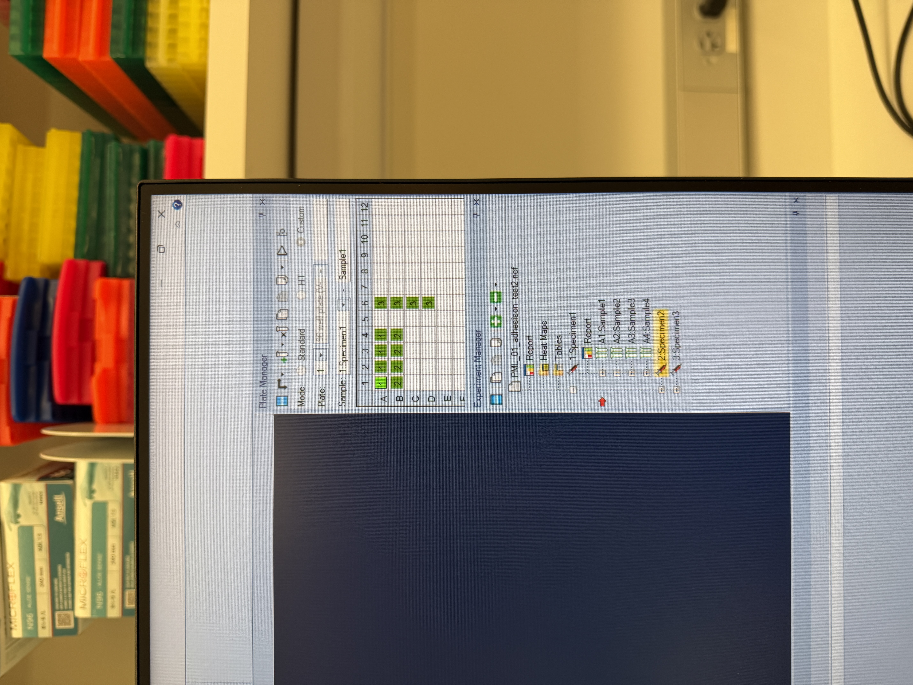

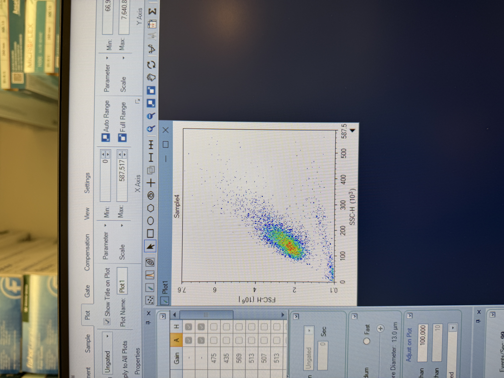

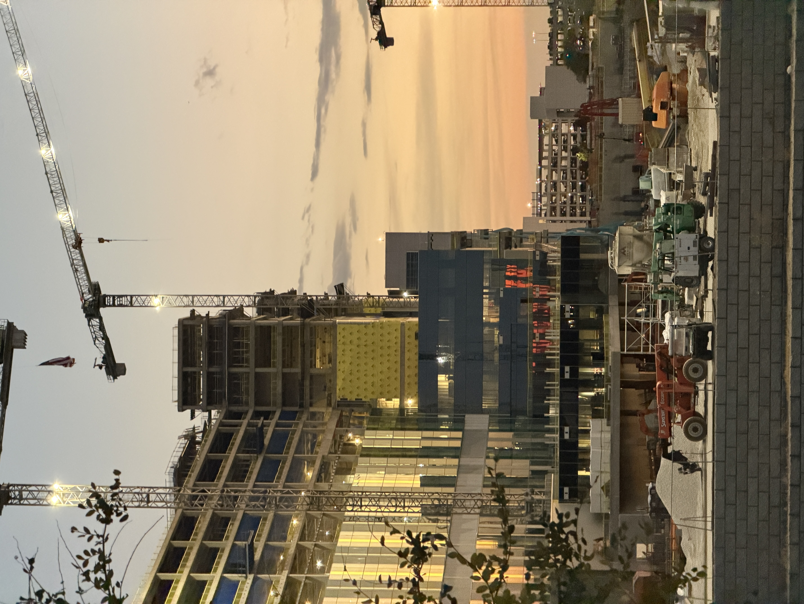
:::

## Day 6 - 9월 12(토) · '상수'의 시간, 마음 정리

유튜브에서 얘기한 '상수'의 시간은 하루 중 오롯이 나를 위해 정리하는 루틴을 만들라는 얘기였고,
나는 그 중에서도 '정리'에 집중하기로 했다.

말은 거창하게 내뱉았지만, 
지친 육신을 쉬게하고 내가 좋아하는 것들로 채워넣은 주말을 보냈다.
연속된 새로운 도전 속에서, 내가 익숙하고 좋아하는 쉼을 온전히 만끽했다.

그 시작은 이발이었다.

나는 이발하는 시간을 좋아한다. 
그 즈음이면 내 빽빽한 머리숱이 더 이상 자랄 곳이 없다고 괴성을 지르기도 하고,
아침마다 마르지 않는 머리에 한참동안 드라이기를 가져다 대고 있으면 종종 현타가 오기도 한다.

무거워진 머리를 가볍게 정리하는 이발을, 그래서 좋아한다.
이발 후에는 달달한 boba, 버블티를 한잔 마셔줬다.

:::{.photo-row}

:::

그리고 쇼핑!

내 계획은 크게 두 가지였다.
1. RRL 블랙온블랙 빈티지 파이브포켓
2. 해밀턴 카키필드 메카니컬 36mm

왜 갖고 싶었는지를 조금 더 풀어서 자세히 설명하자면 다음과 같다.

이번주 월요일, 처음 청바지를 소킹하면서 느꼈던 변화가 나름 재밌었고,
다른 청바지를 시도해보고 싶다는 생각이 들었다.

그리고 요즘 패션에 대한 소비를 스스로 돌아보며 조금 회의적인 부분이 있었는데,
구매 의사결정을 가볍게하는 것, 그리고 그 구매에 대해 다소 후회하는 순간들이 더러 있었다는 것이다.

그래서 조금 더 비싼 돈을 지불하지만, 
경년 변화라는 재미를 느낄 수 있는 청바지를 갖고 싶었고,
폴로의 본고장에서 구매하는 RRL 청바지는 의미가 있을 것 같았다.

그리고 시계.
해밀턴 카키필드 메카니컬은 왠만한 시계 매니아라면 알만한 유명한 시계이다.
시계라곤 애플워치밖에 차 본 경험밖에 없어서,
내 삶의 반경을 조금 더 넓혀보고 싶다는 생각에서 기웃거려보게 되었다.

그러다가 해당 모델이 원래 36mm는 단종시켰다가,
올해 2026년이 1776년 미국 독립기념일로부터 250년이 된다는 사실을 기념하여
올 한해에만 생산, 판매하기로 했다는 사실을 알게되었고,

이 기회에 한번 경험해보고 싶다는 생각이 들었다.

그리고 알게 된 충격적인 사실,

RRL은 너무나도 예쁜 옷이 많아서 다시 한번 제대로 들여다 보고싶었고,
카키필드는 다음주에 수령할 수 있게 되었다!

:::{.photo-row}

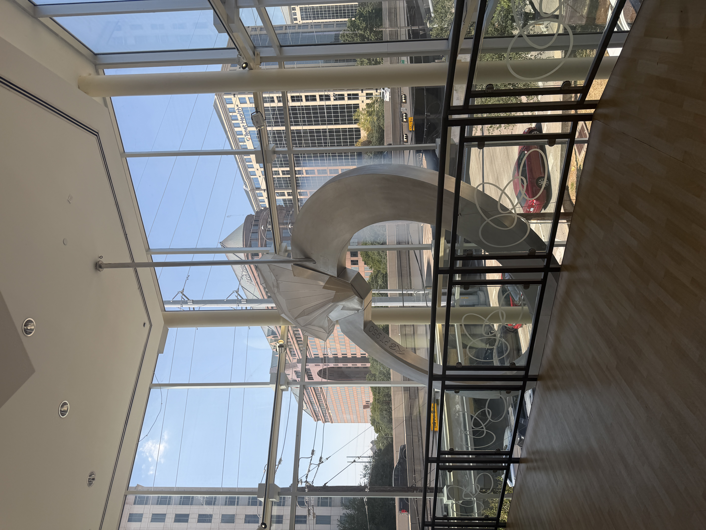

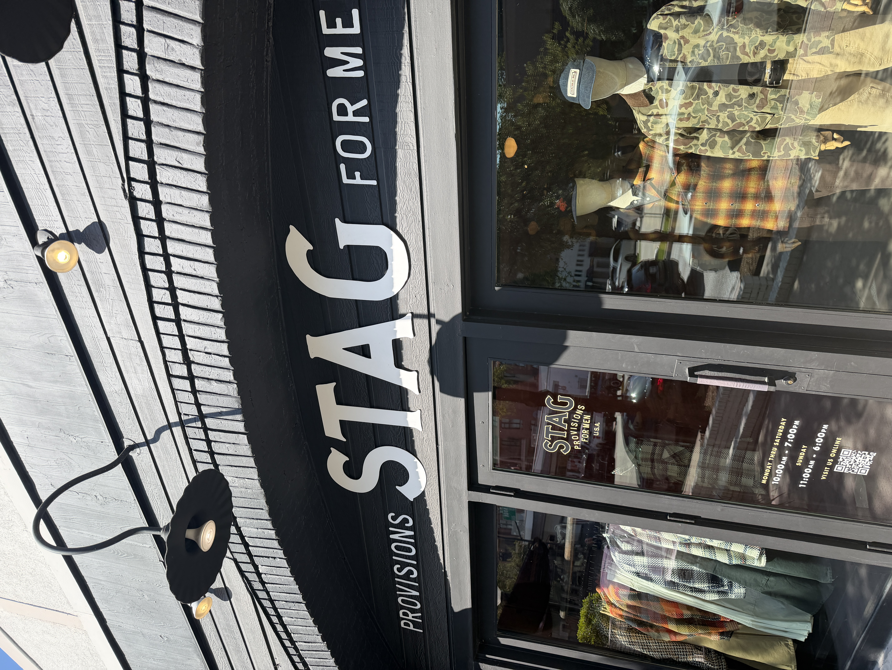

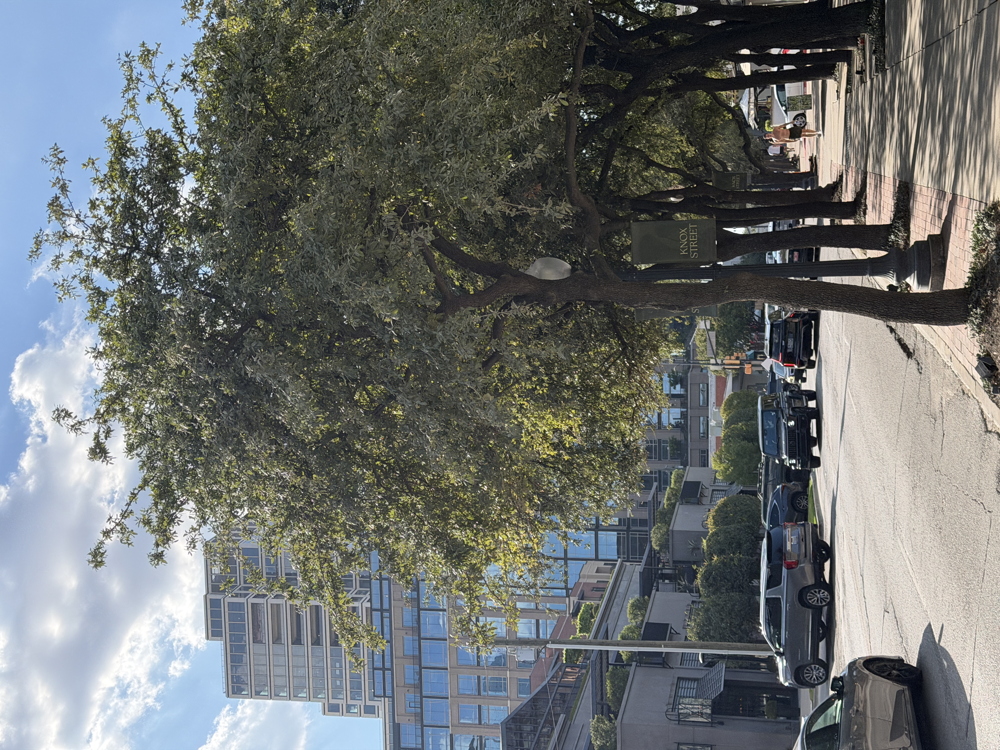
:::

그리고 동네에 대한 단상.
미국은 특히 동네마다 분위기가 천차만별이다.

내가 쇼핑했던 곳은 know street이었고,
모두가 평화롭게 걸어다니며 기분좋은 햇살이 비추던 동네였다.

어떤 환경에 스스로를 놓을지 고민해보게 된 순간이었다.

## Day 7 - 9월 13일(일) · 넷플릭스 하우스

오늘은 일본인 친구, 그리고 한국인 친구 두명 총 네명이서 함께 즐거운 시간을 보냈다.
그 첫 시작은 멕시코 타코집이었다.

우리가 한국에서 흔히 먹던, 
속이 각종 재료들로 꽉차 한 입 베어물면 와르르 무너지는 타코가 아니라,

정말 간단하지만 본질에 집중한,
겉은 빵이고 속은 고기인 정통 멕시코 타코였다.

때로는 복잡한 기교보다 간단한 직관이 통하는 법이다.

:::{.photo-row}

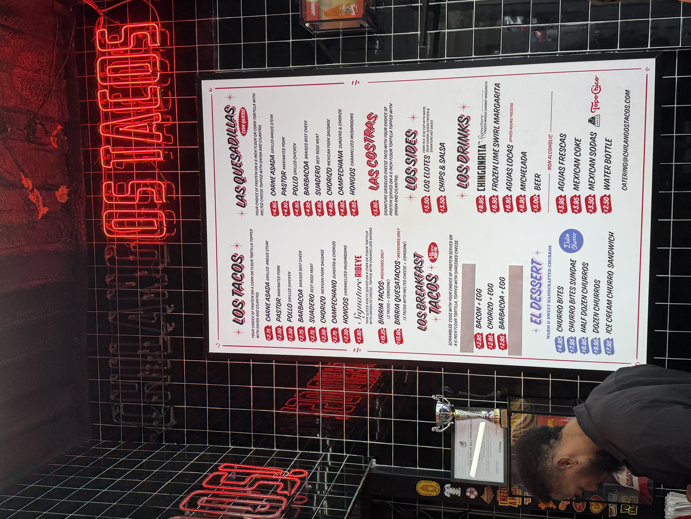

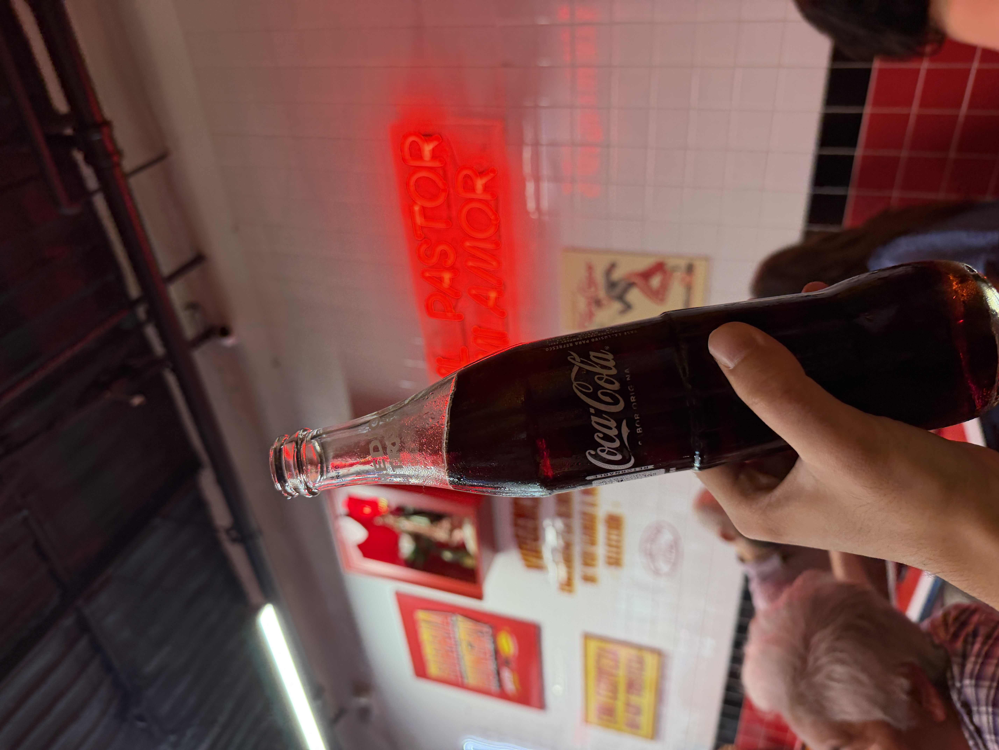

:::

그리고 그 다음에는 무얼 할까 함께 고민하다가,
넷플릭스 하우스에 가보기로 했다.

여기는 넷플릭스에 나온 여러 가지 시리즈를 경험할 수 있게 구성해놓은 테마관인데,
그 중 직접 제대로 참여하고 즐길 수 있는 건 '오징어게임'이었다. 약 $50.

실제로 우리가 '오징어게임'의 참여자가 되어서,
여러가지 게임을 직접 플레이하고 경쟁하는 테마관이었다.

기대와 달리, 
너무나도 실제처럼 잘 꾸며놓아서 정말 몰입해서 플레이할 수 있었다.
한번쯤은 경험해보는 걸 추천!

그리고 굿즈샵에 굉장히 다양한 물건들을 팔고 있었는데,
Stanger Things 기묘한 이야기를 재밌게 봤던 탓인지
관련 굿즈들이 예뻐보이는 게 많았지만 내 지갑을 열진 못했다!

:::{.photo-row}

:::

미국에 온지 6주차, 도전과 실패를 잔뜩 맛볼 수 있는 황금같은 시기이다. 이 순간도 그리운 날이 언젠가는 오겠지. 실패를 각오하고 도전에 나서지만, 실제로 실패를 받아들이는 건 또 다른 숙제이다.

이번주는 화, 목, 금 총 세 번의 운동에 성공했다. 그리고 또, 음식에 신경쓰겠다고 선언했던 것도 든든한 한식 조합으로 어느정도 선방해냈다고 볼 수 있다. 운동도 그렇고 음식도 그렇듯이, 아직 완전한 성공은 아니지만 이렇게 한 주씩 차곡히 경험을 쌓아가다보면 어느 순간엔가 나의 '상수' 영역에 들어와 있을 것이라 믿는다.

그런 의미에서 다음주에는 '상수', 내가 의미있게 지키고자 하는 변치 않는 것들에 대해 얘기해보려 한다. 

이번주는 다소 추상적이고 개인적인 내용이 많이 담긴 글이 되었는데, 내가 생각하고 느낀 것들을 이렇게 글로 다시 한번 차분히 써내려가는 것만으로도 많은 것들이 정리되는 것 같다. 그리고 훗날에도 다시 글로서 경험을 꺼내볼 귀한 자산이 될 것이라 믿는다.