미국에 온 지도 벌써 7주가 되었다.

돌이켜보면 지난 6주 동안 정말 많은 일들이 있었다.  
비행기를 타고 댈러스에 도착한 첫날부터 차를 사고, 운전면허와 SSN을 발급받고, 텅 빈 집에 가구를 하나씩 채워 넣었다. 오리엔테이션을 거쳐 첫 수업을 듣고, 처음으로 미국 연구실에 출근하고, 첫 시험을 치르고, 처음으로 실험을 혼자 해보기도 했다.

그래서 지난 6주 동안은 **가능한 한 많은 것을 기록하려고 했다.**

처음 미국에 도착한 나에게 하루하루가 새로운 사건이었기 때문이다.

하지만 이제는 조금 달라졌다.

차도 생겼고, 집도 어느 정도 자리를 잡았다.
학교에서 마주치는 사람들과 인사를 나누는 것도 익숙해졌고, 연구실에서 어떤 하루를 보내는지도 조금씩 알 것 같다.

무엇보다 이제는 매주 새로운 사건이 일어나기를 기다리기보다는, **이미 시작된 박사과정 속에서 내가 무엇을 배우고 있는지를 기록해야 할 시점**이라는 생각이 들었다.

그래서 앞으로는 지금까지처럼 매주 있었던 일을 하나하나 기록하는 것에서 조금씩 벗어나려고 한다.

물론 **Weekly Diary는 계속 쓸 예정이다.**
다만 이전보다 조금 가볍게, 그 주에 있었던 일과 생각을 남기는 정도로 기록하려 한다.

대신 한 달에 한 번 정도는, 그동안의 경험을 조금 더 길게 돌아보며 '미국 박사과정생으로 살아가면서 배운 것'을 정리해보려고 한다.

새로운 연구실에 빠르게 적응하는 방법, 논문을 읽는 방법, 사람들과 소통하는 방법, 로테이션을 선택하는 방법처럼 그동안 직접 부딪히면서 배웠던 것들을 하나의 주제로 묶어보려고 한다.

아마 앞으로의 글은 이전보다  '미국에서 무엇을 했는가'보다는 '미국 박사과정에서 무엇을 배웠는가'에 조금 더 초점을 두려한다.

그 첫 번째 이야기는,  
**[새로운 연구실에 빠르게 적응하는 방법](../../phd-in-us/journey/month1.html)**에 대한 이야기다.

...

그래도 여전히 주간 기록은 계속된다.

## Day 1 — 9월 14일 (월) · 아주 작은 방해물조차 모든 걸 망칠 수 있다

쉽지 않은 한 주의 시작이었다.
그리고 그 문제는, 실험의 아주 기본이 되는 작은 reagent로 부터 시작되었다.

실험에 쓰이는 여러 재료들 중 특히 antibody는 굉장히 고가이고, 아주 소량만 실험마다 쓰이기 때문에 유효 성분을 intact하게 유지하기 위해서 보통 aliquot을 한다. 쉽게 말하면 그 때의 실험에 쓰일만큼의 용량을 아주 잘게 소분하여 놓는 작업이다.

그래서 오늘은 supervisor와 함께, 새롭게 주문해놓았던 reagents들을 여러 vial에 나누어 소분하는 작업을 하려고 한 날이었다. 그러나 그 aliquot용 라벨기가 말썽을 일으키기 전까지는 말이다.

늘 하던 것처럼 cell number를 count해서 세포들이 살기 좋은 환경으로 이주시켜주고, 또 그리고 오늘은 2주마다 immunology program에 소속된 학생들이 presentation을 하는 WIPS 프로그램을 하는 날이라 여기에 참석했다.

그리고 나서, 본격적으로 aliquot을 시작하려고 보니 label기와 연결된 컴퓨터가 먹통인 것이었다. 그래서 두 가지 방법을 시도했는데, 모니터를 바꾸거나 라벨기를 다른 컴퓨터와 연결해보았다.

모니터를 바꾸었을 때 역시 먹통이라 본체가 문제인 걸 알게 되었고,
나는 내 맥북으로 라벨기를 연결해보려고 안간힘을 쓰고 있었다. 해당 라벨기의 모델명을 찾아서 소프트웨어를 다운로드 받고, 연결까지 성공했으나 우리가 사용하고 있던 라벨 용지의 규격에 맞지 않았던 탓인지 원하는 바가 전혀 라벨에 출력되지 않았다.

다시 원점으로 돌아와, 컴퓨터 본체를 고쳐보려고 했다. 결국 우리 힘으로 안돼서, Bertrand이라는 다른 Senior의 도움을 받았다. 그는 본체와 연결된 모니터 송출기(?)의 문제라고 생각했고, 다른 부분으로 신호가 갈 수 있도록 그 문제가 된 송출기 부분을 본체에서 뜯어내버렸다.

그러자 믿기지 않게 작동하기 시작했다!

물론 이 모든 과정이 결국 저녁 늦은 시간이 되어서 끝나는 바람에,
목표했던 aliquot은 하나도 못한채로 라벨만 잔뜩 출력하고 다음 날을 위한 준비를 마쳤다.

::: {.photo-row}

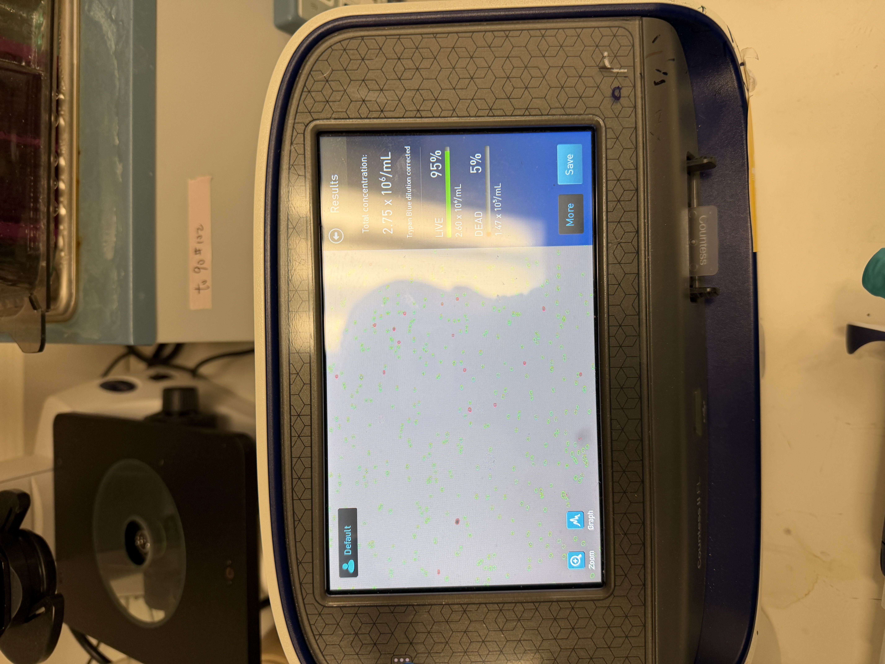

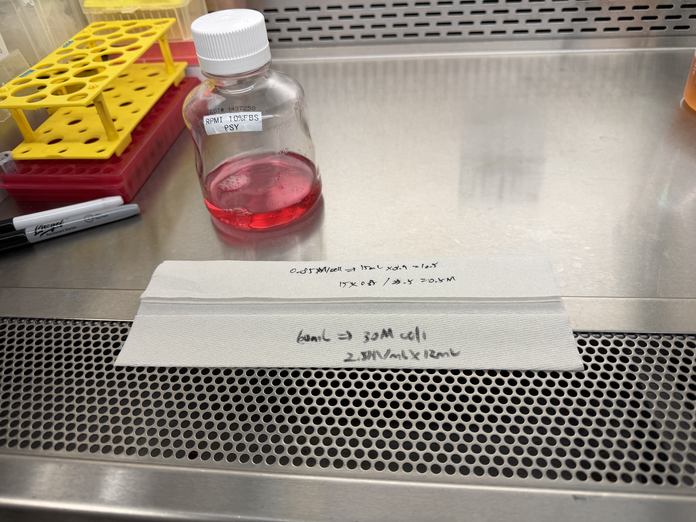

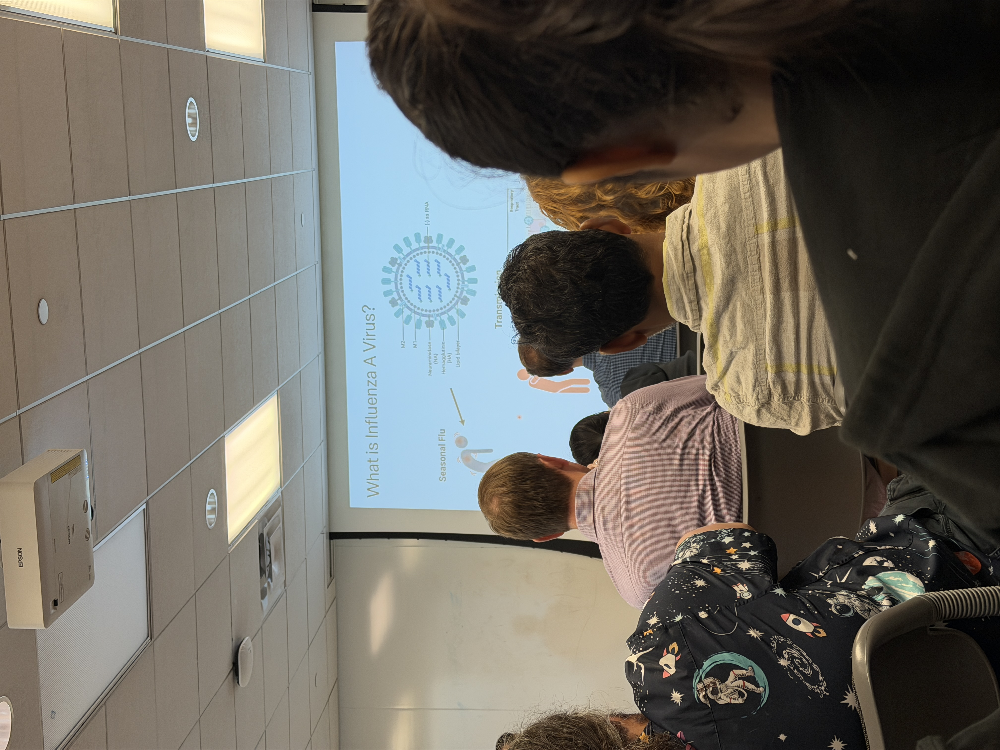

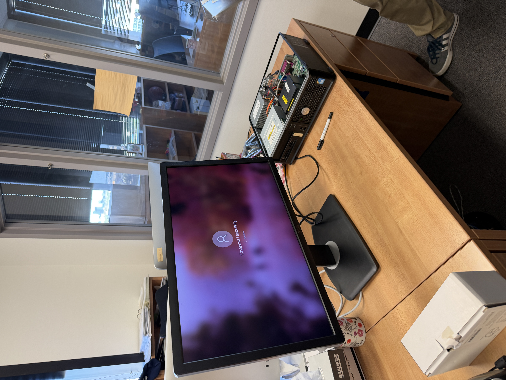
:::

## Day 2 — 9월 15일 (화) · 실험 그리고 실험

오늘은 꽤나 중요한 실험이 있는 날이었다.
Supervisor와 함께, 두 개의 실험을 동시에 진행하는 날이었다.

그리고 그 실험 도중에는, 어제 마치지 못한 Aliquot까지 진행하는 일정이었다.

...

확실히 한 분야에서 거의 10년 이상의 세월을 보낸 사람과, 그렇지 않은 사람의 격차는 상상 그 이상이다. 그는 마치 머릿속에 protocol이 통째로 들어있는 것처럼, 그리고 보이지 않는 세포들의 움직임과 추가하는 reagent의 상호작용까지 머릿속에서 시뮬레이션되는 사람처럼 움직였다.

물론 최대한 설명을 동반하면서 알려주기는 해서, 80% 정도는 따라가고 있는 것 같다. 하지만 아주 복잡한 순간이 되면 그도 설명하기를 멈추고, 휙 진행하곤 해서 이런 부분이 생길때마다 노트해두었다가 아주 긴 복기 과정을 거친다. 

왜 이 순간에는 이렇게 했을까, 나였다면 이렇게 했을까, 이런 생각을 하다보면 아주 중요한 부분을 새롭게 알게되기도 하고, 또 한편으로 지금은 얼마나 많은 부분들을 놓치고 있는건지 혼란스럽기도 하다. 모든 로테이션 학생들이 아마 비슷한 과정을 겪고 있겠지? 라고 생각하며 스스로 위안삼는다.

...

그리고 지금 매주 화요일 목요일 저녁 7시마다 40분 가량의 일대일 영어회화 과외를 받고 있는데, 오늘도 역시 어김없이 그 시간이 찾아왔다. 다만, 실험이 길어져서 정말 죄송하게도 한 시간 가량 늦게 되었는데, 자초지종을 말씀드렸더니 마침 일정이 비어있으시다고 흔쾌히 시간을 옮겨주셔서 정말 다행이었다.

집에 도착하니 저녁 7시 45분, 미친듯한 속도로 볶음밥을 데우고 핫도그와 함께 내가 뭘 먹는지도 모른채로 집어 삼켜버렸다. 그리고 8시. 오늘 수업의 주제는 다음과 같다.

- milestones in your life
- Your personality
- In terms of living, do you prefer big cities or small towns

영어로 대화하다보면, 나도 몰랐던 나의 모습을 새롭게 발견하게 되는 것 같다. 어디선가 본 것 같은 내용이 있는데, 중요한 의사결정은 최대한 다양한 언어로 시도해보라는 내용과 비슷한 느낌을 받았다. 한국어로는 이렇게 말하지 않았을텐데, 영어의 간결함과 직관성으로 인해 조금 다른 방식으로 나를 표현하는 나를 새롭게 관찰하게 되어 내심 놀랐었다.

그리고 이를 자연스럽게 이끌어내는 역할을 해 주시는 튜터 선생님께도 감사한 감정이 들었다. 이 수업은 단순 영어 수업이 아니라, 몰랐던 나를 발견하고 또 더 나아가 나의 인지범위를 넓히는 훈련이라고 생각하니 더 의미가 깊은 시간으로 느껴졌다.

::: {.photo-row}

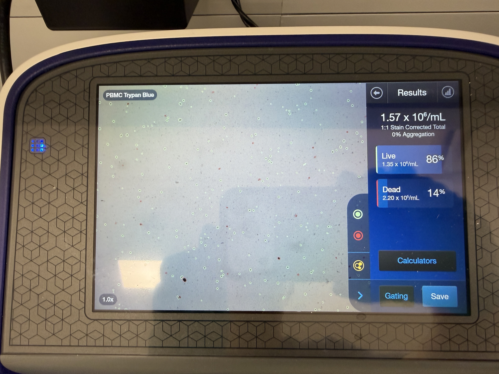

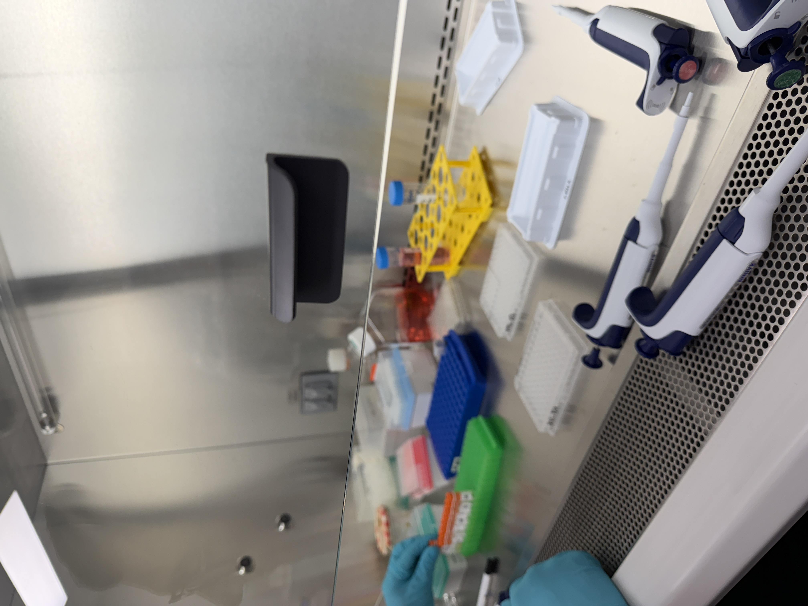

:::

## Day 3 — 9월 16일 (수) · 반복되는 실패

어제 마쳐둔 실험을 보관해두고, 오늘은 그 결과를 직접 분석해보는 날이었다.

항상 이 순간은 긴장과 설렘이 공존한다.

내가 생각한 대로 결과가 나왔을까? 정말 간절한 마음으로 결과를 살펴보지만,
항상 그 생각과 다른 결과를 마주한다.

깊은 좌절도 한 순간, 어떤 차이가 이런 결과를 만들었을지 여러가지 가능성을 생각해보기 시작한다. 이제 점점 실패를 겪는데에 익숙해져 가나보다.

어쨌든 이번 실험의 예상치 못한 결과에 나와 supervisor 모두 꽤나 당황했고, 여러 가지 가능성에 대해 함께 disucssion을 나눠보다가, 세포 자체에 뭔가 문제가 생긴게 아닐까라는 생각을 하게되었다.

그래서 다음주에는, 냉동되어 있는 parental cell을 새로 꺼내서 실험을 반복해보기로 했다.
그 전에, 이 결과가 정말 cell의 문제인지에 대해 조금 더 확실히 하기 위해서, 나에게 단독 실험을 지시했고 나는 이 실험을 위해 금요일 새벽 6시부터 학교로 향해 실험했다..(금요일 일과에서 계속)

::: {.photo-row}

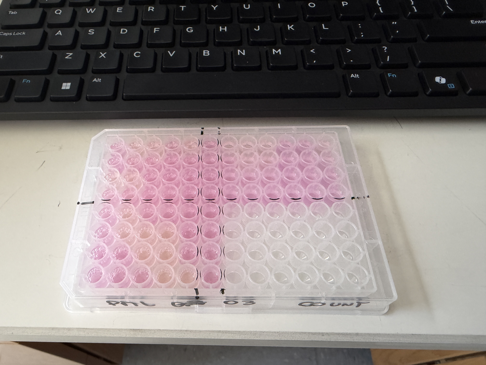

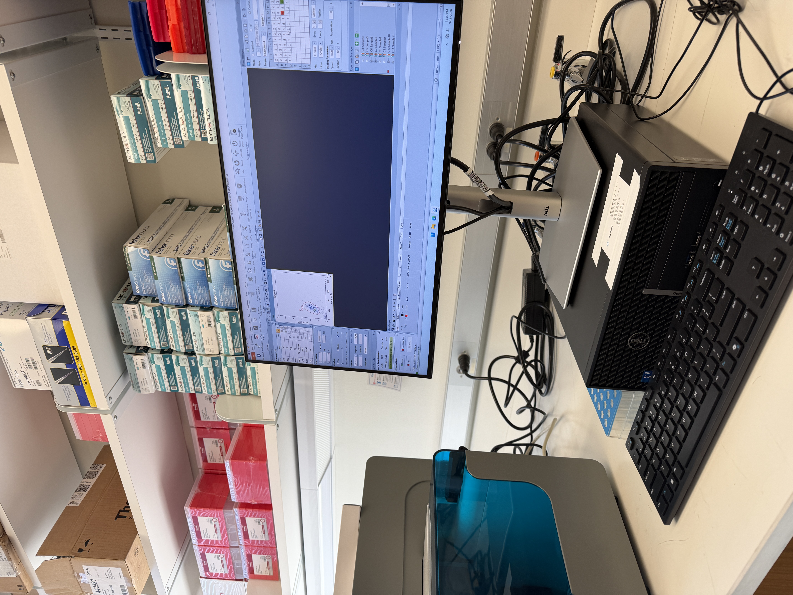

:::

## Day 4 - 9월 17일 (목) · 쉬어가기

조금 지치는 한 주였다.

예상했던 결과대로 나오지 않았던 실험의 탓일까,
아니면 항상 냉방 풀가동인 모든 실내 장소로 인해 냉방병이 도진 탓일까.

그래서 오늘은 나의 흐름을 되찾기 위해 과감하게 조금 쉬어가기로 결정했다.

cafeteria에는 항상 비슷한 음식이 serving되고,
나는 그 중에서 texas cheese burger 외에 worth it 하는 음식을 찾지 못했다.
그렇다고 주구장창 햄버거만 먹을 수는 없으니, 간만에 pizza를 먹었다.

먹을때는 맛있었는데, 시간이 조금만 지나니까 복부 팽만감이 밀려왔다. 이래서 항상 점심에는 배가 고파도, 많은 음식을 먹지 않게 되는 것 같다. 속이 불편해서 건물 내부를 좀 걸어다니다가, 풍경이 꽤나 힐링되는 비밀 spot을 찾아 그 곳에서 30분가량 머무르며 쉬었다.

아무래도 텍사스이다보니, 모든 것들이 다소 접근하기가 어려운 문제가 있다. 가령, 단순한 장보기를 하고 싶다고 해도 가장 가까운 트레이더조스가 차로 15분, H mart는 차로 20분이다. 분명 텍사스 치고는 가까운 거리이긴 하지만, 그 어떤 곳을 가더라도 차로 n분 이상 가야한다는 사실이 마냥 썩 달갑지는 않다.

학교 생활도 예외는 아니었다. 물론 캠퍼스 내에 카페, 식당 등 필요한 것들은 다 갖춰져 있다. 그러나 그 선택지가 하나밖에 없다보니, 이상하게도 어느 날에는 조금 다른 종류의 다른 무엇인가가 당기는 날에는 차로 움직여야 하는 것이었다. 물론, 대학원생의 입장에서 점심 혹은 카페에 가기 위해 차를 타고 캠퍼스 밖을 나가는 것이 time-efficient하지 못하다는 결론으로 항상 이어지기 때문에, 점심 시간에 다른 장소를 시도해본 적이 아직까지는 없다.

...

그리고 오늘의 두번째 영어회화 세션. 오늘은 다음과 같은 주제들을 다뤘다.

- definition of success
- is it important to be liked by others?
- pros and cons of social media

소셜 미디어에 대해 그렇게 깊이 생각해본 적이 없었는데, 나는 생각보다 다른 사람들의 관심을 갖고 싶어한다는 마음이 있다는 것을 알게 되었다. 사실 관심을 갖고 싶다기 보다는, 나의 영향력이 많은 사람에게 닿기를 원한다는 욕망이 있는 것 같았다. 

결국 대학원의 끝에서 하고자 하는 신약 개발 역시도, 로컬 약사의 직무에서 벗어나 더 많은 환자들에게 효용을 누릴 수 있도록 도움주고 싶다는 생각이 있었기 때문이었다.

그래도 이 사회가 온전히 역할을 하기 위해서는 누군가는 로컬 약사, 그리고 누군가는 신약을 개발해야 한다. 둘 다 똑같이 필요하다는 뜻이다. 그럼에도 나에게 조금 더 과학적인 적성을 요하는 일이 맞는 옷이라는 생각을 했고, 지금은 꽤나 만족스러운 옷을 입고 있다는 생각이 들었다.

::: {.photo-row}

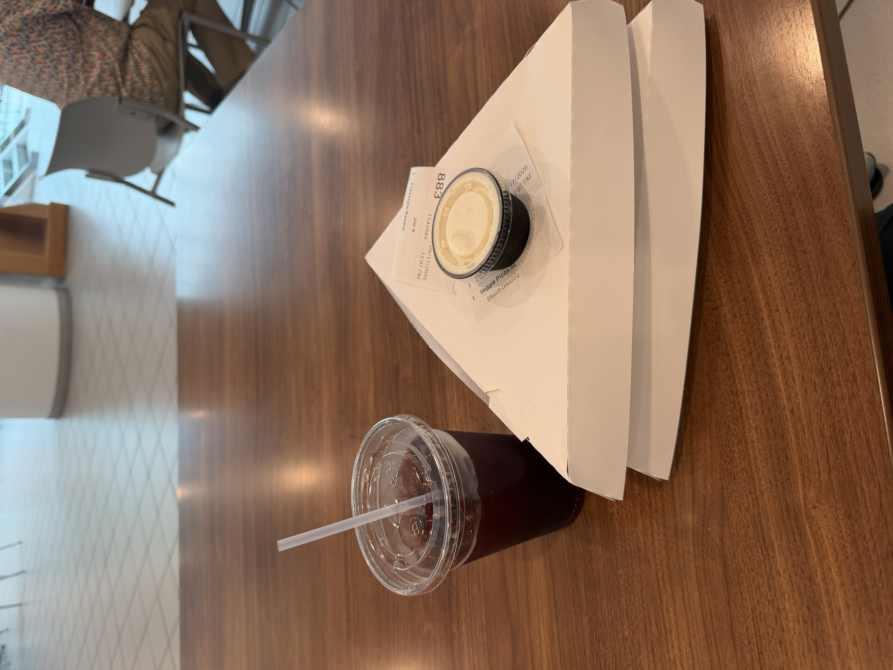

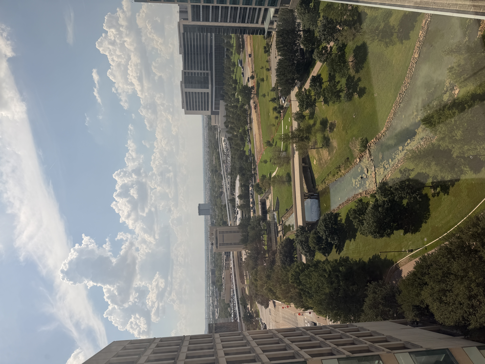

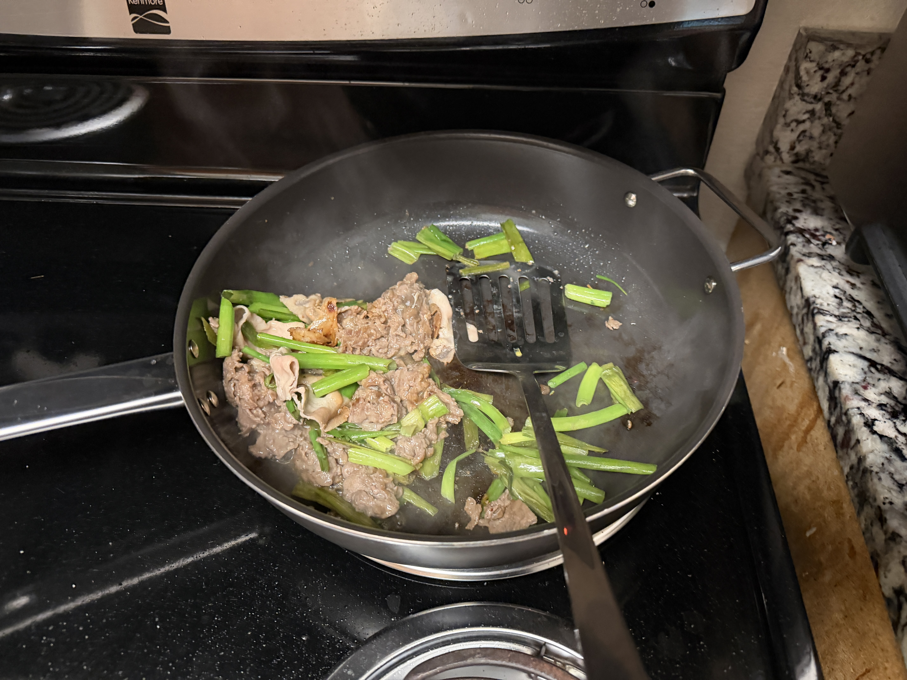

:::

## Day 5 - 9월 18(금) · 연구실 사람들과 Hang Out!

대망의 그 날이다. 
Supervisor가 얘기해둔 실험을 제 시간에 완수하기 위해서, 바쁜 하루를 보냈다.

0900-1030 Lab meeting
1130-1300 Lab organization meeting
1400-1600 Lab Genetics analysis meeting

이 날 하루만 해도 세 개의 다른 미팅이 있었기 때문에, 
그 사이 사이의 시간을 활용하면 도저히 실험을 제 때 끝낼 수가 없었다.

그래서 전 날 목요일 퇴근 전에, 금요일 실험을 위한 전처리를 미리 수행해두었고,
오늘 새벽같이 일어나 학교로 부리나케 달려가서 실험을 시작했다.

내가 내 뜻대로 잠을 포기하면서까지 능동적으로 움직였던 순간이 꽤 오랜만이었다.
나는 잠이 꽤 중요한 사람이고, 대부분의 일들, 약대 시험까지도 내 잠을 포기시키지는 못했다.

그 만큼 지난 화요일 실험 실패의 충격이 컸던 것일까, 아니면 실험 실패의 가설에 대해 내 스스로가 많이 궁금했던 탓일까. 아직 나에 대한 이해가 온전치 못해 그 어느쪽도 틀린 방향은 아닌 것 같았다.

어쨌든 계획한 대로 아침 일찍부터 실험을 마치고, 아침을 먹어준 후 남아있던 실험을 마무리했다.
그리고는 Lab Organization meeting에서 제공된 점심으로 피자를 먹었다.(이럴 줄 알았다면 어제 피자를 안먹는건데! 그래도 역시 싸제 피자가 여기 식당 피자보다 훨씬 낫다.)

오후에 분석까지 마쳤는데, 또 역시나 결과가 온전치 않았다. Supervisor에게 얘기를 하니 cell에 문제가 있는 것 같다고 해서, 다음주에는 새로운 cell로 다시 시스템을 테스트해보기로 했다.

::: {.photo-row}

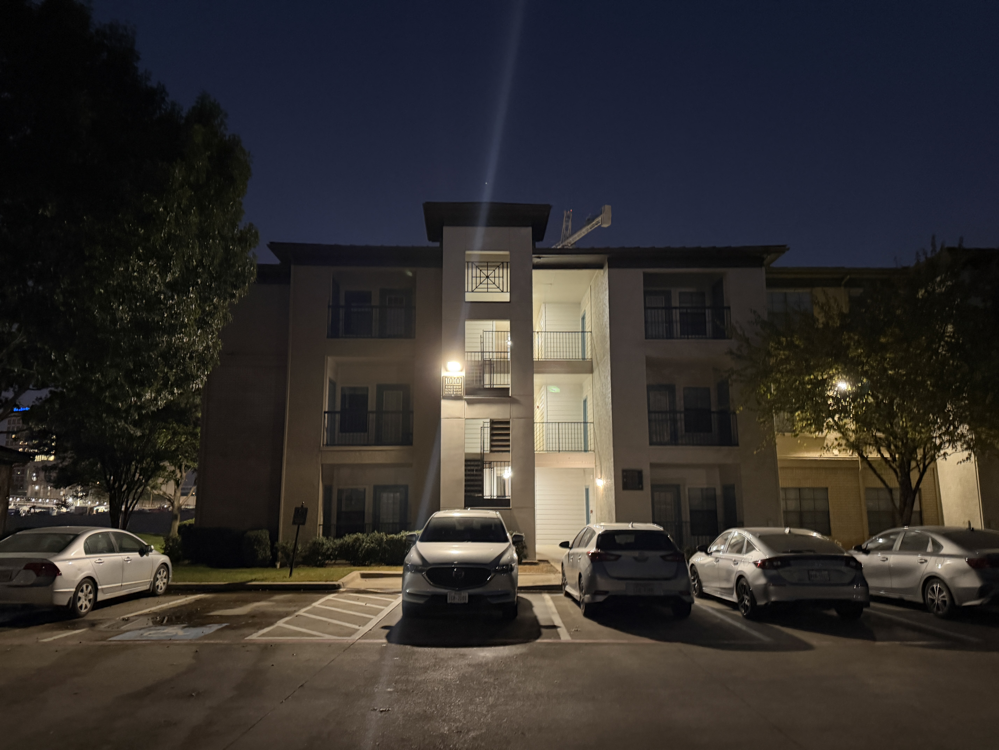

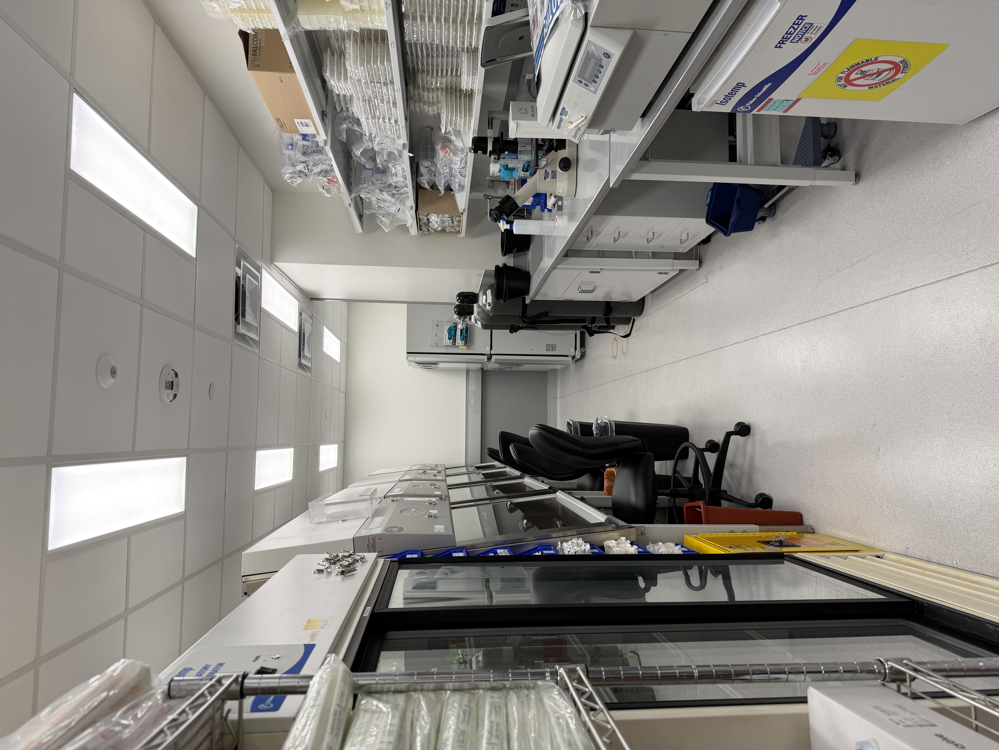

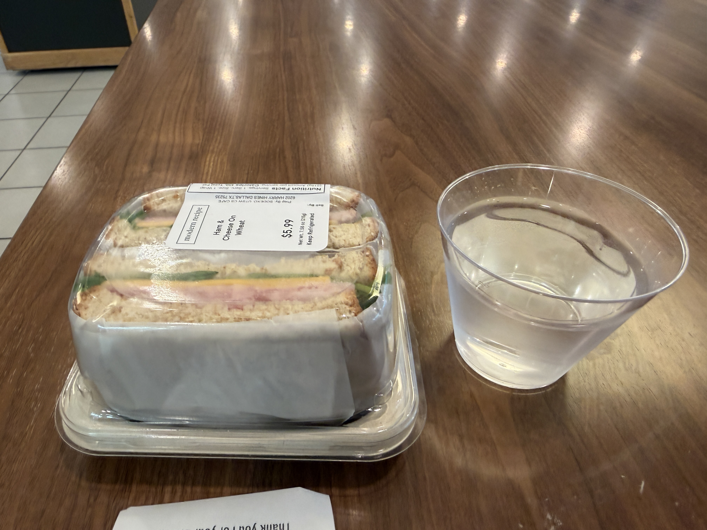

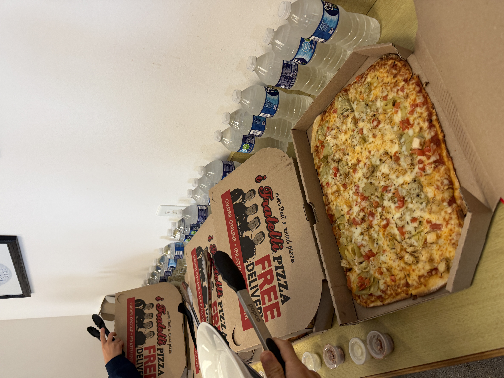
:::

그리고 연구실 사람들과 Hang out!
Bishop Art Street라는 곳에 놀러갔는데, 여기 사람들 표현으로는 Cute한 Shop들이 많고 Cozy한 Place라는 말을 빌려서 표현할 수 있겠다.

꽤나 힙한 동네였고, 적당한 기념품 가게들과 괜찮은 바들이 많이 있었다.
특히 기억에 남는건 bookstore로 운영하던 바였는데, 책을 한권 사면 한잔이 공짜!
물론 논문 읽어야 해서 책은 못샀다.

그리고 연구실 사람들 7명과 함께 어울려 술을 마셨다.
Postdoc 두명(Ahmad, Jessica), Trainee 네명(Maira, Maxime, Brooklyn, 나) 그리고 파리에서 놀러온 Ahmad의 친동생(미안하지만 이름을 까먹었다..)까지 총 7명이었다.

내 Supervisor인 Ahmad는 Rising star라고 불릴만큼 연구도 잘하지만, 또 노는데도 진심이었다. 거의 반 끌려오다 싶이 했던 나는 아침부터 살인적인 스케줄에 많이 피곤했지만, 친구들과 같이 노는게 너무 즐거워서 최대한 남아있다가 오려고 했다.

미국 친구들과 제대로 시간을 보내는 건 거의 처음이었다. 뉴욕에서 온 친구들이라서 뭔가 문화가 다른건지는 몰라도, 음식 없이 빈속에 술부터 때려넣었다. 그렇게 한참동안 술만 마시다가, 저녁 8시나 되어서야 저녁을 먹으러갔다. 나는 너무 피곤하기도 했고, 별로 배가 고프지 않아서 저녁 자리로 이동하는 길에 인사를 하고 집으로 향했다.

친구들에게 추천받아 aperol spritz라는 술을 시켰는데, 아주 상큼하니 맛이 좋았다. 나중에 찾아보니 이탈리아의 포도주 기반 칵테일이라고 한다. 그리고 그 도수는 11% 정도. Spritz에도 여러 종류가 있어서, 다음에는 다른 종류로 한번 더 시도해봐야겠다.

::: {.photo-row}

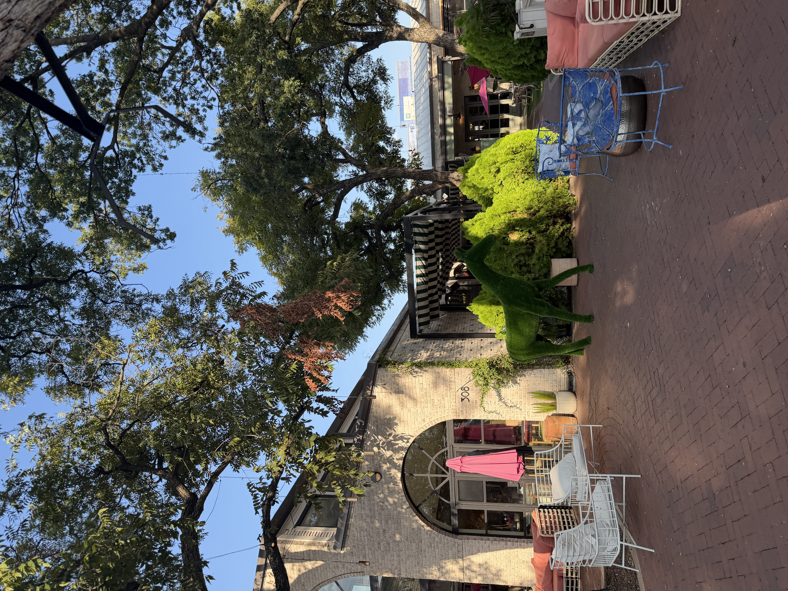

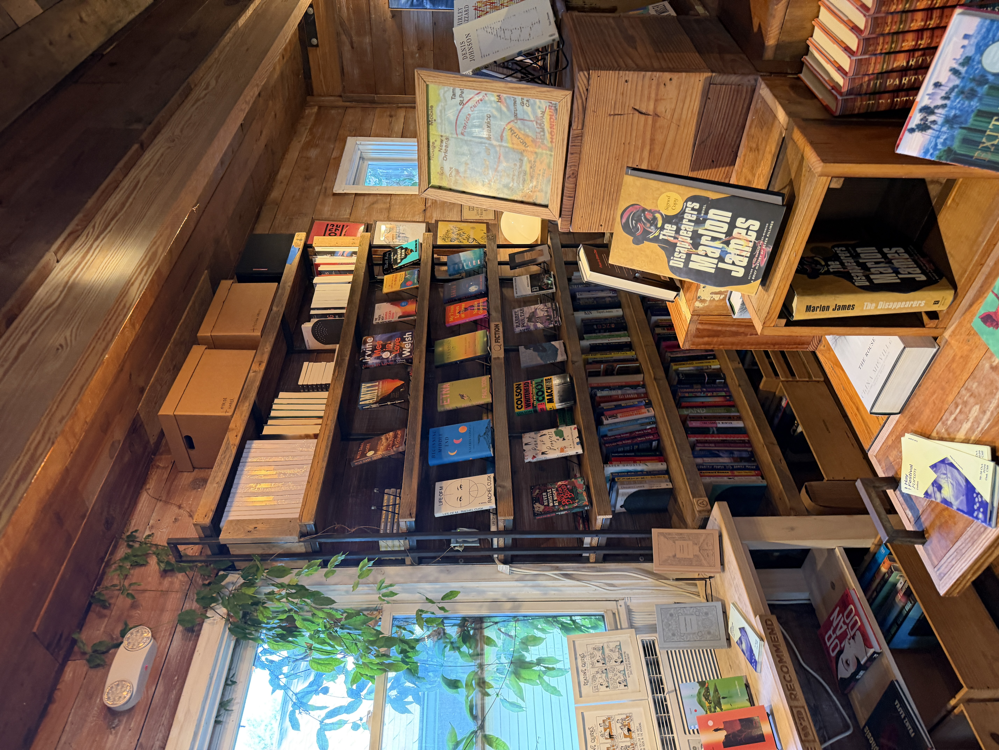

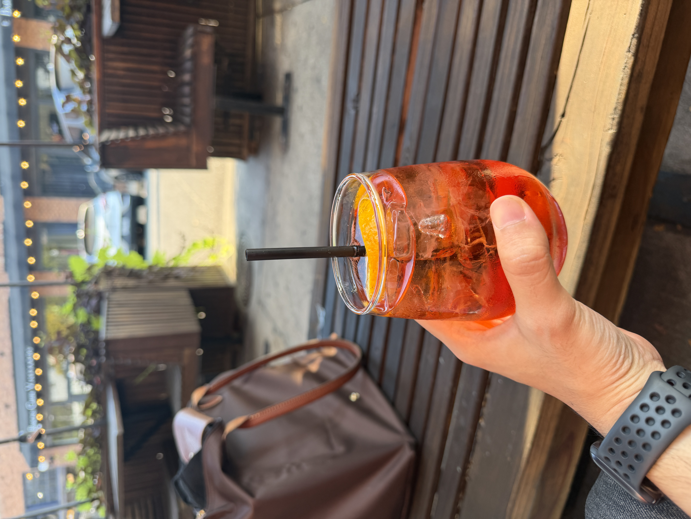

:::

## Day 6 - 9월 19(토) · Balloon Festival

오늘은 너무 너무 알찬 하루를 보낸 날이었다.
조금 분량이 길어질 듯 해서 세 가지 섹션으로 분리하려고 한다.

### Ryoske와 점심

일본인 친구 Ryoske가 달라스에 온 이후로 in-n-out과 chick-fil-A를 먹어본 적이 없다고 했다.
그 말에 너무 충격받은 나는, 점심으로 한번 데려가주겠다고 제안했다.

그리고 그 날이 바로 오늘이었다!

Double-double meal에 animal fried fries, 그리고 diet coke까지
이보다 완벽한 햄버거집은 아직 찾지 못했다.
(Chick-fil-A와 가히 양대산맥을 이룬다.)

신선하게 느껴지는 햄버거 속 재료와, 두툼한 두 장의 패티.
그리고 카러멜라이즈드 된 잛게 썬 양파, 그리고 그 위로 치즈 폭탄이 올라간 animal style의 frided fries까지.
아 그리고 케첩을 푸는 곳에 가면, 노란색 작은 할라피뇨가 있는데 이걸 꼭 곁들여야 한다.

미국식 느끼함을 싹 잡아주면서 살짝의 sour함과 매콤함으로 맛의 밸런스를 잡는데, 정말 기가 막히다.

그렇게 간단히 점심을 먹으면서 이런 저런 얘기를 하다가, 사우나 얘기를 하게 되었다.
아무래도 일본과 한국 두 나라 모두 사우나 문화가 굉장히 발달한 곳이기 때문이었을까.
Ryoske는 사우나를 너무 좋아해서, 자기 일본인 친구와 함께 핀란드로 사우나 여행까지 다녀온 적이 있었다고 했다.
그리고 뉴욕에 있을 때도, 아주 비쌌지만 사우나를 경험했다고 했고.
그런 얘기를 하다가 어느 날 같이 사우나를 가기로 했다. 달라스에 한 곳 쯤은 있겠지?

그리고 H-mart를 가는 김에 한국인 친구를 한 명 더 데리고 셋이서 같이 간단히 장을 보러 이동했다. 전에는 보지 못했던 한국 과일인 배가 입점해 있었고, 그리고 한국에서도 보지 못한 대용량 복분자주도 있었다. 다음에 미국 친구들을 초대하게 되면, 이 대용량 복분자를 잔뜩 먹여 한국의 매운맛을 보여줘야겠다.

그리고 곧 있을 한국의 대명절인 추석을 대비해 송편을 하나 샀다.

::: {.photo-row}

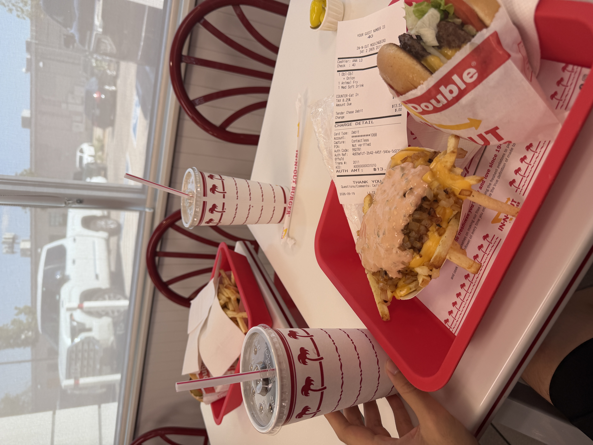

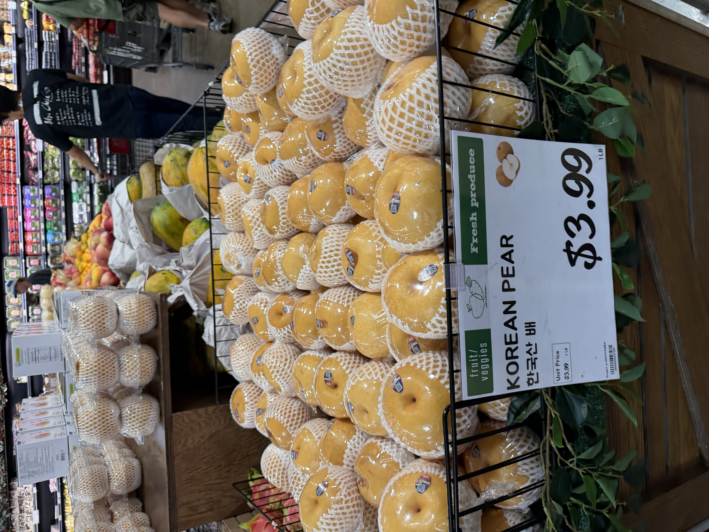

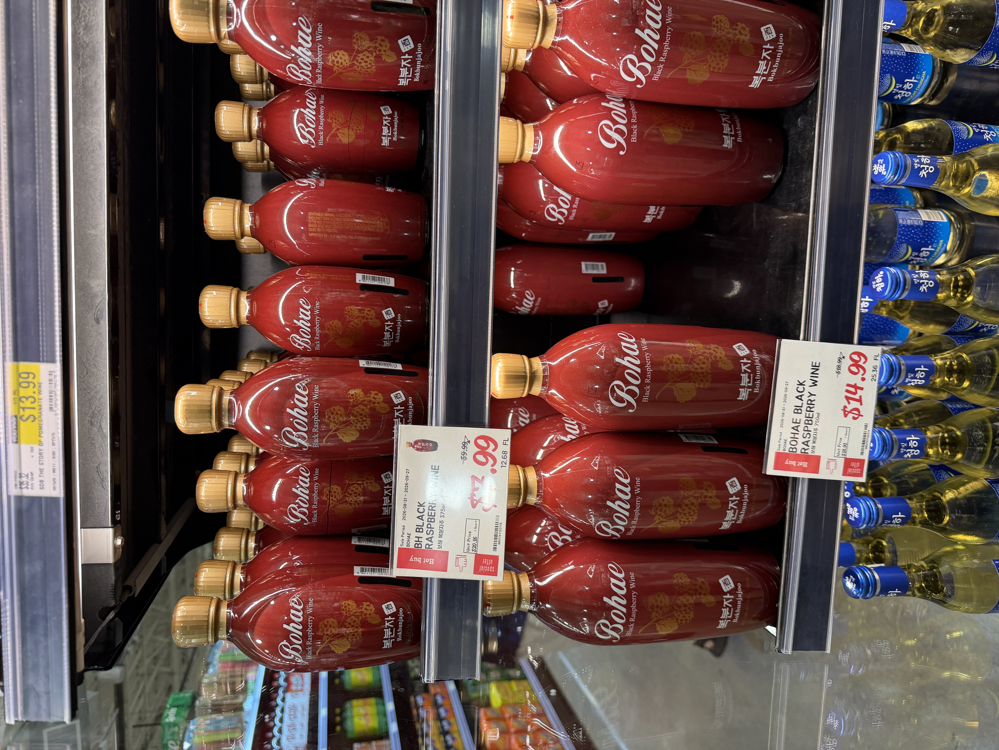

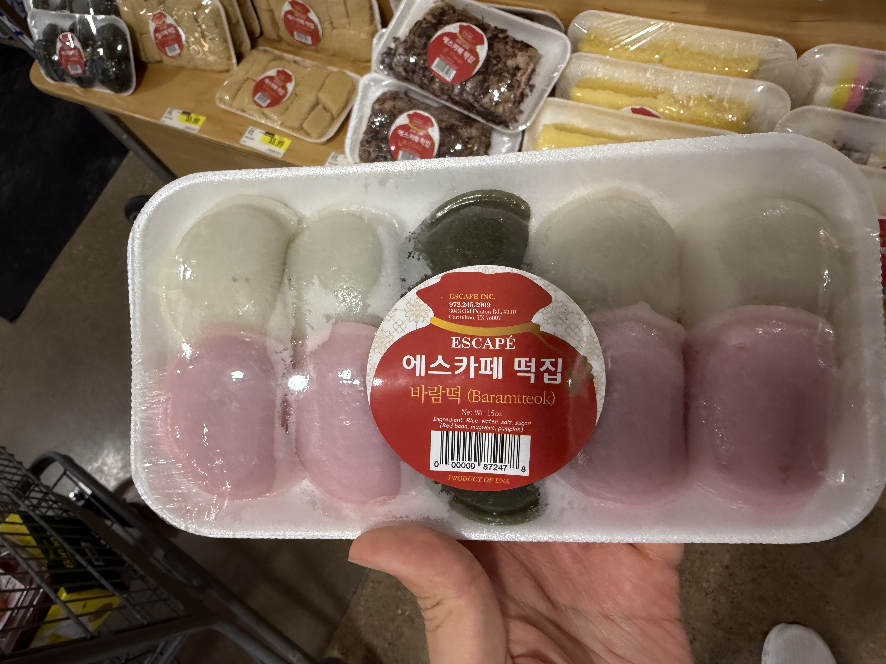

:::

### 혼자만의 시간, 쇼핑과 운동

지난주에, 두 개의 아이템을 사려고 고민중이었다.

해밀턴의 카키필드 메카니컬 36mm과, RRL의 빈티지 파이브포켓 블랙온블랙 제품이었다.
해밀턴 시계는 아직 매장으로 배송이 되지 않아 다음주 목요일쯤 도착할 예정이라고 했고,
RRL 바지는 원래 퍼플 라벨만 취급하는 폴로 매장으로 해당 제품 사이즈를 배송받아 직접 입어볼 기회를 만들었다.

와, 그런데 폴로의 최상급 제품군인 퍼플 라벨만 취급하는 매장이라 그런지 드레스룸도 장난 아니었다. 4평 남짓한 넓직한 공간에 그림들이 이것저것 걸려있었고, 한쪽 벽은 통째로 거울이었다.

그 덕에 정말 럭셔리한 분위기에서 옷을 입어보았으나, 내가 생각했던 핏이 아니었다. 그리고 허리도 조금 남았다. 이대로 보내기엔 너무 아쉬워서, 1인치 작은 제품까지 다시 세팅하여 비교해보고 결정해도 되겠냐고 양해를 구했고, 너무나도 흔쾌히 그게 좋겠다면서 다시 일정을 잡아주셨다. 이러다가 내가 안사게 되면 어떻게 되는거지?ㅠㅠ

아쉬운 마음에 폴로 매장이 위치한 knox street 내에 있는 STAR Provisions라는 편집샵에 방문했다. 이 곳도 RRL을 취급하지만, 내가 찾던 빈티지 파이브포켓 블랙온블랙 레귤러핏이 아닌 기빈스 워시 제품과 블랙온블랙 슬림핏 제품만을 취급하고 있었다.

그렇게 두리번거리다가, 데님 트러커 자켓을 발견했다. 모든 자켓 버튼에 RRL이 쓰여 있었고, 각종 디테일이 너무 마음에 들어 한번 입어봤다. 소매 부분이 굉장히 길게 나오고, 또 기장감은 엄청 크롭한게 특징인데, 아메카지 역사에서 데님 트러커의 거의 시초격인 리바이스 type II에서 영감을 받은 디자인이라고 한다.

그렇게 순식간에 내 관심사는 바지에서 트러커 자켓으로 옮겨갔다. 하지만 아직까지는 살인적인 텍사스 더위 때문에, 이렇게 두꺼운 옷을 사도 잘 활용할 수 있을지에 대해 물음표가 남았다. 그렇지만 그 곳에서 데님에 대해 설명해주신 Juan(쿠안이라고 읽는다) 아저씨가 자주 놀러와서 구경하라고 말씀해주셔서, 이것저것 여쭤보고 정말 기분 좋은 시간을 보내고 왔다.

마지막 개인 일정으로 Student Center에서 간단히 work-out을 해주고, 저녁 약속을 출발하기 전 잠깐 꿀같은 낮잠을 잔 뒤 ballon festival로 향했다.

::: {.photo-row}

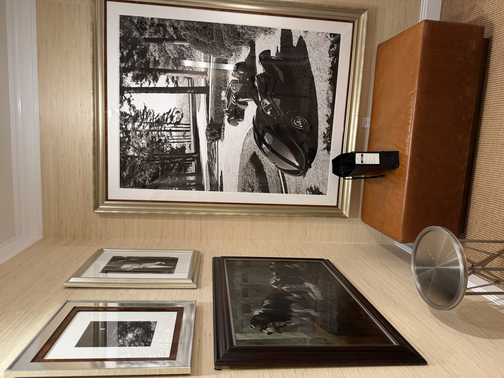

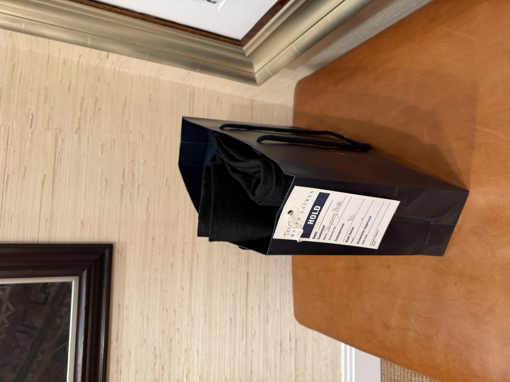

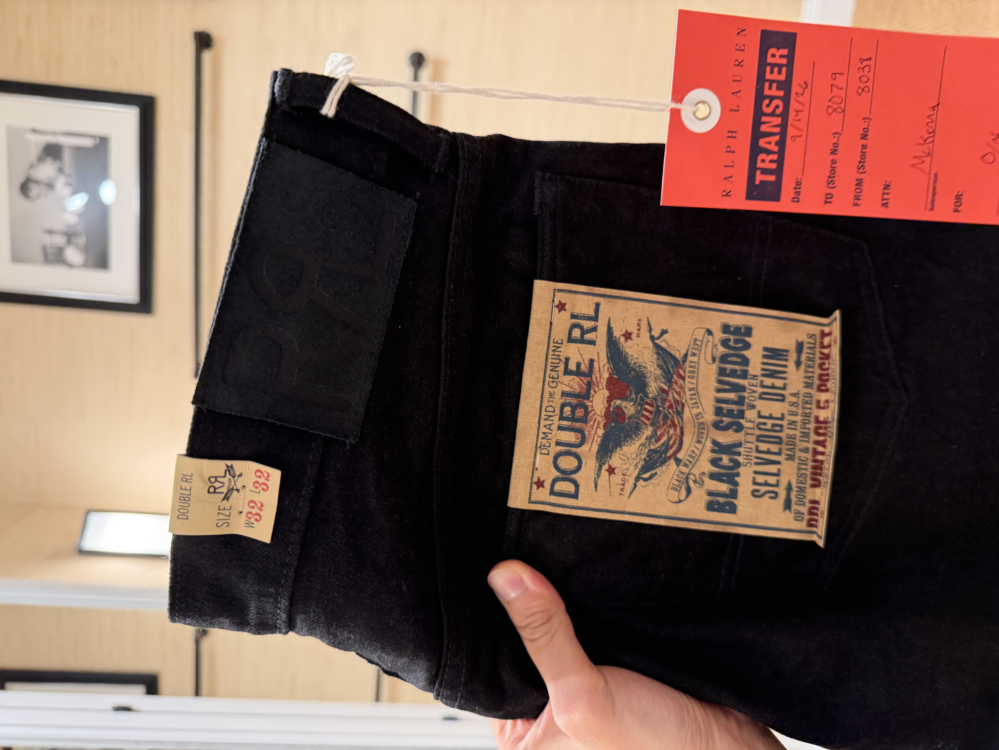

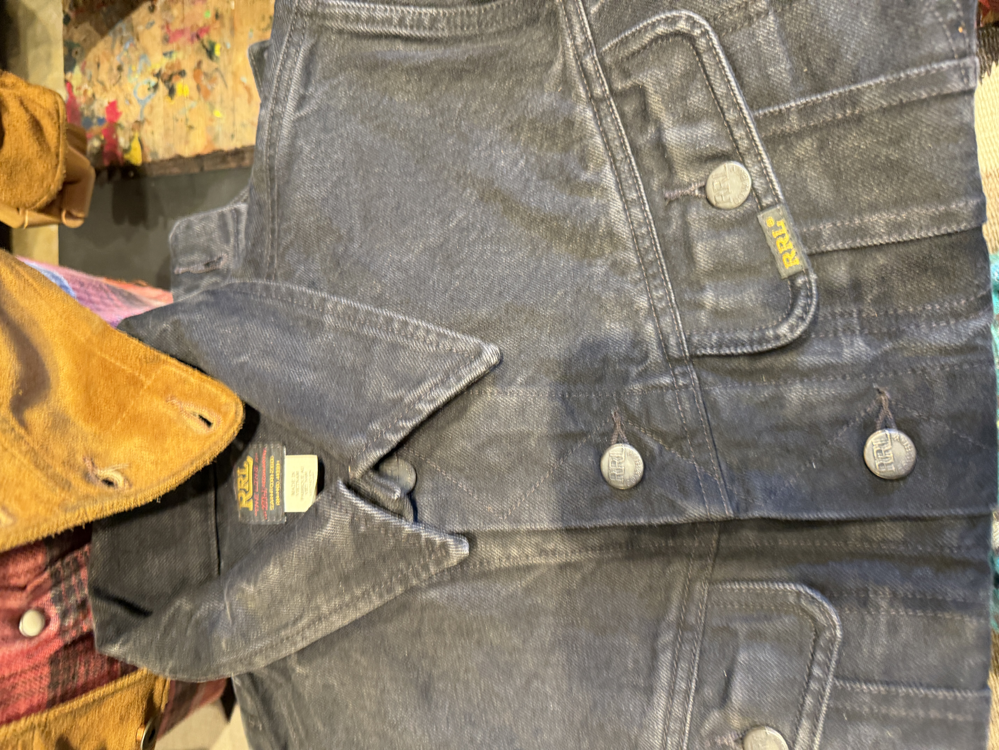

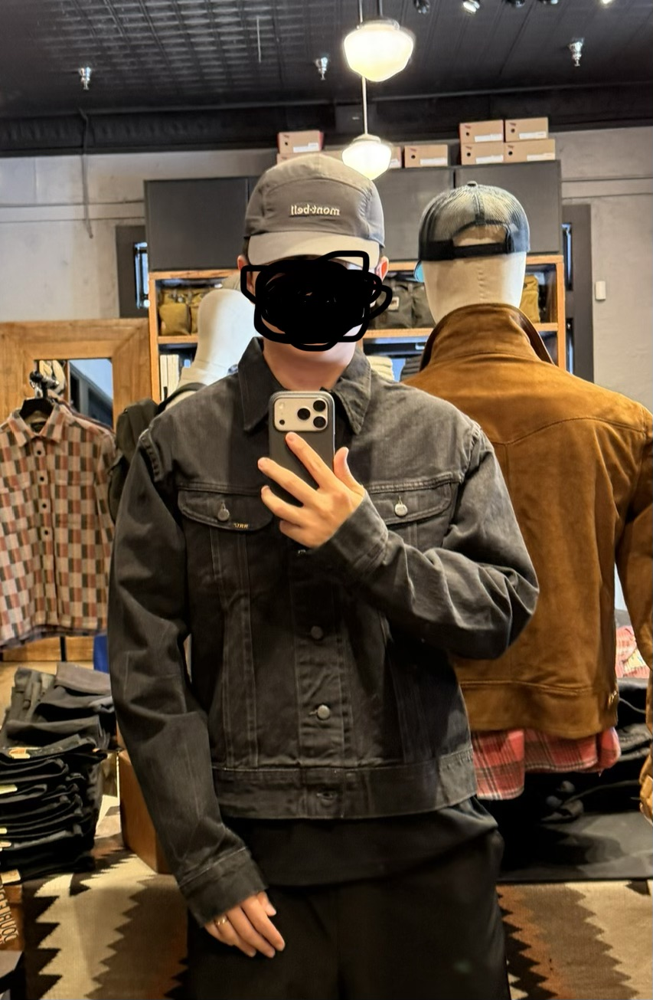

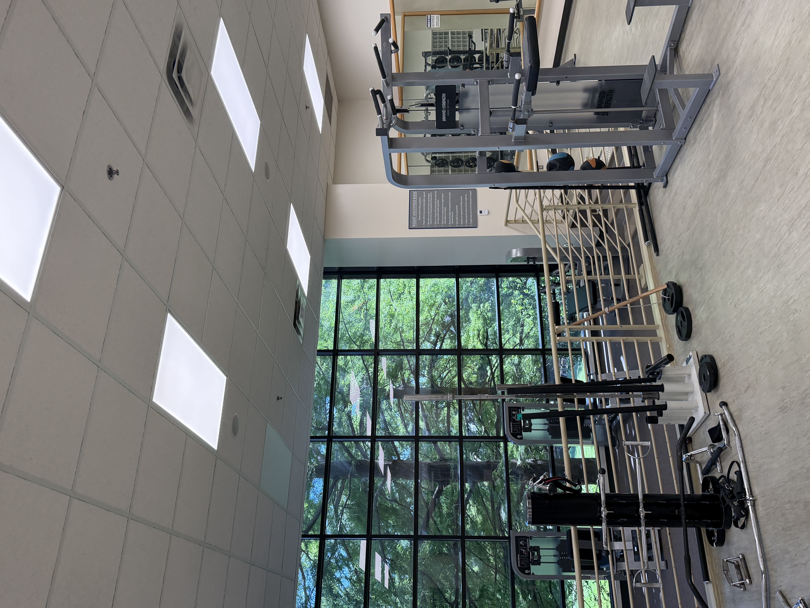

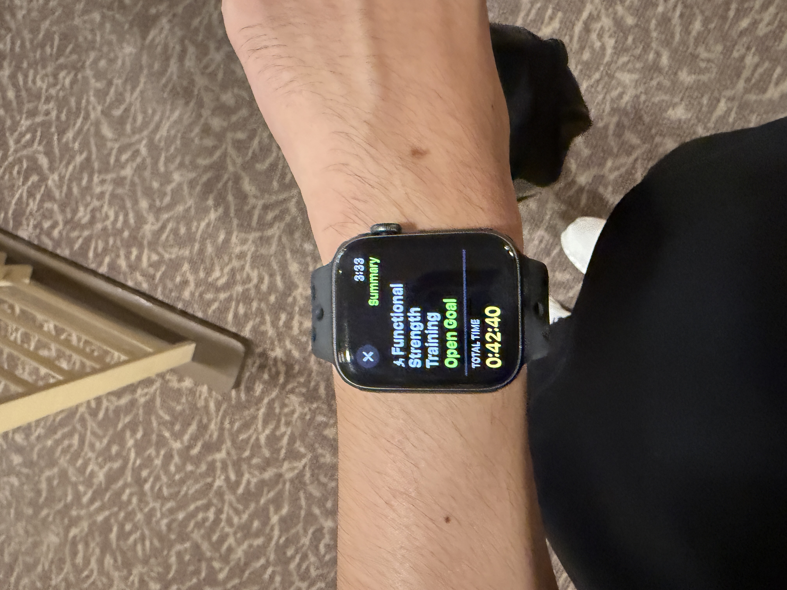

:::

### Balloon Festival

한국 친구들과 함께 저녁이 다되어서야 축제 장소로 이동하기 시작했다. 

Balloon을 띄우는 시간이 7시반부터 8시15분까지라고 해서 그 직전에 도착하는게 목표였는데, 모든 것이 순탄치 않았다.

우선 생각보다 사람들이 너무 너무 많이 몰리는 큰 행사였다.
나는 이렇게까지 큰 행사인 줄 모르고, 그냥 동네에서 열리는 소소한 행사인 줄만 알았다.

그러나 주차장으로 들어가는 줄이 엄청나게 긴 행렬로 늘어져 있었고,
차를 주차할 곳을 찾아 거의 장정 2시간동안이나 헤맸다.
그러다가 결국 해가 졌고, balloon을 날리기로 예정되어 있었던 시간 또한 지나있었다.

그래도 결국 행사장 내부까지 들어갔다. 의지의 한국인들이었다.
그러나 그 기쁨도 잠시, 엄청난 인파에 관리조차 안되는 축제 장소는 생각보다 힘든 곳이었다.
돗자리를 깔고 음식을 사려고 계획했으나, 음식을 사는 줄조차 엄청나게 늘어져 있었다.

그래서 이 마저도 포기하고 마지막 행사 일정인 Raser show라도 건져가겠다는 마음으로,
멀리서 들리는 음악을 반강제로 즐기고 있었다.

Raser show가 시작되자, 우리는 무언가 단단히 잘못되었음을 알았다.
규모나 그 방식이 너무너무 엉성해서, 더 이상 시간을 지체하지 않고 그곳을 빠져나오기로 했다.

이렇게만 이야기하면 너무 악몽같은 경험이라고 생각할 수도 있겠지만,
실상은 오히려 반대에 가까웠다.

차에 있는 두시간동안 시원한 에어컨 바람 아래에서 노을을 잔뜩 즐겼고,
신나는 음악과 함께라면 축제를 가지 못해도 크게 상관없었다.
차에서 많은 즐거운 얘기들을 나눴고, 나이대도 비슷해서 꽤나 죽이 맞는 친구들이었다.
그리고 그 누구도 상황에 대한 불만을 토로하지 않았고, 그 순간을 즐길 줄 알았다.

어쩌면 그것이 박사과정에 요구되는 본질일 수도 있겠다는 생각이 들었다.
박사과정의 그 끝에는 박사 학위가 있긴 하지만,
결국 그 과정을 얼마나 잘 음미하고,
또 예상치 못한 결과를 어떻게 받아들일 것이며,
실패를 대비한 플랜을 어떻게 제안할 것인지에 대한 얘기였다.

마무리로 스근한 국밥 한 그릇과 함께,
모두 지친 심신이 모두 치유되었다.

:::{.photo-row}
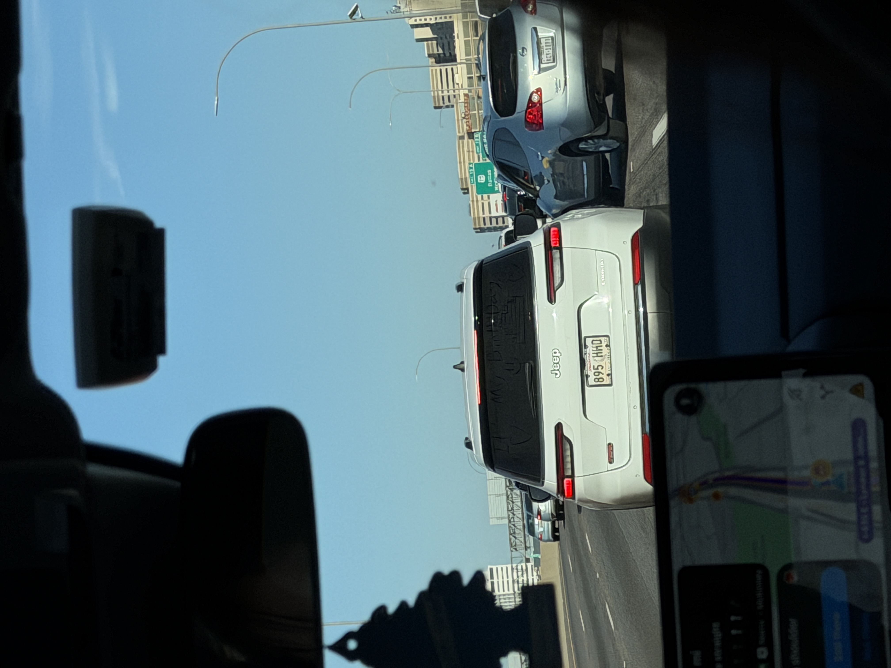

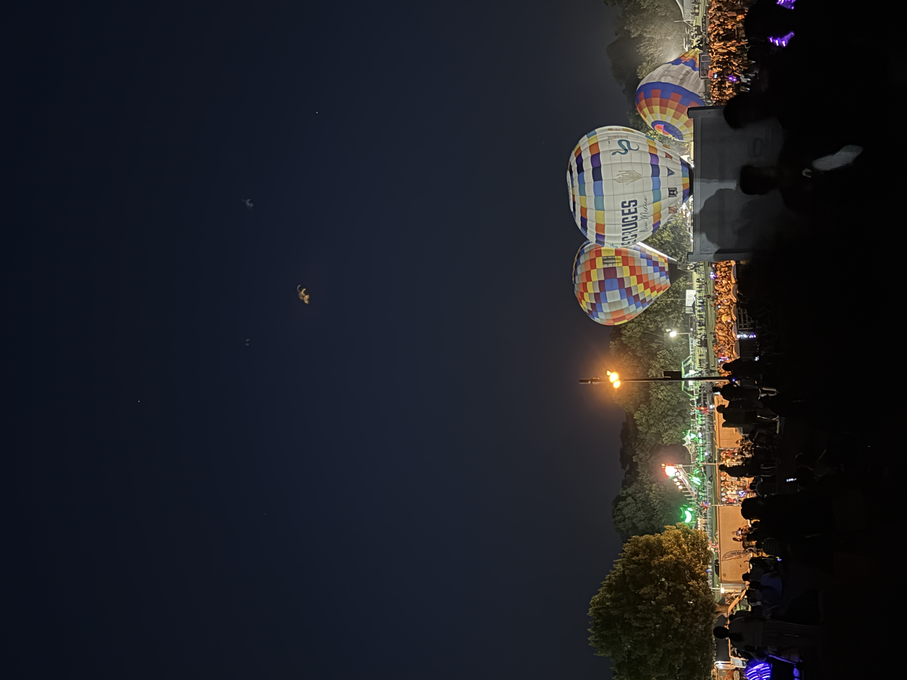

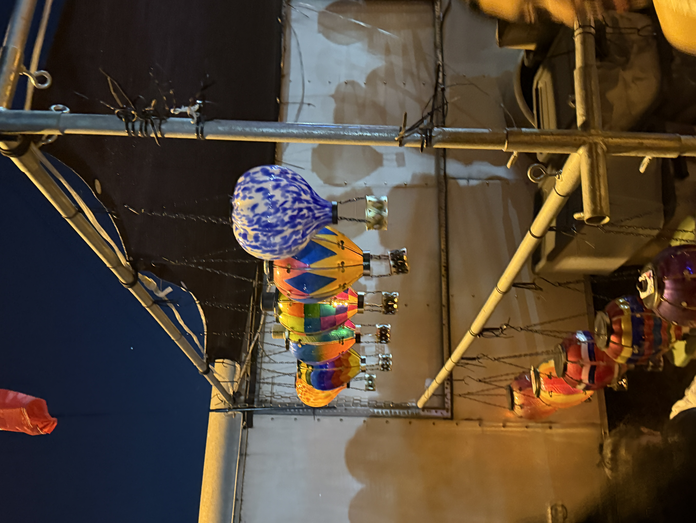

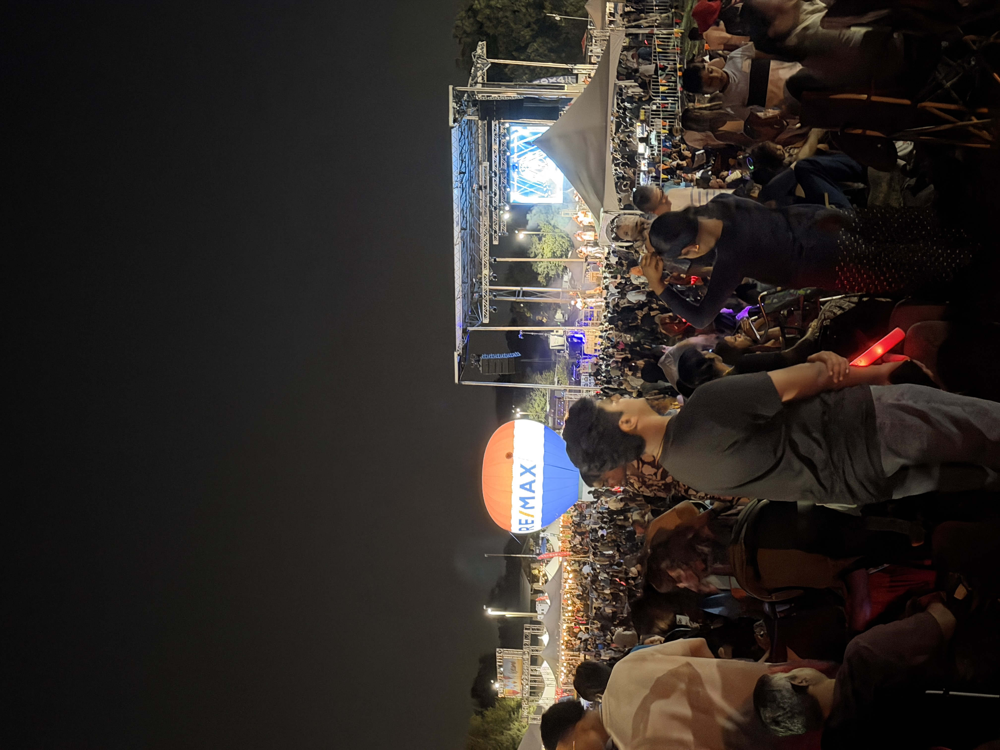

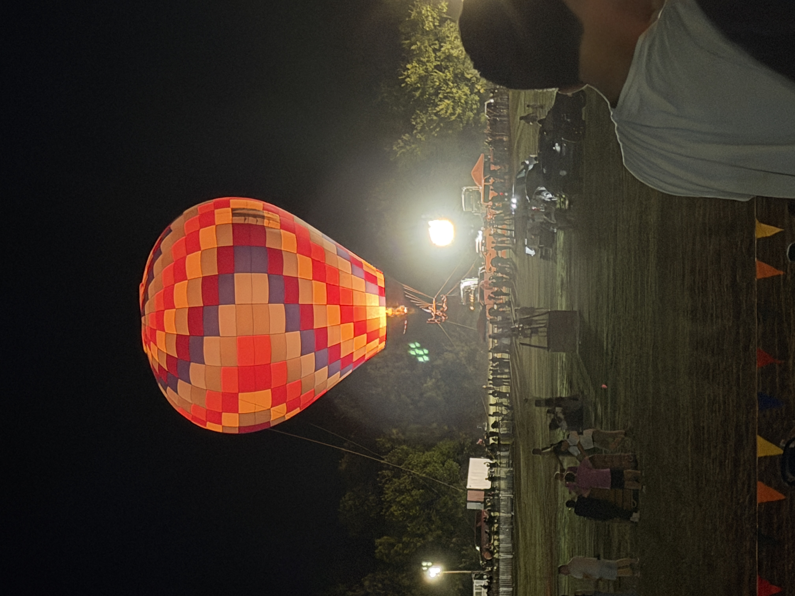

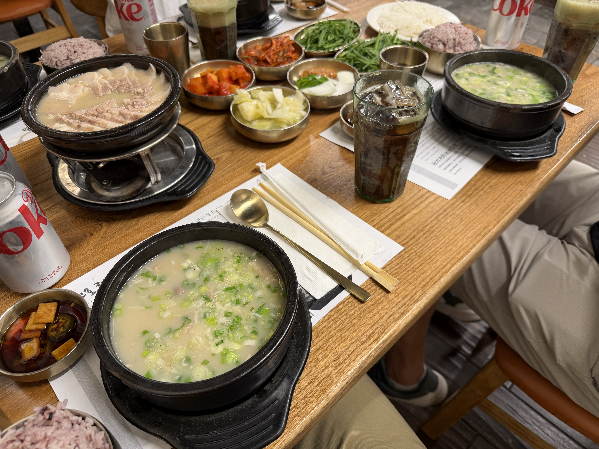

:::

## Day 7 - 9월 20일(일) · 연구실 출근

오늘은 처음으로 주말임에도 연구실에 출근한 날이었다.
지난 실험의 실패로 인해, cell에 문제가 생긴 것 같다고 생각했고,
내 Supervisor가 오늘 일요일에 학교에 가서 새로운 cell을 꺼내겠다고 연락이 왔다.
그리고 기존에 사용하던 cell은 freeze down해서 다시 stock에 보관하기로 했다.

응당 내가 해야할 일이라 생각했고, 나도 기꺼이 같이 가서 배우겠다고 했다.
끝나고 헬스장에 갈 생각으로, 운동복을 입고 연구실로 향했다.

아무도 없을거라 생각한 내 오산이었다.
포닥들은 주말에도 밤낮없이 실험하고 있었고,
몇몇 trainee 친구들도 자리에 있는 친구들이 있었다.

그 어느 누가 시키지도 않았는데, 이렇게 자발적으로 자신의 일에 책임감을 갖고 일하는 모습을 보고
뭔가 스스로 돌아보게 되었다.
나는 얼마나 내 일에 최선을 다하고 있는가?

예정되어 있던 freeze down은 Cell 상태가 좋지 못해서 진행하진 못했지만,
신선한 media로 교체해주고 다음을 기약하기로 했다.

:::{.photo-row}

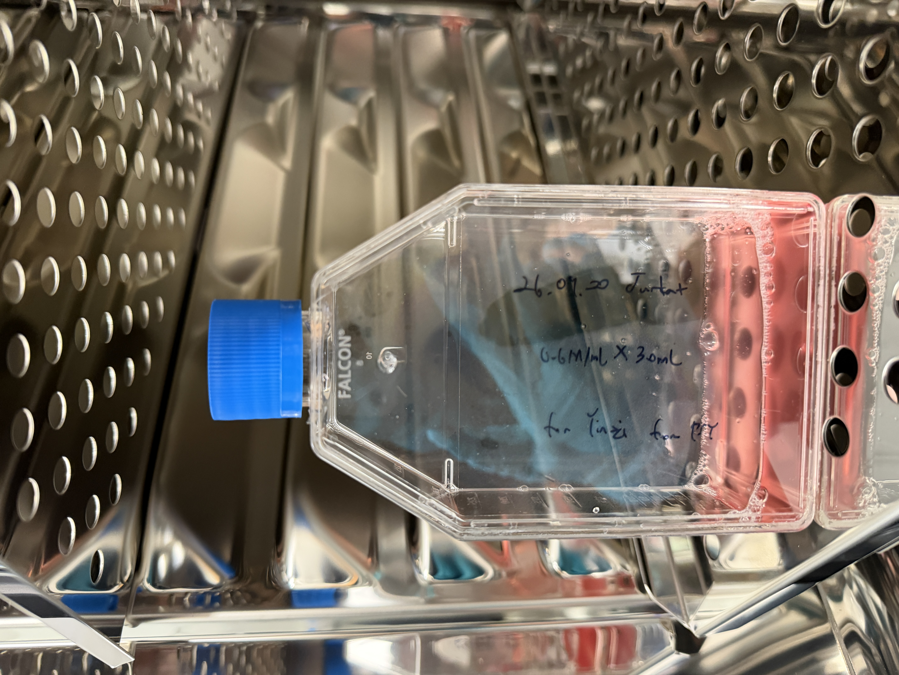

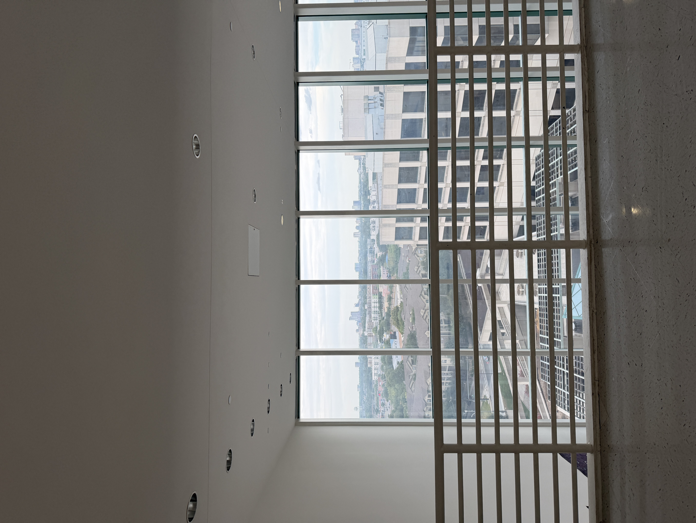
:::

미국에 온지 7주차, 계속된 실패에 소강 상태에 접어들었다. 
글의 초반부에서 선언했던 대로, 글의 내용을 줄이지는 못했던 것 같다.
아직까지 뭔가 순간 순간의 경험이 소중해서 그런지, 쉽게 걷어내지 못하는 중이다.

다음주에는 조금 더 의식해서 최대한 불필요한 내용의 기준을 대폭 강화할 예정이다.
그리고 다다음주 월요일에 곧바로 시험이 예정되어 있다!

얼른 시험을 잘 마치고, 또 Ryoske와 사우나를 가거나
시계 혹은 바지, 혹은 트러커를 구매한 후기와 함께 돌아오겠다.