벌써 다음주면 두 번째 시험이다.

첫학기 Coursework은 Proteins, Genes, Cells 세 가지 파트로 구성된다.

그 중 Proteins의 두번째이자 마지막 시험을 다음주 월요일에 앞두고 있고,
그 다음날인 화요일에 곧바로 Genes에 대한 강의를 이어 수강하게 된다.

다만 지난번에 Proteins 첫번째 시험을 한 번 경험했던 탓인지,
긴장도 훨씬 덜되었고 조금 더 수월하게 준비가 되어가는 것 같다.

얼른 영어도 적응되면 좋겠다..

## Day 1 — 9월 21일 (월) · 평범한 하루

늘 그렇듯 평범한 월요일의 시작이었다.
다만 전 날 출근했던 여파가 가시지 않았는지, 
평소보다 훨씬 피곤한 날이었다.

지나가던 유튜브에서 보았던 내용인데, 짚고 넘어가고자 한다.
그것은 바로 운동, 사업 등 본인만의 영역에서 확고한 성과를 낸 사람들의 공통점에 대한 이야기다.

첫번째로, 그들은 Overperform 하지 않는다.
그들만의 명확한 상한선을 그어놓고, 에너지가 있음에도 '오늘은 여기까지'하며 쉬는 버릇이 있다.

두번째로, 그들은 무엇을 Take할지에 대해 확실하다.
본인이 관심있고, 잘하기를 바라는 25개의 서로 다른 영역에 대해
가장 집중하고 싶은 5개를 고르고,
나머지 20개는 철저하게 버리는 연습을 해야한다.

이는 내가 정말 좋아하는 동생이, 공군에서 복무를 하고 있을 때 만나 나눴던 얘기 중 인상 깊었던 이야기이기도 하다. 그 친구는 결국 자신이 가장 좋아하는 '투자' 분야에서 가장 원했던 성취를 이뤄가고 있다. 언젠가 포텐이 터질것을 알았지만, 정말 대단한 친구고 본받고 싶은 친구다.

어쨌든 본론으로 돌아가면, 결국 전 날의 Overperform이 오히려 이 날 독이 되었다.
최대한 밸런스를 잘 지키며 롱런할 준비를 해야한다.

아무튼 초콜릿을 캠퍼스 구석에서 까먹고, RRL 제품이 매장에 준비되었으니 오라는 메시지를 받았고, 그리고 책상을 사기 위해 중고를 뒤적거리다가, 저녁으로 불고기.

::: {.photo-row}

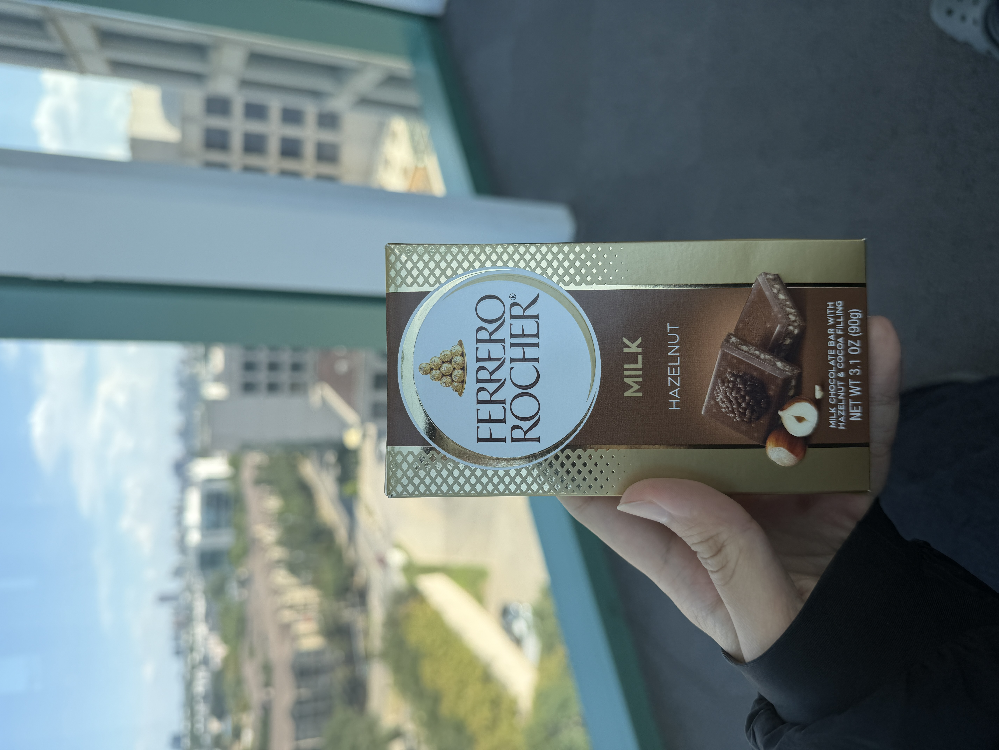

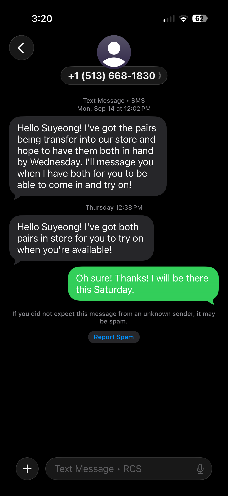

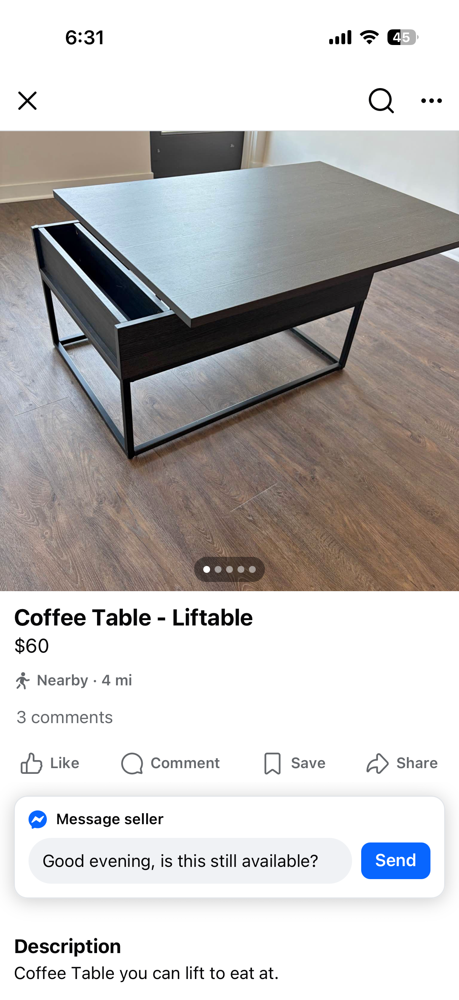

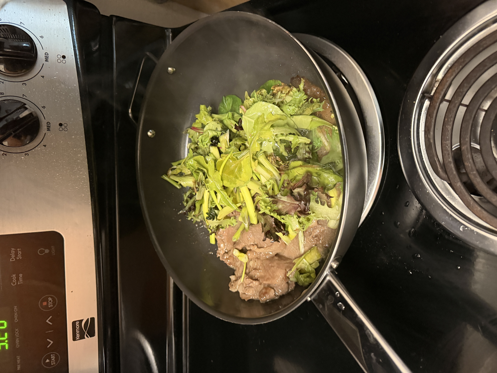
:::

## Day 2 — 9월 22일 (화) · 실험 그리고 실험

여느날과 다를 것 없는 날이었다. 밤 9시에 집에 갔다는 사실만 뺀다면 말이다..
전날 Outperform으로 인한 휴유증을 겪고, 다시 리듬을 찾아가려던 찰나
이를 다시 실험에게 빼앗기고 말았다.

시작은 평범했다.
캠퍼스 내 로비에서 점심으로 비비고 불고기 주먹밥과 감자 핫도그를 즐겼고,
iMAC 용 키보드 마우스를 따로 두는것이 불편해서 이를 맥북과 연동시켜 개별 컴퓨터로 인식하되 마우스와 키보드는 맥북것으로 연결하는 것에 성공했다.(정말 편리하다.. 역시 애플의 생태계는 위대해)

그리고 오후 늦게 도착한 Supervisor는 가족을 배웅하고 이제서야 출근했다며,
함께 실험을 시작하게 되었다.

지난번 실험에서 계속해서 결과가 좋지 않아,
새로운 Cell을 Cell bank에서 꺼내어 테스트를 해보는 날이었다.
다만 그 시작이 너무 늦었다는게 문제이지만 말이다.

다행히, 영어 회화세션을 밤 9시로 미뤄두어 집에 오자말자 허겁지겁 식사를 때우고
세션을 시작할 수 있었다.

- Your current work : Explain it to someone who have less backgrounds
- Is ignorance sometimes better than knowledge
- Cultural difference you've encountered in the US

첫 질문부터 다소 challenging했는데, 역시 설명에 가장 직관적으로 도움되는 방법은 비유인 것 같다. 면역세포가 해당 기관으로 이동하는 것을 사람이 문을 통과하는 것에 빗대어 표현하니, 한 결 설명하기가 수월했다.

그리고 또, 미국에 와서 느낀 점 중 하나는 많은 사람들이 smile face를 항상 유지하고 다닌다는 것이었다. 한국은 그 누구도 길거리에서 smile face로 다니지 않는데, 어떤 것이 이토록 다른 문화를 형성하게 되었는지에 대해 생각해보게 되었다.

::: {.photo-row}

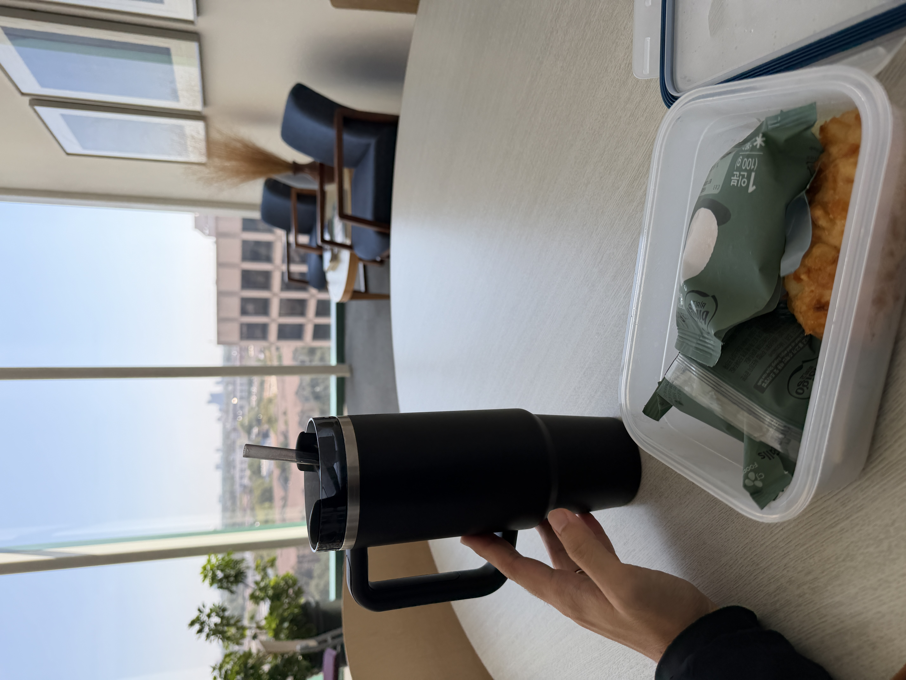

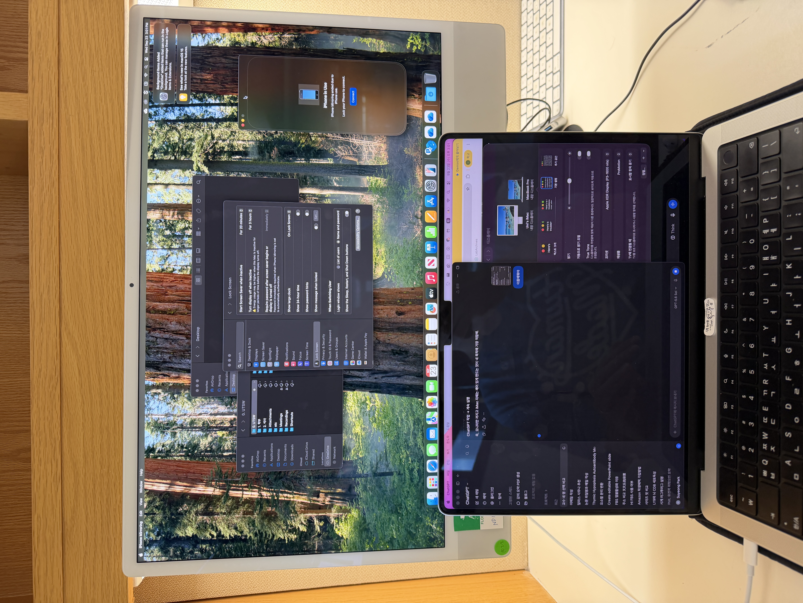

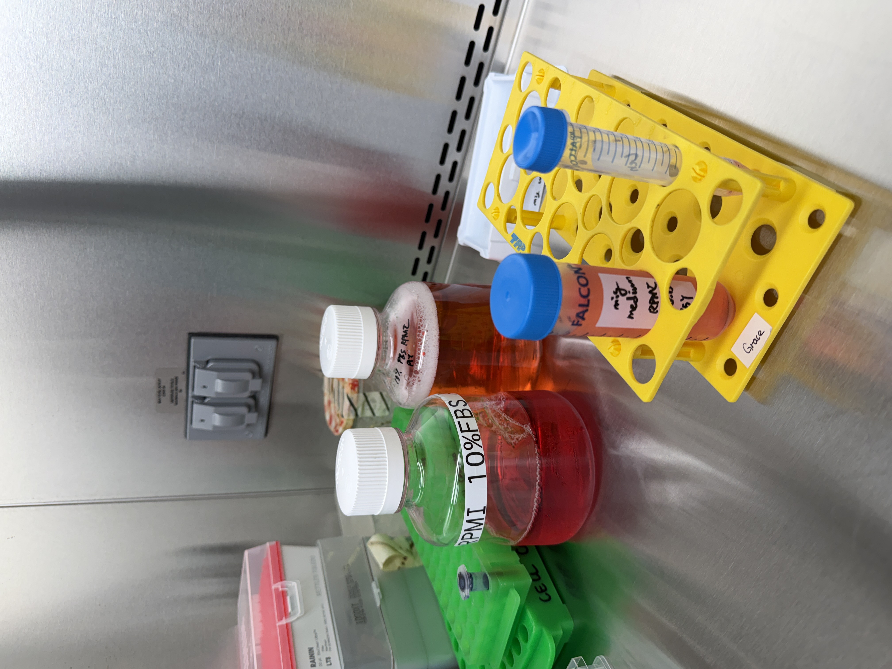
:::

## Day 3 — 9월 23일 (수) · Cell이 문제인가 내가 문제인가

지난주와 마찬가지로, 
어제 끝난 실험을 오늘 곧바로 분석해보았다.

다행히도 실험 결과는 잘 나와주었고,
Cell이 문제인 것으로 생각되어 곧바로 다음 분석을 진행하기로 했다.

그리고 다음주면, 약 두 달 가량 셋업해둔 실험을 드디어 환자 샘플에 적용해보는 날이다.
이 실험 결과에 따라 이 프로젝트가 여기서 끝날지,
아니면 Next step으로 이어져갈지 결정된다.

내 생각에는 5% 정도의 확률로 positive result를 맞이할 수 있을 것 같은데,
이번에도 운이 따라줄지.

그리고 트레이더조스에서 산 볶음밥과 만두에, 한국 김치를 곁들여 저녁을 먹었다.

::: {.photo-row}

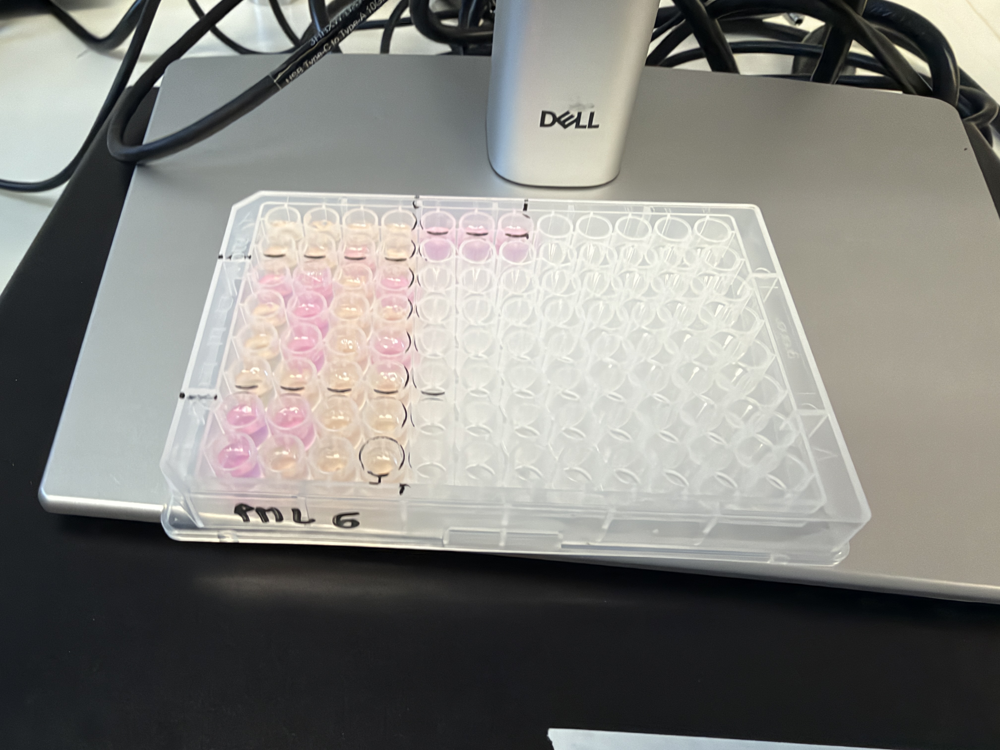

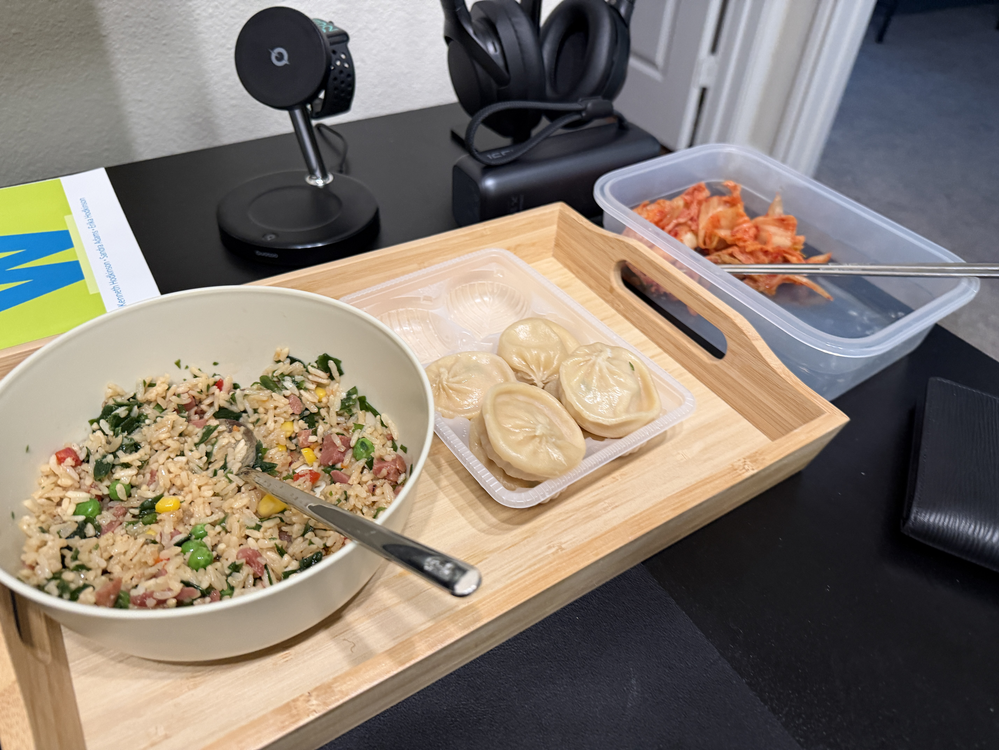

:::

## Day 4 - 9월 24일 (목) · Nature's Typo

내가 속한 Casanova 그룹이 UT Southwestern으로 이주해오면서,
Inborn errors of immunity라는 큰 주제를 하나로 여러 그룹이 묶여 격주로 세미나를 진행한다.

그게 바로 Nature's Typo, 자연이 만들어낸 오탈자에 대한 것이었다.
오늘은 연구실 내 Sonja가 autophagy와 viral immunity 사이의 연관성에 대해 발표했고,
맛있는 피자와 함께 새로운 내용을 열심히 청강했다.

그리고, 언제 갈지 모르는 텍사스 로드하우스 꿀팁을 저장해두었다.
달사람 닷컴이라는 한인 온라인 커뮤니티에서 가끔 이런 유용한 정보가 올라와,
언제 볼지 모르지만 하나씩 저장해두고 있다.

그리고 트레이더조스 볶음밥과, 새로 시도해본 코코넛 쉬림프로 저녁 한끼.
코코넛 쉬림프가 괜찮기는 했는데, 에어프라이기에 너무 오래 넣어둔 탓인지 바삭한 식감이 조금 부족했다. 다음에는 시간을 조금 더 짧게 시도해봐야지.

...

그리고 영어 회화.
- The person you respect the most (in your related field) and why
- Religion and modern conflicts
- Four-day workweek

첫 번째 질문을 받자말자, 동시에 떠오른 세 명의 사람들이 있었다.
그리고 새삼, 내가 참 인복이 많다는 생각이 들었다.
내가 방황하며 어려움을 겪을 때마다, 기꺼이 본인들의 생각을 내어주시고 본인 일인양 함께 치열하게 고민을 나눠주신 멘토님들이다.

결국 세 사람에 대한 이야기를 각각, 아주 길게하고 나서야 다음 질문으로 넘어갈 수 있었다.
그와 동시에, 나도 훗날 누군가에게 그런 사람이 되고 싶다는 생각이 들었다.

::: {.photo-row}

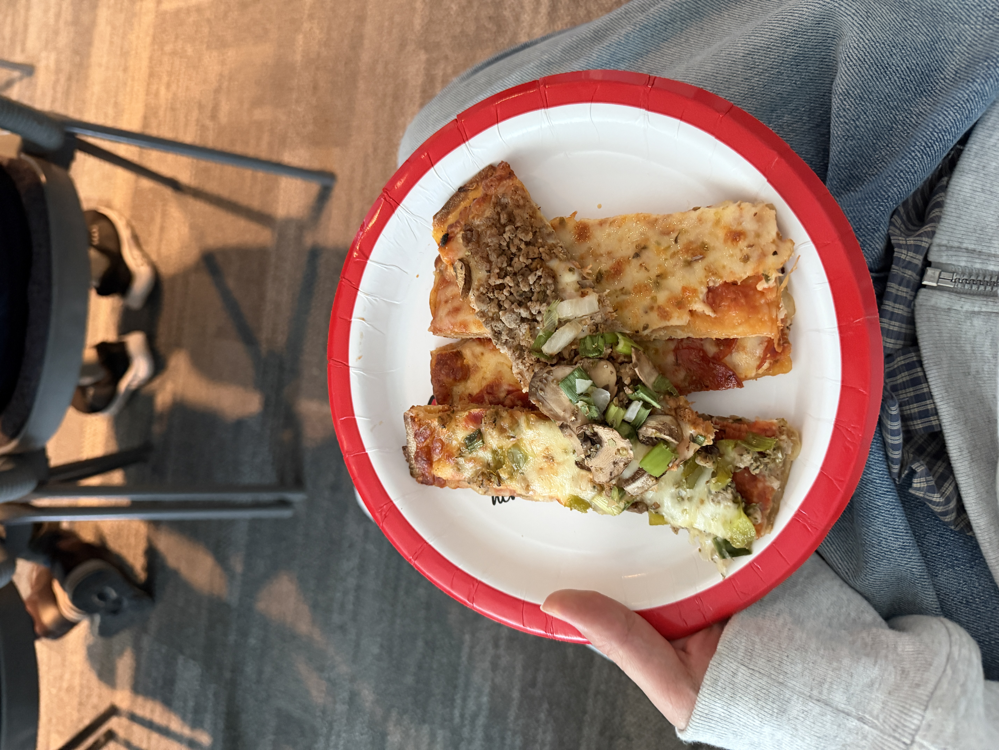

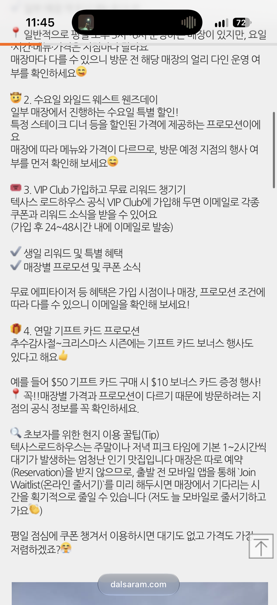

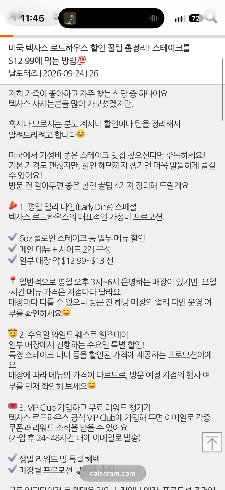

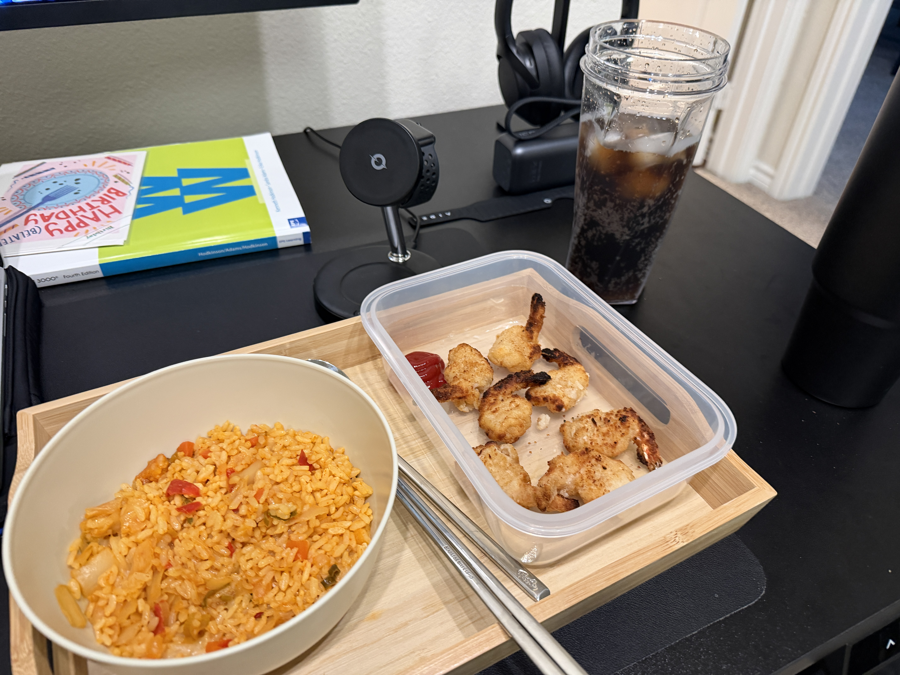

:::

## Day 5 - 9월 25(금) · Mouse!

상상했던 그 mouse가 아닐 것이다.
바로 컴퓨터용 Mouse!

오늘도 지난주 금요일과 마찬가지로 랩사람들과 함께 랩을 열심히 정리했다.
아주 대형랩이 이사해오다보니까 정리가 끝이없다.

하지만 그 대가로 달콤한 커리식 점심을 제공받았다.

그리고 Mouse!
맥북 트랙패드가 좋기는 하지만, 아주 오랜시간동안 일을 하기에는 손목이 조금 불편해서
마우스를 하나 주문했다.

이전에 MX masters 3S라는 모델을 썼었는데, 아주 편하고 좋아서 찾아보니
MX masters 4가 새롭게 나왔다고 해서 주문했다.
(마우스 하나에 130불인건 안비밀..)

역시 돈이 좋다.

::: {.photo-row}

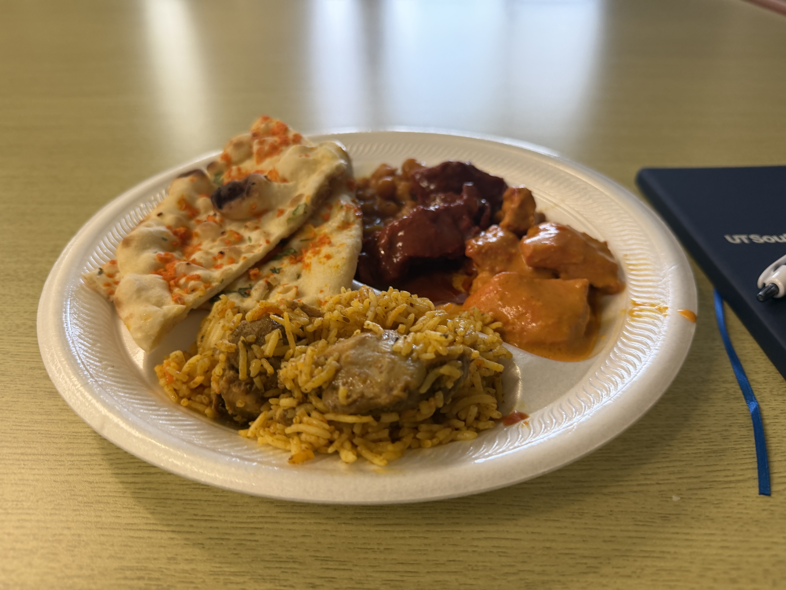

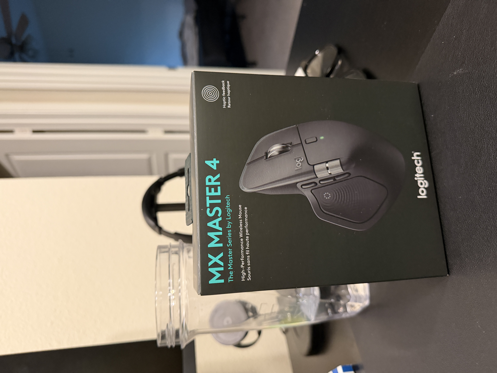

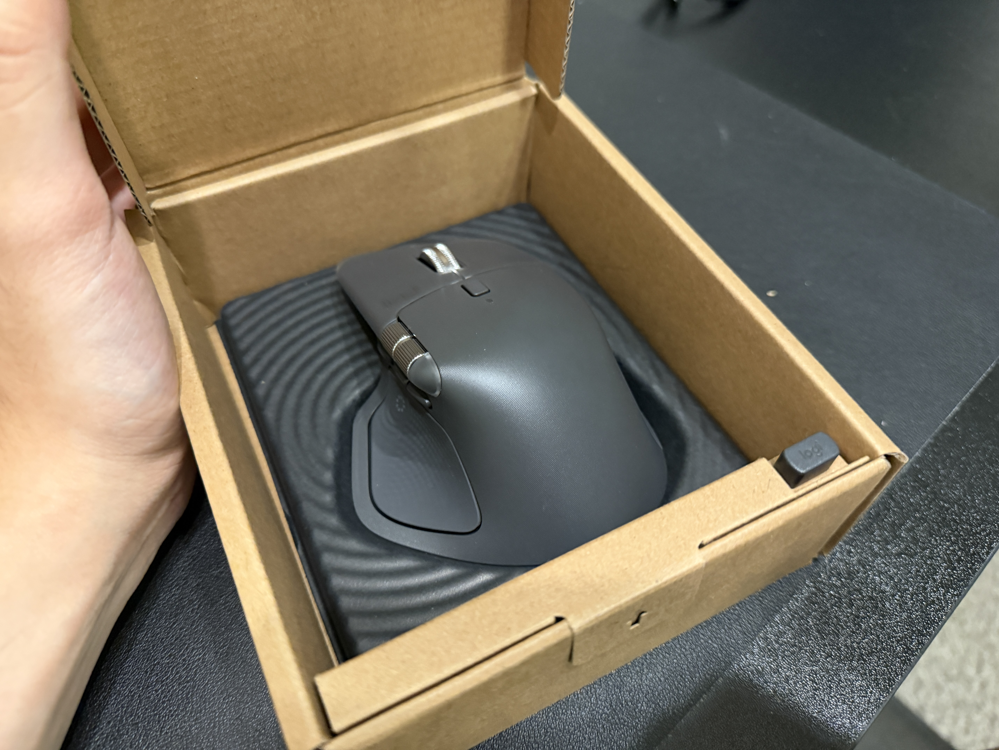

:::

## Day 6 - 9월 26(토) · 시험 공부 전반부

드디어 미뤄둔 시험 공부를 시작하는 날이다.
아차, 그 전에 하나 더 주문한 게 있다.

바로 TV!
소파는 있는데 거실에 아무것도 없어 쓰지 못하고 있다가,
드디어 큰 마음을 먹고 TV를 샀다.

65인치 삼성 mini LED 제품을, 세금 포함 450불 가량에 구매했다.
한국보다 훨씬 저렴한 것 같다.

원래는 페이스북 마켓에서 중고 티비를 사려고 계속 둘러보다가,
이것저것 너무 고려해야 할게 많아서 계속 미뤄두고 있었다.

이러다가 평생 TV를 못사겠다는 생각이 들었고,
또 그리고 RRL 자켓과 바지를 400불 주고 살 고민을 하는 나를 보며,
지금 정말 필요한게 무엇인지 다시 생각해보게 되었다.

RRL은 또 언젠가 기회가 있겠지. 이번에는 그 돈을 TV에 사용하기로 했다.
그리고 그게 정말 잘한 선택이었다.

TV는 아마존에서 구입했고, 배송 옵션 중에 티비를 꺼내 선반장까지 놓아주는 옵션이 있어 선택했는데 아주 편리했다! 이제 드디어 거실에 놓을 책상만 하나 사면 완성이다.

기분 좋게 집근처 스벅으로 가서 미뤄둔 공부를 하나 둘 씩 해치워나갔다.
와 그런데, 역대급 맛있는 메뉴를 찾았다.
그건 바로 솔티드 카라멜 크림 콜드브루였다.

여러 음료들을 시도해보며, 이렇게 내 입맛에 맞는 음료를 찾을땐 정말 기분이 좋아진다.

:::{.photo-row}

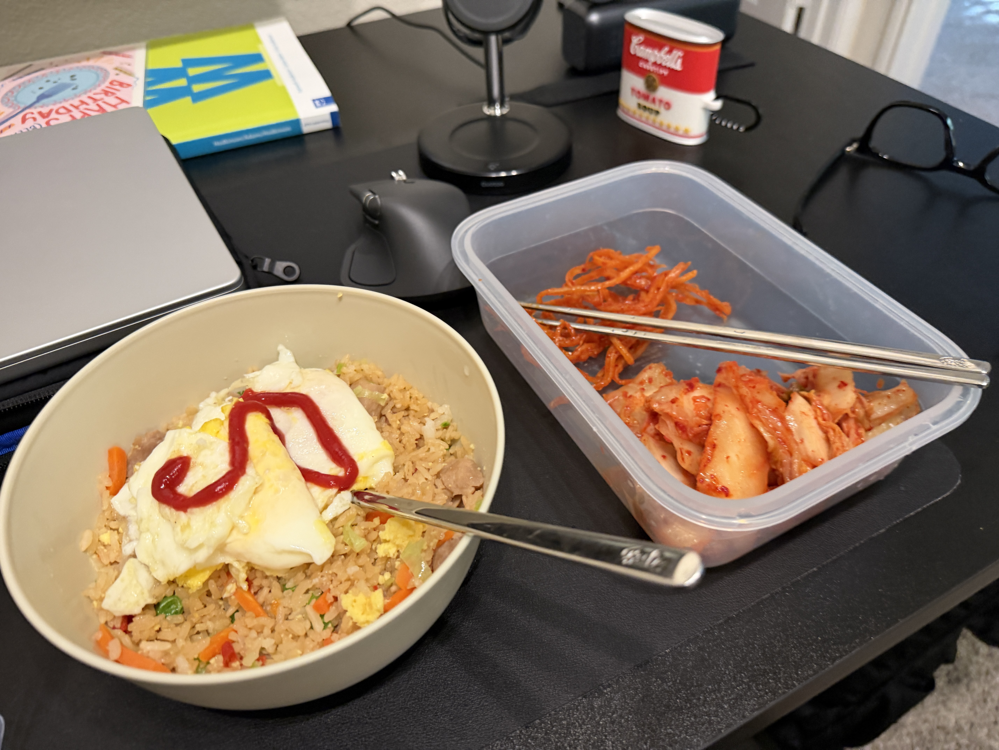

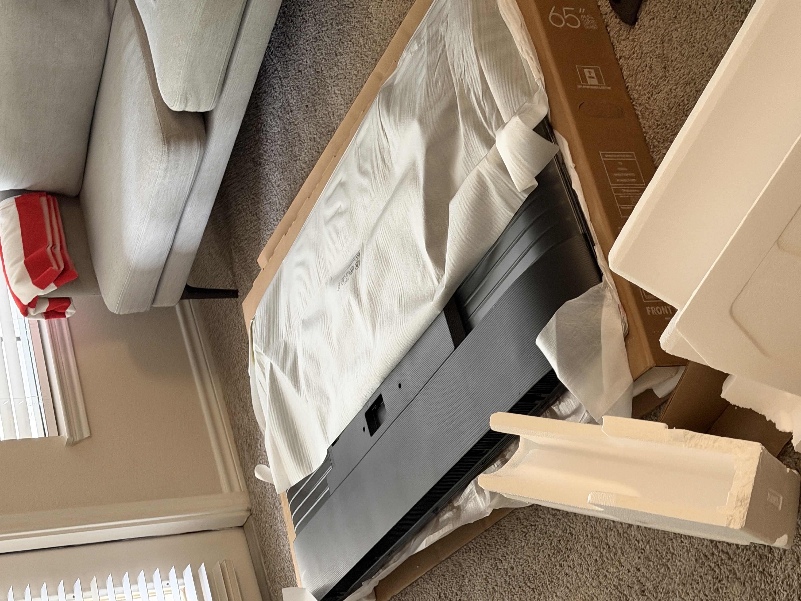

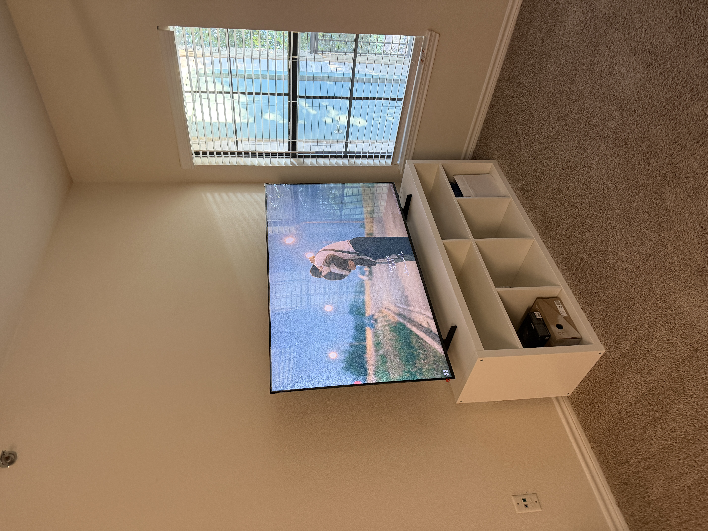

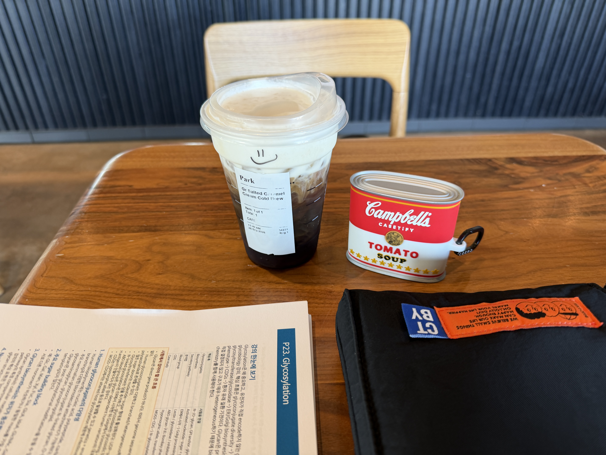

:::

## Day 7 - 9월 27일(일) · 시험 공부 후반부

어제 공부가 꽤나 잘 진행이 되어,
생각보다 진도가 잘 나갔다.
(사실 어쩌면 우매함의 봉우리에 멈춰있는걸지도 모른다)

어쨌든 그러한 탓에, 집에서 밍기적거리다가
인앤아웃을 점심으로 먹고,
내가 좋아하는 Knox street로 향했다.

항상 이동네는 미국인들이 북적거린다.
그만큼 사랑받는 동네.

Uptown 쪽에 있는데, 나중에 기회가 되면 이쪽에서도 살아보고 싶다.
물론 분위기가 좋고 선호도가 높은 만큼 월세는 3-40% 더 비싸지만 말이다.

주차장이 꽉 차서 겨우겨우 자리를 잡고, 이 글을 쓰고 있다.
이제 남은 할 일은 집으로 가서 저녁을 먹고,
어제 미뤄둔 청소를 마무리하고,
그리고 내일 시험을 위해 최종 마지막 파이널 라스트 정리를 마무리 짓는 것이다.

아, 그리고 페이스북 마켓을 둘러보다 꽤 괜찮아보이는 리프트업 테이블을 발견했다.
거리가 꽤나 멀지만, 감안하고도 괜찮은 딜인 것 같아 다음주 중에 픽업을 가기로 했다.
드디어 거실이 완성되는 날이 머지 않았다.

:::{.photo-row}

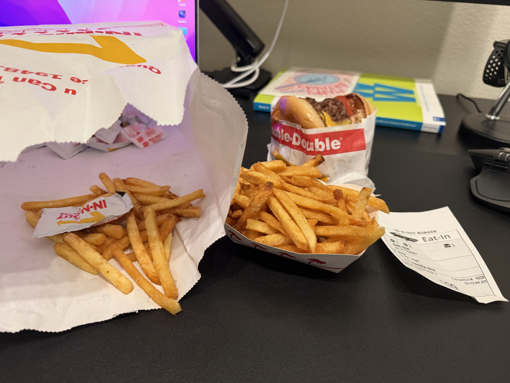

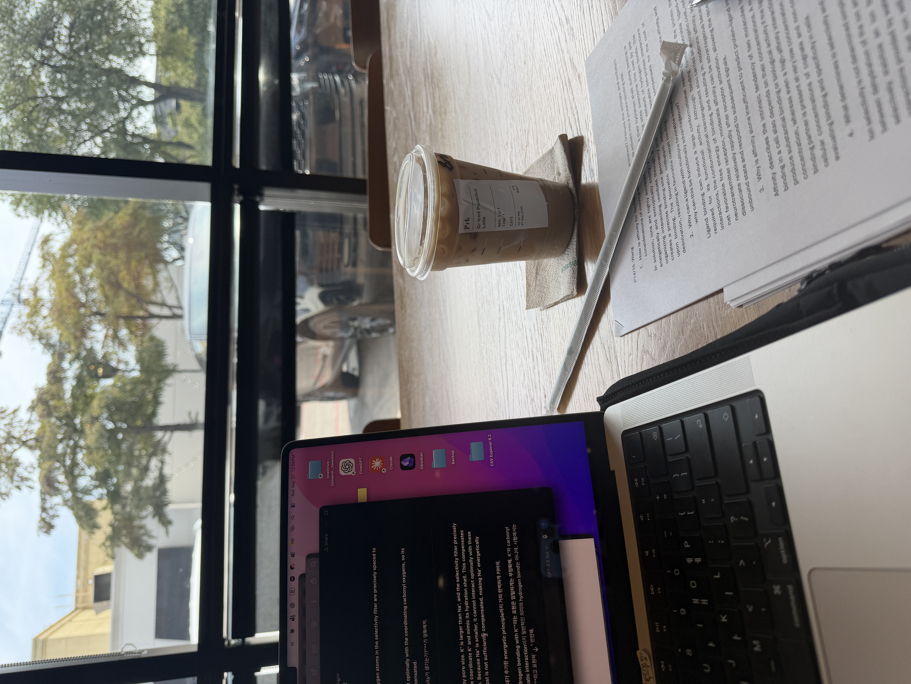

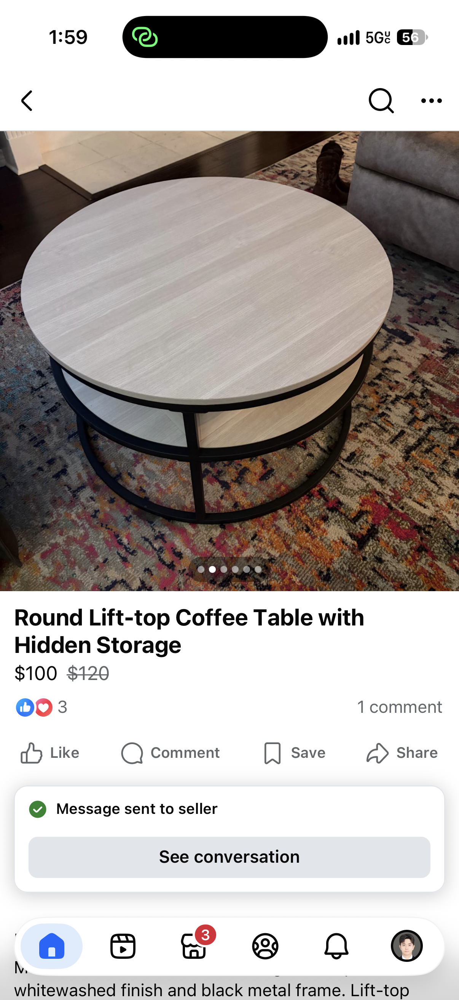

:::

미국에 온지 8주차, 
아직 시계는 배송되지 않아서 그에 대한 후기는 없지만 다음주에는 반드시 받을거라 기대하고 있다.

그리고 루틴에 대한 얘기를 짧게 써보려고 한다.

루틴
- 아침과 영양제 챙겨먹기.
- 오후 12시 이후로 카페인 섭취 금지하기.
- 점심과 저녁을 +-1시간 기준으로 정확한 때에 챙겨먹기.
- 밤 10시 이전에 자기.
- 최소 주 3회 이상 헬스 혹은 런닝하기.
- 매 주말마다 청소하기.

영양과 수면, 정리에 대한 이야기이다.

내가 이 습관을 올 한해동안 잘 유지할 수 있다면,
그 말은 즉 내가 이 생활에 잘 적응하여 지낼 수 있다는 뜻이고,
또 그 말인 즉 내가 박사과정동안 연구에 잘 몰두하여 성과를 낼 수 있다는 뜻이다.

즉, 성공적인 박사 과정을 지내기 위해서는 이 루틴만 잘 지키면 된다!
정말 간편한 계산이다.

아무튼 나를 온갖 위험으로부터 지켜줄 루틴을 소중히 하고, 앞으로도 잘 지켜나가야지.