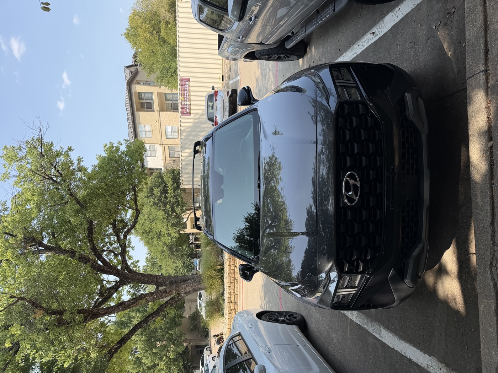
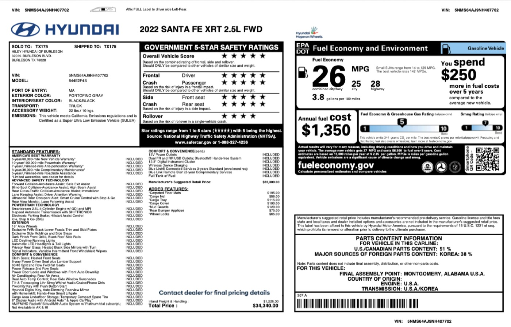
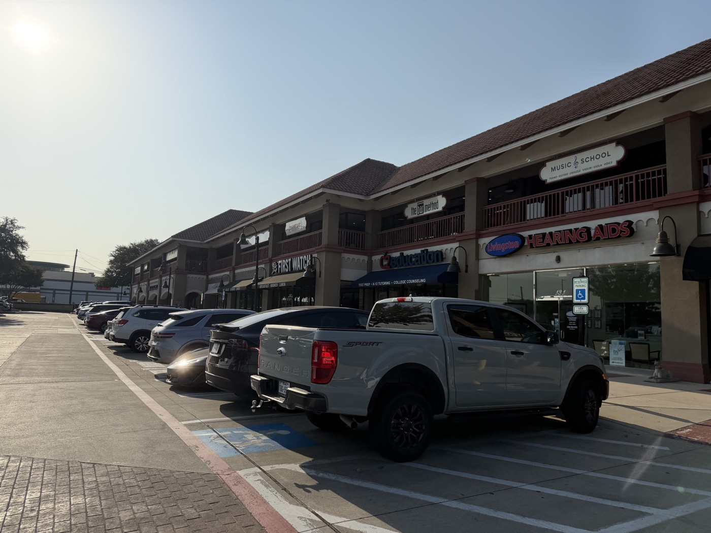
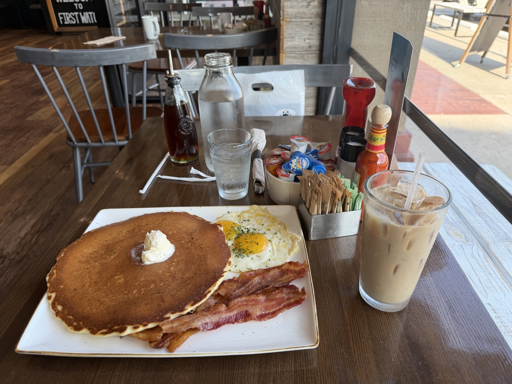
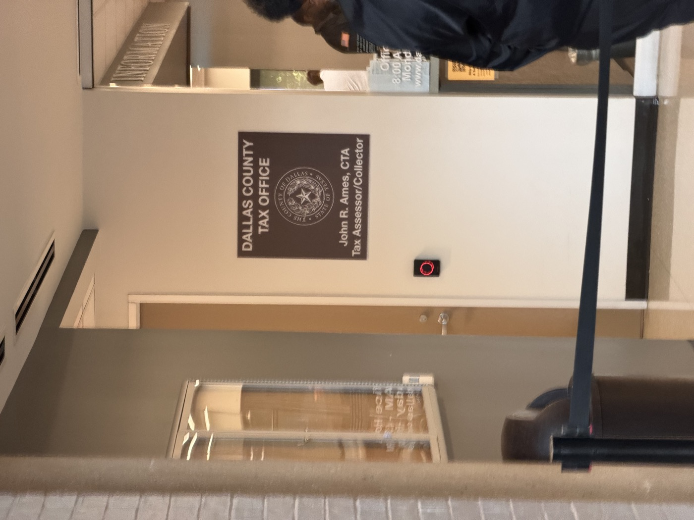
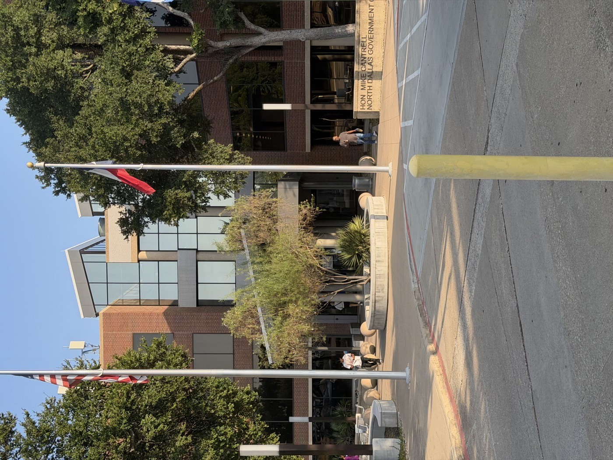
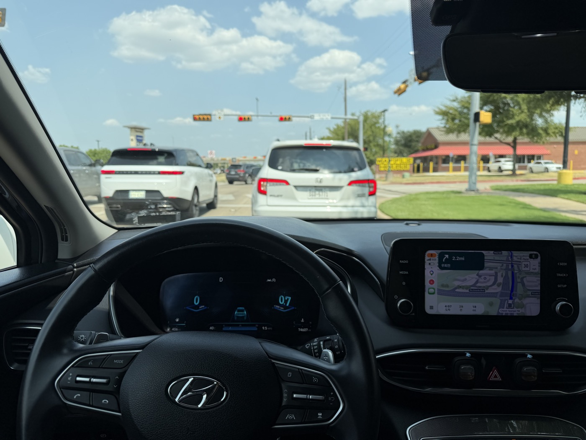

q

이전 글([미국 유학 첫 차 구매 준비](us-car.html))에서는 도착 전 딜러 기준으로 준비 과정을 정리했었다. 실제로는 딜러가 아니라 **개인간 거래(private-party)** 로 2022 Hyundai Santa Fe XRT를 샀다. 한인 커뮤니티에서 매물을 봤고, 상태가 좋아 보여서 직접 진행했다. 이 글은 그 실제 과정을 순서대로 정리한 후기다.

---

## 가격은 어떻게 판단했나

개인거래에서 가장 헷갈렸던 부분은 "적정 가격이 얼마인가"였다. 숫자 하나로 판단할 수 없다는 걸 알게 됐다.

| 자료                  | 이번 차량 기준  | 의미                                      |
| ------------------- | --------- | --------------------------------------- |
| CARFAX Retail Value | 약 $19,000 | 소매시장 기준 참고가. 개인거래 가격과 동일하지 않음           |
| CarMax 매입 견적        | 약 $15,000 | 딜러가 실제로 사가는 가격. 소매가보다 낮은 게 정상           |
| 실제 지불가              | $20,200   | 차량 상태·정비이력·판매자 사정이 반영된 private-party 가격 |

세 숫자는 서로 다른 개념이라 단순 비교하면 안 된다. CARFAX 값보다 비싸게 샀다고 바로 "바가지"라고 판단하지 않고, 아래 다섯 가지를 같이 봤다.

1. 비슷한 연식·트림·주행거리의 실제 매물가
2. CARFAX/KBB 같은 가치 자료
3. 딜러 매입가 (CarMax offer)
4. 사고·소유·title 이력
5. 최근 정비 및 소모품 상태

결론적으로 "싸게 샀다"기보다는 "조금 더 냈지만 상태와 정비이력이 확실한 차를 샀다"에 가까웠다.

참고로 신차 출고 당시 window sticker(Monroney Label)를 보니 MSRP $32,300, 딜러 옵션(플로어 매트·카고넷·트레이·커버·머드가드·범퍼 어플리케·휠락) 포함 총액이 $34,340이었다. 74k mi를 타는 동안 약 **40%** 감가된 셈이다($20,200 ÷ $34,340 ≈ 59%).

---

## 전체 흐름

| 단계  | 내용                              | 비용                 |
| --- | ------------------------------- | ------------------ |
| 1   | CARFAX 리포트 확인                   | $40                |
| 2   | PPI (사전 점검)                     | $150               |
| 3   | 시운전                             | -                  |
| 4   | 신원·VIN·lien 확인, 결제, Bill of Sale 작성 | $20,200            |
| 5   | Title 양도 서명 + Form 130-U 공동 서명    | -                  |
| 6   | 보험 가입 (Progressive)             | -                  |
| 7   | Transit Permit 신청               | -                  |
| 8   | Tax Office 방문·등록                | 세금 $1,262.50 + 수수료 |

### 실제로 든 총비용

| 항목                     | 금액            |
| ---------------------- | ------------- |
| 차량가액 (deposit $500 + 잔금 $19,700) | $20,200       |
| CARFAX + PPI           | $190          |
| 판매세 (6.25%)            | $1,262.50     |
| Title·등록 수수료           | 별도 (카운티별 상이) |
| **합계**                 | **$21,652.50 + 수수료** |

---

## 1단계. CARFAX 리포트 확인

사고 이력, 소유주 변경 이력 등을 확인하기 위해 CARFAX 리포트를 **$40**에 구매했다. 확인해야 할 항목은 이렇다.

- **Accident/damage** — 사고·손상 기록, 구조적 손상(structural damage), 에어백 전개 여부
- **Title** — salvage, rebuilt, flood 등 title 문제 여부
- **Odometer** — 주행거리 조작(rollback) 또는 불일치 여부
- **Ownership** — 소유자 수와 소유 기간
- **Service history** — 오일, 타이어, 브레이크, 필터 등 실제 정비 기록
- **Open recall** — 미해결 리콜 여부
- **지역** — 침수·염화칼슘 등 특정 환경 노출 가능성

이번 차량은 무사고, 구조적 손상 없음, 에어백 전개 없음, 주행거리 이상 없음, title 문제 없음(이런 상태를 Clean title이라고 한다), 개인 소유자 2명, 여러 건의 실제 service record가 확인돼 긍정적으로 판단했다.

## 2단계. PPI (Pre-Purchase Inspection)

PPI를 받으러 가기 전 아침을 간단히 먹었는데, 계산할 때 영수증을 보고 잠깐 멈칫했다. 커피 한 잔에 메뉴 두어 개 시켰을 뿐인데 거의 **30불 가까이** 나왔다. 외식 물가를 새삼 체감한 순간이었다.

::: {.photo-row}

:::

판매자가 "상태 좋다"고 말하는 것과 정비사가 실제로 확인하는 것은 다르다. 판매자와 무관한 독립 정비소에서 구매자 비용으로 받는 게 원칙이다. 비용은 **$150**이었고, 74,532 mi 시점에 아래 항목을 확인했다.

| 항목     | 확인 내용                               |
| ------ | ----------------------------------- |
| OBD/스캔 | 현재·과거 fault code, 경고등               |
| 엔진     | 누유, 냉각수 누유, 이상음, 오일 상태              |
| 변속기    | 누유, 변속 충격/이상음, road test            |
| 브레이크   | 패드·로터 상태                            |
| 타이어    | tread depth, uneven wear, DOT(생산연도) |
| 서스펜션   | 쇼크/스트럿, 부싱, ball joint              |
| 하부     | 누유, 부식, 사고 흔적                       |
| 차체     | 패널 교환/도색 흔적, frame damage 여부        |
| 기본 전장  | AC, lights, windows, locks, battery |

리프트 검사·누유·서스펜션·타이어·브레이크·시스템 스캔까지 모두 양호(GOOD)였다.

::: {.callout-tip}
PPI에서 "GOOD"이라고만 적혀 있어도, 가능하면 타이어 tread depth·brake pad thickness 같은 **숫자로 측정된 값**을 요청하고, 최근 정비 이력은 영수증으로 한 번 더 확인하는 게 좋다. "GOOD"은 향후 몇 만 마일을 보장하는 게 아니라 현재 상태에 대한 판단일 뿐이다.
:::

## 3단계. 시운전

PPI와 별개로 직접 몰아보면서 확인했다.

| 상황    | 확인할 것                     |
| ----- | ------------------------- |
| 냉간 시동 | 시동 직후 이상 진동·소음·경고등        |
| 저속    | 브레이크 이질감, 핸들 쏠림, 저속 변속 충격 |
| 가속    | 엔진 출력, 변속 품질, 이상음         |
| 고속    | 진동, 스티어링 휠 흔들림, 휠베어링 소음   |
| 강한 제동 | 브레이크 떨림, 금속음, 한쪽 쏠림       |
| 주차    | 전후진 전환 충격, 누유 흔적          |

## 4단계. 거래 전 확인, 결제, Bill of Sale 작성

돈을 건네기 전에 아래 세 가지를 먼저 확인했다. 개인거래에서 사기를 막는 가장 기본적인 절차다.

- **판매자 신원** — Title에 적힌 소유주 이름과 판매자 신분증이 일치하는지
- **VIN 일치** — Title, 차량(앞유리 하단·운전석 도어), CARFAX의 VIN이 모두 같은지
- **Lien 여부** — Title에 lienholder(대출 기관)가 적혀 있지 않은지. 적혀 있다면 대출을 다 갚았다는 **lien release** 서류를 함께 받아야 한다

차량을 잡아두기 위해 **$500**을 deposit으로 먼저 지급했다. 이후 총 차량가액 $20,200에서 deposit을 제외한 **$19,700**을 cashier's check로 지급했다. 개인간 거래에서는 판매자가 현금 다발을 받기 부담스러워하는 경우가 많아, cashier's check가 표준적인 결제 수단이다. 결제 후에는 근처 커피숍에서 판매자와 함께 **Bill of Sale**(매매계약서)을 작성했다. 거래 금액, 차량 정보, 양측 서명이 들어가는 간단한 문서로, 표준 양식을 인터넷에서 미리 출력해 가면 편하다.

## 5단계. Title 양도 서명 + Form 130-U

Bill of Sale 작성 후 **Title**(소유권 증서)을 넘겨받았다. 판매자가 Title 뒷면의 seller 란에 서명·양도 정보를 기입한 상태로 건네줬다.

같은 자리에서 **Form 130-U**(Application for Texas Title and/or Registration)도 함께 작성했다. 이 양식은 **판매자와 구매자가 둘 다 서명**해야 해서, 판매자를 만나는 자리에서 받아두지 않으면 나중에 다시 연락해야 한다. TxDMV 웹사이트에서 미리 출력해 가면 된다.

::: {.callout-warning}
Title 뒷면 양도란이나 Form 130-U의 판매자 서명이 빠지면 Tax Office에서 등록이 거부될 수 있다. 그 자리에서 빠짐없이 기입됐는지 확인해야 한다.
:::

## 6단계. 보험 가입

Transit Permit을 신청하기 전에, 차량을 운행하려면 먼저 본인 명의로 보험에 가입해야 한다. 3대 보험사에 견적을 받아봤고, 그중 가장 저렴했던 **Progressive**로 결정했다.

## 7단계. Transit Permit 신청

텍사스에서는 기본적으로 번호판이 차를 따라가지만, 개인거래에서는 판매자가 번호판과 registration 스티커를 떼어 갈 수 있다. 이번 판매자도 앞·뒤 번호판과 앞유리 스티커를 떼어서 가져갔다.

번호판 없이 차를 몰고 이동해야 하므로 **Transit Permit**을 신청했다. 이 permit이 있으면 번호판 없이 **5일간** 합법적으로 운행할 수 있다.

## 8단계. Tax Office 방문 — 등록 및 세금 납부

이후 Tax Office를 혼자 방문해 최종 등록 절차를 밟았다. 준비물은 다음과 같다.

- 판매자에게 받은 **Title**
- 양측이 서명한 **Form 130-U**
- 본인 확인용 **Passport**
- **보험 증명서**(insurance card)
- 세금과 수수료를 낼 수단

세금은 **실제 거래가와 SPV(Standard Presumptive Value)의 80% 중 더 큰 금액**에 6.25%가 붙는다. 시세보다 싸게 샀다고 신고해도 SPV 기준으로 과세되니, 너무 싸게 산 경우에는 세금을 미리 계산해 두는 게 좋다. 이번에는 거래가가 더 높아서 $20,200 × 6.25% = **$1,262.50**을 냈다.

::: {.callout-note}
세금은 전액 현금으로 냈다. **Apple Pay는 안 됐고**, 카드는 수수료가 추가로 붙는 경우가 많다. 현금이나 check로 준비해 가는 게 안전하다.
:::

절차를 마치자 그 자리에서 텍사스 번호판과 **registration 스티커**(텍사스는 Two Steps, One Sticker 제도라 앞유리 스티커가 하나뿐이다)를 받았고, 최종적으로 **registration receipt**(등록 확인 서류)까지 수령하며 등록이 끝났다.

계기판 주행거리는 74,607 mi. PPI를 받았던 74,532 mi에서 크게 벗어나지 않은 상태로 정식으로 내 차가 됐다.

::: {.photo-row}

:::

---

## 구매 직후 체크리스트

등록을 마친 뒤 아래를 정리해뒀다.

- [ ] Title / registration receipt / Form 130-U / Bill of Sale 보관
- [ ] 판매자에게 받은 정비 영수증·CARFAX·PPI 보고서 보관
- [ ] 보험 카드를 차 안에 비치
- [ ] 현재 mileage와 최근 오일 교환 mileage 기록
- [ ] 타이어 DOT와 tread depth 기록
- [ ] 브레이크 pad/rotor 상태 기록
- [ ] 향후 정비를 mileage 기준으로 캘린더에 기록

---

## 마치며

딜러 거래보다 절차가 단순해 보이지만, 스스로 확인해야 할 게 더 많다. CARFAX와 PPI로 차량 상태를 검증하는 과정, 그리고 판매자를 만난 자리에서 신원·VIN·lien과 Title·130-U 서명을 확인하는 과정이 특히 중요했다. 결제부터 등록까지 하루 이틀 안에 끝났다. 딜러에서 비슷한 상태의 차를 샀다면 dealer fee와 마진이 붙었을 테니, 시세보다 조금 더 줬더라도 전체 비용은 합리적인 편이었다고 생각한다.

*세금·서류 요건은 카운티마다 조금씩 다를 수 있으니, 방문 전 관할 Tax Office에 필요 서류를 한 번 더 확인하는 걸 추천한다.*

---

## 앞으로의 정비 계획과 운행 계획

구매 시점 기준(약 75,000 mi, 2.5L GDI, FWD)으로 다음 정비 계획을 세워뒀다. 53,146 mi에서 타이어 4개 교체와 브레이크 패드 교체가 있었고, 약 69k mi(2026년 3월경)에 오일을 교환한 이력이 확인됐다. 오일 교환 주기를 5,000–6,000 mi로 잡으면 **지금이 바로 첫 오일 교환 시점**이다.

현대의 10년/100,000 mi 파워트레인 보증은 첫 소유주에게만 적용되고, 두 번째 소유주부터는 5년/60,000 mi로 줄어든다. 이 차는 이미 보증이 끝난 상태라, 아래 예비비를 넉넉하게 잡았다.

| 시점 | 정비 |
|------|------|
| 지금 (75k) | 오일 + 필터, 에어필터·캐빈필터 점검 |
| 80–91k | 오일 교환 주기(5,000–6,000 mi)마다 오일 + 필터, 타이어 rotation, 브레이크/타이어 점검 |
| **~90k** | 브레이크 오일 교환, 변속기 오일 상태 점검 |
| **96k** | ★ 스파크플러그 교체 + 오일/필터 |
| **100k** | ★ 전체 상태 점검. 이 마일리지 자체가 차를 팔아야 할 시점은 아님 |
| 104–140k | 오일 교환 주기마다 rotation, 브레이크/서스펜션/하체 점검 반복 |
| **120k** | ★ 냉각수(coolant) 교환 + 전체 점검 |
| **144–150k** | ★ 오일 + 엔진/변속기/냉각계통/하체/브레이크/타이어/배터리/AC 전체 점검 |

::: {.callout-tip}
텍사스의 더위와 짧은 시내 주행 위주의 운행은 매뉴얼상 **severe 조건**에 해당할 수 있다. 이 경우 오일·변속기 오일·필터 교환 주기가 짧아지니 오너스 매뉴얼의 severe 기준표도 함께 확인해 두자.
:::

75k에서 150k까지 정상적인 유지비 합계는 대략 **$3,000–5,250**, 예상치 못한 수리 예비비를 더하면 보수적으로 **$4,500–7,500** 정도로 잡아뒀다.

정비 계획과 별개로, "언제까지 이 차를 탈까"도 미리 정해뒀다. 2년(2028년, 약 95k), 6년(2032년, 약 150k), 10년(2036년, 약 200k) 세 시점을 놓고 비교했다.

| 보유 기간 | 판매 시점 | 주행거리 | 핵심                  |
| ----- | ----- | ---- | ------------------- |
| 2년    | 2028  | 95k  | 감가를 최소화하려면 빨리 파는 전략 |
| 6년    | 2032  | 150k | 경제성과 수리 리스크의 균형     |
| 10년   | 2036  | 200k | 차량을 최대한 오래 사용하는 전략  |

판단 기준은 마일리지가 아니라 **비용의 종류**로 나눴다. 오일·필터·타이어 rotation·스파크플러그·냉각수·정상적인 타이어/브레이크 교체 같은 **routine maintenance**는 매각 판단에서 아예 제외한다. 대신 엔진·변속기·AC compressor·큰 전장 문제·휠베어링·CV axle·큰 서스펜션/냉각계통 수리 같은 **unexpected repair**만 기준으로 삼는다.

- unexpected repair 누적 $3,000 미만 → 그냥 계속 탄다
- $3,000–5,000 → 대체로 계속 탄다
- $5,000–7,000 → 차량 상태와 향후 비용을 비교해서 판단
- $7,000 이상, 또는 엔진/변속기급 major repair → 매각을 진지하게 고려

100,000마일이 됐다는 이유만으로, 아직 $15,000 넘게 가치 있는 차를 팔 필요는 없다고 결론 내렸다. 그래서 **6년/150k를 1차 목표로 잡고, 그 시점에 그동안의 unexpected repair 누적액을 보고 200k까지 갈지 매각할지 다시 판단**하기로 했다. 2년/95k는 차량을 빨리 교체하고 싶을 때의 안전한 출구 전략, 10년/200k는 상태가 계속 좋을 경우 차량을 끝까지 뽑아 쓰는 전략 정도로만 남겨뒀다.
