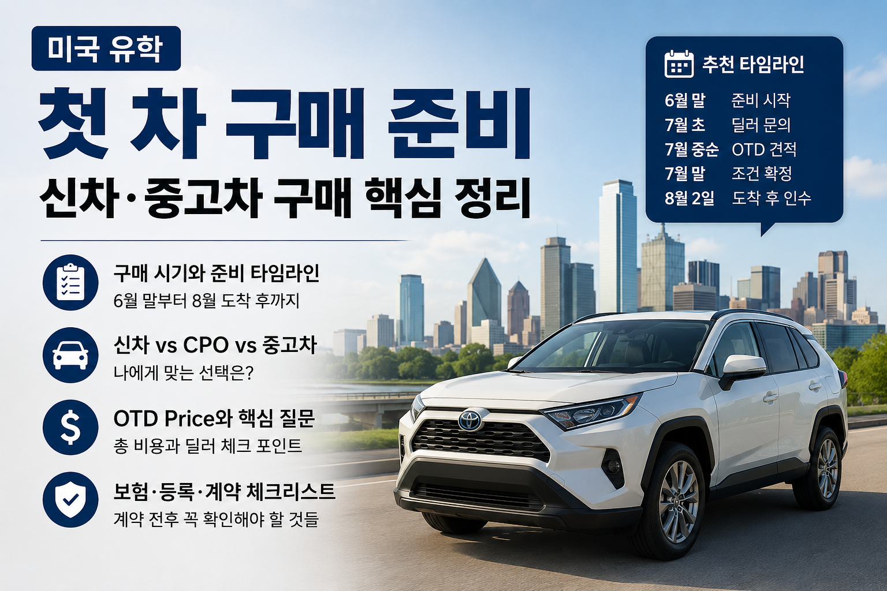

# 미국 유학 첫 차 구매 준비: 신차·중고차 구매 핵심 정리

미국 유학 생활에서 자동차는 꽤 큰 지출입니다.  
특히 Dallas처럼 차가 있으면 생활이 훨씬 편해지는 지역에서는, 도착 직후 차를 어떻게 살지 미리 생각해 두는 것이 좋습니다.

저는 8월 2일 미국에 도착할 예정이라, 지금부터 차 구매를 어떻게 준비하면 좋을지 정리해 보았습니다.

---

## 결론부터

8월 2일 도착이라면, 6월 말부터 딜러십에 무작정 메일을 돌릴 필요는 없습니다.

지금은 최종 가격 협상보다 **차종, 예산, 트림, 딜러 리스트를 정리하는 시기**입니다.

추천 흐름은 이렇습니다.

- **6월 말:** 차종, 예산, 필수 옵션 정하기
- **7월 초:** Dallas 주변 딜러 재고 흐름 확인하기
- **7월 중순:** 실제 VIN 있는 차량 기준으로 OTD 견적 요청하기
- **7월 말:** 조건 좋은 차량이 있으면 refundable deposit으로 잡기
- **8월 2일 도착 후:** 보험 가입, 딜러 방문, 계약, 인수

인기 모델이나 특정 하이브리드 차량을 원한다면 지금부터 가볍게 문의해도 되지만, 본격적인 견적 경쟁은 **7월 중순 이후**가 적당해 보입니다.

---

## 1. 도착 직후 렌트카 vs Uber

처음부터 2~3주 렌트카를 길게 잡는 것은 조금 아까울 수 있습니다.

차를 빨리 살 계획이라면, 도착 직후 며칠은 **Uber, DART, 학교 셔틀**로 버티는 것이 더 현실적입니다.

### 추천 방식

**도착 첫 3~5일**

- Uber
- DART
- 학교 셔틀
- 필요할 때만 마트 이동

**차 보러 다니는 날**

- 필요하면 1~3일만 짧게 렌트

**차 출고가 1~2주 늦어질 때**

- 그때 렌트카를 1주 정도 고려

즉, 처음부터 장기 렌트를 예약하기보다는 **차 출고 일정이 보인 뒤 필요한 만큼만 렌트**하는 편이 좋습니다.

---

## 2. 신차를 살 돈이 있다면

신차를 살 현금이 있다면 선택지는 훨씬 단순해집니다.

SSN이나 미국 신용기록이 없어도, **현금 구매라면 신차 구매가 가능할 수 있습니다.**  
다만 딜러마다 내부 정책이 다를 수 있으므로 미리 확인해야 합니다.

딜러에게는 이렇게 물어보면 됩니다.

> I am an international student on F-1 visa.  
> I do not have an SSN yet.  
> I plan to purchase without financing.  
> Can you complete the sale, title, and registration with my passport, I-20, I-94, proof of insurance, and U.S. address?

반대로 **finance나 lease**를 하려면 SSN, 미국 신용기록, 소득 증빙이 중요해집니다.

처음 미국에 도착한 유학생은 좋은 financing 조건을 받기 어려울 수 있으므로, 신차를 현금으로 살 수 있다면 그쪽이 더 깔끔할 수 있습니다.

---

## 3. 차가 오래 걸릴까?

차가 빨리 나오는지는 차종에 따라 다릅니다.

딜러 lot에 실제로 있는 차량이면 보험만 준비되면 며칠 안에 인수할 수도 있습니다.  
하지만 특정 색상, 특정 트림, 인기 하이브리드 모델은 몇 주 이상 기다릴 수 있습니다.

그래서 중요한 것은 단순히 “재고 있어요”라는 말이 아니라 아래를 확인하는 것입니다.

- [ ] 실제로 lot에 있는 차량인지
- [ ] VIN이 있는지
- [ ] in transit 차량인지
- [ ] ETA가 언제인지
- [ ] 이미 deposit이 걸린 차량인지
- [ ] refundable deposit이 가능한지

핵심은 **VIN이 있는 차량 기준으로 이야기하는 것**입니다.

---

## 4. 중고차, CPO, 신차 중 무엇이 좋을까?

처음에는 중고차나 CPO도 고려할 수 있습니다.

하지만 요즘 중고차 가격이 높으면, 상태 좋은 CPO와 신차 가격 차이가 생각보다 작을 수 있습니다.  
그렇다면 차라리 신차를 사는 것도 괜찮은 선택입니다.

### 신차가 좋은 경우

- 오래 탈 계획이 있다
- 고장 스트레스를 줄이고 싶다
- 차량 이력을 걱정하고 싶지 않다
- 현금 구매가 가능하다
- 중고차와 가격 차이가 크지 않다

### CPO가 좋은 경우

CPO는 Certified Pre-Owned의 약자입니다.  
제조사 인증 중고차라 일반 중고차보다 비싸지만, 점검과 추가 warranty가 붙는 경우가 많습니다.

차를 잘 모르는 유학생에게는 개인거래보다 안전할 수 있습니다.

### 일반 중고차가 좋은 경우

- 초기 비용을 줄이고 싶다
- 감가상각이 부담된다
- 좋은 매물을 찾을 시간이 있다
- 차량 상태를 볼 줄 알거나 inspection을 받을 수 있다

다만 처음 미국에 온 유학생이라면 개인거래보다는 **공식 딜러, CPO, CarMax, Carvana 같은 큰 플랫폼**이 더 안전할 수 있습니다.

---

## 5. 한인 딜러는 어떨까?

한인 딜러를 무조건 피해야 한다는 뜻은 아닙니다.

한국어로 상담할 수 있다는 점은 분명 장점입니다.  
다만 한국어가 된다는 이유만으로 가격과 조건을 검증하지 않고 믿는 것은 위험합니다.

딜러가 한인이든 아니든 중요한 기준은 같습니다.

- [ ] OTD 가격을 서면으로 주는가
- [ ] 불필요한 add-on을 강제로 붙이지 않는가
- [ ] 차량 VIN을 명확히 알려주는가
- [ ] title, registration 절차를 제대로 처리하는가
- [ ] 리뷰가 괜찮은가
- [ ] 계약서의 숫자가 견적과 일치하는가

결국 중요한 것은 **투명한 가격과 서류를 제공하는 딜러인지**입니다.

---

## 6. 차종과 조건 먼저 정하기

딜러에게 연락하기 전에 내가 원하는 차의 기준을 먼저 정해야 합니다.

미국 딜러 사이트를 보면 같은 차종이라도 트림, 옵션, 패키지, 색상에 따라 가격이 꽤 달라집니다.

“그냥 SUV 하나 사고 싶다” 정도로 접근하면 딜러가 보여주는 차량에 끌려가기 쉽습니다.

### 먼저 정할 것

- [ ] 세단이 좋은지, SUV가 좋은지
- [ ] 신차를 살지, CPO를 살지, 일반 중고차를 살지
- [ ] 예산 상한선
- [ ] 필수 옵션
- [ ] 있으면 좋은 옵션
- [ ] 절대 필요 없는 옵션
- [ ] 선호 브랜드
- [ ] 선호 색상
- [ ] 보험료가 부담되지 않는 차종인지

---

## 7. 브랜드와 트림 고르기

미국에서 첫 차를 살 때는 감성보다 실용성이 중요합니다.

박사과정 동안 오래 탈 차라면 아래 요소를 같이 봐야 합니다.

- 유지비
- 보험료
- 연비
- 리셀 가치
- 정비 접근성
- 부품 수급
- 장거리 운전 편의성
- 실내 공간
- 안전 옵션

많이 보는 브랜드는 Toyota, Honda, Mazda, Subaru, Hyundai, Kia 정도입니다.

### 트림을 볼 때 확인할 옵션

- Blind Spot Monitoring
- Rear Cross-Traffic Alert
- Rear A/C Vents
- Apple CarPlay / Android Auto
- Adaptive Cruise Control
- Lane Keeping Assist
- Backup Camera
- Power Liftgate
- Alloy Wheels
- AWD 여부

Dallas는 눈이 많이 오는 지역은 아니기 때문에 AWD가 필수는 아닙니다.  
다만 여행을 자주 가거나 SUV를 선호한다면 고려할 수 있습니다.

---

## 8. 가장 중요한 것은 OTD Price

미국에서 차를 살 때는 MSRP보다 **OTD Price**가 중요합니다.

### MSRP

MSRP는 Manufacturer’s Suggested Retail Price의 약자입니다.  
쉽게 말하면 제조사 권장 소비자가격, 즉 차량 스티커 가격에 가깝습니다.

하지만 실제로 내가 최종 결제하는 금액은 MSRP와 다릅니다.

### OTD Price

OTD는 Out-the-Door Price의 약자입니다.  
내가 실제로 지불해야 하는 최종 금액입니다.

OTD에는 보통 아래가 포함됩니다.

- 차량 가격
- 세금
- title fee
- registration fee
- dealer documentation fee
- mandatory add-ons
- 기타 수수료

딜러에게는 항상 이렇게 물어봐야 합니다.

> Can you send me the full out-the-door price in writing?

구두 견적보다 **서면 견적**이 중요합니다.

---

## 9. 딜러에게 물어볼 핵심 질문

딜러에게 연락할 때는 아래 질문만 확실히 하면 됩니다.

- [ ] 이 차가 실제로 lot에 있나요?
- [ ] VIN을 알려줄 수 있나요?
- [ ] in-stock인가요, in-transit인가요?
- [ ] ETA는 언제인가요?
- [ ] OTD price를 서면으로 받을 수 있나요?
- [ ] market adjustment가 있나요?
- [ ] mandatory add-on이 있나요?
- [ ] deposit은 refundable인가요?
- [ ] SSN 없는 F-1 학생 현금 구매가 가능한가요?
- [ ] 여권, I-20, I-94, 보험, 미국 주소로 title/registration이 가능한가요?

견적을 주지 않거나, 계속 방문만 유도하거나, OTD를 흐리는 딜러는 굳이 붙잡을 필요 없습니다.

---

## 10. 딜러에게 보내는 간단한 메일

7월 초에는 이런 식으로 가볍게 문의하면 됩니다.

> Hello,  
>  
> I will be arriving in Dallas on August 2 and plan to purchase a vehicle shortly after arrival.  
> I am interested in the [MODEL / TRIM].  
>  
> Could you let me know if you expect any in-stock or in-transit vehicles available around late July or early August?  
>  
> I am an international student on F-1 visa and may not have an SSN yet. I plan to purchase without financing.  
> Can your dealership complete the sale, title, and registration with my passport, I-20, I-94, proof of insurance, and U.S. address?  
>  
> Thank you.

7월 중순 이후에는 실제 VIN 있는 차량 기준으로 이렇게 요청하면 됩니다.

> Could you please send me the full out-the-door price in writing, including all taxes, registration/title fees, dealer fees, and any mandatory add-ons?

---

## 11. 여러 딜러에게 같은 조건으로 견적 받기

차량 구매에서 가장 중요한 전략은 여러 딜러에게 같은 조건으로 견적을 받는 것입니다.

한 딜러에게만 가면 내가 좋은 가격을 받는지 알 수 없습니다.

### 추천 방식

- 같은 모델
- 같은 트림
- 비슷한 색상
- 비슷한 옵션
- 실제 VIN 있는 차량
- 동일한 OTD 기준

이렇게 맞춰서 여러 딜러에게 견적을 요청합니다.

그다음 가장 좋은 견적을 받은 뒤, 다른 딜러에게 이렇게 물어볼 수 있습니다.

> I received a lower out-the-door quote from another dealership.  
> If you can match or beat it, I would be willing to move forward.

다만 너무 공격적으로 할 필요는 없습니다.  
중요한 것은 정중하게, 서면으로, 숫자를 명확히 받는 것입니다.

---

## 12. 계약할 때 조심할 것

계약 당일에는 숫자가 바뀌지 않았는지 꼭 확인해야 합니다.

### 확인할 것

- [ ] VIN이 내가 견적 받은 차와 같은지
- [ ] OTD 가격이 이메일 견적과 같은지
- [ ] market adjustment가 붙었는지
- [ ] 불필요한 add-on이 들어갔는지
- [ ] dealer warranty가 추가되었는지
- [ ] service contract가 들어갔는지
- [ ] GAP insurance가 들어갔는지
- [ ] doc fee와 registration fee가 이상하지 않은지
- [ ] 세금이 맞게 계산되었는지
- [ ] 보험 시작 시간이 맞는지

Finance office에서는 warranty나 protection package를 권할 수 있습니다.  
필요 없으면 이렇게 말하면 됩니다.

> I would like to decline all optional add-ons.

---

## 13. 결제와 보험

현금 구매라고 해서 실제 지폐를 들고 가는 것은 추천하지 않습니다.

보통은 아래 방식이 더 안전합니다.

- 미국 은행계좌 개설
- cashier’s check
- wire transfer
- 일부 금액 카드 결제 가능 여부 확인

그리고 차를 몰고 나오려면 보험이 필요합니다.  
따라서 차량 계약 전에 보험 견적을 먼저 받아두는 것이 좋습니다.

미국 운전 기록이 없는 유학생은 보험료가 높게 나올 수 있습니다.  
차값뿐 아니라 보험료까지 계산해야 합니다.

---

## 14. 내 추천 타임라인

### 지금부터 6월 말까지

- [ ] 차종 2~3개로 좁히기
- [ ] 예산을 OTD 기준으로 정하기
- [ ] 필수 옵션 정하기
- [ ] Dallas 주변 딜러 리스트 만들기

### 7월 초

- [ ] 딜러에게 가볍게 문의하기
- [ ] SSN 없는 현금 구매 가능 여부 확인하기
- [ ] in-stock / in-transit 재고 흐름 보기
- [ ] refundable deposit 가능 여부 확인하기

### 7월 중순

- [ ] 실제 VIN 있는 차량 기준으로 OTD 견적 요청하기
- [ ] 여러 딜러 견적 비교하기
- [ ] 보험 견적 받아보기

### 7월 말

- [ ] 조건 좋은 차량이 있으면 refundable deposit 고려하기
- [ ] 도착 후 방문 예약 잡기
- [ ] OTD 가격 서면 확보하기

### 8월 2일 도착 후

- [ ] 미국 번호 개통
- [ ] 은행계좌 개설
- [ ] 보험 가입
- [ ] 딜러 방문
- [ ] 계약서 확인
- [ ] 차량 인수

---

## 핵심 요약

8월 2일 도착이라면 지금 당장 딜러십에 대량으로 메일을 돌릴 필요는 없습니다.

지금은 **차종, 예산, 트림, 딜러 리스트를 정리하는 시기**이고, 본격적인 OTD 견적 경쟁은 **7월 중순 이후**가 좋습니다.

도착 직후에는 장기 렌트보다 Uber/DART로 며칠 버티고, 차를 보러 다니는 날만 짧게 렌트하는 방식이 현실적입니다.

신차를 현금으로 살 수 있다면 SSN이 꼭 필요하지 않을 수 있지만, 딜러에 미리 확인해야 합니다.

가장 중요한 것은 이 세 가지입니다.

1. **VIN 있는 차량 기준으로 보기**
2. **OTD 가격을 서면으로 받기**
3. **불필요한 add-on과 warranty를 조심하기**

결국 첫 차 구매의 핵심은 좋은 딜을 잡는 것보다, **나쁜 조건으로 급하게 사지 않는 것**입니다.