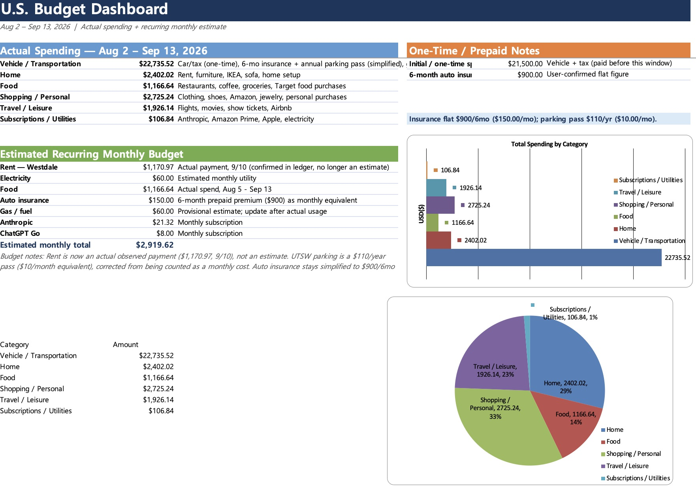
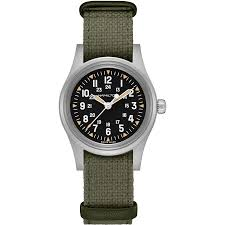

지난 [정착 초기 2주 지출 정리](us-cost-of-living.html) 이후로 한 달이 더 지났다. 이번엔 8월 2일부터 9월 13일까지, 그러니까 실질적으로 **한 달 살아본 결과**를 전부 뜯어봤다. 저번 글에서는 "일단 다 써보자" 였다면 이번엔 조금 더 냉정하게 나눠봤다. 매달 나갈 돈(recurring)과 이번 달에만 몰린 정착 비용(one-time)을 기준으로 삼았다.

## 한눈에 보기

| 테마 | 지출액 | 성격 |
|------|------|------|
| 1. 차량/교통 | $22,735.52 | 차량 구매(one-time) + 보험/주차권(사실상 반복) + 실주행비 |
| 2. 집 | $2,402.02 | 이사 세팅(one-time) + 렌트 첫 결제(recurring) |
| 3. 식비 | $1,166.64 | 거의 전부 recurring |
| 4. 쇼핑/개인용품 | $2,725.24 | one-time 큰 지출 몇 개 + 자잘한 recurring |
| 5. 여행/여가 | $1,926.14 | 항공권 위주 one-time |
| 6. 구독/공과금 | $106.84 | 전부 recurring |
| **합계** | **$31,062.40** | |

숫자만 보면 압도적으로 크지만, 이 중 절반 이상은 **차 사고 이사하느라 한 번만 나간 돈**이다. 그래서 이번 글의 핵심은 이 표가 아니라 다음 표다.

::: {.callout-note}
9월 13일 스크린샷 기준으로 아직 pending(승인 대기) 상태인 거래가 10건 있다 — 확정되면 살짝 바뀔 수 있다.
:::

---

## Recurring vs One-time — 진짜 "한 달 생활비"는 얼마일까

한 달치 카드 내역을 쭉 훑어보니, 큰 지출일수록 오히려 **다시는 안 나갈 돈**인 경우가 많았다. 차 사는 데 $21,500, 이사 세팅에 $1,231, 옷장 채우는 데 $606.94, 항공권 몇 개에 $1,850… 이런 건 "이번 달 생활비"라고 부르기엔 억울하다. 그래서 진짜 반복되는 항목만 따로 뽑아봤다.

| 반복(recurring) 항목 | 월 금액 | 비고 |
|------|------|------|
| 렌트 (Westdale) | $1,170.97 | 9/10 실제 결제 확인 |
| 식비 (외식+장보기) | $1,166.64 | 한 달치 실지출 |
| 교통 (기름값, 세차, 로컬 이동) | $154.59 | 세차는 $9.99/월 무제한권으로 가입해서 반복비 |
| 자동차보험 (6개월 $900 선결제) | $150.00 | 월 환산액 |
| 구독/공과금 (Anthropic, Amazon Prime, Apple, 전기) | $106.84 | |
| 여가 (영화 등 습관성 소비) | $29.21 | |
| 헤어샵 | $50.00 | 몇 주에 한 번 반복 |
| Amazon 소액 주문 (안정기 추세로 환산) | $91.37 | 정착 초반 폭주 제외하고 계산 |
| **합계 (월 반복 생활비)** | **$2,919.62** | |

| One-time / 정착 비용 | 금액 |
|------|------|
| 차량 + 세금 | $21,500 |
| 이사 세팅 (가구, 이케아, 소파, U-Haul) | $1,231.05 |
| 옷장 세팅 (Dillard's, ON Inc, REI, Nike 등) | $606.94 |
| Amazon 대형 주문 2건 (환불 1건 제외) | $586.22 |
| 항공권 2건 (칸쿤 + DC) | $1,720.54 |
| 시계 (아래에서 자세히) | $676.56 |
| 그 외 (이상준쇼 티켓, Airbnb, 운전면허 수수료, 출장 우버, 연간 주차권, Apple Store, CVS 등) | $496.61 |
| **합계 (one-time)** | **$26,817.92** |

::: {.callout-tip}
**월 $2,919.62** — 렌트, 보험, 주차권을 전부 "매달 나가는 돈"으로 환산해서 넣은 숫자다. 이게 이번 달 총지출($31,062.40)보다 훨씬 현실적인 "매달 각오해야 하는 생활비"에 가깝다. 정착 초기의 목돈들은 결국 다시 안 나갈 돈이라는 걸 숫자로 확인하니 마음이 좀 놓였다.
:::

---

## 이번 달 내 소비 취향은 어디로 쏠렸나

정착 필수 비용(차, 집, 식비, 공과금)을 걷어내고 나니, 내가 "이건 꼭 안 써도 됐는데 썼다" 싶은 지출은 거의 다 **쇼핑**과 **여행/여가** 두 테마에 몰려 있었다. 이 한 달 동안 내가 뭘 좋아하고 뭐에 돈을 아끼지 않는 사람인지가 카드 내역에 그대로 드러난 셈이다.

### 쇼핑 — 시계 하나 지르다

쇼핑 항목($2,725.24) 안에서 제일 큰 단일 지출은 **시계**였다. 해밀턴 카키필드 메카니컬(Hamilton Khaki Field Mechanical)을 한번 경험해보기로 하고 질렀다.

| 항목 | 금액 |
|------|------|
| 정가 | $725 |
| 할인 | -$100 |
| 세전 소계 | $625 |
| 세금 포함 최종 결제액 | $676.56 |

제대로 된 시계를 써본 적이 없어서 "이번 기회에 경험이나 해보자"는 마음으로 결정했는데, 정말 예상치 못한 $100 할인을 받아서 세금까지 다 포함해 $676.56에 데려왔다. 쇼핑 지출 안에서 옷장 세팅($606.94)이나 Amazon 대형 주문들과 나란히 놓고 보면, 이번 달 "나를 위한 소비" 1순위는 확실히 이 시계였다.

### 여행 — 칸쿤과 DC, 두 장의 항공권

여행/여가 항목($1,926.14)의 대부분은 항공권 두 장이다.

| 항공권 | 카드 결제액 | 실제 내 부담 |
|------|------|------|
| 칸쿤행 (Frontier) | 약 $1,300 | **약 $650** — 동행인 것까지 같이 끊어서 |
| DC행 (Southwest) | 약 $400 | 약 $400 |

칸쿤 항공권은 카드에는 $1,314.74로 찍혀 있지만, 이건 나 혼자가 아니라 같이 가는 사람 것까지 한 번에 결제한 금액이다. 그래서 순수하게 내 몫만 따지면 실제 부담은 절반 정도인 **$650 안팎**이라고 보는 게 맞다. [이 불안을 종식할 칸쿤행 비행기](../diary/2026-08-week4.html)를 시험 이틀 전에 홧김에 끊었던 그 티켓이다.

DC행은 온전히 내 항공권으로, $405.80이 그대로 내 지출이다.

::: {.callout-note}
카드 내역만 보면 여행 항목이 실제보다 부풀려 보일 수 있다 — 남 몫까지 대신 결제한 금액은 카드 명세서엔 전부 잡히지만 실제 내 지출은 아니기 때문이다. 다음 정산 때는 "카드 결제액"과 "내 실부담"을 나눠서 기록해야겠다.
:::

---

## 마치며

한 달을 살아보니 확실해진 게 하나 있다 — **정착 초기의 목돈은 결국 사라지는 돈이고, 진짜 신경 써야 할 건 매달 반복되는 $2,919.62다.** 이 안에서도 렌트($1,170.97)와 식비($1,166.64)가 절반을 넘게 차지하니, 결국 아낄 수 있는 건 쇼핑·여행 쪽 재량 지출뿐이라는 것도 다시 확인했다.

그리고 이번 달 소비를 돌아보면서 알게 된 사실 하나: 나는 필수 지출을 줄이려 애쓰기보다는, **한번 꽂히면(시계, 항공권) 확실하게 지르는 타입**이라는 것. 다음 달엔 이 재량 지출 두 테마(쇼핑/여행)를 얼마나 의식적으로 조절할 수 있을지 지켜볼 계획이다.
