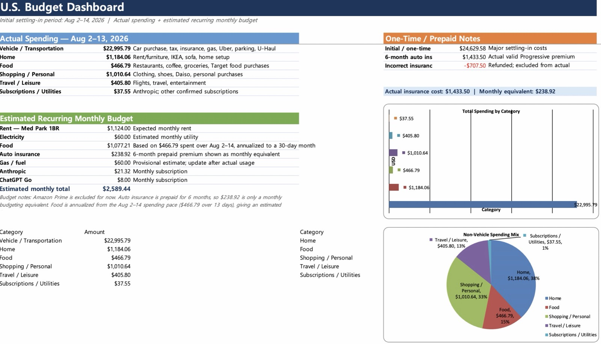
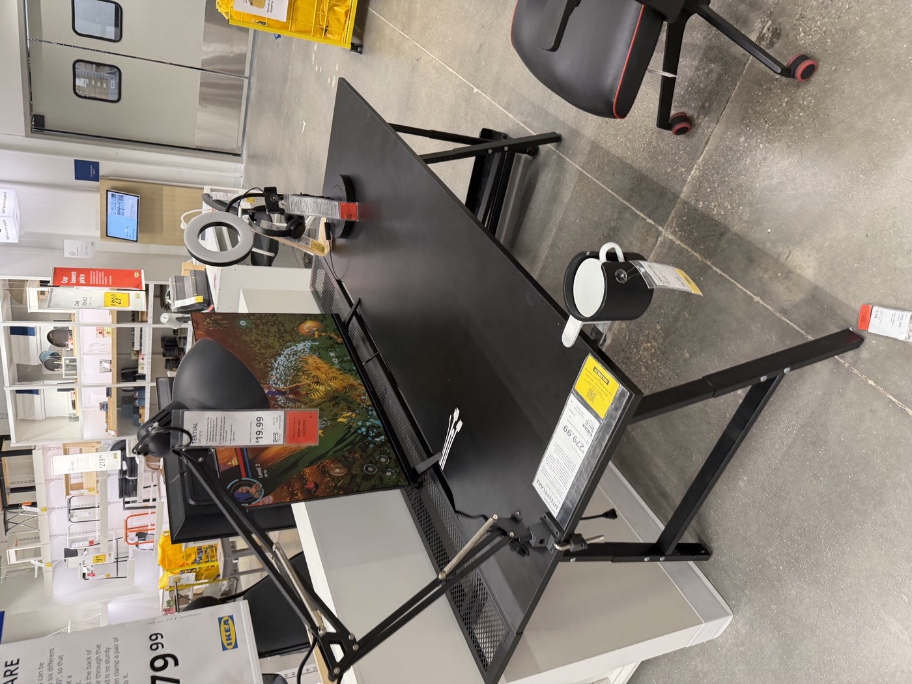
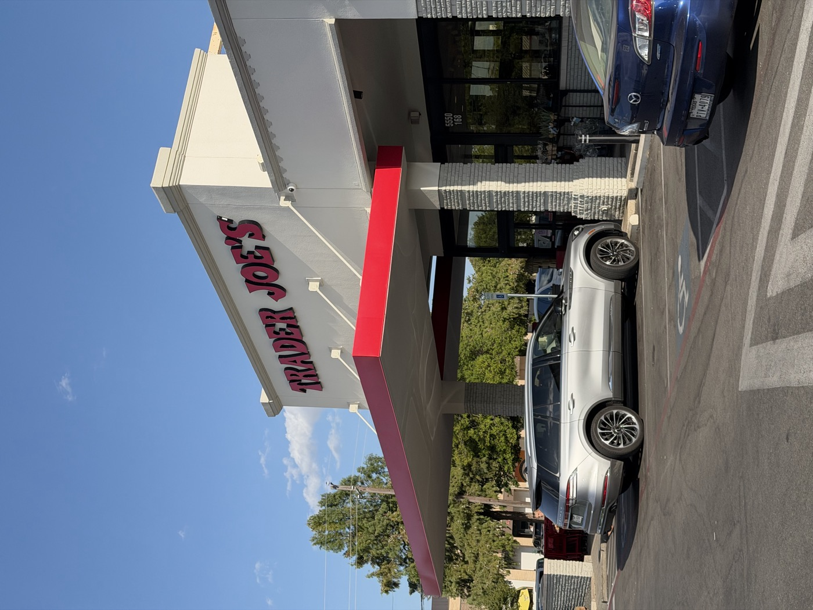
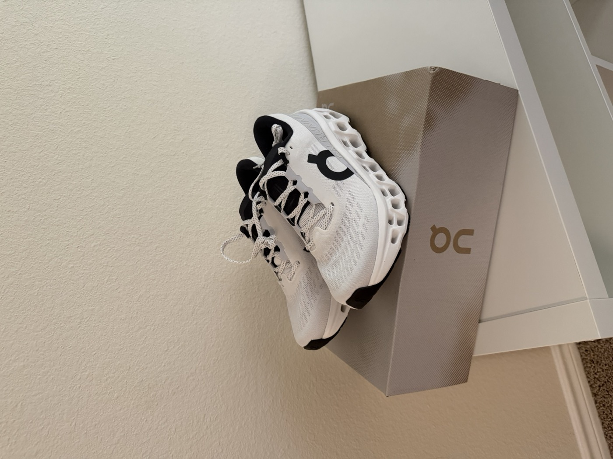
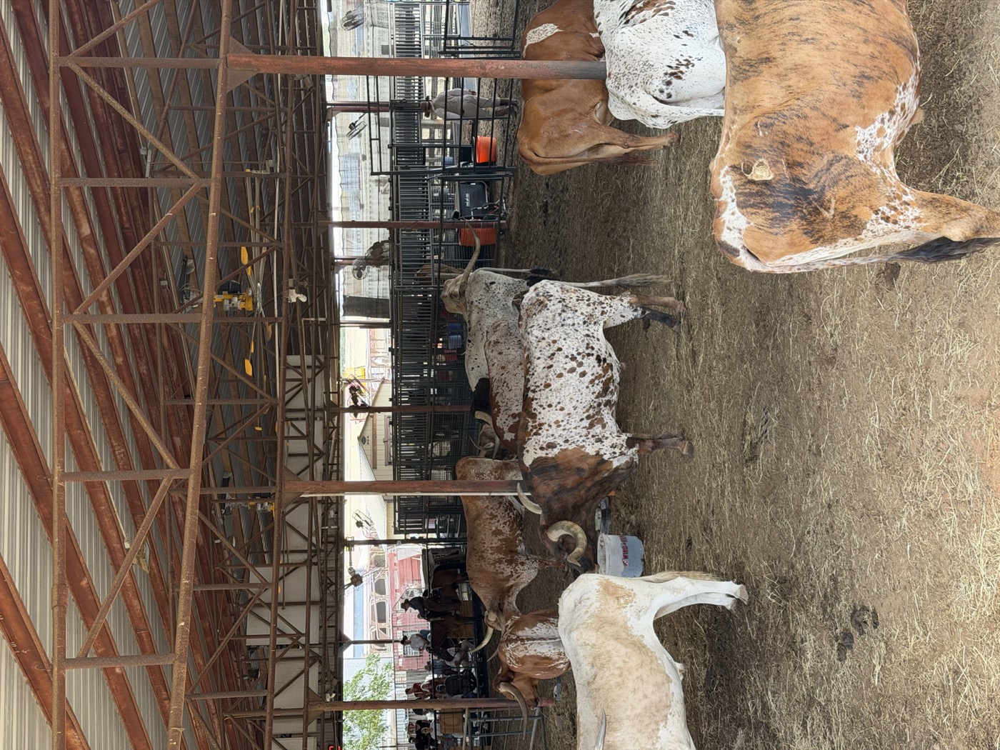
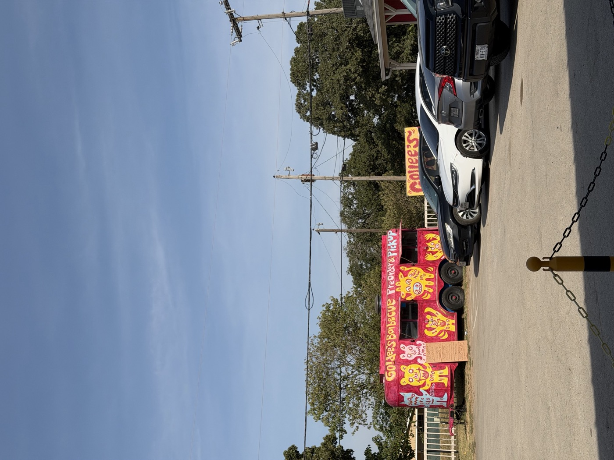

🇰🇷 [한국어로 보기](us-cost-of-living.html)

Estimating prices with an exchange-rate calculator ahead of time is one thing; actually feeling them every time you swipe a card is another. I tracked every dollar I spent in my first two weeks in Dallas (August 2–14) and split it into six themes — **vehicle, home, food, shopping/personal, travel/leisure, subscriptions/utilities**. Since I was still in the middle of settling in, one-time expenses dominate, but I also pulled out the recurring monthly costs buried inside them.

## At a glance

| Theme | Spend |
|------|------|
| 1. Vehicle | $22,995.79 |
| 2. Home | $1,184.06 |
| 3. Food | $466.79 |
| 4. Shopping/Personal | $1,010.64 |
| 5. Travel/Leisure | $405.80 |
| 6. Subscriptions/Utilities | $37.55 |

::: {.callout-note}
I was accidentally overcharged for insurance once and got a $707.50 refund — that's excluded entirely from the actual-spend totals below.
:::

---

## 1. Vehicle

This is by far the biggest item in my two-week spending. Broken down, it splits into three parts.

| Line item | Amount | Note |
|------|------|------|
| Car purchase price | $20,200 | Private-party sale |
| Sales tax | $1,262.50 | 6.25% of vehicle value, per Texas |
| Auto insurance | $1,433.50 | 6 months, prepaid (Progressive) |
| Other | ~$99.79 | Gas, Uber, parking, U-Haul (van rental to move a sofa) |

I already covered **the purchase price and tax** in detail in my [used car buying writeup](us-car-review.en.html), from the PPI to registration. In Texas, even a private-party sale gets taxed 6.25% of the vehicle's value, paid in cash or by card at the Tax Office when you register — so you need to have that extra chunk of money ready on top of the purchase price itself.

**Here's how I picked insurance.** Before you can apply for a Transit Permit, you need insurance in your own name to legally drive. I requested quotes online from three insurers — each one asked for roughly the same information (VIN, driver's license, US address, prior driving history), so each quote only took about 10–15 minutes to get. I expected my premiums to run high across the board as an international student with no US driving history, and that turned out to be true — but I was surprised by how much the quotes varied between companies. I compared all three and went with **Progressive**, the cheapest of the three, prepaying the full six months of coverage — $1,433.50 — up front.

::: {.callout-tip}
Car insurance in the US is typically prepaid in 6-month chunks. For a monthly budget, it's more realistic to divide the 6-month total by 6 (in this case, $238.92/month).
:::

::: {.photo-row}

:::

---

## 2. Home

| Line item | Details |
|------|------|
| Furniture | Used sofa (Facebook Marketplace), bed frame/mattress |
| IKEA | Desk, storage, household items |
| Other setup | Standing desk, small appliances, etc. |

This $1,184.06 over two weeks doesn't include rent — it's purely the cost of filling an empty apartment. Instead of buying new, I got the sofa used off Facebook Marketplace (the same sofa I mention in my [used car buying writeup](us-car-review.en.html), the one I rented that U-Haul van to move), then filled in a desk plus storage and household items from IKEA.

Rent itself is broken out separately below, under "Estimated recurring monthly costs." Early on, **the initial setup cost can actually feel bigger than rent** — the difference is that this isn't a monthly recurring expense, it's a lump sum you pay once and you're done.

::: {.photo-row}

:::

---

## 3. Food

| Line item | Details |
|------|------|
| Eating out | Chick-fil-A, In-N-Out, Chipotle, First Watch, BCD Tofu House, ramen, etc. |
| Groceries | Trader Joe's, H Mart, Target grocery |
| Coffee | Café visits |

I spent $466.79 over two weeks — I barely cooked and mostly ate out or ordered delivery, so scaled up to 30 days that comes out to roughly $1,077.21/month. The moment US restaurant prices really hit me was at First Watch, when a coffee and a couple of menu items came out to **almost $30**. I expect this number to come down naturally once I start leaning more on Trader Joe's and H Mart for groceries.

::: {.photo-row}

:::

---

## 4. Shopping/Personal

| Line item | Details |
|------|------|
| Clothing/Activewear | Alo, REI, Vuori, Nike |
| Essentials | Daiso, Target |
| Other | Outlet mall purchases |

At $1,010.64, this is the second-biggest item after the vehicle. It's mostly small essentials that added up — "oh, I don't have this either" trips to Daiso and Target — plus clothing and sneaker shopping (Alo, REI, Vuori, Nike). Each individual purchase was only a few dollars to a few tens of dollars and didn't feel like much at the time, but added together it turned out to be about the same size as the home setup costs in item 2.

::: {.photo-row}

:::

---

## 5. Travel/Leisure

At $405.80, this is a relatively small item — it covers a flight and some minor entertainment. It also includes a weekend trip out to watch the longhorn cattle at the Fort Worth Stockyards and grab dinner from the Goldee's BBQ truck. None of it was essential — it was mostly stress relief from settling in — but this category can grow fast the moment visitors show up or travel plans start forming, so I plan to keep tracking it separately.

::: {.photo-row}

:::

---

## 6. Subscriptions/Utilities

| Line item | Amount |
|------|------|
| Anthropic | $21.32/month |
| ChatGPT Go | $8.00/month |

At $37.55 in actual two-week spend, this is the smallest item — but it's only going to grow. Once utilities like electricity and internet start billing properly, they'll add their own line items; for now I've estimated electricity at around $60/month.

---

## Estimated Recurring Monthly Costs

Based on two weeks of actual spending, here's my estimate of the recurring costs I expect to pay every month going forward.

| Item | Est. monthly | Note |
|------|------|------|
| Rent (Med Park 1BR) | $1,124.00 | Estimated rent |
| Electricity | $60.00 | Estimate |
| Food | $1,077.21 | Two-week actual spend ($466.79) scaled to 30 days |
| Auto insurance | $238.92 | Monthly equivalent of the prepaid 6-month premium |
| Gas | $60.00 | Provisional estimate, to update after more driving |
| Anthropic | $21.32 | Monthly subscription |
| ChatGPT Go | $8.00 | Monthly subscription |
| **Total** | **$2,589.44** | |

::: {.callout-tip}
Food and gas are still estimates based on only two weeks of data. Gas in particular is likely underestimated, since my commuting pattern hasn't settled in yet — I'll update both after another month or two.
:::

---

## Wrapping up

Before I actually looked at the numbers, all I really knew was "I heard the US is expensive." Breaking it down by theme made **where the money actually goes** a lot clearer. Especially early on, if you don't separate "money that goes out every month" from "money that only goes out once," the cost of living can feel a lot scarier than it really is. The $2,589.44/month figure I've landed on here is still an estimate based on just two weeks of data, so I plan to update it against real bills after another month or two.
