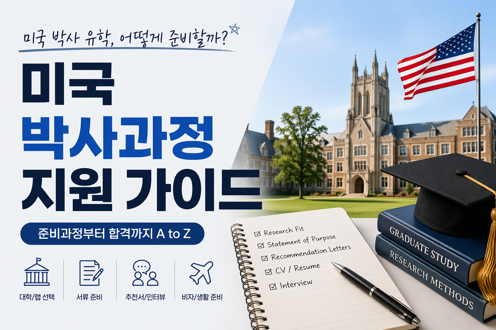

미국 박사과정 지원은 단순히 서류를 모아서 내는 게 아니다. 지원자가 왜 연구를 하고 싶은지, 왜 이 학교인지, 그리고 앞으로 어떤 연구자가 될지를 설득하는 과정이다. 나는 면역학·유전학 쪽으로 지원했고, 최종적으로 UTSW(UT Southwestern Medical Center) PhD 프로그램에 합격했다. 그 과정에서 배운 것들을 최대한 구체적으로 정리해본다.

---

## 학교별 서류 요구 현황

학교마다 요구 서류가 조금씩 다르다. 

| 서류          | A School | B School | C School     | D School   | E School |
| ----------- | -------- | -------- | ------------ | ---------- | -------- |
| SOP         | ✅        | ✅        | ✅            | ✅          | ✅        |
| PS          | ⚪        | ✅        | ⚪            | ✅          | ⚪        |
| LOR (3통)    | ✅        | ✅(4-5통)  | ✅            | ✅          | ✅        |
| Transcript  | ✅        | ✅        | ✅(WES 직접 발송) | ✅          | ✅        |
| TOEFL/IELTS | ✅        | ✅        | ✅            | ✅          | ✅        |
| CV          | ✅        | ✅        | ✅            | ✅ (GPA 삭제) | ✅        |
| GRE         | ❌        | ❌        | ❌            | ❌          | ❌        |
대부분의 내용들은 일반적인 지침을 따르며, 22곳을 지원하면서 있었던 항목별 특이케이스는 각 소주제별로 정리 예정이다. 

짧게 언급하자면, 다음과 같다.

1. 추천서를 4-5통까지 허락해주는 학교가 있었다.
2. Transcript를 credential evaluation agencies 통해 official하게 요구하는 학교가 있었다.
3. CV에 명기된 GPA를 삭제 요구하는 학교가 있었다.

> GRE는 2023년 이후 대부분의 이공계 PhD 프로그램에서 폐지됐다. 지원 전 반드시 최신 요강을 확인할 것.

---

## 전체 타임라인

지원 시즌은 생각보다 빨리 시작된다. 대부분의 프로그램 마감이 이른 경우에는 **11월 중순**, 보통 일반적인 경우에는 **12월 초**에 몰려 있기 때문에, 늦어도 **3월부터는 본격적으로 준비**해야 한다.

| 시기     | 할 일                          |
| ------ | ---------------------------- |
| 3-6월   | TOEFL/IELTS 응시               |
| 6~7월   | 지원할 학교·프로그램 리스트 확정, 관심 PI 파악 |
| 7~8월   | SOP 초안 작성 시작, 추천인에게 연락       |
| 9~10월  | SOP/PS 수정 반복,                |
| 10~11월 | 학교별 에세이 커스터마이징, 최종 제출        |
| 12~1월  | 인터뷰 초대 대기                    |
| 1~2월   | 인터뷰 (International은 보통 Zoom) |
| 3~4월   | 합격 통보, April 15 데드라인까지 결정    |

---

## Statement of Purpose (SOP)

SOP는 지원 서류 중 가장 중요하다. 분량은 보통 1~2페이지(약 600~1000단어)이고, 핵심은 딱 하나다: **"나는 연구자로서 이런 사람이고, 이 학교에서 이런 연구를 하고 싶다."**

### 구조

나는 다음 구조로 썼다.

1. **Hook** — 연구에 관심을 갖게 된 계기. 추상적인 "어릴 때부터 과학이 좋았다"는 금물이다. 구체적인 실험 경험, 논문, 혹은 결정적인 순간으로 시작해야 한다.

2. **연구 경험 요약** — 학부·석사 때 했던 연구를 서술한다. 단순히 나열하는 게 아니라, *내가 무엇을 배웠고, 어떤 질문을 갖게 됐는지*에 초점을 맞춘다. 기술적인 스킬 나열보다 사고 과정이 훨씬 중요하다.

3. **연구 관심사** — 박사 과정에서 탐구하고 싶은 주제를 구체적으로 밝힌다. 너무 좁게 쓰면 유연성이 없어 보이고, 너무 넓으면 진지하게 고민하지 않은 것처럼 보인다. "~분야에서 ~메커니즘을 이해하고 싶다" 정도의 수준이 적당하다.

4. **왜 이 프로그램인가** — 관심 있는 PI 2~3명을 구체적으로 언급한다. 단순히 이름을 넣는 게 아니라 그 PI의 어떤 논문이 흥미로웠는지, 그 연구가 내 관심사와 어떻게 연결되는지를 써야 한다.

5. **마무리** — 장기적인 목표(academia, industry 등)와 이 프로그램이 그 목표에 어떻게 기여하는지로 끝낸다.

### 학교별 커스터마이징

SOP의 70~80%는 공통 내용이어도 되지만, 관심 PI 언급과 프로그램의 특징적인 부분(rotation system, 특정 core facility 등)은 학교마다 반드시 맞춤 작성해야 한다.

::: {.callout-warning}
다른 학교 이름이 남아있는 채로 제출하는 실수가 생각보다 자주 발생한다. 제출 전 반드시 교차 확인할 것.
:::

---

## Personal Statement (PS)

PS는 모든 학교에서 요구하는 서류는 아니다. 요구하는 경우에도 SOP와 별도로 제출하거나, SOP 안에 통합하기도 한다. PS의 목적은 SOP가 다루지 않는 **개인적인 배경과 맥락**을 설명하는 것이다.

| | SOP | PS |
|--|-----|-----|
| 초점 | 연구 경험과 목표 | 개인 배경과 다양성 |
| 톤 | 학술적, 분석적 | 개인적, 서사적 |
| 필수 여부 | 거의 모든 학교 필수 | 학교마다 다름 |

여기서 쓸 수 있는 내용:

- 연구를 시작하게 된 개인적 동기 (가족력, 본인의 경험 등)
- 학업에 영향을 미친 어려움이나 역경
- 한국에서 교육받은 배경이 어떤 관점을 제공하는지
- 커뮤니티나 다양성에 기여한 경험

::: {.callout-tip}
PS는 감상적인 자기소개서가 되면 안 된다. 모든 내용이 "왜 나는 좋은 연구자가 될 것인가"와 연결되어야 한다.
:::

---

## 추천서 (Letters of Recommendation)

대부분의 프로그램이 **3통**을 요구한다. 추천서는 지원자가 직접 쓸 수 없기 때문에, 누구에게 부탁하느냐가 핵심이다.

### 추천인 선택 기준

좋은 추천서는 **구체적**이다. "이 학생은 열심히 했습니다"는 아무 의미 없다. 추천인이 직접 나의 연구 능력, 사고방식, 문제 해결 과정을 목격한 사람이어야 한다.

- **같이 연구한 PI나 지도교수**가 가장 좋다.
- 강의만 들은 교수보다 **실험실에서 함께 일한 사람**이 낫다.
- 유명한 교수의 형식적인 추천서보다, 잘 아는 교수의 구체적인 추천서가 훨씬 강력하다.

### 추천 요청 프로세스

| 타임라인     | 할 일                             |
| -------- | ------------------------------- |
| 마감 2개월 전 | 추천인에게 정식 요청 이메일 발송              |
| 요청 시     | CV, SOP 초안, 지원 학교 목록, 마감일 함께 전달 |
| 마감 2주 전  | 리마인더 이메일 발송                     |
| 마감 후     | 감사 이메일                          |

::: {.callout-note}
추천인에게 강조하고 싶은 포인트(특정 프로젝트, 문제 해결 능력 등)를 함께 전달하면 더 구체적인 추천서를 받을 수 있다.
:::

::: {.callout-tip}
일부 학교에서는 4-5통의 추천서까지 허락하는 경우가 있다. 다만 이런 경우에, 추가될 서류가 합격 당락을 결정할만큼 유효한 추천서인지에 대한 고민이 필요하다.
:::

---

## Transcript (성적증명서)

- **비공식 성적증명서**: 원서 제출 시 업로드 (스캔본 또는 PDF)
- **공식 성적증명서**: 합격 후 학교에 직접 발송 (봉투 봉인 + 학교 직인 필요)
- 영문 성적증명서가 없는 경우, 공인 번역 필요

보통은 이 단계에서 비공식 성적증명서로 갈음하는 경우가 많으며, 일부 4.0 변환을 지원하지 않는 학교 성적표의 경우에는 변환을 위해 WES와 같은 credential evaluation agencies를 이용해야 하는 경우도 있다.

::: {.callout-tip}
일부 학교는 WES(World Education Services) 같은 공인 학점 평가 서비스를 요구하기도 한다. 필자는 이를 위해 9월 경 [WES iCAP](https://www.wes.org/resource-library/blog/credential-advice/wes-international-credential-advantage-package/) 서비스를 이용했고, 10월 말경 실제 서류를 우편으로 받았다. Unofficial PDF는 발급된 이후부터 자유롭게 접근 가능하다.
:::

---

## TOEFL / English Proficiency

대부분의 프로그램이 **iBT 80~100점** 이상을 요구한다.
TOEFL 100점 이상인 경우에 대부분의 Program에 지원이 가능했고,
2026년 01월을 기준으로 TOEFL은 개정되어 IELTS와 같이 Band 형식으로 채점된다.
구토플 기준으로 100점의 점수가 뉴토플 기준 5.0-5.5 정도로 책정된다.

| | TOEFL iBT | IELTS Academic |
|--|-----------|----------------|
| 형식 | 컴퓨터 기반 | 지필 or 컴퓨터 |
| 점수 체계 | 0–120점 | 0–9.0 밴드 |
| 일반 최소 요건 | 80–100점 | 6.5–7.0 |
| 미국 이공계 선호 | ✅ 더 일반적 | ⚪ |

TOEFL은 최근 2년 이내 응시 결과 중 섹션별 최고점을 합산해 제출할 수 있는 **MyBest Scores** 제도를 운영한다. 단, Stanford 외에는 이를 제출 허락하는 경우는 없었다.

---

## CV (Curriculum Vitae)

미국 학계 CV는 한국 이력서와 다르다. 사진, 나이, 성별은 넣지 않는다. 
분량은 보통 2페이지이다.

### 필수 섹션

- **Education** — 학교, 전공, GPA, 졸업 연도
- **Research Experience** — 실험실 이름, 지도교수, 연구 내용 (bullet point 2~3개)
- **Publications / Presentations** — 논문, 학회 포스터, 구두 발표
- **Awards & Fellowships**
- **Skills** — 실험 기법, 프로그래밍 언어 등
- **Teaching / Mentoring** (있는 경우)

### 연구 경험 서술 방법

단순 나열이 아닌, bullet point로 구체적인 기여를 서술한다.

❌ **나쁜 예**: Worked in immunology lab

✅ **좋은 예**: Performed scRNA-seq analysis on 12 human thymic samples using Seurat, identifying 8 distinct T cell developmental trajectories

::: {.callout-tip}
좀 더 구체적인 CV 지침을 위해 글을 추가로 작성했으니 아래 내용을 참고.
:::

---

## PI 컨택 — 해야 하나?

프로그램마다 다르다.

- **Rotation 시스템** (UTSW, Harvard BBS 등): 입학 후 여러 랩을 돌고 나서 지도교수를 정한다. 지원 전 PI 컨택이 필수는 아니지만, 관심 있는 PI가 학생을 뽑을 계획인지 미리 확인하는 건 도움이 된다.
- **직접 PI 배정 시스템**: 특정 PI 아래로 지원하는 경우, 사전 컨택이 사실상 필수다. 이메일을 먼저 보내고 video call을 거쳐 "informal acceptance"를 받은 뒤 공식 지원을 하는 게 일반적이다.

컨택 이메일은 짧고 구체적이어야 한다. PI의 최근 논문을 읽고 구체적인 질문이나 관심사를 담아서 보낸다. "I am very interested in your lab"으로 시작하는 이메일은 읽히지 않는다.

---

## 제출 전 최종 체크리스트

- [ ] SOP에 다른 학교 이름이 남아있지 않은가
- [ ] 모든 추천인이 제출 완료했는가 (포털에서 확인)
- [ ] 성적증명서 영문본이 정확한가
- [ ] TOEFL/IELTS 점수 리포팅 완료했는가 (학교 코드 확인)
- [ ] CV 날짜와 내용이 최신 상태인가
- [ ] 지원 포털에서 모든 항목이 "Submitted" 상태인가

---

## 마치며

박사 지원 준비에서 가장 중요한 건 **일찍 시작하는 것**이다. SOP는 쓰고 또 쓰고 또 쓰는 과정에서 좋아진다. 한 번에 완성하려 하지 말고, 초안을 빨리 만들어서 피드백을 받는 사이클을 반복하는 게 훨씬 효율적이다.

특히 추천서는 내가 컨트롤할 수 없는 부분이기 때문에 여유를 두고 일찍 요청하는 것이 중요하다. 이후 글에서는 인터뷰 준비와 Visit Weekend 경험을 더 자세히 다룰 예정이다.
