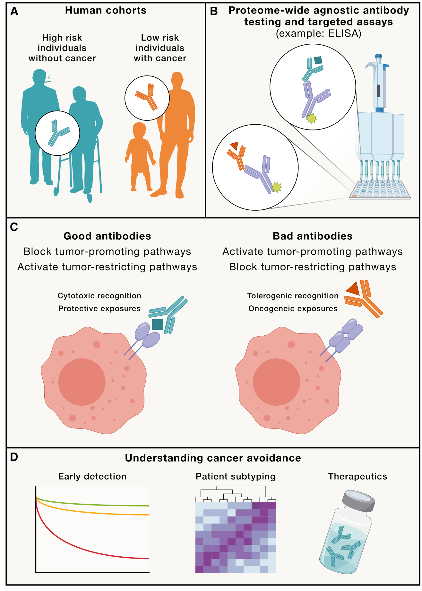

암은 같은 사람에게도 언제, 어떻게 발생할지 예측하기 어려운 질병이다.

같은 환경에 노출되고 비슷한 위험요인을 가진 사람이라도, 누군가는 평생 암에 걸리지 않는 반면 누군가는 암이 발생하고 빠르게 진행한다. 같은 암을 가진 환자들 사이에서도 치료에 대한 반응과 예후는 크게 다르다.

물론 나이, 생활습관, 유전적 요인, 종양 자체의 특성 등 여러 가지 요인이 이를 설명한다. 하지만 그것만으로는 충분하지 않다.

그렇다면 한 가지 질문을 던져볼 수 있다.

*암이 발생하기 훨씬 전부터, 그 사람의 면역계는 이미 다른 상태였던 것은 아닐까?*

2026년 *Cell*에 발표된 Paul Bastard와 국제 공동연구팀의 Commentary는 바로 이 질문에서 출발한다.

> "Do autoantibodies shape cancer immunosurveillance?"

---

## 면역계는 암을 감시하고 있다

우리 몸의 면역계는 바이러스와 세균을 제거할 뿐만 아니라, 비정상적으로 변한 세포를 찾아내고 제거하는 역할도 한다. 이것을 **cancer immunosurveillance**, 즉 암 면역 감시라고 한다.

실제로 면역계가 제대로 작동하지 않는 상황에서는 종양이 더 쉽게 발생할 수 있고, 반대로 면역 checkpoint inhibitor와 같은 치료가 암을 억제할 수 있다는 사실은 면역계가 암의 발생과 진행에 중요한 역할을 한다는 것을 보여준다.

그런데 여기에는 아직 풀리지 않은 중요한 문제가 있다.

왜 어떤 사람의 면역계는 암을 잘 감시하고, 다른 사람의 면역계는 그렇지 못한가?

Paul Bastard와 동료들은 그 답의 일부가 **항체(antibody)**에 있을 수 있다고 제안한다.

---

## 항체는 단순한 방어 기록이 아니다

우리 몸에는 과거에 무엇을 경험했는지를 반영하는 다양한 항체가 존재한다. 바이러스에 감염되면 바이러스에 대한 항체가 만들어지고, 백신을 맞으면 특정 항원에 대한 항체가 형성된다. 따라서 항체 repertoire는 일종의 면역학적 기록(immunological record)이라고 볼 수 있다.

하지만 항체가 단순히 과거의 면역 반응을 기록하는 것만은 아니다. 일부 항체는 실제로 자신의 표적 단백질의 기능을 바꿀 수 있다. 특히 자신의 몸을 구성하는 단백질을 공격하는 **자가항체(autoantibody)**는 특정 면역 기능을 직접 차단하거나 변화시킬 수 있다.

이미 감염병 분야에서는 이 현상이 잘 알려져 있다. 예를 들어,

anti-type I IFN autoantibody → IFN-α/ω 기능 차단 → antiviral immunity 저하 → severe viral infection

과 같은 연결이 실제 환자에서 관찰됐다. 또한 IL-10을 중화하는 자가항체는 inflammatory bowel disease와 연관될 수 있다. 즉, 자가항체 하나가 특정 면역 pathway를 선택적으로 무력화하고 질병을 일으킬 수 있다.

그렇다면 자연스럽게 다음 질문이 나온다.

암을 감시하는 면역 pathway를 공격하는 autoantibody도 존재한다면 어떨까?

---

## 암 면역 감시를 방해하는 자가항체가 있을 수 있다

Paul과 동료들이 제안하는 핵심 가설은 이것이다.

**사람마다 가지고 있는 antibody repertoire가 cancer immunosurveillance를 다르게 만들 수 있다.**

예를 들어 어떤 사람에게 특정 autoantibody가 존재한다고 하자. 그 antibody가

- tumor-promoting pathway를 차단하거나
- tumor-reactive immune response를 강화한다면

→ 암 발생을 억제하는 방향으로 작용할 수 있다.

반대로,

- tumor-restricting immune pathway를 차단하거나
- T-cell-mediated tumor surveillance를 방해한다면

→ 암 발생이나 진행을 촉진할 가능성이 있다.

즉 antibody는 단순한 "암이 생겼다는 표시"가 아니라, 경우에 따라서는 암의 발생과 진행에 직접 영향을 미치는 **biological modifier**일 수 있다는 것이다.

---

## 그렇다면 어떤 antibody를 찾아야 할까

여기서 이 논문의 재미있는 부분이 나온다. 저자들은 antibody를 하나의 종류로 한정하지 않는다. 크게 보면 세 가지를 생각할 수 있다.

**① 정상적인 자기 단백질에 대한 항체 — Autoantibodies**

예: cytokines, receptors, checkpoint molecules, complement regulators, enzymes, integrins, 기타 cell-surface proteins. 논문의 Table 1에는 integrin이 명시적으로 autoantigen 후보군으로 포함되어 있다.

**② 암에서 새롭게 나타나는 항원에 대한 항체 — Tumor-associated / tumor-specific antibodies**

mutation이나 tumor-specific protein에 대한 항체다.

**③ 외부 항원에 대한 항체**

바이러스, 세균, fungi 등 과거의 감염 경험을 반영하는 항체다.

즉, "암과 관련된 antibody가 무엇인지 미리 정해놓지 말고 최대한 넓게 찾아보자"는 것이 이들의 접근이다.

---

## 가장 중요한 것은 "발견"이 아니라 "기능"이다

여기서 매우 중요한 함정이 있다. 어떤 암 환자에게 특정 autoantibody가 많이 발견됐다고 해서, 그 antibody가 암을 일으켰다고 말할 수는 없다. 그 antibody가 단순히 암이나 감염의 결과로 생긴 것일 수도 있기 때문이다.

그래서 저자들은 antibody를 발견한 다음 반드시 functional assay를 해야 한다고 강조한다. 논리적으로는:

Antibody 발견 → Target 확인 → Binding 확인 → Target function에 영향을 주는가? → 실제로 immune pathway를 변화시키는가? → Cancer phenotype과 연결되는가?

라는 단계다. 이렇게 해야 bystander antibody와 실제로 질병 기전에 관여하는 functional antibody를 구분할 수 있다.

---

## 그래서 ATLAS가 등장한다

이 질문을 소수의 환자만 가지고 풀기는 어렵다. 그래서 저자들은 **ATLAS**라는 국제적인 multidisciplinary team을 구성했다. 목표는 한마디로, **Cancer Antibody Atlas를 만드는 것**이다.

다양한 사람들의 antibody repertoire를 대규모로 분석한다. 예를 들어 cancer-free individuals, cancer가 발생한 사람, cancer 위험이 높은데도 cancer가 발생하지 않은 사람, immunotherapy를 받는 환자 등을 비교한다.

기술적으로는 매우 많은 antibody specificity를 한 번에 탐색할 수 있는 platform을 사용한다. human proteome microarray, PhIP-seq, phage/yeast display, 새로운 DNA-based serological assay 등을 활용해 어떤 antibody가 존재하는지를 agnostic하게 탐색한다.

그리고 흥미로운 antibody가 발견되면 다시 실험실로 가져온다.

Discovery → Functional validation → Mechanism → Clinical phenotype

이렇게 연결하는 것이다.

---

## 결국 "Good antibody"와 "Bad antibody"를 찾는 것이다

위 Figure 1의 C 패널이 이 개념을 가장 직관적으로 보여준다.

**Protective antibody**: tumor-promoting pathway를 block하거나 tumor-restricting pathway를 activate → 더 강한 cancer immunosurveillance

**Deleterious antibody**: tumor-promoting pathway를 activate하거나 tumor-restricting pathway를 block → 약화된 cancer immunosurveillance

그리고 어떤 antibody는 아무런 기능이 없더라도 cancer risk나 treatment response를 예측하는 biomarker가 될 수 있다.

---

## 더 흥미로운 질문: 암 치료와도 연결된다

이 접근은 암이 생기는 것뿐만 아니라 immunotherapy와도 연결된다.

예를 들어 immune checkpoint blockade를 받는 환자에서, baseline antibody repertoire가 치료 반응 또는 immune-related adverse events와 연결되는 antibody가 있을 수 있다는 것이다.

따라서 미래에는 antibody profile을 이용해 누가 치료에 반응할지, 누가 치료 독성을 경험할 가능성이 있는지, 어떤 immune pathway가 중요한지를 이해할 수 있을 가능성이 있다.

---

## 면역유전학이 묻는 질문

이 논문이 나에게 특히 와닿았던 이유가 있다.

지금 내가 몸담고 있는 연구실도 autoantibody를 연구하는 그룹이고, 이 Commentary의 교신저자인 Paul Bastard, 그리고 Jean-Laurent Casanova 모두 내가 속한 랩과 직접 연결되어 있는 사람들이다. 같은 질문을 지금 내가 있는 자리에서 다시 마주하고 있는 셈이다.

이 논문이 던지는 질문은 결국 하나로 수렴한다. **항체는 단순히 몸이 무엇을 겪었는지를 기록하는 흔적이 아니라, 그 사람의 미래를 바꿀 수 있는 변수일 수 있다.**

증상이 나타나기 전에, 개인의 항체 repertoire가 이미 암에 대한 운명을 어느 정도 결정해놓고 있을 수 있다는 것. 그리고 그중에는 우리를 지켜주는 antibody도, 우리를 취약하게 만드는 antibody도 있다는 것.

그 지도를 그리는 일이 지금 내가 하고 싶은 연구다.

---

*Bastard P, Hulett T, Smith-Byrne K, Landegren N, Mogensen TH, Fellay J, Travis RC, Casanova JL, Dang CV, Lu X. Do autoantibodies shape cancer immunosurveillance? Cell. 2026;189. https://doi.org/10.1016/j.cell.2026.06.021*
