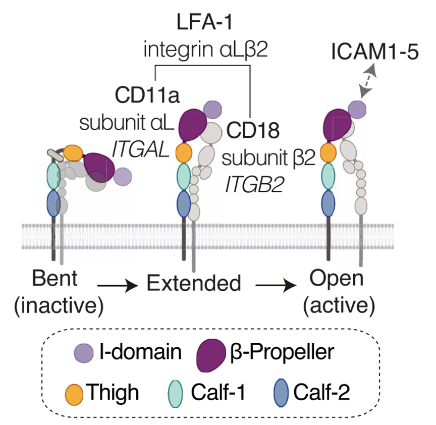

몸 전체 백혈구에 광범위하게 깔려 있는 단백질 하나가 통째로 없다면, 어떤 일이 벌어질까.

상식적으로는 "여기저기서 문제가 생기겠지"라고 생각하기 쉽다. 그런데 2026년 2월 *Science Immunology*에 발표된 한 논문은 정반대의 이야기를 보여준다. 온몸의 백혈구가 다 갖고 있는 접착 단백질이 사라졌는데, 정작 문제는 딱 한 곳, 피부에서만 생겼다.

---

## 사마귀가 평생 낫지 않는 병

**표피이형성증(epidermodysplasia verruciformis, EV)**이라는 희귀 유전병이 있다. 피부에 상주하는 흔한 바이러스인 β-HPV(피부 사마귀 바이러스)를 몸이 통제하지 못해서, 온몸에 편평사마귀가 평생 없어지지 않고 퍼지는 병이다. 환자의 절반 정도는 나이가 들면서 자외선에 노출된 부위에 피부암까지 생긴다.

흥미로운 건, 이 환자들이 사마귀와 피부암 말고는 대체로 건강하다는 점이다. 다른 감염병에 유독 취약하지도 않다. 즉 면역계 전체가 고장 난 게 아니라, 피부 바이러스를 통제하는 아주 좁은 기능 하나만 빠져 있는 것처럼 보인다.

그런데 EV 환자의 절반 가까이는 원인 유전자를 아직 모른다. 알제리, 이란 등 여러 나라의 EV 가계 62곳을 유전체 분석한 연구팀은, 원인 미상이었던 40개 가계 중 4곳에서 공통적으로 같은 유전자의 변이를 발견했다. **ITGAL**, 즉 인테그린 αL(CD11a)이었다.

---

## LFA-1: 백혈구라면 다 갖고 있는 접착 단백질

ITGAL이 만드는 αL 단백질은 β2(CD18)와 짝을 이뤄 **LFA-1**(lymphocyte function-associated antigen 1)이라는 인테그린을 만든다. 백혈구 표면에서 혈관벽의 ICAM 단백질을 붙잡는 일종의 "접착제"다.

LFA-1은 특정 세포만의 전유물이 아니다. T세포, B세포, NK세포, 단핵구, 수지상세포까지 거의 모든 백혈구가 갖고 있다. T세포가 혈관을 빠져나와 조직으로 들어갈 때도, T세포가 항원제시세포와 만나 "면역 시냅스"를 이룰 때도 LFA-1이 관여한다고 알려져 있었다. 그만큼 다재다능하고 중요한 단백질이라는 뜻이다.

연구팀은 환자들의 αL 변이가 실제로 단백질 기능을 망가뜨리는지 세포 실험으로 확인했다. HEK293T, HeLa, Jurkat 세포에 변이 αL을 발현시키자 세 변이 모두 LFA-1이 세포 표면에 전혀 나타나지 않았다. ICAM-1 결합, 세포 간 응집, 이동 능력까지 모두 완전히 사라졌다. 반면 정상인 집단에서 발견되는 다른 흔한 αL 변이 34종은 대부분 기능에 영향이 없었다 — 즉 인구 전체에서 LFA-1이 통째로 망가지는 경우는 극히 드물다(약 122만 명 중 1명꼴).

환자들의 실제 혈액 세포에서도 LFA-1은 완전히 검출되지 않았다. **인간에서 처음 보고된, 완전하고 선택적인 LFA-1 결핍**이었다.

---

## 그런데, 나머지는 다 멀쩡했다

여기서부터가 이 논문의 진짜 흥미로운 지점이다.

LFA-1이 면역 시냅스와 백혈구 이동에 그렇게나 중요하다고 알려져 있었다면, 이게 통째로 없는 사람은 훨씬 더 심각한 면역결핍을 보여야 하지 않을까? 실제로는 그렇지 않았다.

- 백혈구 종류와 분포는 CyTOF·CITE-seq으로 정밀하게 들여다봐도 거의 정상이었다.
- T세포 분화, TCR 레퍼토리 다양성, 사이토카인 생산 능력도 정상이었다.
- 항원제시세포와의 상호작용(동종 T세포 반응)도 LFA-1 없이 정상적으로 일어났다.
- 호중구는 LFA-1이 아예 없어도 다른 β2 인테그린(Mac-1, αXβ2)이 대신 일해서 염증 부위로 이동하는 데 문제가 없었다.
- HPV에 대한 항체 반응도 정상적으로 만들어졌다 — 체액성 면역도 괜찮았다.

즉 LFA-1이 없어도 몸은 "이동 경로를 우회"할 방법을 대부분 갖고 있었다. 유일하게 우회로가 없었던 한 곳이 바로 피부였다.

---

## 피부로 가는 문은 하나뿐이었다

백혈구가 혈관에서 조직으로 들어갈 때 쓰는 인테그린은 크게 두 계열이다. α4 계열(VLA-4, α4β7)과 β2 계열(LFA-1, Mac-1, αXβ2). 연구팀이 건강한 사람의 백혈구를 정밀하게 조사해보니, 대부분의 백혈구는 이 두 계열 중 **적어도 하나씩은 겹쳐서** 갖고 있었다. 그래서 한쪽 문이 막혀도 다른 문으로 들어갈 수 있다.

예외가 둘 있었다. 호중구, 그리고 **피부를 표적으로 하는 기억 T세포**(CLA⁺ 세포)였다. 이 두 부류는 α4 계열 인테그린이 아예 없고, 오직 β2 계열, 그중에서도 특히 LFA-1에만 의존했다. 실험적으로도 피부 표적 T세포는 ICAM-1에만 달라붙었고, 다른 조직행 T세포가 쓰는 VCAM-1이나 MAdCAM-1에는 반응하지 않았다.

LFA-1이 없는 환자들에서 이 피부 표적 T세포들은 사라진 게 아니라 **혈액 속에 갇혀 있었다.** 정상적으로는 피부와 혈액을 오가야 할 세포들이 피부로 들어가는 문 자체가 없어서 혈류에만 쌓인 것이다. 실제로 환자들의 혈액에서 피부 표적 T세포 비율은 대조군보다 4배 높았다.

그 결과를 피부 생검으로 직접 확인했다. 건강한 사람의 피부에는 mm²당 평균 524개의 T세포가 있었지만, 환자의 피부에는 103개뿐이었다. 혈액과 피부의 피부 특이적 T세포 비율을 계산하면, 건강한 사람은 약 1:2(피부 쪽이 더 많음)인 반면 환자는 20:1을 넘었다 — 있어야 할 자리에 있지 못하고 혈관 속을 떠도는 셈이다.

---

## 왜 이게 중요한가

이 연구가 보여주는 건 단순히 "LFA-1이 피부 면역에 필요하다"는 사실 하나가 아니다. 더 일반적인 원리를 보여준다.

**감염병이 특정 장기에만 생기는 이유가, 반드시 그 장기의 방어력 자체가 약해서가 아닐 수 있다.** 이 환자들의 T세포는 멀쩡했다. 증식도, 사이토카인 생산도, 항원 인식도 다 정상이었다. 문제는 순전히 "그 세포가 필요한 자리에 도착하지 못한다"는 교통 체증이었다. 저자들은 이를 조직 특이적 면역의 "국소적(lacunar)" 결함이라고 부른다 — 면역세포의 능력이 아니라 배치의 문제라는 뜻이다.

임상적으로도 흥미로운 연결고리가 있다. 2004~2009년 건선 치료에 쓰였던 항-LFA-1 항체 약물 에팔리주맙도 이 환자들과 비슷하게 HPV 피부 병변을 유발했다 — 유전적 결핍과 약물 차단이 같은 결과를 냈다는 뜻이다. 반면 이 약물은 JC 바이러스 뇌염(PML)이라는 훨씬 심각한 부작용 때문에 결국 시장에서 퇴출됐는데, 저자들은 이 차이가 약물이 LFA-1 결합을 막는 것 외에 추가로 억제 신호까지 전달하기 때문일 수 있다고 설명한다. 유전적 "완전 결핍"과 약물에 의한 "기능 차단"이 항상 같은 결과를 내는 건 아니라는 점도 신약 개발에 시사하는 바가 크다.

---

## 연구자의 시선에서

이 논문은 Casanova 연구실 특유의 접근법을 잘 보여준다. 희귀한 유전 질환 환자 한두 명이 아니라, 비슷한 증상을 가진 여러 가계를 모으고, 자연적으로 발생한 "인간 유전자 녹아웃"을 통해 그 유전자가 정말로 무엇에 필요한지를 역으로 추론하는 방식이다. 생쥐 모델로는 얻기 힘든, 인간 면역계에 대한 직접적인 증거를 만들어낸다.

개인적으로 흥미로웠던 건 "많이 발현되는 단백질 = 여러 곳에서 중요한 단백질"이라는 직관이 이 사례에서는 틀렸다는 점이다. LFA-1은 거의 모든 백혈구에 있지만, 정작 대체 불가능한 곳은 피부로 가는 T세포의 이동 경로 하나뿐이었다. 나머지는 전부 다른 인테그린이 백업으로 존재했다.

조직마다 면역세포가 어떻게, 무엇에 의존해서 도착하는지를 아는 것은 결국 "이 장기는 왜 이 감염에 취약한가"라는 질문에 답하는 데 필요한 지도다. 그 지도가 아직 상당 부분 비어 있다는 걸, 이 논문은 다시 한번 확인시켜준다.

---

*Yatim A, Youssefian L, Idani A, et al. Human LFA-1 governs T cell immune surveillance of the skin. Sci Immunol. 2026;11(116):eadz8360.*