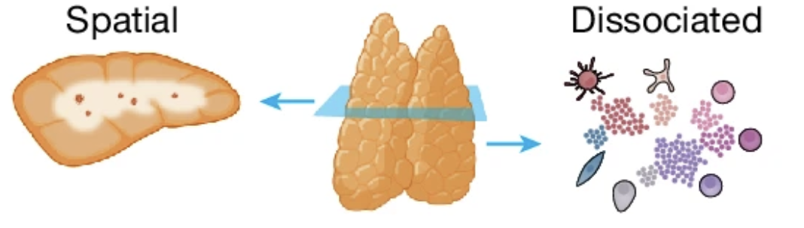

면역계에서 가장 기묘한 장기가 있다면, 흉선(thymus)일 것이다.

심장 바로 위, 흉골 뒤에 자리 잡은 이 작은 기관은 태어날 때 가장 활발하게 일하다가, 사춘기를 지나면서 서서히 지방조직으로 대체된다. 성인이 되면 거의 흔적만 남는다. 그런데 이 기관이 없으면, 면역계는 제대로 작동하지 않는다.

흉선은 T세포의 학교다.

---

## T세포가 '나'를 배우는 곳

T세포는 골수에서 태어나지만, 성숙은 흉선에서 이루어진다. 흉선에서 T세포는 두 가지 결정적인 시험을 통과해야 한다.

첫 번째는 **양성 선택(positive selection)**이다. 자기 몸의 MHC 분자를 인식할 수 있는 T세포만 살아남는다. 인식하지 못하면 죽는다.

두 번째는 **음성 선택(negative selection)**이다. 자기 몸의 단백질에 너무 강하게 반응하는 T세포는 제거된다. 남겨두면 자가면역 질환의 씨앗이 된다.

이 두 과정을 거쳐 살아남은 T세포만이 혈액으로 나가 외부 침입자와 싸운다. 흉선은 "적당히 반응하는" T세포만을 선별해 내보내는 정밀한 필터다.

그런데 이 과정이 흉선 안에서 정확히 어디서, 어떤 순서로 일어나는지는 오랫동안 불분명했다.

---

## 흉선의 지리학

흉선에는 두 개의 구역이 있다. 바깥쪽의 **피질(cortex)**과 안쪽의 **수질(medulla)**이다.

교과서적으로는 피질에서 양성 선택이 일어나고, 수질에서 음성 선택이 일어난다고 알려져 있다. 하지만 실제로 각 세포가 정확히 어디에 있고, 어떤 신호를 주고받으며, 어떤 순서로 이동하는지는 기술적 한계 때문에 세포 수준에서 파악하기 어려웠다.

2024년 11월, *Nature*에 발표된 연구가 이 문제에 정면으로 답했다.

Nadav Yayon, Veronika Kedlian, Chenqu Suo를 포함한 국제 공동연구팀은 **인간 흉선 공간 세포 지도(Spatial Human Thymus Cell Atlas)**를 완성했다. 태아기부터 소아기까지의 흉선 조직을 대상으로, 단일세포 RNA 시퀀싱, 공간 전사체 분석, 고해상도 다중 이미징을 통합해 각 세포의 유전자 발현 정보와 그 세포가 실제로 조직 안 어디에 있는지를 동시에 파악했다.

---

## 피질과 수질 사이의 연속적인 공간

이 연구의 핵심 기여 중 하나는 **피질-수질 축(Cortico-Medullary Axis, CMA)**이라는 개념이다.

기존에는 흉선을 피질과 수질, 두 개의 구획으로 나누어 생각했다. 하지만 이 연구는 흉선이 두 개의 구획이 아니라, 피질에서 수질로 이어지는 **하나의 연속적인 공간**으로 기능한다는 것을 보여줬다. T세포는 이 연속적인 축을 따라 이동하며 성숙해간다.

연구팀은 TissueTag라는 분석 도구를 새롭게 개발해 이 연속적인 공간 축을 수치화했다. 각 세포에 "이 세포는 피질과 얼마나 가까운가, 수질과 얼마나 가까운가"를 나타내는 좌표를 부여하고, 세포의 유전자 발현 패턴이 이 공간 좌표에 따라 어떻게 달라지는지를 추적했다.

---

## 발견: CD4와 CD8의 분리 시점

이 연구에서 특히 흥미로운 발견 중 하나는 CD4 T세포와 CD8 T세포가 수질로 진입하는 시점이 서로 다르다는 것이다.

CD4와 CD8은 T세포의 두 주요 계통이다. CD4 T세포는 면역 반응을 조율하는 도우미 역할을, CD8 T세포는 감염된 세포나 암세포를 직접 제거하는 역할을 한다. 이 두 계통이 흉선 안에서 언제, 어디서 갈라지는지는 오래된 질문이었다.

이 연구는 두 계통이 피질-수질 축의 서로 다른 위치에서, 서로 다른 시점에 수질로 진입한다는 것을 공간적으로 보여줬다. T세포의 운명이 단순히 세포 내부의 신호만이 아니라, 그 세포가 흉선 안 **어디에** 있는가와도 연결되어 있다는 것이다.

---

## 흉선 상피세포: 교사들의 지도

흉선 안의 T세포만이 주인공이 아니다. 흉선 상피세포(thymic epithelial cell, TEC)는 T세포 선택의 기준을 제시하는 교사 역할을 한다. 특히 수질의 흉선 상피세포(mTEC)는 몸 전체에서 발현되는 다양한 조직 특이적 단백질을 흉선 안에서 발현시켜, T세포가 자기 단백질을 인식하고 제거되도록 유도한다.

이 연구는 태아기와 소아기에 걸쳐 흉선 상피세포 전구체의 뚜렷한 세포군을 새롭게 확인하고, 이들이 흉선의 공간 구조 형성에 어떻게 기여하는지를 추적했다.

흉선의 구조적 틀은 태아 2기(second trimester)에 이미 완성된다는 것도 이 연구의 중요한 발견이다. 면역계의 기초 설계도가 태어나기 훨씬 전부터 구축된다는 의미다.

---

## 왜 이게 중요한가

흉선 세포 지도는 단순히 기초과학의 성과에 그치지 않는다.

음성 선택이 실패하면 자가반응성 T세포가 살아남아 자가면역 질환으로 이어진다. 양성 선택이 충분히 이루어지지 않으면 면역결핍이 생긴다. DiGeorge 증후군처럼 흉선 자체가 형성되지 않는 경우, 환자는 T세포 부재로 인한 심각한 면역결핍을 겪는다.

이 지도는 이러한 면역 이상이 흉선의 어느 부분에서, 어떤 세포 간 상호작용의 실패로 시작되는지를 이해하는 데 토대가 된다. 나아가 체외에서 흉선 organoid를 만들어 T세포 발달을 재현하거나, 흉선 이식의 효과를 높이는 데도 이 지도는 실질적인 참고가 될 수 있다.

---

## 연구자의 시선에서

이 논문을 처음 읽었을 때, 두 가지가 특히 눈에 들어왔다.

하나는 **공간 정보의 힘**이다. 단일세포 시퀀싱은 세포 하나하나의 유전자 발현 프로필을 보여주지만, 그 세포가 조직 안 어디에 있는지는 알 수 없다. 공간 전사체 분석이 그 공백을 채운다. 세포의 정체(identity)와 위치(location)를 동시에 아는 것은, 발달 과정을 이해하는 데 차원이 다른 정보를 제공한다.

다른 하나는 **흉선 발달과 자가면역의 연결**이다. 내가 관심을 갖는 질문 중 하나는 "왜 특정 개인에서 자가항체가 형성되는가"다. 이 논문은 그 답의 일부가 흉선에서의 T세포 교육 과정, 그리고 그 과정에 영향을 미치는 유전적·공간적 요인에 있을 수 있다는 것을 시사한다.

흉선의 지도가 완성됐다고 해서 면역계의 비밀이 다 풀린 건 아니다. 오히려 이 지도는 더 정밀한 질문을 가능하게 하는 출발점이다.

---

*Yayon N, Kedlian VR, Boehme L, Suo C, et al. A spatial human thymus cell atlas mapped to a continuous tissue axis. Nature. 2024;635(8039):7944.*
