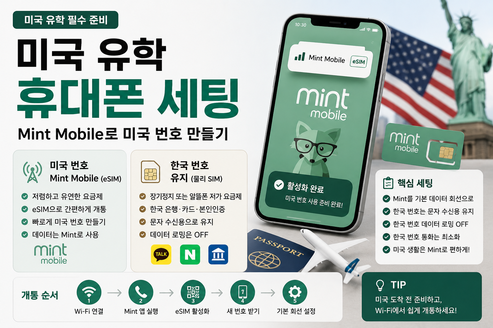

# 미국 유학 휴대폰 세팅: Mint Mobile로 미국 번호 만들기

미국에 도착하면 가장 먼저 필요한 것 중 하나가 **미국 전화번호**입니다.  
은행 계좌를 만들 때도, 아파트와 연락할 때도, 학교 시스템에 로그인할 때도, Uber나 DoorDash 같은 앱을 쓸 때도 미국 번호가 있으면 훨씬 편합니다.

UTSW 박사과정생 기준으로 생각했을 때, 초반 휴대폰 세팅은 이렇게 가져가는 것이 가장 현실적이라고 봅니다.

> **미국 번호는 Mint Mobile eSIM으로 만들고, 한국 번호는 인증문자 수신용으로 유지하기.**

---

## 결론부터 말하면

추천 세팅은 아래와 같습니다.

| 구분 | 추천 세팅 | 용도 |
|---|---|---|
| 미국 번호 | Mint Mobile eSIM | 미국 생활 메인 번호 |
| 한국 번호 | 기존 통신사 장기정지 또는 알뜰폰 저가 요금제 | 한국 은행·카드·본인인증 문자 수신 |
| 데이터 | Mint Mobile | 미국에서 메인 데이터 사용 |
| 한국 번호 데이터 로밍 | 끄기 | 원치 않는 로밍 요금 방지 |
| 한국 번호 통화 | 거의 사용하지 않기 | 카카오톡 보이스톡, FaceTime 등으로 대체 |

핵심은 **미국에서는 Mint Mobile을 메인으로 쓰고, 한국 번호는 없애지 않고 인증용으로만 살려두는 것**입니다.

---

## 1. Mint Mobile을 쓰려는 이유

Mint Mobile은 미국의 저가 통신사 중 하나입니다.  
대형 통신사처럼 매장이 많은 방식은 아니고, 온라인으로 가입하고 eSIM 또는 SIM을 받아 쓰는 방식에 가깝습니다.

유학생 입장에서 Mint Mobile이 괜찮은 이유는 단순합니다.

- eSIM으로 개통 가능
- 매장 방문 없이 시작 가능
- 약정 부담이 적음
- 미국 번호를 빠르게 만들 수 있음
- 가격 구조가 비교적 단순함
- 한국 번호와 듀얼심으로 함께 쓰기 좋음

특히 미국에 막 도착한 박사과정생에게는 “완벽한 통신사”보다 **빨리 개통되고, 은행·학교·아파트 연락에 쓸 수 있는 미국 번호**가 더 중요합니다.

---

## 2. 한국에서 Mint Mobile 미국 번호를 미리 만들 수 있을까?

정확히 말하면, **한국에서 준비는 할 수 있지만 완전한 사용은 미국 도착 후 활성화하는 것이 안전합니다.**

Mint Mobile은 eSIM을 앱이나 QR 코드로 설치하고 활성화하는 방식입니다.  
새 번호를 받을 경우에는 보통 ZIP code를 기준으로 번호가 배정됩니다.

그래서 가장 안전한 방식은 아래 흐름입니다.

### 한국에서 할 일

- [ ] Mint Mobile 앱 설치하기
- [ ] 내 휴대폰이 eSIM을 지원하는지 확인하기
- [ ] 휴대폰이 unlocked 상태인지 확인하기
- [ ] 결제 가능한 카드 준비하기
- [ ] 미국에서 사용할 ZIP code 준비하기  
      예: Dallas 또는 본인이 살 아파트 ZIP code
- [ ] 도착 당일 사용할 Wi-Fi 또는 로밍 방법 정하기

### 미국 도착 후 할 일

- [ ] 공항 또는 숙소 Wi-Fi 연결하기
- [ ] Mint Mobile 앱 실행하기
- [ ] eSIM 활성화하기
- [ ] 새 미국 번호 발급받기
- [ ] Mint를 기본 데이터 회선으로 설정하기

즉, 한국에서 무리하게 모든 activation을 끝내려고 하기보다는, **한국에서는 준비만 해두고 미국 도착 후 Wi-Fi에서 개통하는 방식**이 좋습니다.

---

## 3. 왜 eSIM이 편할까?

유학생에게 가장 편한 조합은 보통 이겁니다.

> **Mint Mobile = eSIM**  
> **한국 번호 = 물리 USIM**

이렇게 하면 휴대폰 하나에서 미국 번호와 한국 번호를 동시에 유지할 수 있습니다.

미국에서는 Mint Mobile을 메인으로 쓰고, 한국 번호는 은행·카드·카카오톡·네이버 인증문자를 받을 때만 켜두는 방식입니다.

### eSIM이 좋은 이유

- 미국 도착 후 바로 개통하기 쉬움
- 유심 배송을 기다릴 필요가 적음
- 한국 물리 유심을 그대로 유지할 수 있음
- 미국 번호와 한국 번호를 동시에 관리하기 좋음
- 번호를 바꾸거나 요금제를 바꿀 때 비교적 편함

다만 eSIM을 쓰려면 휴대폰이 eSIM을 지원해야 하고, 통신사 잠금이 없는 unlocked phone이어야 합니다.

---

## 4. 미국 도착 당일에는 데이터가 꼭 필요하다

미국 공항에 도착했는데 데이터가 안 되면 생각보다 불편합니다.

도착 당일에는 아래와 같은 상황에서 바로 인터넷이 필요합니다.

- Google Maps 보기
- Uber나 Lyft 부르기
- 숙소 담당자에게 연락하기
- 학교 이메일 확인하기
- 가족에게 도착 연락하기
- Mint Mobile eSIM 활성화하기
- 아파트 체크인 안내 확인하기

그래서 출국 전에는 **도착 당일 인터넷 연결 방법**을 반드시 정해두는 것이 좋습니다.

### 방법 1. 한국 통신사 로밍을 하루 정도만 켜두기

도착 직후 인터넷이 끊기지 않아서 가장 안전합니다.  
단, 비용이 들 수 있습니다.

### 방법 2. 공항 Wi-Fi로 Mint Mobile eSIM 활성화하기

비용은 아낄 수 있지만, 공항 Wi-Fi가 불안정하거나 activation이 꼬이면 조금 당황할 수 있습니다.

개인적으로는 첫 도착이라면 **한국 로밍을 하루 정도만 준비해두고, 숙소에 도착한 뒤 Mint Mobile을 차분히 활성화**하는 방식이 가장 마음 편할 것 같습니다.

---

## 5. Mint Mobile 개통 순서

미국 도착 후 Mint Mobile을 개통하는 흐름은 대략 이렇게 생각하면 됩니다.

### 1단계. Wi-Fi 연결

공항, 숙소, 학교 Wi-Fi 중 하나에 연결합니다.

### 2단계. Mint Mobile 앱 열기

한국에서 미리 앱을 설치해두면 좋습니다.

### 3단계. eSIM 활성화

Mint Mobile 앱에서 eSIM을 활성화합니다.  
주문 확인 이메일이나 앱 안내를 따라 진행하면 됩니다.

### 4단계. 새 번호 받기

기존 미국 번호가 없다면 새 번호를 받습니다.  
이때 Dallas 또는 거주지 ZIP code를 입력하면 해당 지역 기반 번호를 받을 수 있습니다.

### 5단계. 기본 회선 설정

미국 생활용 기본 회선을 Mint Mobile로 설정합니다.

아이폰 기준으로는 대략 이런 느낌입니다.

- **Cellular Data:** Mint Mobile
- **Default Voice Line:** Mint Mobile
- **한국 번호:** 켜두기
- **한국 번호 Data Roaming:** Off
- **Allow Cellular Data Switching:** Off

이렇게 해두면 미국에서는 Mint Mobile 데이터만 쓰고, 한국 번호는 인증문자 수신용으로만 유지할 수 있습니다.

---

## 6. Mint Mobile 요금제는 어떻게 고르면 좋을까?

처음부터 1년치를 결제하기보다는, **처음 3개월 정도 써보고 결정하는 것**을 추천합니다.

Mint Mobile은 보통 몇 개월 단위로 선불 결제하는 구조입니다.  
요금과 데이터 제공량은 바뀔 수 있으므로, 개통 직전에 공식 사이트에서 다시 확인하는 것이 좋습니다.

### 데이터 사용량이 적은 편

학교와 집 Wi-Fi를 주로 쓰고, 외부에서는 지도와 메신저 정도만 쓴다면 낮은 데이터 플랜으로 시작해도 됩니다.

### 데이터 사용량이 많은 편

밖에서 영상, 핫스팟, 장보기 앱, 지도, Uber를 자주 쓴다면 중간 이상 데이터 플랜이 편합니다.

### 처음이라 잘 모르겠다면

처음 3개월은 너무 낮게 잡지 말고, 중간 정도 플랜으로 시작하는 것이 마음 편합니다.  
Dallas에 적응하고 실제 데이터 사용량을 본 뒤 낮추거나 올리면 됩니다.

---

## 7. 한국 번호는 왜 살려둬야 할까?

미국 번호를 만들었다고 해서 한국 번호를 바로 없애면 안 됩니다.

한국 번호는 생각보다 오래 필요합니다.

### 한국 번호가 필요한 경우

- 한국 은행 앱 로그인
- 카드 앱 본인인증
- 카카오톡 계정 유지
- 네이버 인증
- 정부24 인증
- 공동인증서·금융인증서 관련 업무
- 한국 보험, 가족, 학교 관련 연락
- 카드 해외결제 확인 문자

특히 미국 도착 초반에는 한국 은행이나 카드 앱을 자주 확인하게 됩니다.  
이때 한국 번호가 없으면 본인인증에서 막힐 수 있습니다.

그래서 한국 번호는 최소 몇 달, 가능하면 1년 정도는 유지하는 편이 안전합니다.

---

## 8. 한국 번호 유지 방법 1: 기존 통신사 장기정지

가장 안정적인 방식은 기존 통신사의 **장기정지 + 해외 문자수신/본인인증 서비스**를 쓰는 것입니다.

이 방법은 한국 번호로 전화를 받기 위한 세팅이 아닙니다.  
한국 번호를 **인증문자 수신용으로 유지하는 세팅**입니다.

### 장점

- 설정이 비교적 단순함
- 유학생·장기체류자에게 적합함
- 한국 번호 유지 가능
- 인증문자 수신 가능
- 월 5~6천 원 정도로 유지 가능

### 단점

- 한국 번호로 오는 전화는 받기 어려움
- 문자 발신이 제한될 수 있음
- 데이터 사용 불가
- PASS 앱이나 ARS 인증은 제한될 수 있음

### 이런 사람에게 추천

- 출국이 얼마 남지 않은 사람
- 한국 번호 문제로 스트레스 받고 싶지 않은 사람
- 인증문자만 안정적으로 받으면 되는 사람
- 한국 번호로 전화받을 일은 거의 없는 사람

대부분의 유학생은 가족과 친구 연락을 카카오톡 보이스톡, FaceTime, Zoom 등으로 대체합니다.

---

## 9. 한국 번호 유지 방법 2: 알뜰폰 저가 요금제

두 번째 방법은 한국 번호를 알뜰폰 저가 후불 요금제로 번호이동하는 것입니다.

이 방식은 장기적으로 비용을 줄일 수 있습니다.  
다만 출국 전에 반드시 테스트가 필요합니다.

### 알뜰폰으로 갈 때 확인할 것

- [ ] 번호이동 가능한지
- [ ] 후불 요금제인지
- [ ] 물리 USIM 사용 가능한지
- [ ] 해외로밍 가능한지
- [ ] 해외 SMS 수신 가능한지
- [ ] 인증문자 수신이 안정적인지
- [ ] 데이터 로밍 차단 가능한지
- [ ] 할인 종료 후 요금이 얼마인지
- [ ] 미국에서 고객센터 연결이 가능한지

알뜰폰은 업체마다 해외 인증문자 수신 안정성이 다를 수 있습니다.  
그래서 알뜰폰을 선택한다면 **반드시 출국 전에 한국에서 인증 테스트를 해보고 가야 합니다.**

---

## 10. 한국 번호로 오는 전화를 받을 수 있을까?

가능은 하지만, 일반적으로는 추천하지 않습니다.

한국 번호를 장기정지 + 문자수신 서비스로 두면 보통 전화는 못 받는다고 생각하면 됩니다.

반대로 알뜰폰이나 기존 통신사 요금제를 정지하지 않고 유지하면 전화를 받을 수는 있지만, 미국에서 한국 번호로 전화를 받으면 로밍 음성통화 요금이 붙을 수 있습니다.

그래서 보통 박사 유학생들은 이렇게 합니다.

> 한국 번호 전화는 받지 않는다.  
> 급한 연락은 카카오톡으로 받는다.  
> 한국 번호는 문자 인증용으로만 유지한다.

가족이나 지인에게는 출국 전에 이렇게 말해두면 좋습니다.

> 미국에 가면 한국 번호 전화는 잘 못 받아요.  
> 급한 연락은 카카오톡이나 이메일로 주세요.

---

## 11. 내가 추천하는 최종 세팅

UTSW 박사과정생으로 미국에 간다면 저는 이렇게 할 것 같습니다.

### 미국 번호

**Mint Mobile eSIM 사용**

- 한국에서 앱 설치
- 휴대폰 eSIM 지원 확인
- 미국 도착 후 Wi-Fi에서 활성화
- Dallas ZIP code로 새 번호 받기
- 미국 생활 메인 번호로 사용

### 한국 번호

**안정성 우선이면 기존 통신사 장기정지 + 문자수신 서비스**

- 월 5~6천 원 정도
- 인증문자 수신용
- 한국 전화는 거의 포기
- 출국 초반에는 가장 마음 편함

**비용 절감 우선이면 큰 알뜰폰사 저가 후불 요금제**

- 출국 2~3주 전 번호이동
- 물리 USIM 유지
- 해외 SMS 수신 가능 여부 확인
- 은행·카드·네이버·카카오 인증 테스트
- 할인 종료 후 요금 확인

개인적으로는 **출국 초반 6개월~1년은 안정성 우선으로 가고, 미국 생활이 안정된 뒤 알뜰폰으로 옮길지 다시 판단**하는 것도 괜찮다고 봅니다.

---

## 12. 출국 전 체크리스트

### Mint Mobile 준비

- [ ] Mint Mobile 앱 설치
- [ ] 휴대폰 eSIM 지원 여부 확인
- [ ] 휴대폰 unlocked 여부 확인
- [ ] 결제 가능한 카드 준비
- [ ] Dallas 또는 거주지 ZIP code 확인
- [ ] 도착 당일 Wi-Fi 연결 방법 확인
- [ ] 한국 로밍을 하루 정도 켤지 결정

### 한국 번호 준비

- [ ] 한국 번호 유지 방식 결정
- [ ] 기존 통신사 장기정지 여부 확인
- [ ] 알뜰폰 번호이동 여부 확인
- [ ] 해외 SMS 수신 가능 여부 확인
- [ ] 데이터 로밍 차단 설정
- [ ] 은행 앱 문자 인증 테스트
- [ ] 카드 앱 문자 인증 테스트
- [ ] 카카오톡 계정 확인
- [ ] 네이버·정부24 인증 확인
- [ ] 가족과 지인에게 연락 방식 안내

---

## 핵심 요약

미국에 도착하면 미국 번호는 거의 필수입니다.  
UTSW 박사과정생처럼 장기간 미국에 머무를 예정이라면, Mint Mobile eSIM으로 미국 번호를 만들고 한국 번호는 인증문자 수신용으로 유지하는 세팅이 가장 현실적입니다.

처음부터 복잡하게 여러 통신사를 비교하기보다는, 아래처럼 단순하게 시작하는 것이 좋습니다.

- 미국 번호는 Mint Mobile eSIM
- 한국 번호는 물리 USIM으로 유지
- 미국 데이터는 Mint 사용
- 한국 번호 데이터 로밍은 끄기
- 한국 번호 전화는 거의 받지 않기
- 한국 인증문자는 계속 받을 수 있게 해두기

결국 목표는 단순합니다.

> **미국에서는 미국 번호로 생활하고, 한국 번호는 인증용으로 안전하게 살려두는 것.**

이 세팅만 해두면 미국 도착 직후 은행, 학교, 아파트, 교통, 장보기 앱을 훨씬 수월하게 시작할 수 있습니다.